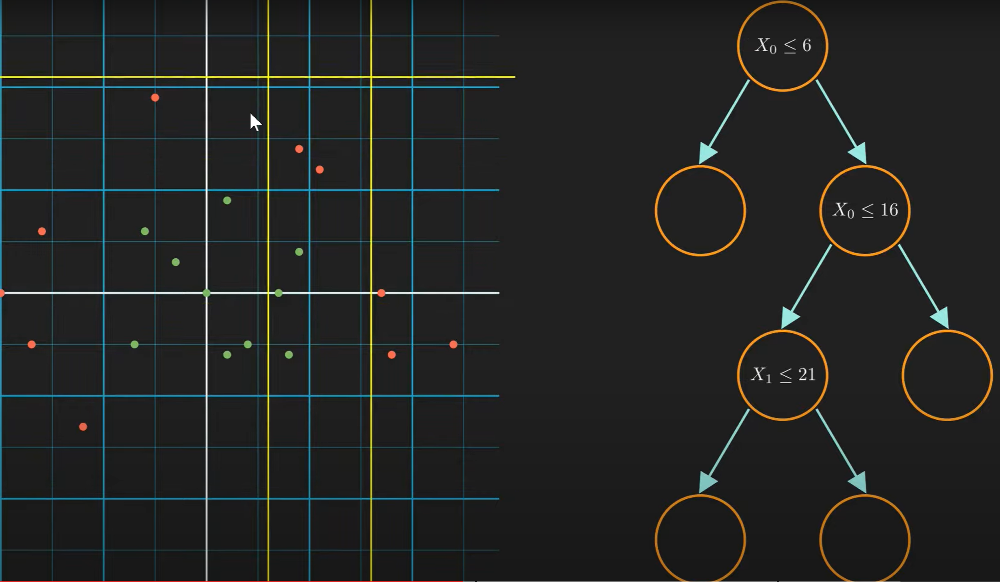

# Basic Method
<!-- prettier-ignore-start -->
!!! abstract "摘要"
    === "目录"
        [TOC]

    === "资源"
        - [YouTube 博主](https://www.youtube.com/@NormalizedNerd)
        - [code](https://github.com/Suji04/ML_from_Scratch)
<!-- prettier-ignore-end -->
## 1. 决策树和随记森林
### 1.1.1 decision tree classification
机器学习中的决策树就好似搜索树一样（请与fds中学到的决策树区分），能够对非线性分割的目标进行逐步拆分。如图：
<div align="center">

</div>
而当我们探讨，$\text{which split is better?}$ 这个问题的时候, 我们需要`information gain`和 `entropy`两个概念

$$
Entropy = \sum{-p_i log(p_i)} \\
IG = E(parent) - \sum w_i E(child)
$$

<div align = "center">

</div>
由此我们便可以计算出哪种分类方式更好。最后，我们确保每个叶节点都只要单一类型的元素。

代码建议阅读[源码](https://github.com/Suji04/ML_from_Scratch)看看！

### 1.1.2 decision tree regression
决策树回归的原理与分类类似，只是我们需要用到`MSE`来计算`IG`，并且最后的叶节点不再是单一类型的元素，而是一个平均值。（**小结**：regression更偏向解决连续连续型的问题，而classification更偏向解决离散型的问题）
$$
Var = \frac{1}{n} \sum (y_i - \hat{y_i})^2
$$
为了使叶节点更纯净，我们要让方差尽可能小。因此，我们需要找到一个最优的切分点，使得切分后的两个子集的方差之和最小。与上面IG的计算相似：
$$
Var_{target} = Var_{parent} - \sum w_i Var_{child}
$$

>这个问题还可以通过遍历所有的特征和特征值来解决，但是这样的时间复杂度太高，因此我们可以通过随机选取特征和特征值来解决这个问题。这就是随机森林的原理。

### 1.2.1 random forest classification
随机森林是一种集成学习方法，它通过集成多个决策树来解决分类问题。它的原理是通过随机选取特征和特征值（Bootstrapping & Feature Selection）来构建多个决策树，然后通过投票的方式来决定最终的分类结果。这样做的**好处**是，既能够减少过拟合，又能够减少计算量。
> 两个随记过程：
> 1. Bootstrapping：保证每个树使用不同的数据，让模型对原始数据的分布不敏感。
> 2. Feature Selection：保证每个树使用不同的特征，让模型对特征的选择不敏感，减少了不同树之间的相关性。
> 
伪代码如下：
```python
def fit(self, X, y):
    for i in range(self.n_estimators):
        X_subset, y_subset = self._get_random_subsets(X, y)
        tree = DecisionTree()
        tree.fit(X_subset, y_subset)
        self.trees.append(tree)
```

<!-- prettier-ignore-start -->
!!! note "小结"
    - 研究发现，特征子集的个数接近$\sqrt{m}$或者$log^{m}$时，模型的性能最好(其中，$m$是特征的个数)。
    - 用于regression时，我们可以用平均值来代替投票的方式。
<!-- prettier-ignore-end -->

## 2. Markov
### 2.1.1 Markov Chain
这是一个经典的概率推断模型，其中观看Normal Nerd的视频你将会有个清晰的认知。这里我只是简单的记录一下。
> 高阶转移矩阵和特征值求稳定概率分布的方法。

### 2.1.2 Hidden Markov Model

### 2.1.3 HMM：Forward Algorithm


### 2.2.1 Markov Decision Process
这是一个经典的强化学习模型。

### 2.2.2 Q-Learning

### 2.2.3 Deep Q-Learning


## 3. SVM
SVM是一种监督学习算法，它的目标是找到一个超平面，将不同类别的数据分开。


