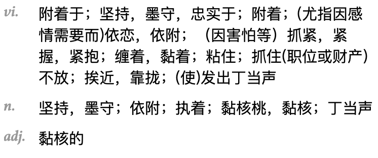
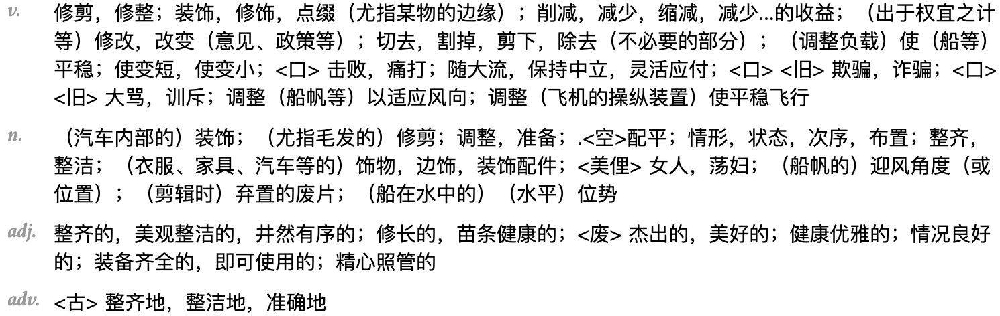

# 一些些单词

|单词|中文|用法|
|---|---|---|
|vital|重要的||
|cling||clung, clung, clinging|
|trim||有很多意思和用法|
|viel|面纱、借口|We lift the viel. 我们揭开了真相。|
|applaud| v.鼓掌；赞赏；称赞；赞许|applaud sb. for sth. 可以引申为认同|
|municipal|市政的|a municipal government|
|evolve|进化|an evolving conversation. 一个不断发展的对话。(请会意)|
|neglect|忽视|neglect to do sth.|
|involve|｜You don't involve me in your plan. 你不把我纳入你的计划。(会意吧)|
|livid|青灰色的;愤怒的|livid with anger|
|retribution|报应| |
|errand boy|傀儡| |
|humility|谦逊| |
|good in sack|床上功夫好| |
|be over the moon|非常高兴| |
|pledge|v.保证；n.誓言| |
|vocally anti|公开反对| |
|carve out some room/time|腾出一些空间/时间| |
|plateaued|瓶颈| |
|foreplay|前戏| |
|sloppiness|粗心| |
|discretion|谨慎| discreet adj.谨慎的|
|battle cry|战斗口号| |
|Do the math|算一下| |
|legitimacy|权威| |
|counting on|依靠| |
|esteem|n.尊重；v.尊重| |
|for the sake of conscience|为了良心| |
|dismanting|拆除| |
|screw it up|搞砸了| |
|wheeler dealer|投机商人| |
|fulfill the destiny|实现命运| |
|make it dignified|使之体面| |
|trickle down|滴滴答答| |
|ludicrous|adj.荒唐的| |
|rancid|adj.腐臭的| |
|prelude|n.序幕,前奏| |
|suffocating|adj.令人窒息的| |    
|This is cut and dry.|这是老生常谈。| |
|intrube|v.打扰| |
|imposition|n.强加,欺骗,打扰| |
|discard|v.丢弃| |
|tension|n.紧张| |
|water under the bridge|过去的事情| |
|quarrelsome|adj.好争吵的| |
|diet|n.饮食| |
|for the time being|暂时| |
|flagship|n.旗舰| |
|rub shoulders with|与...交往| |
|defy|v.违抗| |
|caucus|n.政党会议| |
|testimony|n.证词| |
|scapgoat|n.替罪羊| |
|badger|v.纠缠| |
