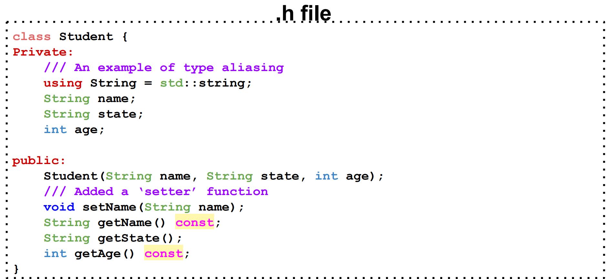
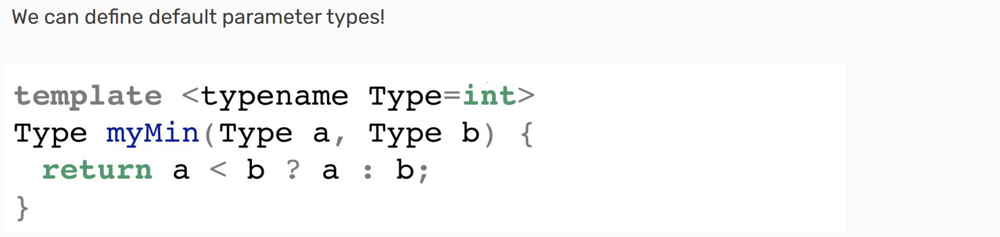
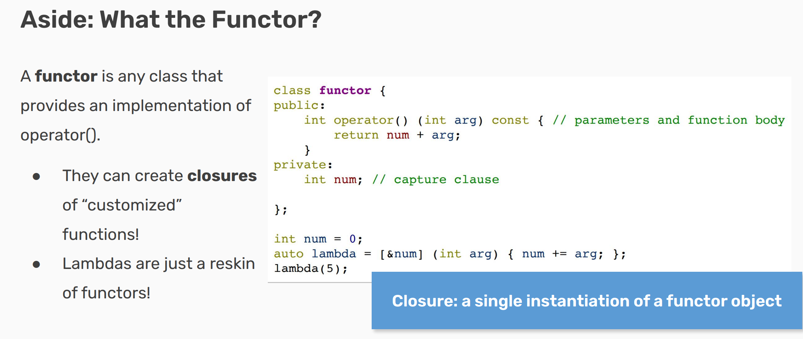
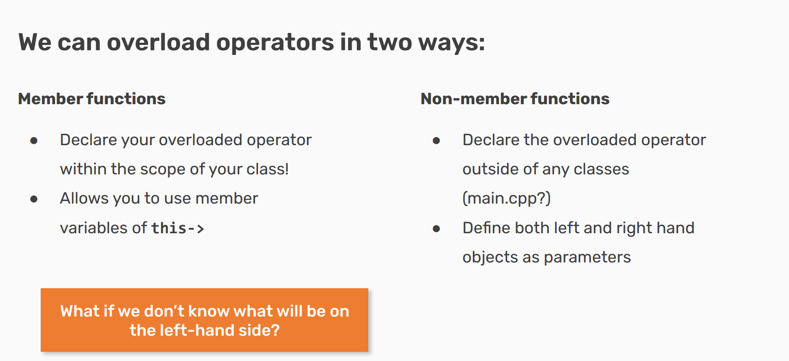
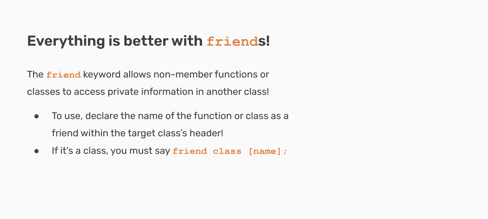
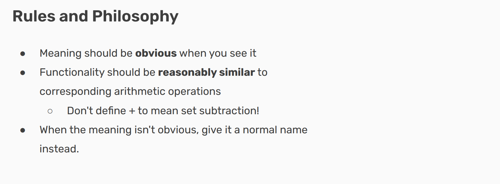
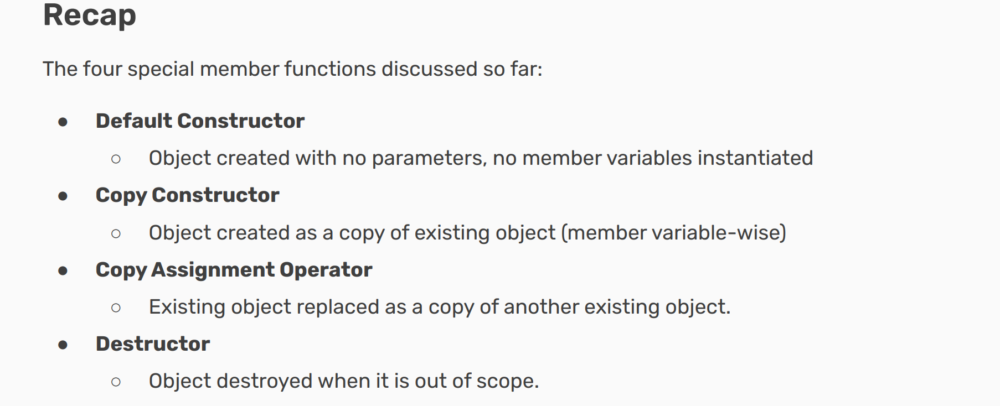

# CS106L - 24 winter

这里是CS106L的课程资料，包括课程大纲、课程作业、课程讲义等。

## Slide Note

### lec3 Initialization & referrence
1. [初始化](https://en.cppreference.com/w/cpp/language/initialization)
2. [referrence](https://en.cppreference.com/w/cpp/language/reference)
3. [cv-type](https://en.cppreference.com/w/cpp/language/cv)
4. You can’t declare a non-const reference to a const variable
   

### lec4 Stream
1. cerr and clog
> cerr: used to output errors
> clog: used for non-critical event logging

2. getline
   
> 注意getline函数的使用，最好不要和cin混用，否则会出现问题。

### lec5 Class
1. How to write .h and .cpp file
2. To make alias
   ```cpp
   Private:
      /// An example of type aliasing
      using String = std::string;
      String name;
      String state;
      int age;
   ```
3. How to use `this` pointer
   ```cpp
   void Person::set_name(const std::string& name) {
      this->name = name;
   }
   ```
4. Container adapters：例如queue中的deque和list
   ```cpp
   std::queue<int, std::list<int>> q;
   ```

5. virtual 关键词 用于声明虚函数。虚函数是在基类中使用 virtual 关键字声明的成员函数，它可以在派生类中被重写（覆盖）。：
   ```cpp
   class Base {
   public:
      virtual void show() {
         std::cout << "Base::show() called" << std::endl;
      }
   };

   class Derived : public Base {
   public:
      void show() override {
         std::cout << "Derived::show() called" << std::endl;
      }
   };
   ```

   而如果使用纯虚函数，那么每个基类使用都一定要重写这个函数，否则会报错。
   ```cpp
   virtual double area() const = 0;
   ```

   一段示例代码：
   > 请注意constructor变量名的命名技巧，这样可以避免和成员变量重名。

### lec6 Template class
1. 为什么要使用模板类？
   - 代码复用
   - 类型安全
   - 性能优化
   

2. 在.h文件中必须包含.h和.cpp文件
   ```cpp
   #include "source.cpp"
   ```
3. const 的使用
   ```cpp
   std::string stringify(const Student& s){
      return s.getName() + " is " + std::to_string(s.getAge()) +
      " years old." ;
   }
   ```
   由于编译器并不知道`getName()`&`getAge()`函数是否会改变s的值，所以我们需要在函数后面加上const关键词。
   
   

4. throw exception
   ```cpp
   void Student::setAge(int age) {
      if (age < 0) {
         throw std::invalid_argument("Age cannot be negative");
      }
      this->age = age;
   }
   ```
   
   
5. const_cast 使用技巧
   

### lec7 template function
1. An example
   
2. Constraints and concepts
   

??? note "Complex Reference"
   
3. 使用template可以更有效率：
   ```cpp
   template<unsigned1>
   struct Factorial {
      enum value =n * Factorial<n - 1>::value };
   };
   template<>// template class "specializationstruct 
   Factorial<0>{enum fvalue=1};
   std::cout <<Factorial<10>::value << endl;//prints 3628800, but run duringcompile time!
   ```
4. constexpr: 用于在编译时计算值
   ```cpp
   constexpr int factorial(int n) {
      return n <= 1 ? 1 : n * factorial(n - 1);
   }
   ```

### lec8 function and lambda
1. function pointer
   
2. lambda expression
   ```cpp
   int limit = 5;
   auto is_greater_than_limit = [limit](int value) {
      return value > limit;
   };
   ```
   
3. Functor
   
4. virtual function: can be overrided by derived class
   
5. The STL implements tons of cool algorithms that we
can use without rewriting them! 

### lec9 Operator Overloading
1. fraction example： https://replit.com/@havenw/simplefraction



2. friend关键词可以让一个函数访问类的私有成员，它有助于实现重载运算符，但请注意他会**破坏封装性**。
   ```cpp
   class Fraction {
   public:
      friend std::ostream& operator<<(std::ostream& os, const Fraction& f);
   };
   ```
   


> 


### lec10 Special Member Function
Class has three main part: the constructor and destructor, member variables, and functions.

Totaly, there are 6 special member functions:
- Default constructor
- Copy constructor
- Copy assignment operator
- Move constructor
- Move assignment operator
- Destructor

The compiler will generate these functions for you if you don't define them yourself. However, if you define any of these functions, the compiler will not generate the others for you.

Example:

1. 浅拷贝和深拷贝
   ```cpp
   #include <iostream>

   class ShallowCopyExample {
   private:
      int* data;

   public:
      // 浅拷贝的构造函数
      ShallowCopyExample(const ShallowCopyExample& other) {
         data = other.data;  // 只是复制指针，而不是复制指针指向的数据
      }

      // 深拷贝的构造函数
      DeepCopyExample(const DeepCopyExample& other) {
         data = new int(*other.data);  // 分配新的内存，并复制数据
      }

      // 析构函数
      ~ShallowCopyExample() {
         delete data;  // 释放动态分配的内存
      }
   };

   int main() {
      ShallowCopyExample original;
      ShallowCopyExample shallowCopy = original;  // 浅拷贝

      DeepCopyExample deepCopy = original;  // 深拷贝

      return 0;
   }
   ```
<!-- prettier-ignore-start -->
!!! warning "attention"
   If you have to define a destructor, copy constructor, or copy assignment operator, you should define all three!
   - Needing one signifies you’re handling certain resources manually.
   - We then should handle the creation, assignment, use, and destruction of those resources ourselves!
   
<!-- prettier-ignore-end -->

### lec RAII & smart pointer
1. 一段代码中存在许多种可能的code path， 我们需要留意是否会造成内存泄漏。
   ｜ ｜ Acquire ｜ Release｜
   ｜Heap Memory | new | delete|
   | Files | open | close|
   | Locks | try_lock | unlock|
   | Socket | socket | close |
2. **Exception:**
   

3. Unique_pointer: can not be copied.
   
