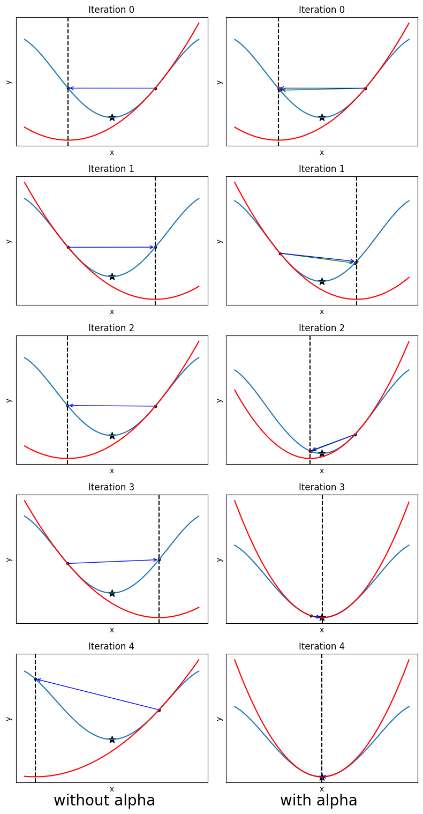

# Introduction to Model-Based Learning

注意在之前的所有算法中，我们都把环境当作一个**黑盒**使用，我们的模型必须环境交互来获得新的state和reward。这样的方法称为Model-Free Methods。

但是需要注意我们的问题都是来源于真正生活的，因此环境的演化规律 $p(s_{t+1}|s_t,a_t)$ 实际上是可以知道的。（比如说，物理规律可以给我们很大的信息；而在许多游戏中，更新的方式也是由游戏规则给定的。）此外，就算演化无法知道，根据后面几讲介绍的知识，我们也可以通过model-based learning来学习这个规律。

下面，我们就来讨论假设我们已经知道了环境的演化规律 $p(s_{t+1}|s_t,a_t)$ ，我们如何利用这个信息来提升我们的算法。

## Examples

### Deterministic Environment

我们首先来考虑一个确定性的环境。对于这样的情况，我们的目标实际上是

$$
a_1,a_2,\cdots,a_T=\arg\max_{a_1,\cdots,a_T}\sum_{t=1}^T r(s_t,a_t)
$$

其中根据环境的确定性给出了 $s_{t+1}=f(s_t,a_t)$ 。注意这个表达式实际上代表着一个没有任何约束的优化问题，因此我们可以通过传统的方法完成这个优化。

### Non-deterministic Environment

对于非确定性的环境，问题变得稍微复杂。乍一想，可能会假设我们的目标是

$$
a_1,a_2,\cdots,a_T=\arg\max_{a_1,\cdots,a_T}\mathbb{E}_{s_1,\cdots,s_T}\left[\sum_{t=1}^T r(s_t,a_t)\right]
$$

但实际上并不对——这样丧失了 $s_t$ 可能为作出决策 $a_t$ 带来的信息。

> 一个直观的例子：假设你参加考试，如果按照这样的假设，你只能基于最基础的分布 $s_0$ （比如考纲）作出决策 $a_1$ 。但实际上， $s_1$ 可能是考试题目！显然，最优的策略并不是只基于 $s_0$ 作出决策，而是应该看题目来给出答案。

上面这一方法也称为**open loop**：相当于你从环境只获得一个 $s_0$ 的信息，而你的信息 $a_1,\cdots,a_T$ 传送给环境之后就再也没有收到反馈。

但我们也可以把它变为**close loop**：我们根据 $s_1$ 输出的并不是一系列确定的action，而是一个policy $\pi_t(a_t|s_t)$ 。注意这里的policy甚至可以和 $t$ 相关，因为这和之前我们完全对环境的动力学一无所知的情况不同，我们可以作出更加精细的决策。

这里一个比较好玩的事情是，我们如何表达 $\pi$ 呢？之前， $\pi$ 是一个神经网络；但现在我们断言 $\pi$ 实际上可以做成线性：

$$
\pi(a_t|s_t)=\text{Deterministic}(K_ts_t+k_t)
$$

而其中只有 $K_t,k_t$ 是一些我们需要优化的参数。

> Q: 为什么可以这样做呢？
>
> A: 因为我们已经比之前强大了太多！设想我们发射火箭上太空，在之前讲解的算法中，我们相当于完全不知道自己在做什么（甚至无法区分自己是在发射火箭还是在玩原神！），因此当然给定一个 $s$ 对应的决策 $a$ 也会极其复杂；而现在，我们相当于已经通晓物理规律，给出了火箭的轨迹和各个需要的物理参数。唯一需要做的事情就是处理一些可能的微扰，比如风速等等。这样，当然我们就可以用一个线性的函数来表征我们对于各种微扰应该作出怎样微小的反应。

# Algorithms

我们先考虑open loop的问题，并介绍一个系统化的解决方法。同样，简单起见，我们先考虑一个确定性的环境。在这种情况下，我们的问题就是一个优化问题：

$$
a_1,a_2,\cdots,a_T=\arg\max_{a_1,\cdots,a_T}\sum_{t=1}^T r(s_t,a_t),\quad  s_{t+1}=f(s_t,a_t)
$$

## Stochastic Optimization

第一种方法十分有趣——我们并不是用之前常见的gradient-based的各种方法，而是考虑一种随机化的解决方案。一般地，我们考察一个优化目标

$$
\max_{a_1,\cdots,a_T} J(a_1,\cdots,a_T)
$$

最简单的方法被称为“random shooting method”，也就像一个盲人射箭一样：我们随机生成一些 $a_1,\cdots,a_T$ ，然后计算 $J$ ，最后选择最好的那个。

这显然比较愚蠢——最好的一组参数出现的概率可能很小，导致我们很难sample到。为了解决这个问题，CEM(Cross Entropy Method)出现了：我们每一次都重新设置我们采样的分布，使得它“靠近”最好的数据点的分布。具体地：

> **Cross Entropy Method**

重复：
1. 随机采样 $\mathbf{A}_1,\mathbf{A}_2,\cdots,\mathbf{A}_N$ （这里 $\mathbf{A}=(a_1,\cdots,a_T)$ ）；
2. 计算 $J(\mathbf{A}_1),J(\mathbf{A}_2),\cdots,J(\mathbf{A}_N)$ ；
3. 保留最好的 $M$ 个数据点，更新 $p(\mathbf{A})$ 使得它更接近这 $M$ 个数据点的分布。一般地， $p(\mathbf{A})$ 取为高斯分布。

但是前面介绍的这些方法都有一个十分严重的问题：要想找到最优解，总归要采样覆盖所有可能的 $\mathbf{A}$ 构成空间的一大部分才可以。这样，维度越大，我们需要的采样点就越多，计算量就会越大。

### Monte Carlo Tree Search

Monte Carlo Tree Search(MCTS)是一种更加智能的方法，可以适度的避免这个问题。它的基本思想是，我们从树根开始向下寻找，每次expand一定的节点，选出其中最有前途的；接下来从选出的节点进一步开始expand。这有点类似于beam search，关键在于我们无需展开所有的节点，同时也比贪心做的更好。

一个MCTS的实例需要具有以下两个部分：
- Tree Policy：给定当前所有已经expand过的节点，接下来应该expand哪个节点？
- Default Policy：给定一个节点，我们如何评判它是否有前途？（这样的评判需要基于和环境的交互；但我们当前并不知道应该如何和环境交互，所以我们采用这样一个default policy，从而公平地评判不同节点。）

而其算法的思想和前面简单介绍的基本类似，但注意并不完全和beam search一致。具体地:

> **Monte Carlo Tree Search**

```python
def MCTS(root):
    while True:
        # Selection & Expansion
        node = TreePolicy(root)
        # Simulation
        reward = DefaultPolicy(node)
        # Backpropagation
        update(node,reward)

def update(node,reward):
    while True:
        node.N += 1
        node.Q += reward
        if node.parent is None:
            break
        node = node.parent
```

我们还可以介绍一下常见的Tree Policy——UCT Tree Policy：
```python
def UCT(expanded):
    if not root.fully_expanded():
        return root.expand()
    else:
        best_child = argmax([Score(child) for child in root.children])
        return UCT(best_child)

def Score(node):
    return node.Q/node.N + C*sqrt(log(node.parent.N)/node.N)
```

这里，大概的思路是：如果某个深度较低的节点没有被完全expand，就优先完全expand；而对于完全expand的节点，就考虑score哪个最大。可以看出，这里的score函数

$$
\text{Score}(s_t)=\frac{Q(s_t)}{N(s_t)}+C\cdot \sqrt{\frac{\log N(s_{t-1})}{N(s_t)}}
$$

第一项代表着这个点整体是否有前途；而第二项代表为没有怎么expand过的点的加分。

## Deterministic Optimization

我们前面介绍的是随机化的方法，下面就让我们回到熟悉的领域，考察和梯度相关的方案。

一个直观的思想是我们直接对

$$
a_1,a_2,\cdots,a_T=\arg\max_{a_1,\cdots,a_T}\left[r(s_1,a_1)+r(f(s_1,a_1),a_2)+\cdots+r(f(f(\cdots),a_{T-1}),a_T)\right]
$$

计算梯度并优化。但实际上这有一个不易察觉的问题：套了过多层数的 $f$ 之后，体系的梯度很容易爆炸。实际上，如果是这样操作，一般不能使用梯度下降这种first-order method，而是必须采用second-order method。

> 直观上，为什么这样会有问题呢？因为考虑第一步的 $a_1$ ，它会影响到 $s_2$ ，进而影响到 $s_3,\cdots,s_T$ ，这样不断向后传播。如果一系列 $s_i$ 连成一个曲线，那么 $a_1$ 就像这个曲线一开始的方向那样，“牵一发而动全身”。这样，但凡 $a_1$ 稍微有一点扰动，整个体系就会变化巨大。

这样的方法也叫做shooting method。与之相对的是collocation method：我们把问题转化为

$$
a_1,\cdots,a_T,s_1,\cdots,s_T=\arg\max \left[r(s_1,a_1)+\cdots+r(s_T,a_T)\right]
$$
但需要增加constraint 

$$
s_{t+1}=f(s_t,a_t)\qquad (\forall t=1,2,\cdots,T-1)
$$

这样的方法就解决了之前shooting method的问题：每一个变量都只影响最近的 $r$ 和约束条件。实验上，对于这样的方法，first order就够了。

但接下来我们还是暂时先考虑shooting method。我们来介绍一个重要的方法：LQR(Linear Quadratic Regulator)。

### LQR

我们的目标是

$$
J=r(s_1,a_1)+r(f(s_1,a_1),a_2)+\cdots+r(f(f(\cdots),a_{T-1}),a_T)
$$

我们首先考虑建立一个简化的问题。为了方便起见， $f$ 可以选为线性的关系：

$$
f(s_t,a_t)=\mathbf{F_t}\dbinom{s_t}{a_t}+f_t
$$

但 $r$ 并不能简单地选作一次函数，因为我们需要把它最大化，一次函数会导致变量全部趋于无穷。为此，我们选取

$$
r(s_t,a_t)=\frac{1}{2}(s_t^TA_ts_t+2s_t^TB_ta_t+a_t^TC_ta_t) +x_t^T s_t+y_t^T a_t
$$

其中 $A_T,C_T$ 是对称矩阵。接下来，这个问题就完全变成了一个代数问题。

### Stupid Derivations

这段推导没什么技术含量，所以可以考虑跳过推导，直接看后面的Algorithm。我们可以从最后一个action开始，我们的目标实际上是

$$
Q(s_T,a_T)=\frac{1}{2}(s_T^TA_Ts_T+2s_T^T B_Ta_T+a_T^TC_Ta_T) +x_T^T s_T+y_T^T a_T
$$

（注意这里的记号和之前的相似性： $Q$ 就相当于之前的Q function）由此可以解出第 $T$ 步最优的action：

$$
a_T=-C_T^{-1}(y_T+B_Ts_T)
$$

然后，带入原来的表达式，我们会得到关于 $s_T$ 的等效目标：

$$
V(s_T)=\frac{1}{2}(s_T^TA_Ts_T-s_T^TB_T^TC_T^{-1}B_Ts_T)+x_T^Ts_T-y_T^TC_T^{-1}B_Ts_T
$$

（注意这个 $V$ 也是等效的value function）我们可以进一步简化地记

$$
V_T=A_T-B_T^TC_T^{-1}B_T, \quad v_T=x_T-B_T^TC_T^{-1}y_T
$$

再代入 $s_T$ 用 $s_{T-1},a_{T-1}$ 的表达式，我们就可以给出

$$
V(s_T)=\frac{1}{2}(s_{T-1},a_{T-1})\mathbf{F}_{T-1}^TV_T\mathbf{F}_{T-1}\dbinom{s_{T-1}}{a_{T-1}}+(s_{T-1},a_{T-1})\mathbf{F}_{T-1}^T(V_Tf_{T-1}+v_T)
$$

此时，就可以消去所有 $T$ 时刻的参量，得到 $a_{T-1}$ 需要优化的表达式：

$$
Q(s_{T-1},a_{T-1})=\frac{1}{2}(s_{T-1}^TA_{T-1}s_{T-1}+2s_{T-1}^T B_{T-1}a_{T-1}+a_{T-1}^TC_{T-1}a_{T-1}) +x_{T-1}^T s_{T-1}+y_{T-1}^T a_{T-1}
$$

$$
Q(s_{T-1},a_{T-1})=\frac{1}{2}(s_{T-1},a_{T-1})^T \mathbf{Q}_{T-1}\dbinom{s_{T-1}}{a_{T-1}}+\mathbf{q}_{T-1}^T\dbinom{s_{T-1}}{a_{T-1}}
$$

其中

$$
\mathbf{Q}_{T-1}=\dbinom{A_{T-1}\quad B_{T-1}}{B_{T-1}^T\quad C_{T-1}}+\mathbf{F}_{T-1}^TV_T\mathbf{F}_{T-1}
$$

$$
\mathbf{q}_{T-1}= \dbinom{x_{T-1}}{y_{T-1}}+(f_{T-1}^TV_T^T+v_T^T)\mathbf{F}_{T-1}
$$

这样，我们就完成了一个轮回：我们再一次回到了要优化这样一个二次形式的表达。类似之前地，我们只需要求出最优的 $a_{T-1}$ ，然后据此我们可以算出 $V_{T-1},v_{T-1}$ ，然后继续向前推进。

### LQR Algorithm

我们可以把前面的计算分为backward pass和forward pass。在backward pass中，我们倒着计算出各个参量；在forward pass中，我们根据这些参量和 $s_1$ 计算出最优的action。

> LQR Backward Pass

1. 初始化： $\mathbf{Q}_T=\dbinom{A_T\quad B_T}{B_T^T\quad C_T},\mathbf{q}_T=\dbinom{x_T}{y_T}$
2. 对 $t=T,T-1,\cdots,1$ ：
    1. $a_t=-C_t^{-1}(y_t+B_ts_t)$
    2. $V_t=A_t-B_t^TC_t^{-1}B_t, \quad v_t=xt-B_t^TC_t^{-1}y_t$
    3. $\dbinom{A_{t-1}\quad B_{t-1}}{B_{t-1}^T\quad C_{t-1}}\texttt{ += } \mathbf{F}_{T-1}^TV_{t}\mathbf{F}_{T-1}$ （对应 $\mathbf{Q}_{t-1}$ ）； $\dbinom{x_{t-1}}{y_{t-1}}\texttt{ += } (\mathbf{F}_{T-1}^TV_{t}^T+v_{t}^T)\mathbf{F}_{T-1}$ （对应 $\mathbf{q}_{t-1}$ ）

> LQR Forward Pass

对 $t=1,2,\cdots,T$ :

1. $a_t=-C_t^{-1}(y_t+B_ts_t)$
2. $s_{t+1}=\mathbf{F_t}\binom{s_t}{a_t}+f_t+f_t$

最后，一个comment是，我们果然看到这里的policy很简单，就是一开始我们提出的线性形式。这也印证了在最低阶近似下，线性的policy是一个合理的解。

### Extend LQR to Stochastic Case (But Close Loop)

神奇的是，我们可以轻松地把LQR推广到stochastic的情况（这里，考虑close loop的情况，也就是在做决策 $a_t$ 的时候可以获得 $s_1,\cdots,s_t$ 的信息）。并且，只要我们作出假设：环境的演化是高斯分布

$$
p(s_{t+1}|s_t,a_t)=\mathcal{N}(f(s_t,a_t),\Sigma_t)
$$

其中 $f(s_t,a_t)=\mathbf{F_t}\binom{s_t}{a_t}+f_t$ 的形式和之前相同。我们实际上可以说明，现在的情况下**决定性的最优策略和原来完全相同**。

我们来说明这一点。现在需要优化的表达式是

$$
J=r(s_1,a_1)+\mathbb{E}_{s_2\sim p(\cdot|s_1,a_1)}\left[r(s_2,a_2)+\mathbb{E}_{s_3\sim p(\cdot|s_2,a_2)}\left[\cdots\right]\right]
$$

让我们来归纳地论证这一点。首先，对于 $a_T$ ，我们知道原先的解

$$
a_T=-C_T^{-1}(y_T+B_Ts_T)
$$

对于每一个 $s_T$ 都是最优解，因此它在期待值下依然是最优解。接下来，我们必须计算

$$
\mathbb{E}_{s_{T}\sim p(\cdot|s_{T-1},a_{T-1})}\left[V(s_T)\right]
$$

其中

$$
V(s_T)=\frac{1}{2}s_T^TV_Ts_T+v_T^Ts_T
$$

$$
p(s_T|s_{T-1},a_{T-1})\sim \mathcal{N}\left(\mu_{T-1},\Sigma_{T-1}\right)
$$

$$
\mu_{T-1}=\mathbf{F_{T-1}}\dbinom{s_{T-1}}{a_{T-1}}+f_{T-1}
$$

这样，我们可以计算出

$$
\mathbb{E}_{s_{T}\sim p(\cdot|s_{T-1},a_{T-1})}\left[V(s_T)\right]=\mathbb{E}_{s_{T}\sim p(\cdot|s_{T-1},a_{T-1})}\left[\frac{1}{2}s_T^TV_Ts_T+v_T^Ts_T\right]
$$

$$
=\frac{1}{2}\mu_{T-1}^TV_T\mu_{T-1}+v_T^T\mu_{T-1}+\frac{1}{2}\text{tr}(V_T^T\Sigma_{T-1})
$$

注意到第三项是常数，因此我们可以删掉这一项。此时，我们发现只保留了高斯分布的均值，因此现在的 $V(s_T)$ 的期待值依然和之前的表达式一致。因此， $\mathbf{Q}$ 函数和 $\mathbf{q}$ 函数的表达式也和之前一致。这样，我们就又完成了一个轮回，就证明了在stochastic的情况下，LQR依然是最优的。

### Extend LQR to Nonlinear Case

我们可以进一步推广LQR到非线性的情况。这里，出于简化，依然假设环境是决定性的。十分自然地，我们考虑把reward函数和演化函数 $f$ 都展开到首阶：

$$
f(s_t',a_t')\approx f(s_t,a_t)+\nabla f(s_t,a_t)\binom{s_t'-s_t}{a_t'-a_t}
$$

$$
c(s_t',a_t')\approx c(s_t,a_t)+\nabla c(s_t,a_t)\binom{s_t'-s_t}{a_t'-a_t}+\frac{1}{2}\binom{s_t'-s_t}{a_t'-a_t}^T\nabla\nabla c(s_t,a_t)\binom{s_t'-s_t}{a_t'-a_t}
$$

（有时候也把 $\nabla\nabla$ 记为 $\nabla^2$ ，尽管这在数学上是不规范的记号，但只需要知道我们指的是Hessian就好）有了这样的表达式，我们就可以继续使用LQR的方法了。

但是做了一步优化后，我们的action就和一开始的解产生了距离。此时，我们必须重新再计算一次各个导数，并重新计算一次LQR。这样的算法就被称为**iLQR（iterative LQR）**或者**DDP**（Differential Dynamic Programming）。

> iLQR Algorithm

重复：
1. 计算各个偏导数；
2. 运行LQR的backward pass，得到 $a_t$ 关于 $s_t$ 的线性关系的系数（即前面的 $a_t=-C_t^{-1}(y_t+B_ts_t)$ ）；
3. 运行LQR的forward pass。但这一步计算 $s_t$ 的时候，我们**必须采用真实的演化函数 $f$**，而不是线性近似。

> Q: 为什么必须采用真实的演化函数呢？
>
> A: 因为线性近似本身只是我们处理这个问题的一个手段。环境的反应好比是真正的考试，而线性近似好比是考前做的模拟卷。你在得到一个题目（ $s_t$ ）的时候，如何得到答案（ $a_t$ ），这个**方法**（相当于线性policy的那个系数）可以参考模拟卷；但不能说你把题目也当成模拟卷的题目来做，否则就会越差越远啊！

现在，让我们审视一下这个iLQR算法。如果用一句话来说，它所作的事情就是，在某个点做一个展开，把函数近似为二次函数，然后找到最优解。接下来，在之前的“最优解”处再次展开，找一个新的“最优解”。

仔细一想，我们忽然觉得这有点像寻找函数极值的**牛顿法**：在每一个点根据一阶导数和二阶导数近似为二次函数，然后找到这个二次函数的极值点作为下一轮迭代的目标。事实上，上面的方法基本就是牛顿法：我们对

$$
J=r(s_1,a_1)+r(f(s_1,a_1),a_2)+\cdots
$$

这个函数中的 $f$ 展开到一阶， $c$ 展开到二阶。如果 $f$ 也展开到二阶，就完全是牛顿法了；但这里直觉表明 $f$ 只展开到一阶就可以了，这样还减少了计算量。因此，可以说iLQR是一种**近似的牛顿法**。同时，这也揭示了本讲很久之前介绍[shooting method](#deterministic-optimization)的时候为什么说一阶的展开必定不会work：我们的整个推导最重要的部分正是基于最大化这个**二次函数**。

此外，作为一种二阶方法（和gradient-based的一阶方法相对），这样的方法的优势是没有像learning rate这样的可调参数，因此避免了炼丹的痛苦；但是另一方面，它也失去了灵活性，甚至不一定收敛！

为此，一个调整的方法是我们把原来的更新

$$
a_t'-a_t=-C_t^{-1}(y_t+B_t(s_t'-s_t))
$$

变为

$$
a_t'-a_t=-C_t^{-1}(\alpha y_t+B_t(s_t'-s_t))
$$

然后调整一个合适的 $\alpha$ 。需要注意，如果 $\alpha=0$ ，那么因为 $s_1'=s_1$ 是固定的，系统实际上不会更新；如果 $\alpha=1$ ，那么系统相当于完全按照原来的方法更新。因此， $\alpha$ 代表使用这个二阶方法更新的程度。

下面是一个简单的demo（请注意，其原理和这个算法的原理并不完全一致，只是给一个大致的感受）：我们用牛顿法试着找到下面这个函数的极值。可以看出，用普通的方法是不收敛的。但是如果给出一个合适的 $\alpha\approx 0.98$ ，就可以收敛。



这里图中的红色曲线代表牛顿法近似的二次函数，黑色竖线是对称轴。在右边的图中，蓝色代表本来根据牛顿法的正常迭代关系应该到达的位置，而绿色代表了根据 $\alpha$ 的迭代方法之后到达的位置。


### Example: Nonlinear Model-Predictive Control

Nonlinear Model-Predictive Control是一个强大的算法，它在环境动力学已知的时候可以有非常好的performance。

设想现在和环境的交互周期 $T$ 可能很长，比如成千上万。那么前面的iLQR效率就显得有些低了；而这个算法解决了这一问题。具体地，我们选取一个比较小的，我们的计算量能够接受的 $T_0<T$ ，然后重复：

1. 根据当前的state $s_t$ ，把它当成第一步，对 $\sum_{t'=t}^{t+T_0}c(s_{t'},a_{t'})$ 运行iLQR，得到最优的一系列action $a_t,a_{t+1},\cdots,a_{t+T_0}$ ；
2. 扔掉后面的所有action，保留 $a_t$ ，并和环境进行一步交互。

这里的第二步看起来扔掉后面的 $a_{t+1},\cdots,a_{t+T_0}$ 比较奇怪，而实际上这是因为我们跑iLQR只是为了用backward pass获得对于 $a_t$ 的系数，并不关心后面的forward pass的结果。

这样的算法，虽然比起之前的略有“短视”，但其极大地减小了计算量，从而有很大优势。实验上，其效果极其的好，且对微扰的robustness令人[印象深刻](https://www.youtube.com/watch?v=anIsw2-Lbco)。

这个算法另外一个值得一提的特点是，其**对动力学的正确性**是不敏感的。实验上，在Hopper环境（即一个几个关节构成的机械腿做跳跃）中，实验人员为动力学系统赋了一个错误的参数（整体质量变为原先的2倍或一半）。但机器人的表现只是开始看起来有些笨拙，而很快也就完成了目标。

> 为什么会这样？我们知道，基于动力学的模型本身应该是对动力学敏感的。但这个算法的 **“短视”性** 恰恰帮助它在错误的环境下依然走向正途。比如说，虽然错误的参数可能导致决策的偏差，但第一步的偏差是最小的。而我们的算法又只take了决策出来的第一步，然后重新观察并重新决策。这样，这个算法就可以在错误的动力学下依然保持robust。

# Reference Papers

1. [A Survey of Monte Carlo Tree Search Methods](http://www.incompleteideas.net/609%20dropbox/other%20readings%20and%20resources/MCTS-survey.pdf)（MCTS的综述）
2. [Differential dynamic programming](https://books.google.com.hk/books/about/Differential_Dynamic_Programming.html)（介绍和提出DDP的一本书）
3. [Synthesis and Stabilization of Complex Behaviors through Online Trajectory Optimization](https://homes.cs.washington.edu/~todorov/papers/TassaIROS12.pdf)（实现nonlinear Model Predictive Control的paper）
4. [Learning Neural Network Policies with Guided Policy Search under Unknown Dynamics](https://papers.nips.cc/paper_files/paper/2014/hash/6766aa2750c19aad2fa1b32f36ed4aee-Abstract.html)