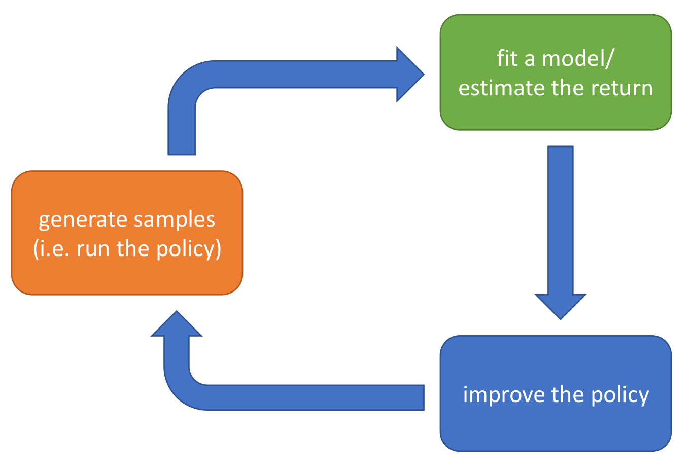

# Markov Decision Process (MDP)

## Basic Concepts

**Markov Chain**：

$$
\mathcal{M}=\{S,T\}
$$

其中， $S$ 被称为**state space**； $T$ 被称为**transition matrix**。 我们可以写出稳态的分布：
$$
p_{t+1}(s')=\sum_{s\in S}T(s',s)p_t(s)
$$

这就是一个简单的矩阵乘法。

**Markov Decision Process**：

$$
\mathcal{M}=\{S,A,T,r\}
$$

其中， $S$ 是**state space**， $A$ 是**action space**， $T$ 是**transition matrix**。我们有

$$
p_{t+1}(s')=\sum_{s,a}T(s',s,a)p_t(s)p^{(A)}_t(a)
$$

这里 $p^{(A)}_t(a)$ 代表在时刻 $t$ 来take action $a$ 的概率。

$r$ 是 **reward function**，对于任意(state,action)对，它给出

$$
r(s,a)\in \mathbb{R}
$$

在 **Partially Observed MDP (POMDP)** 中，我们还必须引入**observation** $o_t$ 。但在接下来，我们均不考虑这一情况。

## Goal

我们的目标是最大化 **cumulative reward**:
$$
\theta^\star=\arg\max_\theta \mathbb{E}_{\tau\sim p_\theta(\tau)}\left[\sum_{t=0}^T r(s_t,a_t)\right]
$$

其中 $\tau$ 代表轨迹 $(s_0,a_0,s_1,a_1,\ldots)$ , $p_\theta(\tau)$ 代表在策略 $\pi_\theta$ 下得到该轨迹的概率。

我们还希望把这一表达式扩展到 $T=\infty$ 。(注意现在的情况中有些问题，因为 $T\to \infty$ 时 $\tau$ 的probability space趋于无限大。) 为此，定义 $p_{\theta}(s_t,a_t)$ ，它是在时间 $t$ 获得 $(s_t,a_t)$ 的概率。 （注：参见第二讲**Notation**部分的重要注意事项， $p_\theta$ 对于不同的 $t$ 不是一个分布）

我们有
$$
p_{\pi_\theta}((s_{t+1},a_{t+1})|(s_t,a_t))=p(s_{t+1}|s_t,a_t){\pi_\theta}(a_{t+1}|s_{t+1})
$$

因此，可以重写goal为
$$
\theta^\star=\argmax_\theta \sum_{t=0}^T\mathbb{E}_{(s,a)\sim p_{\pi_\theta}(s_t,a_t)}\left[ r(s,a)\right]
$$

这以表达就很容易扩展到 $T\to \infty$ 的时候了。

## Value Function and Q Function

Value function是一个很重要的概念。它定义了一个state的价值，即在这个state下，我们可以获得的最大reward。我们可以定义**Value Function**为

$$
J=\sum_{t=0}^T\mathbb{E}_{(s_t,a_t)\sim p_{\pi_\theta}(s_t,a_t)}\left[ r(s_t,a_t)\right]
$$

$$
=\mathbb{E}_{s_0\sim p(s_0)}\left[\mathbb{E}_{a_0\sim \pi_\theta(a_0|s_0)}\left[r(s_0,a_0)+\sum_{t= 1}^T\mathbb{E}_{(s_t,a_t)\sim p_{\pi_\theta}(s_t,a_t|s_0,a_0)}\left[ r(s_t,a_t)\right]\right]\right]
$$

我们也可以从中定义著名的**Q-Function**：

$$
Q^{\pi_\theta}(s_t,a_t)=r(s_t,a_t)+\sum_{i={t+1}}^T\mathbb{E}_{(s_i,a_i)\sim p_{\pi_\theta}(s_i,a_i|s_{t},a_{t})}\left[ r(s_i,a_i)\right]
$$

（注意，这里还是一样的问题：如果 $T$ 有限，那么 $Q^{\pi_\theta}(\cdot,\cdot)$ 对于不同的 $t$ 很可能不是一个函数，但这一点从记号上没有显示出来。可以发现很多RL的记号都存在这种问题，需要自己意会。）

和**Value Function**：

$$
V^{\pi_\theta}(s_t)=\mathbb{E}_{a_{t}\sim \pi_\theta(a_t|s_t)}\left[Q^{\pi_\theta}(s_t,a_t)\right]
$$

这样我们的目标就变成了

$$
J=\mathbb{E}_{s_0\sim p(s_0)}\left[V^{\pi_\theta}(s_0)\right]=\mathbb{E}_{(s_0,a_0)\sim p_{\pi_\theta}(s_0,a_0)}\left[Q^{\pi_\theta}(s_0,a_0)\right]
$$

此外，我们还有一个重要的，联系 $Q$ 和 $V$ 的关系：

$$
Q^{\pi_\theta}(s_t,a_t)=r(s_t,a_t)+\mathbb{E}_{s_{t+1}\sim p(s_{t+1}|s_t,a_t)}\left[V^{\pi_\theta}(s_{t+1})\right]
$$

这使得我们可以使用**Dynamic Programming**的方法计算 $Q$ 和 $V$ 。之后，我们会讨论这一方法。

### Planing with Q and V

$Q,V$ 的重要性在于，它们可以很好地表达出我们的goal。换句话说，如果我们有了 $Q,V$ ，我们就可以优化policy。

比如说，如果我们有 $Q^{\pi}(s,a)$ ，我们就有一个最好的策略：

$$
\pi(a^\star,s)\leftarrow 1, a^\star=\argmax_a Q^{\pi}(s,a)
$$

除此之外，由于 $V$ 是 $Q$ 的期待值，我们也就知道我们的policy应该选择一个好的 $a$ ，使得 $Q(s,a)\ge V(s)$ 。这些直觉是很重要的，之后会讨论。

# RL Algorithms Overview

所有的RL算法都遵循这张图的结构：

"Generating Samples" 通常是比较容易的，因为只需要环境完成。最关键的部分是绿色和蓝色的部分：**Reward Evaluation** 和 **Policy Improvement**。

下面是一些常见的RL算法：（我们会在接下来的几讲介绍它们）

| Algorithm | Reward Evaluation | Policy Improvement |
| --- | --- | --- |
| Policy Gradients| $J$ is sum of rewards | Gradient Descent on $J$ |
| Value-based | Learn $V,Q$ of the **optimal policy** | Improve policy using $V,Q$ (with the intuition discussed above)|
| Acter-Critic | Learn $V,Q$ of the **current policy** | Improve policy using $V,Q$ |
| Model-based | Learn $f_\phi$ , $s_{t+1}=f_\phi(s_t,a_t)$ (Simulate the env) | Backprop onto $\pi_\theta$ using $f_\phi$ |

## Tradeoff

- **sample efficiency**: 
    - 这也被称为是否 "off-policy" ？"off-policy" 指的是，就算policy改变了，我们也可以利用之前的数据。这样的算法更加sample efficient。
    - 我们什么时候要care sample efficiency呢？可以发现，如果我们的环境是一个真实的物理环境，那么sample efficiency就很重要了。但如果我们的环境是一个模拟环境，我们就不用管这个。
    - 可以发现，最需要sample的当然是policy gradient；而model-based 和 value-based 需要的sample数是最少的。
- **wall clock time**:这是计算复杂度的一个简称。如果我们的模型要高频地与环境交互，那么计算复杂度就很重要了。
- **stability**:这是指算法的稳定性。policy gradient作为一个梯度下降算法，总是可以保证convergence；但其他大部分的RL算法的convergence还是open question。