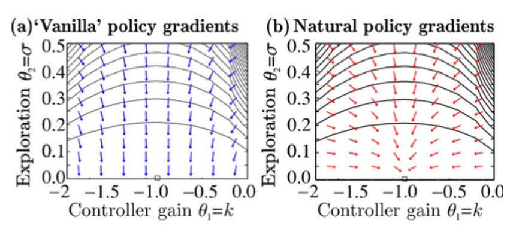

# Goal

我们本讲主要的两个目标：

- Policy Gradient和Policy Iteration算法大概等价；
- 在之前第五讲介绍Policy Gradient的时候我们给出了一个[First Order Approximation版本](./5-policy_grad.md#with-first-order-approximation)的算法，其中扔掉了很多项。我们现在来解释为什么丢掉这些项是合理的。

# Policy Gradient as Policy Iteration

让我们回顾一下policy gradient的表达式

$$
\nabla_\theta J(\theta)=\mathbb{E}_{\tau\sim p_\theta(\tau)}\left[\sum_{t=0}^{T-1}\nabla_\theta\log\pi_\theta(a_t|s_t)\hat{A}^{\pi_\theta}(s_t,a_t)\right]
$$

这里 $\hat{A}^{\pi_\theta}(s_t,a_t)$ 代表着取样估计的advantage function。比如在state-dependent baseline下，它可以写为

$$
\hat{A}^{\pi_\theta}(s_t,a_t)=\sum_{t'\ge t}\gamma^{t'-t} r(s_{t'},a_{t'})-V^{\pi_\theta}_\phi(s_t)
$$

原来的policy gradient的算法大致可以写为：

1. 利用 $\pi_\theta$ 采集新的数据；
2. 根据这些数据训练value function network $V^{\pi_\theta}_\phi$ 。
3. 利用模型计算advantage function并根据policy gradient 来 update policy $\pi_\theta$ ；

如果整理一下，会发现第2步实际上是**Estimate Advantage**，而第3步是**Improve Policy Based On Advantage**。这两步的思想和**policy iteration**是完全一致的！只不过，我们会发现，第3步的improve并不是像policy iteration那样直接argmax，而是采用了梯度上升这样更加soft的方法。

这就给我们一个直觉，policy gradient和policy iteration是等价的。我们接下来就来比较严格地说明这一点。

## Directly Optimizing the Policy Gradient Objective

我们还记得最开始介绍policy gradient的时候，提出了其objective为：

$$
J(\theta)=\mathbb{E}_{\tau\sim p_\theta(\tau)}\left[\sum_{t=0}^{T-1}\gamma^t r(s_t,a_t)\right]
$$

现在，我们考虑**直接优化**这一objective（而不是计算梯度）。具体地，我们用 $\theta_1$ 代表优化后的policy， $\theta_0$ 代表优化前的policy。那么

$$
J(\theta_1)-J(\theta_0)=\mathbb{E}_{\tau\sim p_{\theta_1}(\tau)}\left[\sum_{t=0}^{T-1}\gamma^t r(s_t,a_t)\right]-\mathbb{E}_{\tau\sim p_{\theta_0}(\tau)}\left[V^{\pi_{\theta_0}}(s_0)\right]
$$

注意这里巧妙的地方在于，对于第二项，我们把它表示为value function的形式。同时，注意到

$$
\mathbb{E}_{\tau\sim p_{\theta_0}(\tau)}[V^{\pi_{\theta_0}}(s_0)]=\mathbb{E}_{\tau\sim p_{\theta_1}(\tau)}[V^{\pi_{\theta_0}}(s_0)]
$$

因为二者的第一步分布都是一样的。这样就允许我们化简出

$$
J(\theta_1)-J(\theta_0)=\mathbb{E}_{\tau\sim p_{\theta_1}(\tau)}\left[\sum_{t=0}^{T-1}\gamma^t r(s_t,a_t)\right]-\mathbb{E}_{\tau\sim p_{\theta_1}(\tau)}[V^{\pi_{\theta_0}}(s_0)]
$$

$$
=\mathbb{E}_{\tau\sim p_{\theta_1}(\tau)}\left[\sum_{t=0}^{T-1}\gamma^t \left(r(s_t,a_t)-V^{\pi_{\theta_0}}(s_t)+\gamma V^{\pi_{\theta_0}}(s_{t+1})\right)\right]
$$

$$
=\mathbb{E}_{\tau\sim p_{\theta_1}(\tau)}\left[\sum_{t=0}^{T-1}\gamma^t A^{\pi_{\theta_0}}(s_t,a_t)\right]
$$

其中，advantage function还是像原来那样地定义:

$$
A^{\pi_{\theta_0}}(s_t,a_t):=r(s_t,a_t)-V^{\pi_{\theta_0}}(s_t)+\gamma \mathbb{E}_{s_{t+1}\sim p(\cdot|s_t,a_t)}\left[V^{\pi_{\theta_0}}(s_{t+1})\right]
$$

但现在我们需要优化的 $\theta_1$ 又跑到了底下。为了解决这个问题，我们还是进行importance sampling

$$
J(\theta_1)-J(\theta_0)=\mathbb{E}_{\tau\sim p_{\theta_1}(\tau)}\left[\sum_{t=0}^{T-1}\gamma^t A^{\pi_{\theta_0}}(s_t,a_t)\right]
$$

$$
=\sum_{t=0}^{T-1}\gamma^t \mathbb{E}_{s_t\sim p_{\theta_1}(s_t)}\left[\mathbb{E}_{a_t\sim \pi_{\theta_0}(a_t|s_t)}\left[A^{\pi_{\theta_0}}(s_t,a_t)\frac{\pi_{\theta_1}(a_t|s_t)}{\pi_{\theta_0}(a_t|s_t)}\right]\right]
$$

但问题没有完全解决——仍然有一部分 $\theta_1$ 在下面的概率分布里。为了解决这个问题，我们必须引入数学上的性质。

> **Claim.** 

我们现在断言，如果

$$
|\pi_{\theta_1}(\cdot|s_t)-\pi_{\theta_0}(\cdot|s_t)|\le \epsilon
$$
（这里依然是total variation distance），那么写

$$
J(\theta_1)-J(\theta_0)=\sum_{t=0}^{T-1}\gamma^t \mathbb{E}_{s_t\sim p_{\textcolor{red}{\theta_0}}(s_t)}\left[\mathbb{E}_{a_t\sim \pi_{\theta_0}(a_t|s_t)}\left[A^{\pi_{\theta_0}}(s_t,a_t)\frac{\pi_{\theta_1}(a_t|s_t)}{\pi_{\theta_0}(a_t|s_t)}\right]\right]
$$

**不会带来很大误差**。

这个证明我们为了连贯性放到最后。那么为了利用这个claim，我们就需要先进行约束。这就带来了下面称为“Little Step”的优化问题：

> **Little Step**:
> 
> **Maximize** $J(\theta_1)=\sum_{t=0}^{T-1}\gamma^t \mathbb{E}_{s_t\sim p_{{\theta_0}}(s_t)}\left[\mathbb{E}_{a_t\sim \pi_{\theta_0}(a_t|s_t)}\left[A^{\pi_{\theta_0}}(s_t,a_t)\frac{\pi_{\theta_1}(a_t|s_t)}{\pi_{\theta_0}(a_t|s_t)}\right]\right]$ w.r.t. $\theta_1$
>
> **With Constraint** $|\pi_{\theta_1}(\cdot|s_t)-\pi_{\theta_0}(\cdot|s_t)|\le \epsilon$

现在，假设我们解决了这个优化问题，那么直观上我们就可以解决了原来的 $J(\theta_1)-J(\theta_0)$ 的优化问题：只要**不断地迭代**这个Little Step，我们就可以逐渐优化 $J(\theta)$ ！这有点像gradient step中限制了一个grad norm（做gradient clipping），使得每一步都只能走不超过一个距离，但是最终还是可以到达最优点。

这样，我们接下来就只需要考虑这个Little Step的优化问题了。

## Optimization With Constraints

首先，注意到total variation的数学性质不是特别好，我们用KL divergence来代替它。这里引入一个well-known的不等式：

$$
|p(\cdot)-q(\cdot)|\le \sqrt{\frac{1}{2}\text{KL}(p||q)}
$$

这样，我们就可以把问题转化为约束在

$$
\text{KL}\left(\pi_{\theta_1}(\cdot|s_t)||\pi_{\theta_0}(\cdot|s_t)\right)\le \epsilon
$$

的情况下进行优化。接下来，有两种可能的思路。通过第二种思路，我们可以最终建立起通往policy gradient的桥梁。

### Method 1: Add to loss

这个方法并不强制差距不超过 $\epsilon$ ，而只是大致地理解其含义： $\pi_{\theta_1}$ 和 $\pi_{\theta_0}$ 应该接近。根据DL给我们留下的重要思想，我们想要什么，就把什么加到loss里面：

$$
\tilde{J}=\sum_{t=0}^{T-1}\gamma^t \mathbb{E}_{s_t\sim p_{{\theta_0}}(s_t)}\left[\mathbb{E}_{a_t\sim \pi_{\theta_0}(a_t|s_t)}\left[A^{\pi_{\theta_0}}(s_t,a_t)\frac{\pi_{\theta_1}(a_t|s_t)}{\pi_{\theta_0}(a_t|s_t)}\right]\right]-\beta \text{KL}\left(\pi_{\theta_1}(\cdot|s_t)||\pi_{\theta_0}(\cdot|s_t)\right)
$$

这样，只需要最大化 $\tilde{J}$ 就可以了。然后可以动态地调整 $\beta$ ：如果KL divergence比 $\epsilon$ 大很多，那么就增大 $\beta$ ；否则减小 $\beta$ 。这可以经验地由

$$
\beta\leftarrow \beta+\alpha(\text{KL}-\epsilon)
$$

决定。一个基于这样的思路的著名算法是**PPO（Proximal Policy Optimization）**。

### Method 2: Natural Gradient

我们还是直接做梯度的计算，但是保证梯度下降的每一步不能太大，进而避免KL divergence超出限额。

这里，好玩的一点立刻来了：我们先对这里的objective求导：

$$
\nabla_{\theta_1}J(\theta_1)=\sum_{t=0}^{T-1}\gamma^t \mathbb{E}_{s_t\sim p_{{\theta_0}}(s_t)}\left[\mathbb{E}_{a_t\sim \pi_{\theta_0}(a_t|s_t)}\left[A^{\pi_{\theta_0}}(s_t,a_t)\frac{\nabla_{\theta_1}\pi_{\theta_1}(a_t|s_t)}{\pi_{\theta_0}(a_t|s_t)}\right]\right]
$$

$$
=\sum_{t=0}^{T-1}\gamma^t \mathbb{E}_{s_t\sim p_{{\theta_0}}(s_t)}\left[\mathbb{E}_{a_t\sim \pi_{\theta_0}(a_t|s_t)}\left[A^{\pi_{\theta_0}}(s_t,a_t)\frac{\pi_{\theta_1}(a_t|s_t)}{\pi_{\theta_0}(a_t|s_t)}\nabla_{\theta_1}\log \pi_{\theta_1}(a_t|s_t)\right]\right]
$$

我们惊奇地发现，这个表达式**就是**之前policy gradient中[First Order Approximation](./5-policy_grad.md#with-first-order-approximation)的表达式！换句话说，**原先的Policy Gradient的First-order-approximation在一定条件下是合理的；它有效的条件是KL divergence不能太大。**

接下来，让我们来严格地对待这个优化问题。首先，作小量近似，可以给出约束的形式

$$
\text{KL}(\pi_{\theta_1}(\cdot|s_t)||\pi_{\theta_0}(\cdot|s_t))\approx \frac{1}{2}(\theta_1-\theta_0)^T \mathbf{F} (\theta_1-\theta_0) \le \epsilon
$$

这里 $\mathbf{F}$ 是Fisher information matrix：

$$
\mathbf{F}=\mathbb{E}_{a\sim \pi_\theta(a|s)}\left[\nabla_\theta \log \pi_\theta(a|s)\nabla_\theta \log \pi_\theta(a|s)^T\right]
$$

而优化的目标在首阶近似下可以写为

$$
J(\theta_1)\approx J(\theta_0)+(\theta_1-\theta_0)\nabla_{\theta_0}J(\theta_0)
$$

这时，因为有一个同阶的约束，我们就**不一定沿着梯度的方向**前进（因为沿着梯度虽然目标函数下降很快，但可能沿着这个方向被约束的比较严重，可能不能走很远）。因此，需要使用拉格朗日乘数法：

$$
0=\nabla_{\theta_1}\left[(\theta_1-\theta_0)\nabla_{\theta_0}J(\theta_0)-\frac{1}{2\alpha}(\theta_1-\theta_0)^T \mathbf{F} (\theta_1-\theta_0)\right]
$$

计算可以得到

$$
\theta_1\leftarrow \theta_0 + \sqrt{2\epsilon} \frac{F^{-1}g}{\sqrt{g^TF^{-1}g}}
$$

其中 $g=\nabla_{\theta_0} J(\theta_0)$ 是原来的梯度。这个算法就被称为**Natural Gradient**。还有一个更著名的、基于这一方法的算法，称为**TRPO（Trust Region Policy Optimization）**。

> Q: 直观地说，Natural Gradient在做什么？
>
> A: 有这样一个很好的例子：假设我们现在有一个高斯分布 $\log \pi_\theta(a|s)=-\frac{(ks-a)^2}{2\sigma^2}+\text{Const}$ ，设 $\theta=(\sigma,k)$ ，那么如果直接进行policy gradient，我们需要计算 $\nabla_\theta \log \pi_\theta(a|s)$ 。这样的梯度很明显在 $\sigma\to 0$ 的时候， $\sigma$ 方向上的梯度比 $k$ 上的梯度大一个量级，如左边的图所示。
> 

> 但另外一个方面，如果我们对于每一个点都计算一个Fisher matrix，并采用natural gradient的梯度下降公式，我们会惊奇地发现梯度变成了右边的图的样子，这样即使在 $\sigma$ 很小的时候梯度也指向了正确的方向！
>
> 换句话说，Fisher matrix本身反映的就是 $\nabla_\theta \log \pi_\theta$ 的不同分量的大小关系；原本 $\sigma$ 分量上 $\nabla_\theta J$ 比较大就是因为 $\nabla_\theta \pi_\theta$ 比较大，这样Fisher matrix的逆就会把它拉回去。

## Conclusion

我们总结一下前面得到的主要结论：
- **offline policy gradient**是policy iteration的优化问题的一种**解决方案**。
- offline policy gradient（特别是first order approximation）成立的条件是每一步update对应的KL divergence不能太大。这**指出了之前policy gradient本身难以注意的问题，并给出了解决方案**：natural gradient。

总而言之，我们站在一个更高的视角审视policy gradient，并最终解释了它的合理性，并给出了确保合理性的算法。

## Prove of the Claim: Bounding the distribution mismatch

在这里，我们试着证明claim。

记

$$
f(s_t)=\gamma^t\mathbb{E}_{a_t\sim \pi_{\theta_0}(a_t|s_t)}\left[A^{\pi_{\theta_0}}(s_t,a_t)\frac{\pi_{\theta_1}(a_t|s_t)}{\pi_{\theta_0}(a_t|s_t)}\right]
$$

那么我们的目标是在给定

$$
|\pi_{\theta_0}(\cdot|s_t)-\pi_{\theta_1}(\cdot|s_t)|\le \epsilon\quad (\forall s_t)
$$

的前提下，论证

$$
\sum_{t=0}^{T-1} \mathbb{E}_{s_t\sim p_{{\theta_0}}(s_t)}\left[f(s_t)\right]\approx \sum_{t=0}^{T-1} \mathbb{E}_{s_t\sim p_{{\theta_1}}(s_t)}\left[f(s_t)\right]
$$

我们首先约化一步。注意到 $f(x)$ 的值域总是可以被bound的，因此我们有

$$
\left|\sum_{t=0}^{T-1} \mathbb{E}_{s_t\sim p_{{\theta_0}}(s_t)}\left[f(s_t)\right]-\sum_{t=0}^{T-1} \mathbb{E}_{s_t\sim p_{{\theta_1}}(s_t)}\left[f(s_t)\right]\right|\le C\cdot \sum_{t=0}^{T-1}\left|p_{\theta_0}^{(t)}(\cdot)-p_{\theta_1}^{(t)}(\cdot)\right|=\mathcal{O}( C\cdot T^2\epsilon )
$$

这样，我们只需要论证

$$
\left|p_{\theta_0}^{(T)}(\cdot)-p_{\theta_1}^{(T)}(\cdot)\right|\le T\epsilon
$$

### 直观的理解

我们可以直观理解为什么这个total variation可以被bound在 $T\epsilon$ 。Markov Chain具有两个步骤：

$$
s\to a; (s,a)\to s'
$$

第二步对于 $p_0$ 和 $p_1$ 都是一样的，而第一步误差不会超过 $\epsilon$ 。根据Markov chain的coupling理论，我们可以构造两列随机变量 $X_s,Y_s$ ，使得它们单独某一个的边缘分布都按照Markov Chain进行行走，但 $X_s=Y_s$ 的概率特别大。再根据total variance的性质

$$
\frac{1}{2}|p(\cdot)-q(\cdot)|=\inf_{\varphi\in \Pi(p,q)}\left[\Pr_{(x,y)\sim \varphi}(x\ne y)\right]
$$

我们就可以通过构造这样一个 $\varphi$ 来证明 $|p_{\theta_0}^{(T)}(\cdot)-p_{\theta_1}^{(T)}(\cdot)|$ 可以被bound。不仅如此，我们还可以定量地大致叙述出来：对于 $(s,a)\to s'$ 这样的步骤，我们的coupling可以选的是只要 $X_s=Y_s,a^{(X)}_s=a^{(Y)}_s$ 就能保证 $X_{s+1}=Y_{s+1}$ ；而对于 $s\to a$ 这样的步骤，我们可以选的是对于 $X_s=Y_s$ ，action不一致的概率不超过 $\epsilon$ 。这样， $T$ 步中出错的概率就不会超过 $T\epsilon$ 。

### 严格的证明

事实上，我们归纳地论证

$$
\left|p_{\theta_0}^{(t+1)}(\cdot)-p_{\theta_1}^{(t+1)}(\cdot)\right|\le \left|p_{\theta_0}^{(t)}(\cdot)-p_{\theta_1}^{(t)}(\cdot)\right|+\epsilon
$$

这实际上可以通过total variance的不等式完成。令 $A= \left|p_{\theta_0}^{(t)}(\cdot)-p_{\theta_1}^{(t)}(\cdot)\right|$ ， 根据前面提到的重要性质

$$
\frac{1}{2}|p(\cdot)-q(\cdot)|=\inf_{\varphi\in \Pi(p,q)}\left[\Pr_{(x,y)\sim \varphi}(x\ne y)\right]
$$

我们可以构造一个分布 $\varphi(\cdot,\cdot,\cdot,\cdot)$ 使得

$$
\varphi(s_t,...)=p_{\theta_0}(s_t),\quad \varphi(:,s_t',...)=p_{\theta_1}(s_t')
$$

$$
\Pr_{(s_t,s_t')\in \varphi(\cdot,\cdot,...)}(s_t\ne s_t')=\frac{A}{2}.
$$

$$
\varphi(s_t,\cdot,a_t,\cdot|s_t)=\pi_{\theta_0}(a_t|s_t),\quad \varphi(\cdot,s_t',\cdot,a_t'|s_t')=\pi_{\theta_1}(a_t'|s_t')
$$

$$
\varphi(s_t,s_t,a_t\ne a_t'|s_t)\le \frac{\epsilon}{2}
$$

接下来，我们可以把 $\varphi$ 拓展两维，具体地：

1. 若 $s_t=s_t',a_t=a_t'$ ，那么 $s_{t+1}=s'_{t+1}$ ；
2. 若否，那么 $s_{t+1}$ 随机根据 $p(s_{t+1}|s_t,a_t)$ 采样， $s'_{t+1}$ 随机根据 $p(s_{t+1}|s_t',a_t')$ 采样。

这样，我们就有一个 $\varphi(\cdot,\cdot,\cdot,\cdot,\cdot,\cdot)$ ，使得

$$
\varphi(s_t,\cdot,a_t,\cdot,s_{t+1},\cdot|s_t,a_t)=p_{\theta_0}(s_{t+1}|s_t,a_t)
$$

$$
\varphi(\cdot,s_t',\cdot,a_t',\cdot,s'_{t+1}|s_t',a_t')=p_{\theta_1}(s'_{t+1}|s_t',a_t')
$$

并且，

$$
\Pr_{(s_{t+1},s_{t+1}')\sim \varphi(...,\cdot,\cdot)}(s_{t+1}\ne s_{t+1}')\le \Pr_{(s_{t},s_{t}')\sim \varphi(\cdot,\cdot,...)}(s_{t}\ne s_{t}')+ \Pr_{(s_{t},s_{t},a_t,a_t')\sim \varphi(\cdot,\cdot,\cdot,\cdot,...)}(a_{t}\ne a_{t}')
$$

$$
\le \frac{A}{2}+ \frac{\epsilon}{2}
$$

因此

$$
\left|p_{\theta_0}^{(t+1)}(\cdot)-p_{\theta_1}^{(t+1)}(\cdot)\right|\le A+\epsilon
$$

归纳得证。

# Reference Papers

1. [Trust Region Policy Optimization](https://arxiv.org/abs/1502.05477)
2. [Proximal Policy Optimization Algorithms](https://arxiv.org/abs/1707.06347)
3. [Reinforcement learning of motor skills with policy gradients](https://www.ias.informatik.tu-darmstadt.de/uploads/Publications/Publications/Neural-Netw-2008-21-682_4867[0].pdf)（介绍了Natural Gradient）