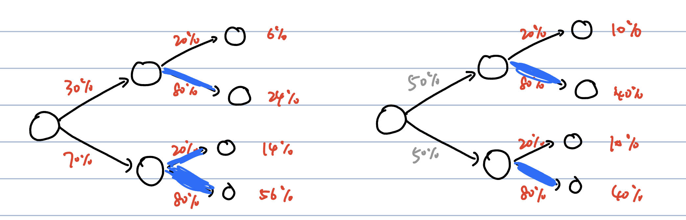

# Policy Gradient Algorithm

我们直接优化目标

$$
J(\theta)=\mathbb{E}_{\tau\sim p_{\pi_\theta}(\tau)}\left[\sum_t r(s_t,a_t)\right]
$$

我们计算梯度，并使用一个小的数学技巧：

$$
\nabla_\theta J(\theta)=\nabla_\theta\left[\int p_{\pi_\theta}(\tau)\sum_t r(s_t,a_t)d\tau\right]
$$

$$
=\int p_{\pi_\theta}(\tau) \nabla_\theta \log p_{\pi_\theta}(\tau)\sum_t r(s_t,a_t)d\tau
$$

$$
=\mathbb{E}_{\tau\sim p_{\pi_\theta}(\tau)}\left[\nabla_\theta \log p_{\pi_\theta}(\tau)\sum_t r(s_t,a_t)\right]
$$

$$
=\mathbb{E}_{\tau\sim p_{\pi_\theta}(\tau)}\left[\left(\sum_t \nabla_\theta\log \pi_\theta(a_t|s_t)\right)\left(\sum_t r(s_t,a_t)\right)\right]
$$

当然，在实际上，我们一般通过采样 $N$ 条轨迹来估计梯度：

$$
\nabla_\theta J(\theta)\approx \frac{1}{N}\sum_{n=1}^N \left(\sum_t \nabla_\theta\log \pi_\theta(a_t|s_t)\right)\left(\sum_t r(s_t,a_t)\right)
$$

这一算法也叫做**REINFORCE** algorithm。 它包含三步（就像第四讲提到的那样）：

1. Sample $N$ trajectories $\tau_n$ by $\pi_\theta$ .
2. Compute the gradient of $J(\theta)$ approximately
3. Update $\theta$ by gradient descent.

*Comments.* 直观上看，对于使得reward $\sum r(s_t,a_t)$ 很大的 $a_t$ ，梯度 $\nabla \log \pi_\theta(a_t|s_t)$ 的"learning rate"更大，所以模型会倾向于把更大的概率给这个action。

## Issues with the vanilla Policy Gradient

这个算法听起来很直观并且很好实现，但是实际上会发现有一定的问题：**reward出现的方式不对**。

设想现在我们把每一个reward加一个常数，这个体系本身不应该受影响；但现在的形式中reward作为一个类似于"learning rate"的形式乘在上面，这就导致了可能的问题。

- 举个例子：假设现在我们取3条轨迹，他们的reward分别为-2,1,1，那么（粗略来说）第一条的概率会下降，第二、三条的概率会上升。但是假设现在reward全局增加一个常数，导致它们变成了100,103,103,那么可以想到它们三条轨迹的概率都会上升，这明显是不对的（因为第一条轨迹在取样的三条中都是最差的，很难说他是一条很好的轨迹）！
- 但是另一方面，如果样本足够多( $N\to\infty$ )，根据理论我们知道整体reward的平移不会影响policy的gradient。
    - 注意上面的解释只不过是intuition；假设现在我们每一个reward都加了一个100导致全部是正的了，这并不会导致所有概率都增加（因为最后的梯度并不是传到概率上，而是传到概率分布的parameters上！）。可以想象，如果所有reward都等于100，那么就像所有都是0一样不会有任何update发生。
    - 因此，这实际上是policy gradient的一个典型问题：**估计本身是unbiased的，但在sample数量不够的时候会产生很大的variance，从而导致估计具有很大的bias**。

为了解决这个问题，引入了重要的两个方法：**baseline**和**causality**。

### Baseline

Baseline直接对上面的问题开刀：既然reward上叠加的uniform constant不影响gradient，那我们不妨修改一下梯度的表达式:

$$
\nabla_\theta J(\theta)\approx \frac{1}{N}\sum_{n=1}^N \nabla_\theta\log p_{\pi_\theta}(\tau_n)\left(r(\tau_n)-b\right)
$$

这里的 $b$ （称为**baseline**）应该是任意的，因为
$$
\mathbb{E}_{\tau\sim p_{\pi_\theta}(\tau)}\left[\nabla_\theta\log p_{\pi_\theta}(\tau)\right]=0
$$

但是另一方面，就像我们前面提到的那样，样本有限的时候可不能乱搞——我们必须选取 $b$ 使得variance最小。但这个计算复杂度太高了，实际上一般不会使用。

### Causality

Causality关注到了一个不易察觉的问题：我们原来的表达式其含义是， $\pi_\theta(a_t|s_t)$ 的梯度依赖于整个过程的reward大小 $\sum_{t}r(s_t,a_t)$ ；但实际上这并不合理——根据因果性， $t$ 时刻的决策不会影响 $t'<t$ 时刻的reward。因此，即使前面几步走的比较差，你不能让后面走的很好的步骤也蒙受这个惩罚。

按照这个思路，我们直接改写

$$
\nabla_\theta J(\theta)\approx \frac{1}{N}\sum_{n=1}^N \sum_{t=1}^T \nabla_\theta\log \pi_\theta(a_t|s_t)\left(\sum_{t'=t}^T r(s_{t'},a_{t'})\right)=\frac{1}{N}\sum_{n=1}^N \sum_{t=1}^T \nabla_\theta\log \pi_\theta(a_t|s_t)\hat{Q}^{\pi_\theta}_{n,t}
$$

其中的 $\hat{Q}^{\pi_\theta}_{n,t}$ 有点类似于Q-function但并不是——它是依赖于路径的，“未来所有reward之和”。

数学上，也可以直接证明这样的causality表达式和原先的表达式在 $N\to\infty$ 时是等价的，因为

$$
\mathbb{E}_{\tau\sim p_{\pi_\theta}(\tau)}\left[\nabla \log \pi_\theta(a_t|s_t)\left(\sum_{t'<t}r(s_{t'},a_{t'})\right)\right]=0
$$ 

只不过，就如我们之前说的那样，通过减小不应该出现的项进行约化，这个利用了causality的表达式会减小variance。

# Off-Policy Policy Gradients

除了巨大的variance之外，policy gradient的on-policy特性（见第4讲）也造成了sample efficiency的问题。当然，一般policy gradient都是用在sample efficiency不需要特别考虑的地方，但是我们还是讨论一类特别的方式，把off-policy的思想引入policy gradient。

关键在于采用**Importance Sampling**。假设现在我们有 $p_{\pi_{\bar{\theta}}}$ 这个分布中取样的若干样本，那么我们就可以用importance sampling利用这些样本来估计 $p_{\pi_\theta}$ 分布中某些东西的期望。具体地，我们写出

$$
\nabla_{\theta}J(\theta)=\mathbb{E}_{\tau\sim p_{\pi_\theta}(\tau)}\left[\nabla_{\theta}\log p_{\pi_\theta}(\tau)\sum_t r(s_t,a_t)\right]
$$

$$
=\mathbb{E}_{\tau\sim p_{\pi_{\bar{\theta}}}(\tau)}\left[\frac{p_{\pi_\theta}(\tau)}{p_{\pi_{\bar{\theta}}}(\tau)}\nabla_{\theta}\log p_{\pi_\theta}(\tau)\sum_t r(s_t,a_t)\right]
$$

$$
=\mathbb{E}_{\tau\sim p_{\pi_{\bar{\theta}}}(\tau)}\left[\prod_{t=1}^T\frac{{\pi_\theta}(a_t|s_t)}{{\pi_{\bar{\theta}}}(a_t|s_t)}
\left(\sum_{t=1}^T \nabla_{\theta}\log \pi_\theta(a_t|s_t) \right)\left(\sum_{t=1}^T r(s_t,a_t)\right)\right]
$$

这样，在连续几轮对policy的训练中，我们只需要在一开始对策略 $\pi_{\bar{\theta}}$ 进行一个采样，就可以用于几轮的训练。我们成功把off-policy的思想引入了policy gradient。

但是这样仍然存在问题：我们注意到，这里有一个 $T$ 个数的连乘积，如果网络的输出比较大或者小，这就很容易导致等式左边（也就是梯度）过大或过小。因此，我们需要进行一些近似（或严格变形）。

## With Causality

这个计算有些复杂。我们首先从旧的causality表达式开始（不做importance sampling）：

$$
\nabla_\theta J(\theta)=\mathbb{E}_{\tau\sim p_\theta(\tau)}\left[ \sum_{t=1}^T \nabla_\theta\log \pi_\theta(a_t|s_t)\left(\sum_{t'=t}^T r(s_{t'},a_{t'})\right)\right]
$$

$$
=\sum_{t=1}^T\sum_{t'=t}^T \mathbb{E}_{\tau\sim p_\theta(\tau)}\left[r(s_{t'},a_{t'}) \nabla_\theta\log \pi_\theta(a_t|s_t) \right]
$$

$$
=\sum_{t=1}^T\sum_{t'=t}^T \sum_{s_1,a_1,\cdots,s_T,a_T}p(s_1)\pi_\theta(a_1|s_1)\cdots p(s_T|a_{T-1},s_{T-1})\pi_\theta (a_T|s_T)r(s_{t'},a_{t'}) \nabla_\theta\log \pi_\theta(a_t|s_t)
$$

（接下来这一步的思想是对概率分布使用causality，但数学上是严格等的）

$$
=\sum_{t=1}^T\sum_{t'=t}^T \sum_{s_1,a_1,\cdots,s_{t'},a_{t'}}p(s_1)\pi_\theta(a_1|s_1)\cdots p(s_{t'}|a_{{t'}-1},s_{{t'}-1})\pi_\theta (a_{t'}|s_{t'})r(s_{t'},a_{t'}) \nabla_\theta\log \pi_\theta(a_t|s_t)
$$

$$
=\sum_{t=1}^T\sum_{t'=t}^T\mathbb{E}_{\tau_{\le t'}\sim p_{\bar{\theta}}(\tau_{\le t'})}\left[\prod_{t''=1}^{t'}\frac{{\pi_\theta}(a_{t''}|s_{t''})}{{\pi_{\bar{\theta}}}(a_{t''}|s_{t''})}r(s_{t'},a_{t'})\nabla_{\theta}\log \pi_\theta(a_t|s_t)\right]
$$

$$
=\sum_{t=1}^T\sum_{t'=t}^T\mathbb{E}_{\tau \sim p_{\bar{\theta}}(\tau)}\left[\prod_{t''=1}^{t'}\frac{{\pi_\theta}(a_{t''}|s_{t''})}{{\pi_{\bar{\theta}}}(a_{t''}|s_{t''})}r(s_{t'},a_{t'})\nabla_{\theta}\log \pi_\theta(a_t|s_t)\right]
$$

$$
=\sum_{t=1}^T\mathbb{E}_{\tau \sim p_{\bar{\theta}}(\tau)}\left[\nabla_{\theta}\log \pi_\theta(a_t|s_t)\cdot \prod_{t''=1}^{t}\frac{{\pi_\theta}(a_{t''}|s_{t''})}{{\pi_{\bar{\theta}}}(a_{t''}|s_{t''})}\sum_{t'=t}^T\left(r(s_{t'},a_{t'})\prod_{t''=t+1}^{t'}\frac{{\pi_\theta}(a_{t''}|s_{t''})}{{\pi_{\bar{\theta}}}(a_{t''}|s_{t''})}\right)\right]
$$

## With First-order Approximation

First-order approximation是指，我们丢掉 $t'\ne t$ 的importance weight项，给出

$$
\nabla_\theta J(\theta)=\sum_{t=1}^T\mathbb{E}_{\tau \sim p_{\bar{\theta}}(\tau)}\left[\frac{{\pi_\theta}(a_{t}|s_{t})}{{\pi_{\bar{\theta}}}(a_{t}|s_{t})}\nabla_{\theta}\log \pi_\theta(a_t|s_t)\sum_{t'=t}^Tr(s_{t'},a_{t'})\right]
$$

乍一看，这毫无道理：为什么我们可以丢掉这么多项？实际上，这一方法更多地来自一个更高的视角。我们会在第9讲进行介绍。不管如何，这样显然减少了巨量的计算量——就算它没有什么道理，如果它work了，人们也想必会十分器重它。

但在接受后面更高级的知识之前，不妨让我们先来从直觉上理解一下上面的表达式的原理。以下内容是来自[jzc](https://github.com/szjzc2018)的一个非常不错的理解
 
> 可以看到，上面的表达式相比于原先最开始的数学上严格的表达，相当于去除了除了 $t$ 时刻之外的所有importance weight。为什么这是合理的呢？

> 我们考虑这样一张图：假设环境是决定性的，而红色标出的是我们的policy的概率。那么根据两步得到的正确概率，我们policy gradient导致的policy概率分布的梯度就可以用图中的蓝线的表示（这里蓝线越粗代表梯度越大）。比如说，从上到下第二个点的reward就比第一个点对policy的梯度影响更大。
> 
> 那么现在我们移去前面（也就是 $t'<t$ 的）importance sampling的项，相当于丧失了第一步的信息（标为灰色，这里假设proposal就是简单的均匀分布，50%概率），也就是训练的数据集中第一步的概率分布完全由proposal $\pi_{\bar{\theta}}$ 提供。但是即便如此，我们可以发现这个模型也可以学会第二步的正确操作：每一个点处policy的选取还是决定于概率更大的那个的reward。
>
> 类似地，前面移除后面的importance weight的影响也只是在于更久远的reward相差了一定的倍数。（原来的时候对于不同的 $t'>t$ ， $r(s_{t'},a_{t'})$ 有着不同的importance weight，但现在直接是加起来）。只要 $t$ 时刻的importance weight还在，整体的优化方向就大概仍然是对的。
> 
> 你可能会argue，这张图片里的情况是因为数字上的巧合（更改这几个概率的数值会使得结论变的不是这样）。但是我**并不是试图论证它是“完全正确的”**；相反，我们却只需要说明这个新的loss是**合理的**：这个新的loss可以理解为**前面和后面都按照importance sampling的方式走，只有第t步按照现有的policy来走**，这样一个**新的**"hybridized policy"。直观上可以想象，优化这个policy也可以带着原来的policy往正确的方向前进。

这里，还透露出一个至深的思想：

> **小贴士**
> 
> RL的一个重要观点是，和DL不同，我们没有一个绝对的“目标”的概念。value只是一个proposed的目标，关键还是要我们的模型能够work。
> 
> 这就是为什么我们很多时候为了减少计算量可以做一些数学上不完全正确的事情：你可以理解为我们换了一个新的目标（比如上面，改成在这样的一个“hybridized”的policy下面最优化reward），只要这个目标依然合理（不能有明显的情况使得它负优化），并且数学上使得计算更简单，那我们就是稳赚不赔。

# Policy Gradient In Practice

## Fake Loss Function for Autograd

我们先回到只考虑causality的policy gradient的表达式：

$$
\nabla_\theta J(\theta)\approx \frac{1}{N}\sum_{n=1}^N \sum_{t=1}^T \nabla_\theta\log \pi_\theta(a_t|s_t)\left(\sum_{t'=t}^T r(s_{t'},a_{t'})\right)=\frac{1}{N}\sum_{n=1}^N \sum_{t=1}^T \nabla_\theta\log \pi_\theta(a_t|s_t)\hat{Q}^{\pi_\theta}_{n,t}
$$

为了避免手动计算梯度，我们可以构造一个没有实际意义的loss，但这个loss的梯度就是 $\nabla_\theta J(\theta)$ 。它可以是

$$
\tilde{J}(\theta)=\frac{1}{N}\sum_{n=1}^N \sum_{t=1}^T \log \pi_\theta(a_t|s_t)\hat{Q}^{\pi_\theta}_{n,t}
$$

（注意 $\hat{Q}^{\pi_\theta}_{n,t}$ 和 $\theta$ 无关，只和路径有关）

## Tune the Hyperparameters

- Learning rate: hard to tune, so better use Adam.
- Batch size: as large as possible, since the variance is large.

# Further Policy Gradients

我们会在第9讲继续介绍有关policy gradient的知识。届时，我们会从另外一个角度理解policy gradient，并对其提出一个重要的改进。

# Reference Papers

1. [Guided Policy Search](https://proceedings.mlr.press/v28/levine13.html)（使用importance sampling的policy gradient方法）
2. [Infinite-horizon policy-gradient estimation](https://arxiv.org/abs/1106.0665) （介绍了temporally decomposed policy gradient）
3. [Reinforcement learning of motor skills with policy gradients](https://www.ias.informatik.tu-darmstadt.de/uploads/Publications/Publications/Neural-Netw-2008-21-682_4867[0].pdf)（介绍了optimal baselines 和 natural gradient）