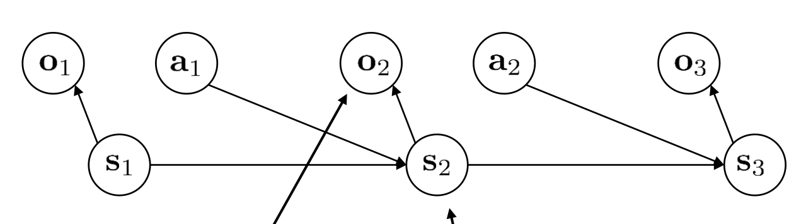
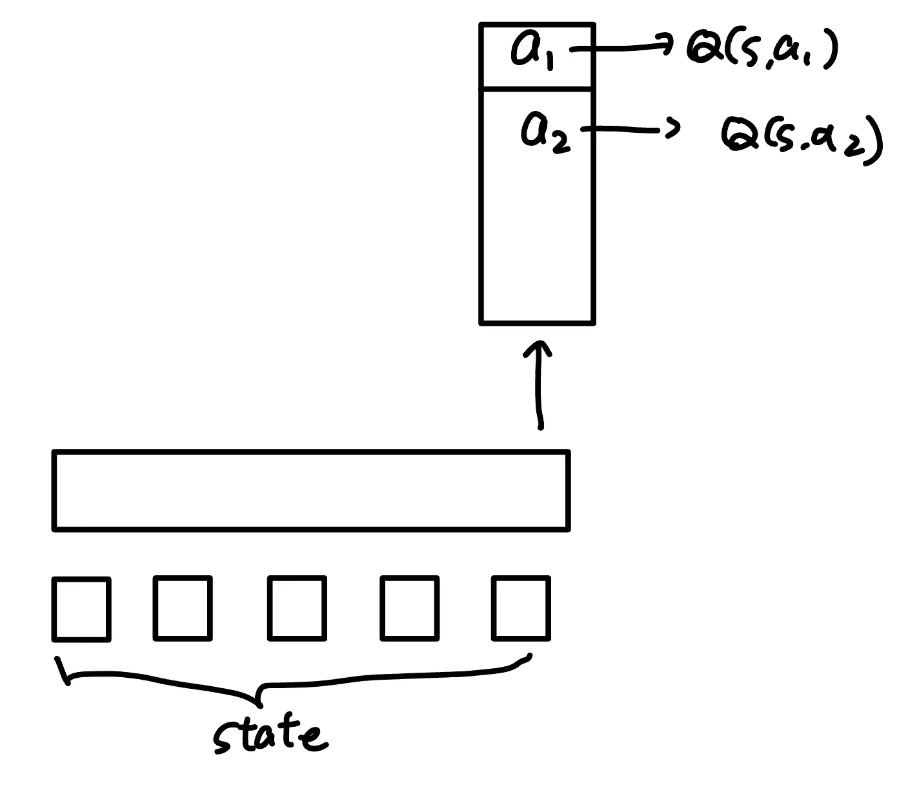

# RL and Language Models

## Partially Observed Scenarios

之前我们介绍的大部分问题都是fully observed的，因此也不用区分state和observation；但在很多问题中，我们观察到的observation $o_t$ 和state $s_t$ 并非一致。比如游戏图像并不包含全部的状态，或者对话的过程中历史也产生影响，等等。

把这类问题formalize一下，就是所谓**POMDP**(Partially Observed MDP)，其结构如图所示：state $s_t$ 是和之前一样的，具有Markov property的；但我们的policy只能condition on $o_t$ ，但 $o_t$ 并不包含 $s_t$ 的全部信息。

对于这样的问题，也有两种policy；第一种称为“memoryless”，也就是policy就是 $\pi(a_t|o_t)$ ，不依赖于 $o_{1..t-1}$ ；第二种则可以利用全部的 $o_{1..t}$ ，这更加普遍。

### Basics of POMDP

POMDP可能比较奇怪。首先，可能有一些奇怪的action出现，其“牺牲小我成就大我”，也就是虽然这个action对于当前的reward是负面的，但收集到了信息，所以有助于未来的reward。比如说，在走迷宫的时候，最优的策略很可能是先随便试一试，再有策略地走。

此外，对于普通的MDP，一定存在一个决定性的策略，不差于任何其他的策略（即为最优策略）；但对于POMDP并且memoryless的情况下，并非如此。

> 比如，考虑一个例子：state 有A,B,C三个；到达B获得reward并立刻结束，否则不获得reward。从A出发，一半概率留在A，一半到达B；从B出发到达A,C各一半；从C出发一半到达B，一半留在C。
>
> 我们再定义observation，使得它无法提供任何信息： $o_A=o_B=o_C$ 。这样，如果memoryless并且决定性，那只能不断向左或者向右，成功的概率只有一半；但一个memoryless并且非决定性的策略是一半概率向左，一半概率向右，这样一定能成功。

### Method 1: Treating POMDP as MDP

接下来，我们来研究如何解决POMDP的问题。一个很自然的想法就是，我们在之前的方法里面，直接把所有state替换为observation。这样行不行呢？这就取决于，原来的方法是否依赖于state的Markov property。接下来，我们分别来讨论。

需要注意，这样给出的policy只能是memoryless的，因为原来的policy只依赖于当前的 $s_t$ 。

#### Policy Gradients

替换后的第一种形式是

$$
\nabla_\theta J(\theta) = \mathbb{E}_{\tau\sim \pi_\theta}\left[\log \pi_\theta(a_t|o_t)\hat{A}(o_t,a_t)\right]
$$

其中

$$
\hat{A}(o_t,a_t)=\sum_{t'=t}^T \gamma^{t'-t}r(o_{t'},a_{t'}) - b(o_t)
$$

是advantage；这里 $b(o_t)$ 是baseline。这一形式的推导是否依赖于Markov property呢？答案是**不依赖**，具体可以回顾很久之前的[推导过程](./5-policy_grad.md)。

但是如果再进一步到actor-critic algorithm，就不行了：一个actor-critic的尝试是把advantage改为模型的近似：

$$
\hat{A}(o_t,a_t) \approx r(o_t,a_t) + \gamma V^{\pi_\theta}(o_{t+1}) - V^{\pi_\theta}(o_t)
$$

这里其实就已经用到了markov property。原因是， $V^{\pi_\theta}(o_{t+1})$ 大概用来估计 $o_{t+1}$ 之后的所有reward的加权和，但这个和可能依赖于 $o_1,\cdots,o_{t+1}$ ，而不是只依赖 $o_{t+1}$ 。因此，actor-critic based methods并不能简单地做上面的替换。当然，就如上面所说，baseline的引入是可以的，因为它只是起到减小方差的作用。

#### Q-Learning and Value-based Methods

根据前面的讨论，可以料想到，Q function和value function一般地都需要依赖于全部的history，而不仅仅是当前的observation。因此，简单的替换是不行的。

#### Model-based Methods

model-based method行不行？直观上，肯定不行，因为model学习的是 $p(o_{t+1}|o_t,a_t)$ ，对于 $o_{t+1}$ 而言只有 $o_t,a_t$ 是不够的。这里，也可以举出一些例子，但为了简单起见，这里不再详细讨论。

### Method 2: State space Models

接下来介绍的Method 2和Method 3都不属于memoryless的方法，因此通常效果比memoryless的方法更好。state space model是指，我们学习一个类似VAE的model：latent variable $z$ 是state；而“图片”是observation $x$ 。在decode的时候， $x_t$ 只依赖于 $z_t$ ；而在encode的时候， $z_t$ 依赖于 $x_1,\cdots,x_t$ （当然，你可以设计糟糕透顶的observation使得 $x$ 不包含任何信息，因此无法通过 $x_1,\cdots,x_t$ 得到state $z_t$ ，但我们暂时不考虑这类情况）。这样，我们就可以用VAE的方法来学习这个model：

$$
p_\theta(x|z)=\prod_t p_\theta(x_t|z_t)
$$

$$
q_\phi(z|x)=\prod_t q_\phi(z_t|x_{1:t})
$$

但和普通VAE不同的是，hidden state $z$ 并非均匀高斯，而是需要一个新的dynamic model来学习：

$$
p(z)=p(z_1)\prod_t p_\psi(z_{t+1}|z_t,a_t)
$$

我们依然可以使用ELBO作为目标来训练。回顾一下，它写为：

$$
\text{ELBO}= \mathbb{E}_{z\sim q_{\phi}(z|x)}\left[\log p_{\theta}(x|z)\right]-\text{KL}(q_{\phi}(z|x)||p(z))
$$

注意到给定了 $x$ 之后， $z$ 的分布是独立的高斯乘积，因此很容易`rsample`；唯一的问题是， $p(z)$ 不是高斯分布，因此第二项KL divergence不容易立刻看出来。一个方法可能是，我们直接把 $p(z)$ 中不同的部分脱离开：

$$
\text{KL}(q_{\phi}(z|x)||p(z))\approx \sum_t \text{KL}(q_{\phi}(z_t|x_{1:t})||p(z_t|z_{t-1},a_{t-1}))
$$

虽然这并不严格相等，因为 $p(z_t|z_{t-1},a_{t-1})$ 也依赖于 $z_{t-1}$ ，但是考虑到 $a_{t-1}$ 也是随机采样得到的，这个分工是合理的。

假设训练完成之后具有很小的Loss，那么我们就可以用 $z_t$ 当作state做之后的任务。这样，我们就可以用普通的RL方法来解决POMDP问题了。

但这一方法有些过火——为了给出最好的model，我们学出一个很复杂的VAE。实际上，有可能不需要state也可以作出接近memory-ful的policy。因此，接下来探讨一些折中的方案。

### Method 3: Recurrent Models

一个方法是，我们注意到，前面的方法里也是假设了通过 $o_{1..t}$ ，我们可以用decoder获得state $z_t$ 的全部信息。那么，我们不如把这一任务交给Q function自己来做。也就是说，我们就选取

$$
s_t:= (o_1,\cdots,o_t)
$$

这一方法也因此称为**history states**。我们可以发现，虽然这个state不一定具有原始state那样多的信息，但它始终是markov的；并且我们可以假设，对于合理的 $o_t$ 选择，它提供了我们能获得的最多的信息。

这样，自然我们的Q网络就需要处理sequence的输入，因此我们需要采用sequence modeling。这就是language models在RL中的一处重要用途。

当然，有一个比较好的计算技巧：在sample trajectory的时候，我们采集到一系列的 $o_1,\cdots,o_t$ ；每一次获得observation之后，我们都要用Q网络给出一个action。这就可能导致如果每一次都重新跑一遍模型，工作量会比较大（是 $t^2$ 量级）。但一个很好的方法是，对于RNN-based的模型，我们可以存下hidden state，这样的话输入一个新的 $o_t$ ，只需要进行一次计算即可。在实现的时候，我们可以把RNN hidden state存入replay buffer。对于transformer，需要采取别的优化方式。

## RL for Language Models

（注：这部分结合了一部分guest lecture的内容来介绍）

我们已经知道language mdoel，比如GPT，的基本工作原理；但GPT如它的名字那样，只是一个transformer decoder，只能做autoregressive的生成。从GPT到ChatGPT，实际上有很长的一段路要走。比如，如何保证模型生成的内容没有恶毒信息？以及如何把单纯completion的language model变成善于做对话格式的应用模型？这些内容和RL就很有关系（当然，还有一些普通的DL方法，比如supervised fine-tuning(SFT)，等等，这里就不再介绍）

一个基本的思想是，我们把language model阐述为一个RL问题：state $s$ 是它获得的问题，而action是它给出的completion。reward如何获得呢？有一些机器的尝试，但人类还是必须要介入。一个重要的方法是**RLHF**(RL from Human Feedback)，也就是对于 $(s,a)$ 对，希望通过人类的某些反馈给出 $r(s,a)$ 。

如何给出 $r(s,a)$ 呢？让人类输出浮点数，显然不现实；一个很好的方法是让人给出同一个state下面对两个action的**preference**。有了preference的统计，那么就可以建立一个模型来估计：

$$
\text{Pr}(a_1\succ a_2|s) = \sigma(r_\phi(s,a_1)-r_\phi(s,a_2))
$$

其中， $r_\phi$ 是我们未知的reward模型；而 $a_1\succ a_2$ 代表给定state $s$ 下，人类认为回答 $a_1$ 比回答 $a_2$ 好的概率（当然，这需要很多人来评价，而不是让一个人给出这个概率！）。 $\sigma$ 可以就取为sigmoid函数。我们可以把它转化为一个objective：

$$
\phi = \arg\max_\phi \mathbb{E}_{(s,a_1\succ a_2)}[\log \sigma(r_\phi(s,a_1)-r_\phi(s,a_2))]
$$

（其中，数据集包含了大量人类评分。比如，对于某个state $x$ 下面有两个回答 $y_1,y_2$ ，数据集可能有 $(x,y_1\succ y_2),(x,y_1\succ y_2),(x,y_2\succ y_1),(x,y_1\succ y_2)$ 这四组数据。）可以论证，这个objective下最优的 $\phi$ 就是满足前面的关系。

那么，采集到很多数据对，我们就可以训练出 $r_\phi$ 这个模型；这样，我们就能够把问题转化为RL问题了！我们可以使用policy gradient等方法进行估计。注意到这个过程只有一步，所以实际上就是

$$
\nabla_\theta J(\theta)=\mathbb{E}_{(s,a)\sim \pi_\theta}[\nabla \log \pi_\theta(a|s)\cdot r_\phi(s,a)]
$$

但是，请注意！这并不行，为什么？因为这有点像offline RL，注意到reward从开始训练 $\theta$ 之后就再也不变，因此我们的model很容易就可以疯狂地exploit $r_\phi$ 的漏洞（人类没有label的数据上面 $r_\phi$ 可以任意地错）。因此，我们需要类似offline RL里面的AWAC方法，加入一个restriction：

$$
J(\theta)=\mathbb{E}_{s,a\sim \pi_\theta}[ r_\phi(s,a)] - \beta\mathbb{E}_s[\text{KL}(\pi_\theta(a|s)||\pi_0 (a|s))]
$$

其中， $\pi_0$ 是没有开始RL之前的policy。在这一目标基础上，一个叫做PPO的算法进行了一些小的修改，并使用它来训练。实验上，在人类的preference上，使用RL的方法fine-tune出来5B的模型可以吊打原始的175B的大模型。

### Can We Do Better?

但前面的方法有一些问题。首先，我们先来训练一个reward模型，再用它来训练。注意到reward模型也必须是很大的transformer（否则完全无法抵挡RL中 $\pi_\theta$ 的猛烈“攻击”！）。因此，这样的工作量实际上很大。

不仅如此，我们可以看到前面的objective中， $\sigma(r_\phi(s,a_1)-r_\phi(s,a_2))$ 这一项有很大的漏洞： $r_\phi$ 可以加上一个任意的复杂网络 $b(s)$ ，loss都不变！一种观点是，模型多余的自由度往往意味着训练更加困难。这可能也会造成一系列问题。

为了应对他们，一个重要的思想诞生了——**DPO(Direct Preference Optimization)**。这一方法要说难其实也不难想到，但是就是一个巨大的成就。它主要的工作是做了一步代数变形。

我们知道，像AWAC一样，前面加入KL divergence之后的objective具有close form的最优策略：

$$
\pi_\theta(a|s)=\pi_0(a|s)\exp \left( \frac{1}{\beta}r_\phi(s,a)\right)
$$

人们想到，我们既然知道最优解，那这一步优化不如换成等价替换。这样，我们直接把policy代入原来的objective：

$$
J_{\text{DPO}}(\theta)=\mathbb{E}_{(s,a_1\succ a_2)}\left[\log \sigma\left(\beta\cdot\left(\log \frac{\pi_\theta(a_1|s)}{\pi_0(a_1|s)} - \log \frac{\pi_\theta(a_2|s)}{\pi_0(a_2|s)}\right)\right)\right]
$$

这就是DPO的目标。可以看到，DPO基本一定优于前面的方法，因为它不仅只需要训练一个policy网络，而且还避免了 $r_\phi$ 存在漏洞的问题。

一个更好玩的是，我们对DPO的objective计算梯度，也可以发现很有趣的意义。它是：

$$
\nabla J_{\text{DPO}}(\theta)=\beta \mathbb{E}_{(s,a_1\succ a_2)}\left[p_{\theta}(a_2\succ a_1)\cdot [\nabla \log \pi_\theta(a_1|s)-\nabla \log \pi_\theta(a_2|s)]\right]
$$

其中

$$
p_\theta(a_2\succ a_1)=\sigma\left(\beta\cdot\left(-\log \frac{\pi_\theta(a_1|s)}{\pi_0(a_1|s)} + \log \frac{\pi_\theta(a_2|s)}{\pi_0(a_2|s)}\right)\right)
$$

是model误判 $a_2$ 比 $a_1$ 好的概率。这很直观——我们总是让model尽量放大 $a_1$ 的概率，减少 $a_2$ 的概率；但我们让它最关注犯错的地方，而做对的地方可以少训练一些。你也许会回忆起，你的高中（或者初中）老师也这样让你练习错题。你现在就会发现，他/她做的一切都是有深意的！

## Multi-step Language Models

我们最后来讨论一下RL和language model的进一步结合——chatbot 模型，也就是和人类能进行多轮对话的模型。如果机器每说一句话，人都给出一个评分，那这个问题就可以是一个RL的问题。

我们应该采用何种RL方法呢？如果用policy gradients，因为它是on-policy的，因此我们可能需要大量地和人交互，这不一定可取。比较常见的是value-based method。此外，一定要注意，对话属于partially observe的问题，而一般采用的方法都是Method 3，即history states，把历史的对话cat起来作为state。

一个有意思的问题是，我们如何定义一个timestamp？
- 你可能认为这是显然的——一轮对话是一个timestamp。人类给出的初始prompt是 $o_1$ ，然后机器给出 $a_1$ ；人类返回的回答是 $o_2$ ，等等。这确实是常见的一种方法，称为**per-utterance** timestamp。但是，这意味着action space巨大！我们从未处理过如此大且discrete的action space的问题，可能遇到巨大挑战；
- 另外一个选择是，我们把一个词当作一个timestamp，也叫做**per-token** timestamp。比如说，开始的system prompt是很多timestamp，但这中间机器只能作出“听”这个特殊的action；而接下来轮到机器说话的时候，它可以作出任意的词作为action，而受到的observation是特殊的“none” observation。以此类推。这样，action和observation的维度都不大；但对于比较长的对话，horizon也会特别长。

我们分别介绍value-based方法在这两种情况下的应用。

### Per-Utterance Timestamp

对于per-utterance的问题，相对简单： $s$ 和 $a$ 都是话，所以我们可以使用两个（可共用参数）transformer，一个把 $s$ 来encode到latent，一个把 $a$ 来encode到latent，再在latent上面训练出Q 网络。在决策的时候，稍微采用一点技巧：我们再拿一个transformer过来，做autoregresive的生成并作beam search；但是，beam search的标准并非是模型输出的概率，而是从模型的输出概率中采样，但用Q function来做beam search。这样，就可以近似地取到Q function的argmax。

当然，我们也可以使用actor-critic的方法，额外训练一个actor来给出 $\pi(a|s)$ 。这个actor可能是一个transformer。当然，各种细节肯定也很复杂。

### Per-Token Timestamp

对于per-token的问题，稍微有些复杂。如图，我们用一个transformer来记录历史上的全部observation中的信息；对于给定的state，我们transformer模型（图中的横长方形）输出一个对于next token的预测；只不过，这一预测不是probability而是Q值。这样，我们可以像普通的LM生成文字一样，选取argmax给出一个policy。

需要注意的一个细节是，在训练中，我们有

$$
Q(s,a)\leftarrow r(s,a)+\gamma \max_{a'} Q(s',a')
$$

但是根据问题设定，只有在机器说完一句完整的话之后才获得reward。因此， $r(s,a)$ 实际上对于大部分(state,action)对而言都是0。这可能导致训练更为困难。

当然，无论使用哪一种方法，我们都还有一个重要的事情需要注意：不论怎么说，训练过程是一个offline的过程（因为我们训练的trajectory都是从最原始的普通language model这一policy采样得到的）。因此，第十六讲中的很多**Offline RL方法**需要被使用，如CQL，IQL等等。顺便一提，如果把Q当作这个“新的”语言模型的logits，那么原先最后形式的[CQL penalty](./16-offline-RL_2.md#another-method-controlling-q-values)就是**cross-entropy loss**，也就是限制模型输出的Q值在原先的next-token上面不能太低。直观看，这也是合理的。

最后，作为总结，multi-step的对话模型还是很open的问题，当下也没有一个明确的针对它的结论。这一领域往往是我们介绍的众多RL方法和DL共同塑成的产物。

# Reference Papers

1. [Training language models to follow instructions with human feedback](https://arxiv.org/abs/2008.02275)（最早的RLHF）
2. [Direct Preference Optimization: Your Language Model is Secretly a Reward Model](https://arxiv.org/abs/2009.01395)
3. [Recurrent Experience Replay in Distributed Reinforcement Learning](https://arxiv.org/abs/1707.01495)（Historical state）
4. [Learning Cooperative Visual Dialog Agents with Deep Reinforcement Learning](https://arxiv.org/pdf/1703.06585)（Multi-step chatbot）