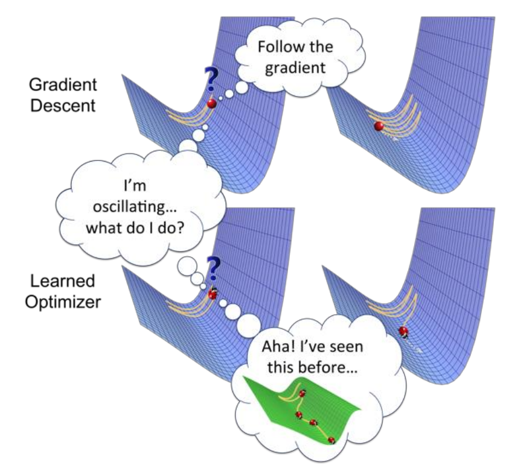
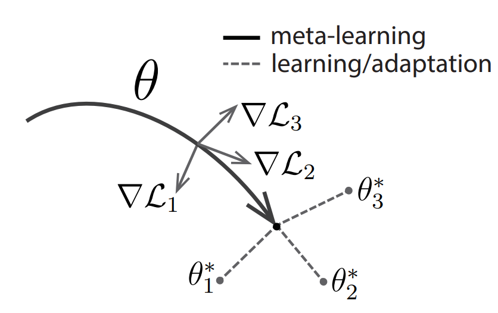

# Transfer Learning & Meta Learning (in RL)

在这一讲，我们来探讨一些非常前沿的话题——transfer learning和meta learning。这些问题把传统的问题提升了一个档次——具体的含义马上就会看到。

在本讲，我们主要讨论下面三个一般的问题（不仅限于RL）：
- 假设一个model在A任务上面训练，有没有办法在B任务上面表现的很好？这称为**forward transfer learning**。
    - 假设在B任务上，我们只能提供相比在A任务上很少的数据。比如，在A任务上训练10000个样本，但在B任务上只有10个样本。
    - 顺便一提，A称为**source task**，B称为**target task**。
- 假设一个model在 $A_1,A_2,\cdots,A_n$ 这 $n$ 个任务上面训练，有没有办法在B任务上面表现的很好（其他的假设和之前一样）？这称为**multi-task transfer learning**。
- 最为神奇地，我们能否在若干个task $A_1,\cdots,A_n$ 上面训练某种“智能体”。然后，把B任务的**训练集**给它，它**自己利用训练集对自己进行操作（注意这一操作不一定是传统的梯度下降）**，然后在B任务上面表现的很好？这称为**meta learning**，也就是learn to learn。
    - meta learning也有很多表述，比如说，这也可以被理解为，我们 **“学习”一个optimizer**，输入model的初始参数和训练集，输出一个在这个训练集上面表现的很好的新参数。如图所示。

在RL里，也可以类似地定义这三个问题。作为初步的理解，你只需要把“任务”理解为“MDP”即可。但是有些时候可能会有差异——比如，在RL里，我们要想了解target domain只能通过我们自己的policy和环境交互的方法（相比之下，DL里面我们可以直接看到数据），因此如果初始化的policy比较差就只能看到biased的数据。因此，RL里的transfer learning和meta learning会遇到更大的挑战。

如果你没有接触过这些概念，你可能完全被它们的新奇所震撼了（尤其是meta learning）。的确——这些问题的确是非常前沿的。因此，这一讲有点像一个“导览”，我们不会进入太深的detail，但简单地科普一下这些问题的算法。

## Forward Transfer Learning

首先，我们来看forward transfer learning。其实，在普通的DL中，我们也接触过类似的问题。比如说，我们都多少做过实验，使用pretrain的大语言模型（比如，MiniCPM）进行supervised fine-tuning，可以（比如说）完成高考语文选择题。这其实就是一个forward transfer learning的例子。

但是在RL中，我们如果采用同样的方法，会面临三个问题：
- **domain shift**：这指的是，两个任务可能具有视觉上的不同。比如说，都是开车，但是原先的任务是在模拟器中用虚拟渲染的图像训练，而新的任务是在真实的摄像头图像中进行。
- **difference in dynamics**：这是更加严重的问题，代表两个任务具有实质上的不同。
- **lack of exploration**：这是RL所特有的问题——经过pre-train之后的模型很大概率收敛到一个接近deterministic的policy。这样，在新的MDP中它很难很快采集到丰富的轨迹。当然，如同我们在第十九讲里介绍的那样，SAC等方法可以很好地解决这个问题。

### Domain Shift

Domain shift实际上是人们在DL中就可以解决的问题。按照我们的阐述，这类问题对应着只是表现的不同（比如，视觉上出现不同）。这可以通过**domain adapation**来解决。

我们假设在source domain上面训练好了一个不错的representation（比如，卷积出来的feature），但这个representation不一定适用于target domain。（注意，我们这里不是说的是feature之后的MLP的参数对于不同domain要变化，而是说**卷积的参数要变化**。）如何在target上面训练呢？这里给出的方法是，我们训练一个类似GAN的结构：discriminator看卷积出来的feature，然后判断这个feature是来自source还是target domain；而target domain模型的卷积层要尽量欺骗这个discriminator。

可以想象，如果这一个训练成功了，那么输出的feature应该在source和target上面是同样的分布；这样，feature就可以很好地和RL的部分对接，或者在DL的领域里的话，和MLP分类器的部分对接。从而，我们完成了forward transfer learning。

注意其中的关键思想——对于这两个不同的domain，只要它们的实质是一样的，那么一定存在两个domain分别的两个feature，使得它们处于同一个distribution。换句话说，**两个实质相同的domain之间的表观差别都是可以忽略的**（通过卷积来“殊途同归”）。这称为**Invariance Assumption**。

但是这一方法在RL中真的一定好吗？可以说，大部分时候还是可以的——但是有时候也有反例。

> 比如说，我们在模拟器的图片上训练开车，但是碰巧模拟器做的比较差，导致在真实环境中开车时，初始未经finetune的模型走的步步出错，是很差的策略。
>
> 接下来，我们按照前面的方法训练。如果原始卷积模型很好的话，它应该能卷出来开车有没有开好的特征（比如，车玻璃是不是撞到东西了）。但是如果这样的话，discriminator一下就发现了——来自target domain的这一特征大概是“差”，而来自source domain可能有好有差。这样，target domain上面的模型为了欺骗discriminator，只好“装疯卖傻”，删掉表达开车开没开好的这个特征。这样，开的好不好这一重要信息就在这一条传输链（图片->卷积模型->RL的policy模型）中断开了。
>
> 可以看到，归根结底，这一failure case来源于一开始所说的，RL中的transfer learning和普通DL的transfer learning的区别，也就是一个差的policy可能导致exploration不足，从而让DL里面本来一定work的方法失效。

### Difference in Dynamics

介绍完了第一个比较“小”的问题——domain shift之后，我们继续来介绍difference in dynamics。这就更有挑战性，我们主要介绍一个研究的结果。如图所示，假设在simulator训练的过程中，我们开车到达终点；而在实际情况中，起点和终点之间被一个墙隔离。如何让模型学会绕过这个墙到达终点呢？

研究者决定依然采用GAN的方法；但是现在，discriminator观察(state,action)对，然后判断这个对是来自source还是target domain。这样的话，如果在墙旁边，因为target domain中模型无法被穿过，所以就立刻会被判断为target domain。因此，模型会学会很远地绕过墙，不被它所干扰。

当然，这是一个极度简化的描述；实际的实现中，我们会建立一个新的reward $\tilde{r}$ ：

$$
\tilde{r}(s,a)=r_{\text{src}}(s,a)+\Delta r(s,a)
$$

（注意我们是在source domain的reward上面做更改。）其中， $\Delta r(s,a)$ 就是discriminator给出的附加reward，模型做的事情在target domain里面越不可能，这个reward越小。

用这样的方法，研究者做了一个实验：训练一个ant在无穷大平面上奔跑。接下来，把它限制在一个有限的圆盘上。实验发现，真的很像一只动物一样，ant先迅速奔跑到圆盘边缘，然后忽然减速，似乎有些犹豫地转了几圈，随后立刻折返。

> 这一方法一定work吗？同样，我们依然能给出反例。但最直接的思想是，这一方法学会的是**source domain和target domain的交集**，因为我们相当于是在source domain的policy做修改，删除了在target domain上面“离经叛道”的错误action。这样，我们不可能学会的是，在source domain上面没有但是在target domain上面有的action。
>
> 就最简单的例子，如果把上面的问题反过来——source domain中间有个墙，而target domain没有，那么这一方法就不会学会从墙中间直线穿过。

### Trick: Randomization

关于lack of exploration，可以参考第十四讲和第十九讲的内容，这里就不再介绍了。我们来额外介绍一个trick——randomization。

回想一下，在DL中，我们如何做pretrain+finetune的？以大语言模型为例，pretrain的模型通常都见到各式各样的数据，而fine tune以一个很狭窄的类型为主。这样，可以想象模型确实可以generalize。

但是对于RL，情况并非如此；很多时候，比如我们pretrain一个humanoid向前走，但是在fine tune的时候，我们要求它向后走。这样，模型的generalize就更加困难。

为了解决这个问题，**randomize**的方法被提出：我们可以**给dynamic加噪声**，使得模型更加robust，也更容易generalize。比如说，在humanoid环境里，我们可以调节肢体的相对大小、重量，和人与地面的摩擦。在训练的时候，我们可以随机地改变这些参数，让模型在“不同的环境”上面分别训练。

令人不惊奇的是，这样训练出来的policy在一组新参数构成的环境上面表现更好；而让人惊奇的是，在更多的环境上训练**几乎没有导致单个环境reward的下降**！这有点像“free lunch”，有些违背我们对generalization的预期；但我们也可以理解为，模型真的学会了一些实质性的内容，不因这些物理参数而改变。

## Multi-Task Transfer Learning

其实，在forward transfer learning的最后引入randomization时，我们已经有了一个思路——pretrain的时候task的分布越广，fine tune的时候表现越好。这就是为什么人们会进一步想做multi-task transfer learning——在多个不同（但有共性）的task上训练。（forward transfer learning中的randomize方法其实也可以视作一种multi-task transfer learning的简化版本。）

Multi-task transfer learning的理想未来是：
- 在多个task上面训练，使得模型在新的task上面表现更好；
- 不仅如此，我们希望多个task的同时训练反而会**加速每个task的平均训练速度**。这是因为，我们希望避免模型overfit，使得模型更加robust，从而收敛的更快。

### Multi-task RL is a RL problem!

在RL里面，其实可以把multi-task RL“压缩”为**一个**MDP，从而把它转化为一个RL问题。

一个最简单的方法是，在 $s_0$ 做一个action $a_0$ ，进入哪个 $s_1$ 代表进入哪个“世界”；而进入了这一世界之后再按照MDP演化。当然，这只是一个文字游戏，不同的“世界”之间的共性的提取并没有因此而简化，因此意义不大。

一个有意义的简化方式是，如果很多task包含共同的state,action（比如，我们的task有让hopper前进，有的让hopper后退，有的让它原地跳跃，等等），那么就可以把他们（有意义地）放入同一个MDP。此时，如何分辨task？我们加入一个 $\omega$ ，称为**context**，刻画了我们在做什么。这样，完整的state space是 $(s,\omega)$ ，我们在这样的一个MDP上面学习。这才真正地把multi-task RL变成了一个RL问题。这称为**contextual policies**。它的主要应用就是所说的，多个task是改变某个目标的参数的情形（向前，向后，不动）。

另外一个方式也是我们之前提到的，**goal-conditioned policies**。这一方法的state space是 $(s,g)$ ，其中 $g$ 代表最后要到达的state。还记得我们之前提到，这种方法可以让机器使用自己的reward（比如 $\mathbf{1}[s=g]$ ）来“dream goal to learn”，不需要环境额外提供reward。我们只需要把模型放进环境里，让他设计goal并试图reach goal，就可以完成Multi-task RL。

这一方法的优势是，如果test的goal就是dream过的goal，那么就立刻完成；但是缺陷也很明显——不是所有的目标都可以写为goal的形式。（我们[当时](./14-exploration_2.md#exploration-by-skills)也举过例子，要求绕开某个区域，就是对历史的刻画，不能表述为只依赖于最终state的goal形式。）

## Meta Learning

我们最后来介绍本讲的重头戏——meta learning。

我们前面已经介绍了meta learning的基本概念。那么，在RL中，我们希望训练出来的meta learner可以完成哪些任务呢？我们知道，在DL中，meta learner输入数据集输出一个不错的模型；而在RL中，这变成了，输入一个MDP，输出policy。因此，可以料想，如果成功了，那么meta learner就可以
- 决定如何explore这一MDP；
- 根据MDP的不同特性，提取出来features；
- 决定如何根据旧的experience来更新policy；

我们可以看到，这基本就意味着，我们的meta learner学会的是一个RL算法！这就是为什么meta learning在RL中如此重要的原因。

### Formalization

让我们来把它formalize一下。首先，在DL中，如何定义meta learning呢？一个“模型”所作的是

$$
f(x)=y\quad (x\in \text{test})
$$

也就是，（比如说）输入图片，输出label。而meta learning做的其实是

$$
g(D_{\text{train}})\in \mathcal{F};\qquad  g(D_{\text{train}})(x) = y\quad (x\in \text{test})
$$

也就是说，输入训练集后，meta learning algorithm给出 $g(D_{\text{train}})$ 这一个 **函数** ，这个函数可以接受一个新的 $x$ ，然后输出 $y$ 。

我们再来分析，学到了的参数是什么。在普通的learning过程，学的是一个参数 $\theta$ ：

$$
\theta^\star = \arg\min_\theta L(f_\theta; D_{\text{train}})
$$

（比如说， $L(f_\theta; D_{\text{train}})=\sum_{x\sim D_{\text{train}}}(y-f_\theta(x))^2$ ）。而在meta learning中，我们学的参数是 $\phi$ ，满足

$$
\phi^\star = \arg\min_\phi L_{\text{meta}}(g_\phi;D_{\text{meta,train}})
$$

其中

$$
L_{\text{meta}}(g_\phi;D_{\text{meta,train}}) = \sum_{(D_{\text{train}},D_{\text{test}})\in D_{\text{meta,train}}}L(g_{\phi}(D_{\text{train}}); D_{\text{test}})
$$

注意 $D_{\text{meta,train}}$ 是**若干个 $(D_{\text{train}},D_{\text{test}})$ 对**，如图所示。

而在RL中，情况也很类似；对于普通的问题，我们优化的是cumulative reward $R$ ：

$$
\theta^\star = \arg\max_\theta J(\pi_\theta;\text{MDP}) = \arg \max_\theta \mathbb{E}_{\tau\sim \pi_\theta}[R(\tau)]
$$

而在meta learning中，我们优化的是

$$
\phi^\star = \arg\max_\phi J(g_\phi;D_\text{meta}) = \arg\max_\phi \sum_{\text{MDP}\in D_{\text{meta}}}J(g_\phi(\text{MDP});\text{MDP})
$$

也就是说，我们的meta learner $g_\phi$ **输入MDP，输出policy**。此时的meta trainin set $D_{\text{meta}}$ 就简单地是一组MDP。

最后，我们来举一个形象的，RL中的meta learning的例子。比如，都是cheetah的环境，但是reward不同：在meta training set中，包含的环境一个的目标是向前1m/s，一个是向后1m/s，一个是向前0.5m/s；然后，在test中，目标是向后0.2m/s。

当然，从这个例子也可以看出，meta learning也需要保证测试点in distribution：如果meta training set中没有向后的任务，那么meta learner就不可能学会向后的policy。这一点是尤其需要注意的。

### Meta Learning Algorithms

我们考虑如何实现上面的meta learning。当然，前提是你必须清楚meta learning在干什么！如果不太清楚（这很合理，因为这一概念更抽象了一层），请再阅读上面的内容（或者为仓库提交issue）。

一个在DL中经典的方法是，我们搞一个RNN，把 $D_{\text{train}}$ 里面的对 $(x,y)$ 一个一个输入进去，并且让最后**输出的hidden state就是 $g_{\phi}(D_{\text{train}})$ 这一模型的参数**。换句话说，

$$
g_{\phi}(D_{\text{train}})(x) = \text{Model}_{\text{RNN}_\phi((x_1,y_1),(x_2,y_2),\cdots)}(x)
$$

其中， $\text{Model}$ 代表一个普通的模型（比如说，图片分类的话就可以是一个卷积网络，而它角标代表着RNN的输出hidden state刚好就作为它的参数）。

那么，在RL里，我们应该怎么做？和之前一样，最大的差别就在于，在RL中训练集不是given的，而是需要我们自己通过和环境交互来获得。我们接下来探讨几个思路。

#### Meta Learning as a Multi-task Learning Problem

你也许会发现——meta learning和multi-task learning比较像。假设我们有一个multi-task learning的算法，我们能否**用这个算法作为 $g_\phi$**，来做meta learning呢？你会发现，这当然是可以的——但是这就违背了我们的初心。好比说，我们在DL的meta learning里面，取 $g_\phi$ 为gradient descent一样。你看那个 $\phi$ ——它的意思是要我们训一个模型，而不是用一些人类指明的方法。

我们可以想到，原来的multi-task learning中的contextual policy可以写为

$$
\pi_\theta(a|s;\omega)
$$

现在，meta learning和multi-task learning的区别就是，我们的 **$\omega$ 不是给定的，而是需要一个网络（就是 $\phi$ ）从MDP中提取出来**。这样，我们就可以给出一种实现方式：

- 在任意时刻，通过历史上的所有transition $(s,a,s',r)$**经过RNN**，得到一个hidden state $\omega$ ；
- policy $\pi_\theta$ 输入 $\omega$ 和state $s$ ，输出action $a$ 。

通过这样的方法，我们可以想像：如果模型足够好，它应该可以学会根据历史上的transition学习出环境的信息，同时规划出exploration的方案。因此，这一方法理论上是可行的。

我们可以举一个例子：走迷宫。RNN有可能会学会，对于历史上失败的尝试，它不会再走；而对于reward增大的方向它会更多地探索。这似乎提取出了“走迷宫”问题的共性，因此确实是一个合理的meta learning方法。需要注意，一个重点在于，**history包含全部的trial-and-error的历史，而非只有最近一个trajectory**。这样，即使之前走错了导致episode end，这一经历也可以被利用。

#### Model-Agnostic Meta Learning (MAML)

这是一个非常强大的算法，请参考它的[原始论文](https://arxiv.org/abs/1703.03400)，具有12k引用量。它的应用范围也不仅限于RL，也可以用在一般的meta learning领域。

它的关键思想是，我们能否通过某种"pretraining"来完成meta learning？我们知道，在很大的数据集上训练的模型（比如，Llama），可以很容易地fine tune到各种领域，比如写程序，做阅读题，或者写广告等等，方面。那么，我们能否在meta learning中也训练出来一个“干细胞”一样的模型，
- 它本身并不在某个task上面表现的很好；
- 但是，对于任何一个task，只需要很少的几个gradient step，它就可以被fine tune到这个task上面表现的很好？

如图所示。

接下来，为了简单讨论，我们取fine tune只包含一个gradient step（还是之前说的那样，我们只是做一个科普，会略去很多技术细节）。在这一模型下，meta learner $g_\phi$ 就是：

$$
g_\phi(\text{MDP}) = \phi + \alpha \nabla_\phi J(\pi_\phi;\text{MDP})
$$

其中 $J_{\text{MDP}}$ 就代表着MDP上面的cumulative reward objective。接下来，在meta training的时候，我们还要再做一次gradient descent：

$$
\phi \leftarrow \phi + \beta \nabla_\phi J_{\text{meta}}(g_\phi) = \phi +  \beta\nabla_\phi \sum_{\text{MDP}\in D_{\text{meta}}}J(\pi_{\phi + \alpha \nabla_\phi J(\pi_\phi;\text{MDP})};\text{MDP})
$$

这个double grad在实现的时候也是一个技术细节，但我们暂时不考虑实现的方法。实验上，不管是在普通的image classification还是RL的任务上，都有着很好的效果。比如，还是之前提到的，让ant在不同方向运动，这样的一个任务；MAML训练之后的ant平均基本不动，只是四处乱跳；但给定任何一个任务，**仅一个**gradient step之后，它就可以向那个方向跑。

#### Variational Inference for Meta RL

你可能会奇怪，variational inference和meta learning，这两个话题好像完全没有任何关系。的确，为了引入这一方法，我们需要首先重新给meta RL一个新的叙述。

**Meta RL可以是一个POMDP**！其实，在介绍第一个方法（RNN）的时候，你也许就已经想到了——把历史上的所有transition放在一起过RNN，这很像我们上一讲介绍的，把observation放在一起当作history state。的确——我们可以把模型处理的任务 $\omega$ 也当作state的一部分，而这一部分（和multi-task learning的不同）是不可以观察到的。前面RNN的引入，就是为了把这一部分的信息提取出来。

但是在POMDP里我们还有另外一个选择！我们可以构造一个variational的state space model，放到这里就是

$$
q\left(\omega _t | (s_1,a_1,r_1,s'_1),\cdots,(s_t,a_t,r_t,s'_t)\right)
$$

然后，我们可以同时训练这个VAE和一个policy $\pi(a|s;\omega)$ ，就像我们在POMDP中的那样。这样的方法也是可行的。一个小的细节是，我们没有必要训练一个full VAE——我们只需要一个encoder，ELBO中的两项我们也可以丢掉reconstruction loss，只保留KL penalty。

> Q: 胡说八道！这样，你这个 $q$ 难道不会只学出一个均匀高斯吗？
> 
> A: 并非如此。冷静一下，你会发现，我们的policy $\pi$ 是依赖于 $\omega$ 的；因此，如果 $q$ 只学出一个均匀高斯，那么policy的loss会很大。我们可以合理地期待，policy的loss可以很好的传播回来，使得 $q$ 学会提取出有用的信息。
>
> 而且去除decoder并非不合理——假设 $\omega$ 包含了这个MDP的全部有效信息，decoder应该一定可以完美地decode回原始数据，因为它们都是这个MDP中的transition。因此，丢弃reconstruction term相当于假设我们有一个完美的decoder，这是完全合理的。

你也许会问，这一方法和RNN没什么差别啊——你现在在VAE里面也需要一个RNN来处理这个sequential的信息。的确，它们的思想很相似；但是，VAE的优势在于， $\omega$ 是比较有随机性的。对于决定性的方法，有可能出现恶性循环：RNN提取信息提取的不对，导致policy完全乱搞，获得不出来任何有reward的action，这又进一步导致RNN提取不出来信息。而VAE的随机性就使得我们更容易避免这个“死局”。

作为具体的实现，[PEARL](https://arxiv.org/abs/1903.08254)是一个很好的例子。如果感兴趣可以进一步研究其实现细节。

### Summary

最后，我们来看一看前面介绍完的三个meta learning方法：
- 用RNN学习历史数据，用hidden state当作policy的parameterization；
- MAML：训练一个“干细胞”，可以很快、很好地“分化”到各种task上；
- 用历史数据学习出来task latent variable $\omega$ ，并让policy condition on $\omega$ 。

它们之间在实践中有着比较大的区别。最常见、好用的方法还是MAML，但它往往需要更多的计算资源；相比之下，第一、三方法更容易overfit（我们说的是meta-overfit！也就是说，对于稍微OOD的test task就无法体现），某种程度是因为它们都依赖于RNN。此外，实验上发现，第一、三方法的训练过程也更为艰难，也许还是因为RNN的信息传递不够充足。

但是，另一方面，从思想上说，它们也没有太大的本质差别。我们已经看到，第一、三方法的差别就是latent variable/hidden state是否为随机化的；而MAML可以理解为第一、三方法的一种特殊情况，用梯度下降代替RNN（这让我想到了[TTT](https://arxiv.org/abs/2407.04620)！请忽略我发电）。

meta-RL的研究最前沿实际上已经迈出了计算机科学的领域。一方面，研究表明，meta-RL可以看到**逻辑推理**等能力emergent的[迹象](https://arxiv.org/abs/1901.08162)，也许代表着某种“智能”的诞生；另一方面，许多研究表明，meta-RL也可以试着解释**人类如何做到学习新的知识、适应新的环境如此迅速**。甚至有一些生物学研究者推测，人的大脑里专门有着用来跑各种meta-learning算法的[区域](https://www.nature.com/articles/s41593-018-0147-8)。也许，未来将在这里被改变。

# Reference Papers

1. [Domain-Adversarial Training of Neural Networks](https://arxiv.org/abs/1505.07818)（Domain Adversarial Training）
2. [Off-Dynamics Reinforcement Learning: Training for Transfer with Domain Classifiers](https://arxiv.org/abs/2006.13916)（Domain Classifier）
3. [EPOpt: Learning Robust Neural Network Policies Using Model Ensembles](https://arxiv.org/abs/1610.01283)（Randomization）
4. [Learning to Achieve Goals](https://citeseerx.ist.psu.edu/document?repid=rep1&type=pdf&doi=6df43f70f383007a946448122b75918e3a9d6682)
5. [Universal Value Function Approximators](https://proceedings.mlr.press/v37/schaul15.html)（Goal-Conditioned Policies）
6. [Hindsight Experience Replay](https://arxiv.org/abs/1707.01495)
7. [Memory-based control with recurrent neural networks](https://arxiv.org/abs/1512.04455)（RNN for Meta Learning）
8. [A Simple Neural Attentive Meta-Learner](https://arxiv.org/abs/1707.03141)（RNN for Meta Learning）
9. [Model-Agnostic Meta-Learning for Fast Adaptation of Deep Networks](https://arxiv.org/abs/1703.03400)（MAML）
10. [Meta-Reinforcement Learning of Structured Exploration Strategies](https://arxiv.org/abs/1802.07245)
11. [Efficient Off-Policy Meta-Reinforcement learning via Probabilistic Context Variables](https://arxiv.org/abs/1903.08254)（Variational Inference for Meta RL）