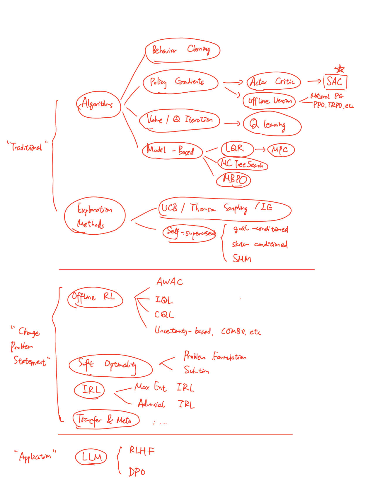
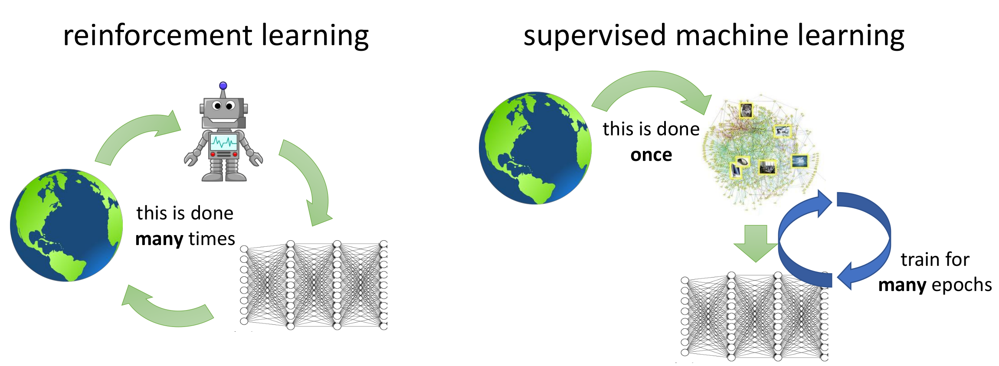

# Challenges, Open Problems, and Philosophy

本讲没有什么特别多的知识性内容，主要是一些回顾、讨论和介绍，大家看个乐呵。如果不感兴趣，我们就可以在此结束CS285的旅程了！🎉🎉🎉

## RoadMap

二十二讲，我们见了很多——是时候把前面的知识总结起来了。在PPT上面，有一张整体的roadmap；而我也来画一张自己的（差不多的）roadmap。

大体上来说，知识分为三个部分：“传统”的RL方法，包括Behavior Cloning，Policy Gradients, Value-based methods, Model-based methods，以及它们衍生出的众多方法，还有exploration的基本方法。然后是一些新的问题陈述，比如不允许和环境交互的offline RL，不要求最优而是要求模拟人类的soft optimality RL，反过来从demo学会reward的IRL，以及transfer learning和meta learning。最后，是应用，这里举了一个代表性的例子——RL应用于LLM。当然，细节都没有在这张图上出现。

学习了如此之多，也许我们会觉得我们可以解决很多RL问题了。但实际上，还有很多挑战我们会面对。它们一般分为两类：

- algorithm challenge:你的算法收敛吗？多长时间收敛？需要费力调超参吗？和环境进行多少次交互？又能不能很快generalize到新的MDP？……
- assumption challenge:你的算法符合实际吗？
    - 任何一个任务必须有人的介入，否则RL agent就不知道该做什么。但人的介入又多种方式：
        - 人设计一个reward function（比如`gym`的那些环境，都是人为设计的reward function）；
        - 人提供一些demo（比如behavior cloning）；
        - 还有我们从来没有讨论过的。比如，可不可以，人对于两段agent的demo给出preference？人类和动物都可以这样学习啊！
        - 再比如，给agent一些描述目标的语言和图像的信息？

我们接下来对这些挑战一一来讨论。

## Stability

这不必多说——我们都知道，RL的算法是以不稳定著称的。比如，Q learning注定不能保证收敛；而policy gradient注定具有很大的方差。这不值得遗憾或惋惜——人生难道不是也是如此吗？

但是，了解它们不稳定的根源是重要的。我们来回顾一下：

- Q learning：不稳定的来源是，fit Q值不一定能保证完全准确，而是做一个投影。这看似很小的bias导致模型无法肯定地收敛。
- Policy Gradient：和Q learning不同，policy gradient基于严格的数学推导给出的objective，因此理论上可以收敛，也没有bias；但是，它的方差很大，因为它是基于sample的。虽然可以增大batch size，使用baseline，但是理论上为了稳定还是需要exponentially large的sample数目（这个论证我们没有cover）。
- model-based：你可能会奇怪，为何model-based也不收敛？按照道理，建立model的过程是一个普通的DL中学习分布的问题，而建立model之后我们可以无限采样，因此也能保证收敛。但是，实际上的问题有些尴尬——没有policy就没办法采样，也没办法训练model。而且，我们希望model训练的transition和我们的policy是相关的。这就导致，我们在最后的算法中**交替训练model和policy**，从而导致了不稳定。
    - 更严重的一个问题我们之前也提到过，policy很强，因此policy喜欢“利用”model中不该有的极大值（"erroneous maxima"），然后把训练过程搞得一团糟。这就是“上梁不正下梁歪”，也是model-based带有一丝advarsial attack的成分造成的。

那么，你可能会问，调节超参数有帮助吗？你会发现，似乎在作业里，我们基本没有调节超参数的过程，和DL形成很鲜明的对比。这是因为RL的超参数调节是一个非常困难的问题，超参数对算法的影响也不像DL里那样的明确。其实，归根结底还是因为，RL的算法大多数本身不收敛，因此超参数的调节实际上作为一种“修补”，试着把它“修”得收敛，这当然很困难。

> 这里也有一个side question：人们其实一直不知道，为什么DL的模型不会严重地overfit？因为DL的模型参数远多于数据量，按道理应该具有在训练数据集上很快overfit的能力。
>
> 没有人知道为什么；但可以想到，这等效的代表着，巨大的神经网络结合上SGD，可以起到某种魔法般的“约束”的作用。那么，我们能否理解这样的“魔法”，并把它应用到RL里面，使得训练更加稳定？比如，如果我们把神经网络变得特别大，是否会有帮助？这些都是open question，等待着人们的解答。

## Sample Efficiency

我们来比较一下RL不同方法中的sample efficiency，从小到大：
- **gradient free methods**：其实我们甚至没有介绍这一类方法，它们是RL最原始的尝试，不需要梯度下降。它们的思想是借鉴“自然选择”的理念，让多个agent优胜劣汰，不断“进化”。可以想象到，这种方法的sample efficiency是最低的。一个典型的量级（比如Cheetah环境）是 **$10^8$ 次交互**，也就是 $10^6$ 个episode。对应到真实时间，这大概是15天。
- **fully on-policy policy gradients**：最原始的policy gradient方法，比如A3C（这个我们也没有仔细介绍，它是将Actor Critic方法进行并行的方法，感兴趣可以参考[这篇论文](https://arxiv.org/abs/1602.01783)）。这个方法的量级大概是 **$10^7$ 次交互**，也就是 $10^5$ 个episode。但是，值的一提的是，它可以高效地并行，因此不一定需要花特别长的时间，只要你有充足的算力。
- **advanced policy gradients**：基于TRPO和PPO的方法可以减少算法的“on policy程度”，进而提高sample efficiency。这个方法的量级大概是 **$10^6$ 次交互**，也就是 $10^4$ 个episode。
- **replay buffer-based method**：比如说Q-learning或者SAC，这些off-policy的方法可以利用replay buffer，进而提高sample efficiency。这个方法的量级大概是 **$10^5$ 次交互**，也就是 $10^3$ 个episode。对于SAC等方法，一个典型的概念是，解决real world的任务（不是通过模拟器），只需要**几个小时**就够了。
- **model-based method**：这些方法的量级大概是 $10^4$ 次交互，也就是 $10^2$ 个episode。
- 还有一些我们没有介绍的，更专注于sample efficiency的方法的model-based方法。最强的方法可以在20分钟内完成一个真实世界的任务，比如开门。

一个神奇的事情是，似乎每向下走一层，sample efficiency都提高了一个量级。这很利于我们对常见的算法需要的用时有一基础概念。

当然，你也许会问，为什么我们还会prefer那些没有那么sample-efficient的方法呢？原因有很多，比如，那些方法也许可以高度并行；或者，它们需要更少的算力。比如，gradient-free method的计算量远远小于model-based方法，后者要存储两个神经网络在显存里并对它们做多轮梯度下降。

不过不管如何，在和实际环境进行交互的问题里，我们还是更喜欢sample efficient的方法。

## Generalization

早在一开始的[Preliminaries](./0-preliminaries.md#from-the-results)，我们就从结果上对比了RL和DL的一个重要区别。但是，当时我们还不太清楚RL究竟在干什么。现在，我们回想一下我们处理RL问题的经历，会发现，DL和RL从结果上来看的巨大差异还包括另外一点：
- DL的模型虽然只是为了拟合数据，但它们的评估方法**强调generalize**。没有人关注你的模型在训练集的loss是0.01还是0.0001，人们只看你的模型在测试集上的表现。
- 而另一方面，虽然我们说RL的问题处理的任务更加困难，没有标准答案，但是RL的评估标准强调**mastery**，也就是把一件事情做的多好。从经历上我们也可以发现，我们只关心agent能在环境里能刷到多少cumulative reward。

有人会问，RL的generalization呢？我们不得不承认，我们很难把一个MDP上面的模型应用到另外一个MDP上。为什么会这样？

有人说，我们加大数据的量！但是在RL里这只不过是一个空的口号，因为数据是和环境交互产生的，是我们自己收集的。也就是RL的这一问题陈述的根基决定了我们很难像DL那样，通过增大数据量来提高generalization，如图所示。

从另一个角度看，我们也并不是什么办法都没有。比如，对于**offline RL**的研究使得我们可以重复利用旧的数据。没准在不久的将来，人们就可以将各个MDP的数据放在一起也形成一个像ImageNet或者Common Crawl这样的数据集，并从上面用offline RL训练出来一个通用的agent。当然，在现在，这一问题还远超我们的预期。

再比如，就如我们在第22讲介绍的那样，transfer learning和meta learning也许可以帮助我们解决这一问题。它们作为新兴的领域，也正在高速地发展并取得成就。

但有人也许会说，我们应该知足了——一个MDP在RL里就是一个任务，你要求在MDP上还能generalize，就好像要求NLP的模型generalize到CV上一样。这也许有些道理，但作为有着信仰的研究者，我们应该意识到RL背负着比DL更深刻的重任：它的目标最终是通向一个像人类一样的智能体。事实证明，我们还有很长的路要走：现在，我们可以用6小时的训练让一个机器人上学会奔跑，但只能在一个**无限大的平面上**。真实世界是如此复杂，脚下有各式各样的地貌，上空有风吹雨淋，这一切都似乎不影响一个几个月的婴儿学会走路。什么时候，我们的agent才能到达这里呢？

## About Assumptions: How Humans Get Involved?

我们再来讨论如何人类介入RL的问题。对于**reward**这一介入方式，我们已经有了很多的研究。但是我们也清楚，很多东西无法定义reward。比如，试着给“把水倒进杯子里”定义reward？除非你描述每一个水分子的位置，否则基本是不可能的。

除了reward之外，demo是一个很好的方法。不仅是behavior cloning，我们甚至还可以通过某些方式像“老师教学生”一样，让人类教agent一些关键技巧，再令agent进行应用。比如，[这篇论文](http://www.jenskober.de/publications/Muelling2012AAAI.pdf)就用此方法让机器人学会打乒乓球。

另外可能的方向是用语言做prompt。比如，[这里](https://arxiv.org/abs/1711.00482)就有一个例子。这可以让agent和人类的交互更贴近“合作者”的关系，更加自然。

此外，preference也是很好的思路。[这篇论文](https://arxiv.org/abs/1706.03741)展示了一个例子，人类通过不断评价左右两段轨迹哪个更好，最终使得agent能够完成后空翻（想一想你能否设计出来一个后空翻的reward函数！）。可以观看这一[视频](https://youtu.be/WT0WtoYz2jE?t=68)，看agent是如何学会后空翻的。

这也启示我们：RL的研究并不只是局限在最原始的问题的解决算法上；一个很重要的方向就是，如何提出一个新的问题陈述，使得它和实际更加贴近，更加有意义。

## Philosophy: What is Reinfocement Learning, anyway?

我们当然知道什么**是** RL。但是，RL**对于我们**是什么东西？
- 它仅仅是一种我们用来解决问题的**工具**，就像计算机、数学和物理一样？
- 还是，它是一个模型，**描述**了人类、动物的学习方式？
- 还是说，它其实就是“学习”这一现象作为一门“学科”的**基本规律**，就像物理定律描述着宇宙的基本动力学规律一样？（我们知道，物理学是不描述人类的“意识”的；也许描述“意识”，或者“学习”这一个“意识”的子集的，就是RL？）

可以说，每个人会有不同的看法。CS285的instructor Sergey Levine曾说过，他自己就坚持第三种观点。当然，我在这里也并不是要推销任何的观点，所以让我们看一看坚持三种观点的人都会说些什么。

（以下纯属虚构！）

### RL as a Engineering Tool

小A就是持这一观点的人。

> “所谓RL，不过是干了那些人类懒得干，或者不会干的事情。比如，我们可以用几千个方程或者建模描述火箭，描述飞机和汽车。我们也可以通过物理学的分析来控制它们到达目的地。但是，对于一个走在路上的机器人，这个物理对于人类还是太复杂了，或者我们懒得做这个建模。RL很好啊——它减轻了我们的工作，人们付出智慧就可以了，计算的体力活可以交给GPU来做。”

> “换句话说，RL是一种技巧，把原先在纸上推导的复杂公式变成在电脑的内存里的gradient descent。它也没有那么高大上。你看，原来我们做的是：
> 
> - 建模；
> - 推导公式，求解方程，进而根据环境进行控制；
> 
> 而现在，我们做的是：
> 
> - 建模；
> - 构造一个simulator，契合RL的要求；
> - 跑一个RL算法，让它进行控制。
> 
> 它们确实没有什么特别根本的差别。”

### RL as a Model of Learning

> “当前的RL的发展还不太够。当我们的算法足够强大的时候，RL就应该能描述人类的学习方式”，小B说。

> “根据RL的问题陈述和定义，RL是描述人类学习原理的*唯一候选人*。我们也已经做了很多——RL算法可以在围棋和DOTA上击败人类，可以像人一样驾驶车辆。”

> “你也许会说，不对啊，人类生下来几个月就会爬行，但这对于RL可能很困难；相反，对于人类复杂抽象的国际象棋问题，RL却最早地解决了。你会因此怀疑，RL并非真正描述了人类的学习？因为人类最自然最擅长的那些——识别人脸，拿起一个物体，在混乱的人群中移动自己的身体来躲避碰撞——对于RL都是困难的。”

> “但是，这实际上是著名的**Moravec's Paradox**。你说的这些例子，不是说"RL连最简单的事都做不到"，而是你搞错了——这些实际上都是很难的问题。**只不过是因为，自然选择带来的幸存者偏差，我们人类甚至地球上的绝大部分生物都擅长这些事情**。人类可以不会开车，不会下围棋和国际象棋；但如果我们不善于移动自己的身体，不善于辨别环境的危险，我们就会被其他的，更擅长这些的生物所取代。”

> “如果总结一下，就是说：
> - 人类极其善于处理corner case，或者未经历过的事情，比如走路的时候即是被绊也很容易恢复平衡；
> - 但是RL对于未见的环境表现不一定好，因此现在我们还未达到人类的水平；
> - 但从另外一个方面来讲，从RL的定义来看，解决这一问题，只有RL才有可能做到。
> - 而我们在实验中很少这么做！
> 
> 所以，别继续在Cheetah和Humanoid上面刷分了！想一想，我们如何才能**generalize**，才能让agent迅速**适应**新的环境？”

此外，一些客观的事实：带着这一思想，很多人进行了让RL在**真实的**环境中的尝试。什么叫做“真实的”环境？不是指不用simulator，而是我们试图刻画**复杂环境（即人类生活的环境）或者人类学习中的特征**。比如：
- 在真实环境中，我们不能reset。
    - 本来要接咖啡，结果咖啡泼到了桌子上，不能reset，而是要agent自己想办法。怎么办？[研究者](https://arxiv.org/abs/2104.11203)（注：下面的例子不完全是论文里的例子）想到了，我们（比如说）训练三个任务：
        - 接咖啡；
        - 把地上的咖啡杯捡起来；
        - 把洒出去的咖啡擦干净。
    - 它们的特点是，任何一个任务失败了，都可以练习其他的任务！这就很合理——比如，在你做化学实验之前，你的老师一定会告诉你如何处理中毒，腐蚀等问题，并确保你会处理这些情况才让你开始实验。这里，机器人很有可能也先学会捡起咖啡杯，最后才学会接咖啡。
- 人类在学习一个任务的时候，并非从random exploration开始。
    - 比如，当你第一次学习游泳，你就算不会任何泳姿，你也不应该让你的每一个关节以各向同性均匀高斯分布来转动和发力。如果你有这样的经历，你会发现你实际上大概会在水里“扑腾”，虽然用的力不一定在这一新的环境里特别有效，但至少你**recall了过去的经历**，并利用了它们。
    - 因此，[这篇论文](https://arxiv.org/abs/2011.10024)就做了这样的尝试。它让机器人在开始训练之前有一个prior，里面的action不一定有利于完成任务，但至少是有意义的（比如，随机的动作就属于没有意义的）。实验上可以发现，一开始在这样的action prior中sample并explore，可以让学习的过程变得更加高效。

> “是的！”，小B说：“只有我们RL训练的环境越来越真实，我们才能期待RL agent进行emerge，最后出现我们认可的‘智能’”。

### RL as the Universal Learning Method

> “我们可以把RL理解为一种根本性、实质性的理论。”，小C说。

> “如同研究神经科学的生物学家Daniel Wolpert所说，‘我们拥有大脑只为了一件事——那就是**作出复杂的且适应性强**的动作’。我们也可以把它搬到learning这一领域：我们需要学习，只为了作出复杂的且适应性强的**决策**。”

> “你也许会说，在DL里，我们并没有做决策啊？但DL难道不是一种学习吗？但是，实际上你想错了。DL的模型也在做决策——并不是说它们决策图片的label是什么，而是它们决定图片的label之后，发生了什么。比如，它受到了cross entropy loss的惩罚，它才根据这个惩罚来调整自己的决策。”

> “在DL里，我们通常在很大但质量不高的‘垃圾’数据集上做pretrain，而在少数高质量的数据集上finetune。你会发现，其实垃圾的数据集就像是环境，我们从中不学习决策，只是学习dynamics；而高质量的数据集如同human给出的指示，比如reward，我们在上面利用过去的知识学会任务。”

> “我的梦想是，有朝一日我们会有一个world dataset，包含了世界上所有有意义的行为。比如，做饭炒菜，扫地，开车，甚至是写代码，都在里面。当然，对于一个指定的task，这里面的大部分数据都属于垃圾；但我们的approach是，我们在这个world dataset上pretrain，做unsupervised的offline RL，然后让agent和真正目标的环境进行交互，完成downstream task。”

事实上，也有一系列研究关注这一问题，它们主要都关注于如何对大的数据集进行unsupervised learning。比如，之前提到的，我们可以做goal conditioned learning；或者，可以让模型自己生成一些有意义的数据，然后把它们当作demo来学习（这篇[文章](https://arxiv.org/abs/2311.05584)）。

## The Final Question, and the Future

我们最后来思考这样一个问题：RL为什么能学会？我们又为什么能学会？

后者很难回答，只不过（也许）这不是搞AI的人们特别要担心的事情。但是，我们的学习方式大概可以归结为两个方面：
- imitation：人类生活在社会里，在遇到未接触的事物时，我们倾向于会模仿他人的行为，从而避免一开始就犯错误——毕竟，人生无法reset。
- understanding：这是更难刻画的了。我们还不知道我们的大脑如何完成图像识别，如何理解语言，更不知道大脑如何控制我们的行为。但是，通过某种方式，我们随着对问题的理解，可以理解他人的意图，而逐渐脱离简单的模仿，来拥有自己的价值观和理念（**Value**）。

前者也难回答。为什么DL能学会？我们甚至答不出来。但是，如果把DL当作一个oracle，那么我们就可以大致地回答：Deep Reinforcement Learning能学会，是因为RL算法可以做decision making，而DL的大模型保证了end-to-end training可以work。我们可以进一步归结到几个方面：
- unsupervised learning：在和环境（或者更准确地说，reward）交互之前，我们可能通过offline的数据集进行goal conditioned之类的学习。
- model learning：我们建立对于环境的模型，这某种程度上也模拟了人类的行为（猜测别人的心思，或者预测可能的后果）。
- policy learning：看似reward只是一个标量的数值，给出的信息远不如DL中图片/label那样丰富；但是，RL的算法实际上带来了巨量信息。比如，就想一想Value backup，它能某种程度上“打通”整个MDP的结构。

我们该究竟如何尝试回答这两个问题呢？也许，现在还没有人知道。如同Sergey Levine教授说的那样，我们应该“Think Big and Start Small”。相信最终有一天，人们会给出一个令人信服的答案。