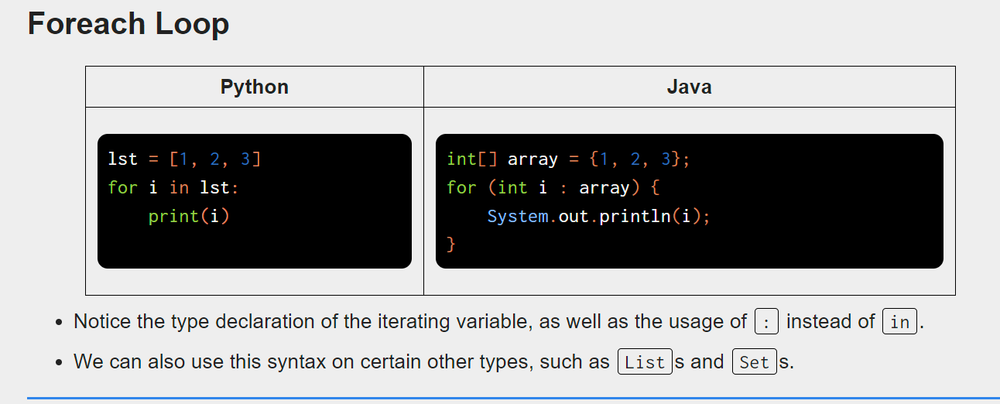
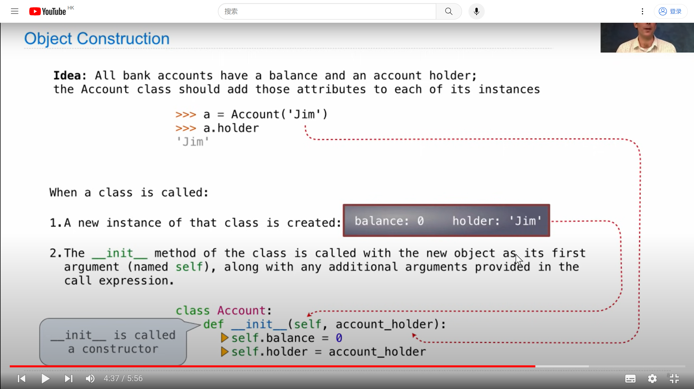
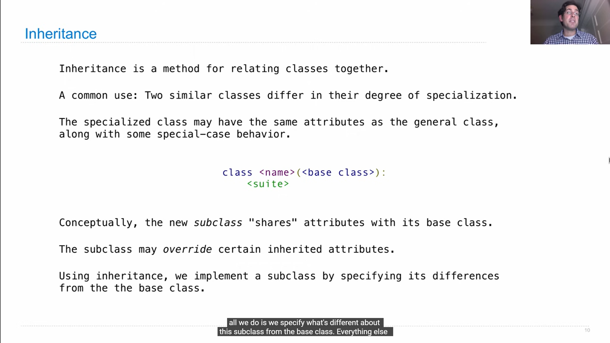

# Note

## Lecture 1 Introduction


## Crash course to Java

> 关于Java语法的[速成课](https://fa23.datastructur.es/materials/hw/hw0/)

1. I totally think java is truly similar to C, so I just write down some important or easily mistakes .
2. Note that `^` in Java is the “XOR” operator, not the exponentiation operation. That is, `2 ^ 10` is valid code, but it will return `8`, not `1024`.
3. Java like python in sow the string.
4. 
5.  If a type starts with a capital letter, it is likely a reference type.
6. 
7. 
8. 关于List、Set和Dictionary的部分我放到后面学习，因为自己对这个的框架搭建的还不够完善，class是个值得好好学习的地方。
9. 

## Something about basic OOP

由于自己在这方面的知识没有一个系统性的学习，故通过CS61A的部分来补充完成。

### Class


A class serves as a template for its instance.



```python
# 下面这段代码值得好好理解
class Worker:
    greeting = 'Sir'
    def __init__(self):
        self.elf = Worker
    def work(self):
        return self.greeting + ', I work'
    def __repr__(self):
        return Bourgeoisie.greeting
    
class Bourgeoisie(Worker):
    greeting = 'Peon'
    def work(self):
        print(Worker.work(self))
        return 'I gather wealth'
    
>>> jack = Worker()
>>> john = Bourgeoisie()
>>> jack.greeting = 'Maam'
>>> Worker().work()
'Sir, I work'
>>> jack
Peon
>>> jack.work()
'Maam, I work'
>>> john.work()
Peon, I work
'I gather wealth'
>>> john.elf.work(john)
'Peon, I work'
```


###　Attribute & Inherent

```python
class customer:
	interests = 0.04
	def __init__(self, name, account):
		self.account = account
		self.name = name

>>> jim_customer = customer('jim', 1000)
# 当我们对jim的interests单独做更改时更改，否则倘若我们更改customer.interest的值，jim.interest的值会随之改变。
```




关于多个类继承的问题在CS61A中讲的是非常浅的，根据GPT的回答如下：

>当一个类继承了两个父类，并且这两个父类中都有相同命名的函数时，Python会按照特定的顺序来确定继承的优先顺序。这个顺序被称为方法解析顺序（Method Resolution Order，简称MRO）。
>
>在Python中，MRO是通过C3线性化算法来确定的。该算法会根据类的继承顺序和继承关系来生成一个有序的方法解析顺序列表。Python会按照这个列表的顺序查找方法，直到找到第一个匹配的方法为止。
>
>默认情况下，Python使用广度优先搜索（BFS）的方式来确定MRO。也就是说，它会先搜索第一个父类，然后再搜索第二个父类。如果两个父类都有相同命名的方法，那么继承的是第一个父类中的方法。
>
>例如，假设有一个类 `Child` 继承了两个父类 `Parent1` 和 `Parent2`，并且这两个父类中都有一个名为 `method` 的方法。那么 `Child` 类继承的是 `Parent1` 类中的 `method` 方法。
>
>如果你想要显式地指定继承的顺序，可以使用 `super()` 函数来调用特定父类的方法。例如，`super().method()` 将调用第一个父类的 `method` 方法，而 `Parent2.method(self)` 将调用第二个父类的 `method` 方法。
>
>总之，当一个类继承了两个父类并且这两个父类中有相同命名的方法时，Python会根据MRO来确定继承的优先顺序。默认情况下，继承的是第一个父类中的方法，但你也可以使用 `super()` 函数来显式地指定继承的顺序。


## Linked list & Tree

```python
Link(5, Link(4, Link(3, Link_empty)))
```

### Tree


## Interface

