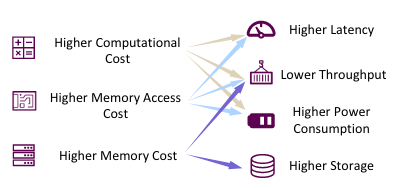
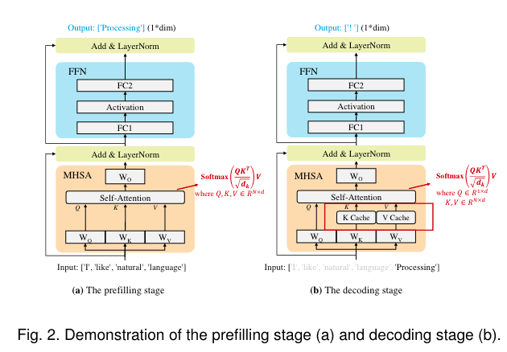

# A Survey on Efficient Inference for Large Language Models
本文介绍了一个综合的分类法，将当前的文献从数据级、模型级和系统级优化三个角度切入分析

## Introduction


## Background
### Transformer


一个关于最后投影矩阵的代码解释
```python
import torch

# 假设有 h 个头，每个头的输出表示为 Z1, Z2, ..., Zh
# Z_i 的形状为 (batch_size, seq_len, d_head)
Z1 = torch.randn(batch_size, seq_len, d_head)
Z2 = torch.randn(batch_size, seq_len, d_head)
# ...
Zh = torch.randn(batch_size, seq_len, d_head)

# 将所有头的输出连接起来
Z = torch.cat((Z1, Z2, ..., Zh), dim=-1)  # 形状为 (batch_size, seq_len, h * d_head)

import torch.nn as nn

# 线性层，用于投影
projection = nn.Linear(h * d_head, d_model)

# 通过投影矩阵 W^O
output = projection(Z)  # 形状为 (batch_size, seq_len, d_model)
```

#### FFN
FFN
https://www.zhihu.com/question/622085869
https://www.zhihu.com/question/460991118/answer/2353153090

```python
class FeedForwardNetwork(nn.Module):
    def __init__(self, d_model, d_ff):
        super(FeedForwardNetwork, self).__init__()
        self.linear1 = nn.Linear(d_model, d_ff)
        self.relu = nn.ReLU()
        self.linear2 = nn.Linear(d_ff, d_model)
    
    def forward(self, x):
        x = self.linear1(x)
        x = self.relu(x)
        x = self.linear2(x)
        return x
        
# 一般来说隐藏层纬度要更大，能有效解决token uniformity的问题
d_model = 512  # 输入和输出的维度
d_ff = 2048   # FFN中的隐藏层维度
```

### Inference
现在大多都是自回归模型（decoder-only），即在生成每个token时，都要考虑之前生成的token，这样的模型在推理时会有很大的延迟，因此需要一些技术来加速推理

#### KV-cache
由于存在大量对先前token存在的重复计算，我们采取了cache策略


> 术语表
> 
> 


### Efficiency Analysis

> 一般来说LLama-70B参数的模型需要140G存储weights（FP16）
> 至于延迟，在2块NVIDIA A100 GPU上生成一个令牌需要大约100毫秒。因此，生成一个包含数百个令牌的序列需要10秒以上的时间。

一般来说存在最开始提到的三个问题，本文优化的重点则主要集中于
• 模型参数
• Attention在长文本下的计算开销
• 自回归解码方法逐个生成token。在每个解码步骤中，所有的模型权重都从片外HBM加载到GPU芯片中，导致较大的内存访问成本。此外，KV-cache的大小随着输入长度的增加而增加，这可能导致碎片化的内存和不规则的内存访问模式

## 优化手段的简要分类

- data-level 对模型本身几乎没什么影响
- model-level 通过改变模型结构来减少计算量，可能微调会使模型性能受损
- system-level 从系统布局的角度优化（本论文说flash attention可能会有树脂偏差？）


### Data-level
#### Input Compression


ICL和CoT的使用，导致计算开销都二次方增长。

- Prompt Pruning：删除不重要的tokens
- Prompt Summary：提示摘要的核心思想是在保留相似语义信息的前提下，将原始提示浓缩为较短的摘要。
- Soft Prompt-based Compression这类压缩技术的核心思想是设计一个明显短于原始提示的软提示，作为LLMs的输入。
> The soft prompt is defined as a sequence of learnable continuous tokens.
- Retrieval-Augmented Generation(RAG工程)

#### Output Organization
Skeleton-of-Thought (SoT)：输出组织技术旨在通过组织输出内容的结构，(部分)实现生成的并行化。当然它还有一个`router model` 来决定应用SoT是否适合于特定的问题。


有一个SGD的东西extend the idea of SoT by organize sub-problems in DAG(有向无环图)形式(一定程度上优化了在数学和代码相关的问题)

与SoT相比，SGD优先考虑答案质量而不是速度。此外，SGD引入了一种自适应的模型选择方法，根据估计的复杂度为每个子问题分配一个最优的模型大小，从而进一步提高了效率。

> 大家可以看看SGLang这个东西，从编译器（语言）的角度来集成优化这个问题

#### 小结
最近，各种各样的激励管道( ToT  , GoT )和代理框架（agent framework）不断涌现。虽然这些创新增强了LLMs的能力，但它们也延长了输入的长度，导致计算成本增加。为了应对这一挑战，采用输入压缩技术来减少输入长度显示出作为解决方案的前景。

当然也有动态停止避免模型开始说废话。最终希望达到（pipeline的级别）的并行化。