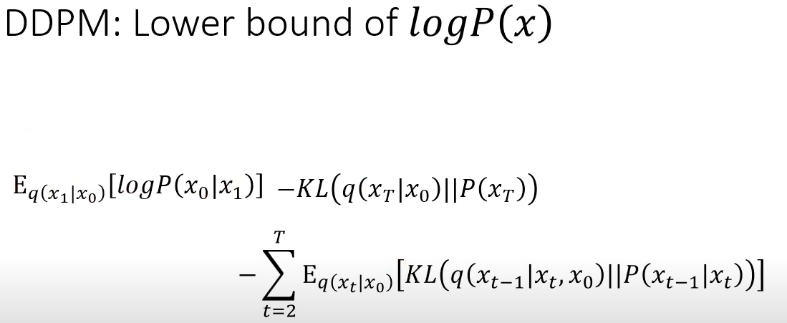
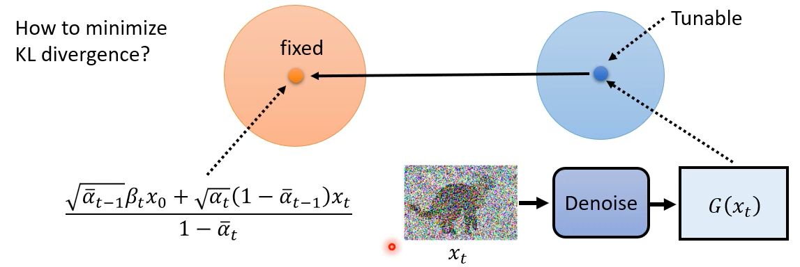
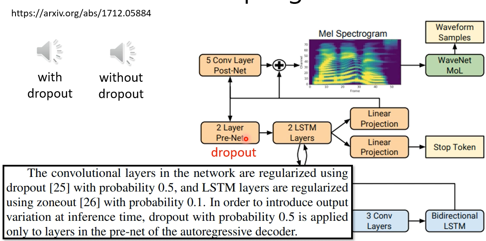

# Diffusion
<!-- prettier-ignore-start -->
!!! quote "资源"
    [Blog](https://lilianweng.github.io/posts/2021-07-11-diffusion-models/#forward-diffusion-process)
<!-- prettier-ignore-end -->

## Training

## 与VAE的关系

## 数学推导

## 为什么要随机sample

> Dropout 也很有趣：

## Diffusion的一些有趣应用

