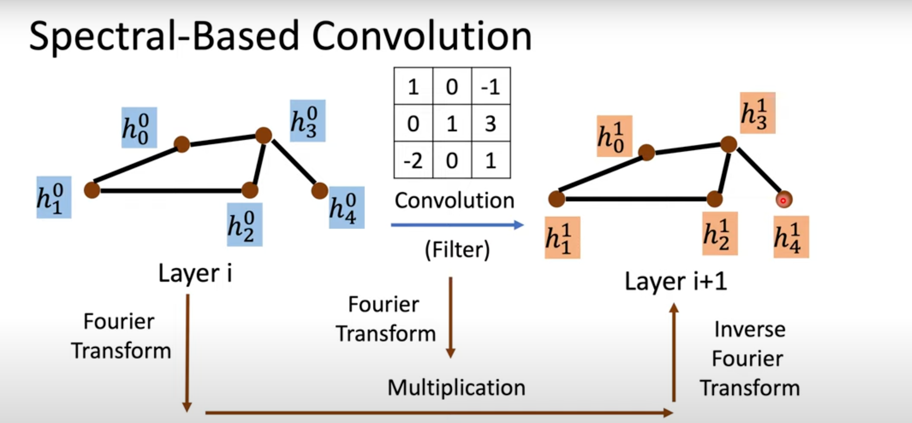

# Graph nerual network
<!-- prettier-ignore-start -->
!!! note "resource"
    - [A gentle introduction to Graph Neural Networks (Basics, DeepWalk, GCN, GAT, GraphSAGE)](https://distill.pub/2021/gnn-intro/)
    - [understand GNN](https://distill.pub/2021/understanding-gnns/)
    - [A survey on graph neural networks](https://arxiv.org/abs/2403.00485)
    - [李宏毅老师的助教视频](https://www.youtube.com/watch?v=eybCCtNKwzA)
<!-- prettier-ignore-end -->

## Basic RoadMap

## 一些些数学
> 图卷积的基本定义

### N-dim Vector Space
$$
\mathbb{R}^n = \{x = (x_1, x_2, \cdots, x_n) | x_i \in \mathbb{R}\} \\
\vec{A}=\sum_{k=1}^{N} a_{k} \widehat{v}_{k} \\
a_j = \vec{A} \cdot \widehat{v}_j = \sum_{k=1}^{N} a_{k} \widehat{v}_{k} \cdot \widehat{v}_j \\
\widehat{v}_{i} \cdot \widehat{v}_{j} = \delta_{ij} = \begin{cases} 1 & i = j \\ 0 & i \neq j \end{cases}
$$

### Fourier Series Representation
$$
x(t) = \sum_{n=-\infty}^{\infty} c_n e^{j2\pi nt/T} \\
c_n = \frac{1}{T} \int_{T} x(t) e^{-j2\pi nt/T} dt
$$

**Fourier Transform**
$$
X(f) = \int_{-\infty}^{\infty} x(t) e^{-j2\pi ft} dt
$$

### Spectral Graph Theory
#### Laplacian Matrix
$$
L = D - A
$$
> $D$ is the degree matrix, $A$ is the adjacency matrix
> L is symmetric and positive semi-definite (for undirected graph)
> $ L = U \Lambda U^T $, where $U$ is the eigenvector matrix and $\Lambda$ is the eigenvalue matrix (Spectral decomposition)
#### Normalized Laplacian Matrix
$$
L_{sym} = D^{-1/2} L D^{-1/2} \\
L_{rw} = D^{-1} L
$$
#### Interpreting vertex frequency
$$
Lf = (D-A)f = Df - Af
$$

#### What we want to learn？

> ChebNet：通过Chebyshev多项式近似卷积核
> GCN是ChebNet的特例，只使用了一阶Chebyshev多项式
> GCN-LPA：将GCN与LPA（Label Propagation Algorithm）结合，实现了半监督学习
> GAT是GCN的改进，通过注意力机制学习权重