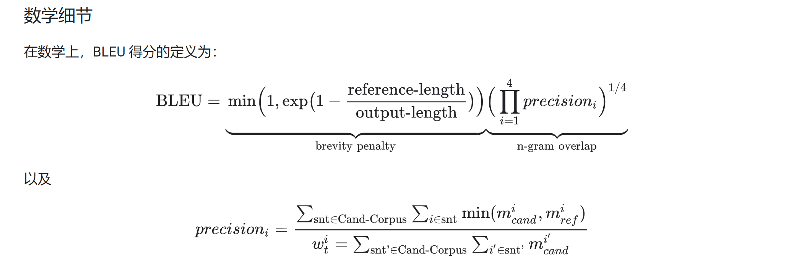
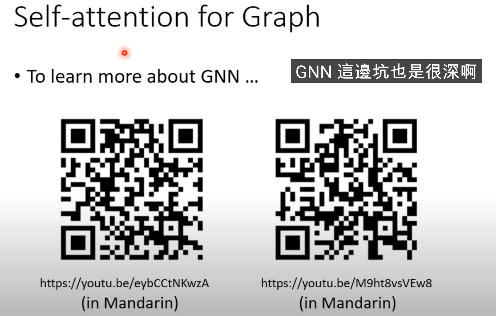

# Transformer
<!-- prettier-ignore-start -->
!!! note "摘要"

    论文：[Attention Is All You Need](https://arxiv.org/abs/1706.03762v7)
    
    参考资料：http://jalammar.github.io/illustrated-transformer/
    
    源码参考：https://github.com/jadore801120/attention-is-all-you-need-pytorch 

    数学证明: https://transformer-circuits.pub/2021/framework/index.html
    
<!-- prettier-ignore-end -->

## 论文内容批注
1. [BELU](https://en.wikipedia.org/wiki/BLEU)一种自动评估机器翻译文本的指标。BLEU 得分是一个 0 到 1 之间的数字，用于衡量机器翻译文本与一组高质量参考翻译的相似度。0 表示机器翻译的输出与参考翻译没有重叠（低质量），而 1 表示其与参考翻译完全重叠（高质量）。

> 事实表明，BLEU 得分与人类对翻译质量的判断有很好的相关性。请注意，即使是人工翻译也无法达到 1.0 的满分。一般来说，>40%就算是很高质量的翻译，>60%则往往超过人工翻译。

2. [LSTM](rnn.md##LSTM)


## 代码解释

### self-attention

<!-- prettier-ignore-start -->
!!! note "资源"
    这个部分其实非常推荐去看21spring李宏毅老师的视频，有很多启发性的内容!!!
<!-- prettier-ignore-end -->

其实Query Key Value 个人认为还是一个比较好理解的逻辑，可以通过3b1b的可视化进行更好的理解。但此外来说，它非常取巧的进行了一种类似于矩阵乘法的操作，来加速了运算速度，并且类似全连接层，加入了全局信息。\\




<!-- prettier-ignore-start -->
??? code "self-attention"
    ```python
    class FeedForwardNetwork(nn.Module):
        def __init__(self, hidden_size, filter_size, dropout_rate):
            super(FeedForwardNetwork, self).__init__()

            self.layer1 = nn.Linear(hidden_size, filter_size)
            self.relu = nn.ReLU()
            self.dropout = nn.Dropout(dropout_rate)
            self.layer2 = nn.Linear(filter_size, hidden_size)

            initialize_weight(self.layer1)
            initialize_weight(self.layer2)

        def forward(self, x):
            x = self.layer1(x)
            x = self.relu(x)
            x = self.dropout(x)
            x = self.layer2(x)
            return x


    class MultiHeadAttention(nn.Module):
        def __init__(self, hidden_size, dropout_rate, head_size=8):
            super(MultiHeadAttention, self).__init__()

            self.head_size = head_size

            self.att_size = att_size = hidden_size // head_size
            self.scale = att_size ** -0.5

            self.linear_q = nn.Linear(hidden_size, head_size * att_size, bias=False)
            self.linear_k = nn.Linear(hidden_size, head_size * att_size, bias=False)
            self.linear_v = nn.Linear(hidden_size, head_size * att_size, bias=False)
            initialize_weight(self.linear_q)
            initialize_weight(self.linear_k)
            initialize_weight(self.linear_v)

            self.att_dropout = nn.Dropout(dropout_rate)

            self.output_layer = nn.Linear(head_size * att_size, hidden_size,
                                        bias=False)
            initialize_weight(self.output_layer)

        def forward(self, q, k, v, mask, cache=None):
            orig_q_size = q.size()

            d_k = self.att_size
            d_v = self.att_size
            batch_size = q.size(0)

            # head_i = Attention(Q(W^Q)_i, K(W^K)_i, V(W^V)_i)
            q = self.linear_q(q).view(batch_size, -1, self.head_size, d_k)
            if cache is not None and 'encdec_k' in cache:
                k, v = cache['encdec_k'], cache['encdec_v']
            else:
                k = self.linear_k(k).view(batch_size, -1, self.head_size, d_k)
                v = self.linear_v(v).view(batch_size, -1, self.head_size, d_v)

                if cache is not None:
                    cache['encdec_k'], cache['encdec_v'] = k, v

            q = q.transpose(1, 2)                  # [b, h, q_len, d_k]
            v = v.transpose(1, 2)                  # [b, h, v_len, d_v]
            k = k.transpose(1, 2).transpose(2, 3)  # [b, h, d_k, k_len]

            # Scaled Dot-Product Attention.
            # Attention(Q, K, V) = softmax((QK^T)/sqrt(d_k))V
            q.mul_(self.scale)
            x = torch.matmul(q, k)  # [b, h, q_len, k_len]
            x.masked_fill_(mask.unsqueeze(1), -1e9)
            x = torch.softmax(x, dim=3)
            x = self.att_dropout(x)
            x = x.matmul(v)  # [b, h, q_len, attn]

            x = x.transpose(1, 2).contiguous()  # [b, q_len, h, attn]
            x = x.view(batch_size, -1, self.head_size * d_v)

            x = self.output_layer(x)

            assert x.size() == orig_q_size
            return x
    ```
<!-- prettier-ignore-end -->
    
    