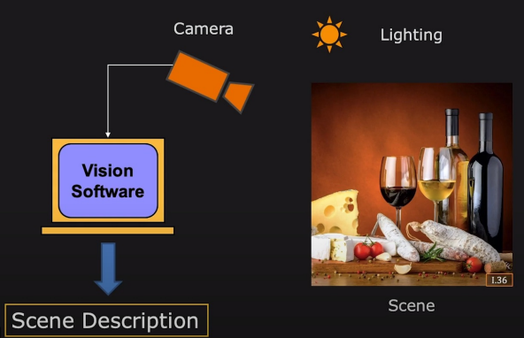

--- comments: true ---
# Introduction

## What is Computer Vision

A standard computer vision system:

### Computer vision tasks

- 3D reconstruction
    - 3D reconstruction, localization, SLAM，……
- Image undestanding
    - Image recognition, object detection, image segmentation, action recognition, deep learning,……
- Image synthesis
    - Colorization, super-resolution, debluring, HDR, panorama, free-viewpoint, GANs, ……

### Why is computer vision hard?

- computers can be better at computing
- humans are better at understanding

## Linear Algebra Recap

矩阵和向量的乘法表示对向量位置进行几何变换，矩阵的列描述了该变换的具体形式（标准基经变换后的坐标）

从几何角度理解矩阵可逆：变换前后的两个点一一对应

行列式几何意义：The determinant is the volume of an n-dimensional parallel body

### Application of Eigenvalues and eigenvectors

- Principal components analysis(PCA)
