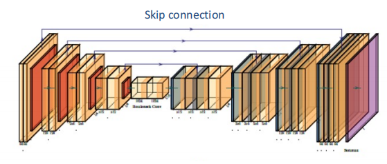
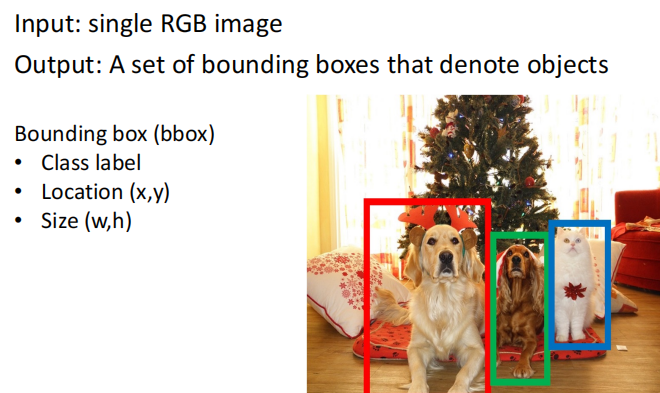
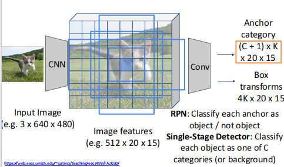
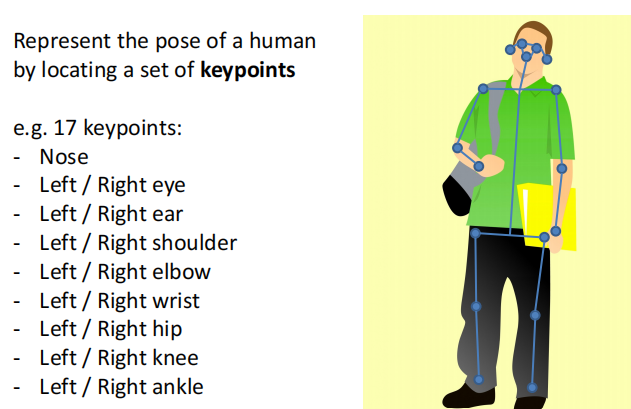

# Lec10 Recognition

!!! Question

    待补充！！
    感觉我对深度学习的理解还不是很透彻，本篇内容没有过多加入我自己的思路。

## Semantic segmentation

如上图所示，语义分割就是识别图像中存在的内容以及位置。

### FCN

我们一般使用FCN(Fully Convolutional Networks)来解决语义分割问题。在传统的FCN基础上，我们加上了两个trick:

- Pooling and Unpooling: 如果不加入池化层，则效率太低，但是由于普通的池化会缩小图片的尺寸，为了得到和原图等大的语义分割图，我们需要向上采样/反卷积。

- Skip Layer: 作用是优化结果。因为我们在pooling,Unpooling的过程中丢失了信息，因此在不同的unpooling层中，我们额外增加原pooling层的输入。

该网络被称作**U-Net**。

### CRF

U-Net输出之后，我们会再加一步**条件随机场**优化能量函数：

$$
E(x)=\sum_i \theta_i(x_i)+\sum_{i,j}\theta_{i,j}(x_i,x_j)
$$

### Evaluation metric

评估语义分割结果，我们使用Intersection-over-union(IoU)

## Object detection

最大的困难就是我们不知道图像中有几个物体，要输出几个bounding box

### Region proposals

基于图片提取出若干可能包含物体的区域

### Two-Stage Model

- First stage: run once per image
    - Backbone network
    - RPN
- Second stage:run once per image
    - Crop features: Rol pool/align
    - Predict object class
    - Predict bbox offset

#### R-CNN

**Non-Max Suppression**
有时候同一个物体，网络会输出两个Bounding box，这时候我们需要选取概率最大的。

#### Fast R-CNN

#### Faster R-CNN

Faster R-CNN使用CNN来选取RP

**RPN**

### Single-stage object detection

YOLO

## Instance segmentation

- Faster R-CNN + Mask Prediction

对于目标检测的每个框中的物体，判断每个像素是属于前景还是背景

## Human pose estimation

### Single Human

- 直接预测关节点
- 用热力图表示关节点

### Multiple humans

- Top-down:
    - Detect humans and detect keypoints in each bbox
    - Example: Mask R-CNN

- Bottom-up:
    - Detect keypoints and group keypoints to form humans
    - Example: OpenPose

