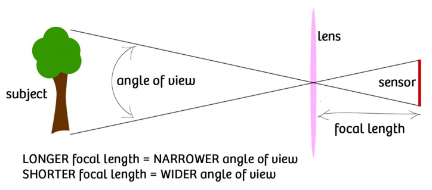
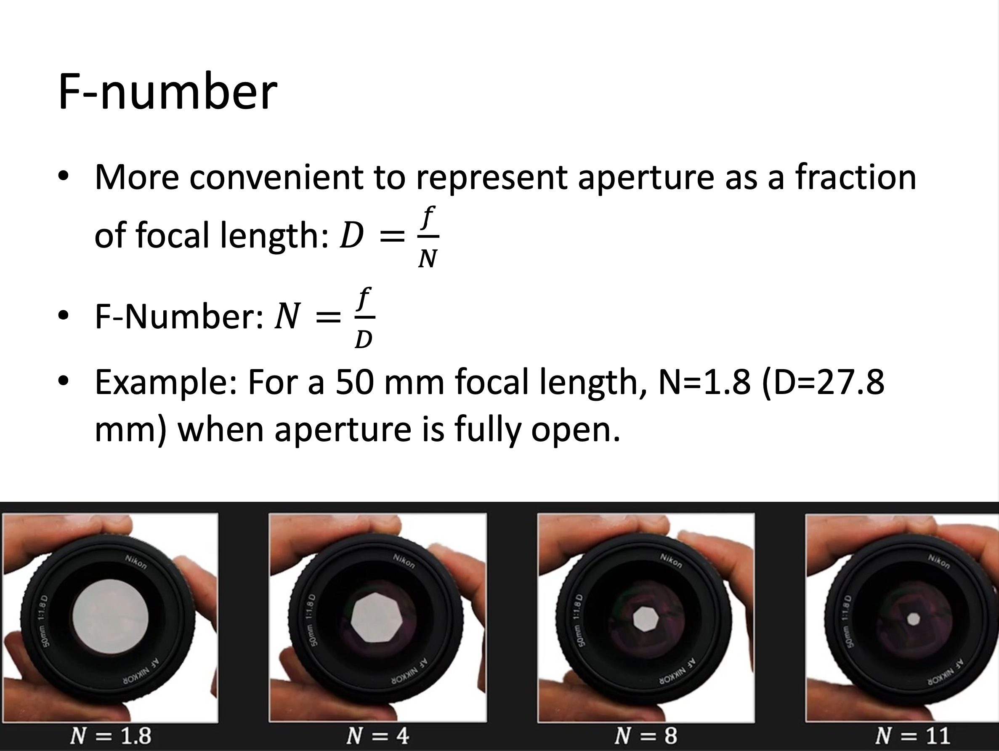
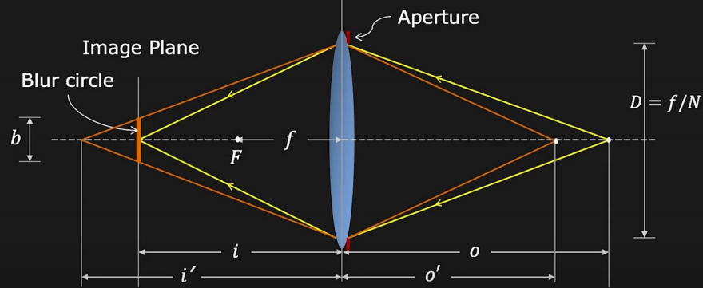
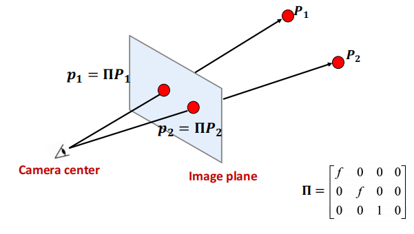
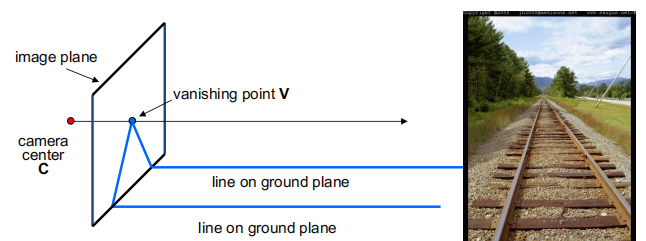
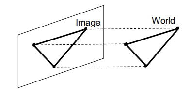

# Lec2 Image Formation

## Camera and lens

首先让我们来设计一个相机。

假如直接在物体面前放一个底片，显然不能得到较好的图像，因为实物与像平面上的点不是一一对应的。如下图所示

因此我们最先想到的就是小孔成像(Pinhole camera)，尽可能使得一一对应关系成立。
> aperture(孔径)越小，成像越清晰

但此时出现一个问题，并不是孔越小图像就越清楚：

- 由物理学可以得到，当孔太小时，会产生光的衍射现象（diffraction effect）
- 孔太小也会导致通光量不足

一个比较好的解决方法是使用镜头——Lens(保持一一对应的同时汇聚更多的光)

If $o=\infty$, then $f=i$

### Image Magnification

放大率 $m=\frac{h_i}{h_o}=\frac{i}{o}$, 

由公式$\frac{1}{i}=\frac{1}{o}+\frac{1}{f}$ 可得，当物体离透镜足够远时，像距可以近似等于焦距，因此可以说焦距也决定了图像放大率。

### Field of  View(FOV)

视场角取决于两个因素：焦距与底片(sensor)的大小，由上图可以直观看出

从成像质量来看，底片越大越好（每个像素收到的光更多，信噪比更好），因此现在的工业目标就是在缩小底片的同时维持好的信噪比。

### Aperture

我们可以通过放大/缩小光圈来控制图像的亮度

### F-number

- More convenient to represent aperture as a fraction of focal length: $D=\frac{f}{N}$

- F-Number: $N=\frac{f}{D}$

### Lens Defocus

当 $f$ 和 $i$ 固定时，只有一个面(深度)在成像平面上是清楚的，所以我们需要对焦

（弥散圆）Blur circle diameter: $b=\frac{D}{i^{'}}\vert i^{'}-i\vert$， 下图是生活中常见的一个例子

### Depth of Field(DoF)

虽然有了弥散圆与defocus的概念，但是我们可能会疑惑生活中的照片并非仅有一个深度才是清晰的，这是因为图像并非连续的，而是由一个个方格（像素）构成的，当弥散圆落在一个像素内时，它表现出来也是清晰的，这就引入了景深的概念：

Range of object distances over which the image is sufficiently well focused, i.e. range over which blur b is less than pixel size.

DoF: $o_2-o_1=\frac{2pf^2cN(o-f)}{f^4-c^2N^2(o-f)^2}$

## Geometric image formation

Geometric image formation 就是使用相机模型来描述3D世界和2D图像之间的几何关系。

### Perspective Projection

使用Pin-hole camera model描述的投影称为透视投影。

#### 齐次坐标的引入(Homogeneous coordinates)

!!! note

    之前学习了多次齐次坐标的表示，这里不详细展开。只需注意引入齐次坐标是因为我们想要将投影表示为线性变换（即能够使用矩阵表示）。
    
    深入了解齐次坐标：GAMES101 Lec3 https://www.bilibili.com/video/BV1X7411F744?p=3&vd_source=49519b2e89bff31aec426f55ae7d4afa

使用齐次坐标表示的投影矩阵：

$\begin{bmatrix}
f&0&0&0 \\ 
0&f&0&0 \\ 0&0&1&0 
\end{bmatrix} \begin{bmatrix}x\\ y\\ z\\ 1\end{bmatrix}=\begin{bmatrix}fx\\ fy\\ z\end{bmatrix}=\begin{bmatrix}f\frac{x}{z}\\ f\frac{y}{z} \\ 1\end{bmatrix}$

Visualize Perspective Projection

#### Projection can be tricky

In perspective projection, straight lines are still straight, however, lenghth and angles are lost.

#### Vanishing points

- Any two parallel lines have the same vanishing point $v$
- The ray from **C** through $v$ is parallel to the lines
    - $v$ tells us the direction of the lines
    - $v$ may be outside the image frame or at infinity

#### Vanishing lines

The union of all of these vanishing points is the vanishing line
> 地平线

#### Perspective distortion

- The exterior columns appear bigger(but why?)
- The distortion is not due to lens flaws.

#### Radial distortion

- Caused by imperfect lenses
- More noticeable for rays that pass through the edge of the lens.
- (two common categories)Pin cushion and Barrel

### Orthographic projectioin

$\begin{bmatrix} 1&0&0&0 \\ 0&1&0&0\\ 0&0&0&1\end{bmatrix}\begin{bmatrix}x\\y\\z\\1\end{bmatrix}=\begin{bmatrix}x\\y\\1\end{bmatrix}$

## Photometric image formation

- Describe the relation between the physical properies of 3D world and the color of 2d image.

### Shutter speed

- control exposure time
- **The pixel value is equal to the integral of the light intensity within the exposure time**

### Rolling shutter effect

### Color spaces

- RGB
- [HSV wiki](https://en.wikipedia.org/wiki/HSL_and_HSV)

人眼对三种颜色RGB的敏感程度是不一样的，在单色中，人眼对红色最不敏感，蓝色最敏感，所以RGB颜色空间均匀性较差。

因此在图像处理中我们还使用了HSV颜色空间，比RGB更接近人们对彩色的感知。

- Hue(色调，色相) 表示色彩信息
- Saturation(饱和度、色彩纯净度) 饱和度越高，颜色越深。饱和度0代表纯白色。
- Value(明度) 颜色的敏感程度，明度为0表示纯黑色

### Bayre filter

对于彩色图像，需要采集多种基本的颜色，最简单的方法是用滤镜的方法，红色滤镜透过红色波长的光etc. 如果要采集RGB三种颜色，则需要三种滤镜，价格昂贵。而拜尔滤镜(Bayre Filter)在一块滤镜上设置不同颜色，由于人眼对绿色比较敏感，因此绿色较多，如上图所示。

### Model the light reflected by an object : Shading

- Compute light reflected toward camera at a specific point
- Inputs:viewer direction, surface normal, light direction, surface parameters

The light received per unit area is proportional to $cos\theta = l\cdot n$

#### Material=BRDF(Bidirectional reflectance distribution function)

BRDF: $f_r(v_i;v_r;n;\lambda)$
$$
L_r(v_r;\lambda)=\int L_i(v_i;\lambda)f_r(v_i;v_r;n;\lambda)cos^{+}\theta_idv_i
$$

