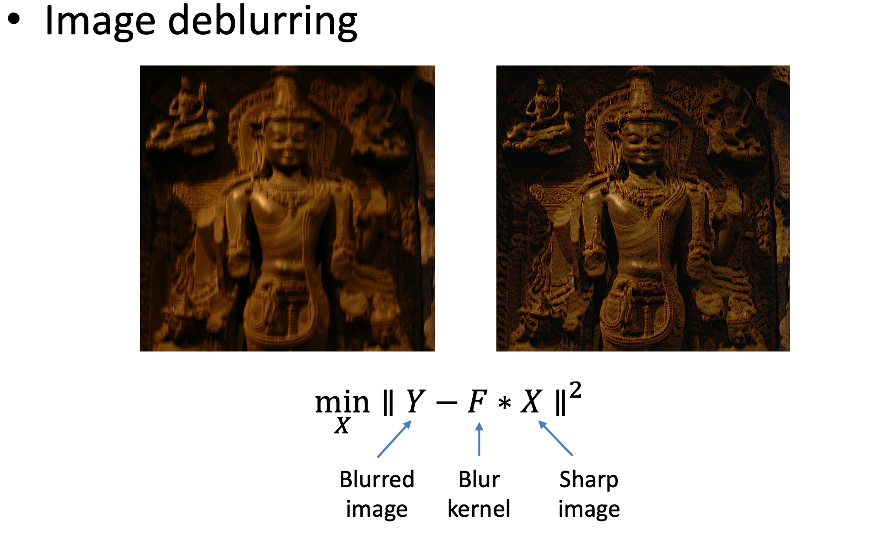
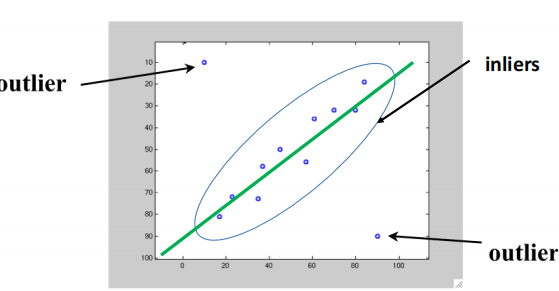
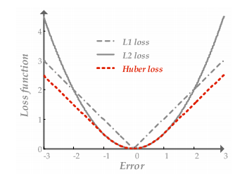
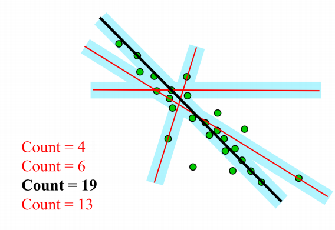
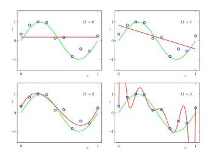

# Lec04 | Model fitting and Optimization

## Optimization

这里首先介绍了优化的基本范式，详见优化基本理论与方法，这里不详细展开

一个有趣的example：Image deblurring

我们已知模糊图像Y和卷积核F，需要通过优化的方法得到去噪后的图像X

我们的想法是找到清晰的图像X，使得它做模糊处理后与已知的图像Y差别尽可能小，于是得到目标函数：
$$
\mathop{min}_X \Vert Y-FX\Vert_2^2
$$

### Model fitting

一个模型描述问题中输入和输出的关系：例如线性模型$b=a^Tx$ 描述输入$a$ 和输出 $b$ 关于模型参数 $x$ 的关系。

但实际结果很难完全满足数学模型，因此我们做的是进行模型拟合，即我们有一个先验的假设（数据符合哪种模型），然后从从数据集中预测出模型的参数（该方法通常被称为学习）

一个经典的方法：最小二乘法(Minimize the **Mean Square Error(MSE)**)
$$
\hat{x}=\mathop{argmin}_x\sum_i(b_i-a_i^Tx)^2
$$

如果我们假设数据中的噪声是服从高斯分布，那么可以与**极大似然估计**联系起来

#### Maximum Likelihood Estimation

首先假设数据服从高斯noise
$$
b_i=a_i^T+n,\ n\sim G(0,\sigma)
$$
对于给定的 $x$, 观察到 $(a_i,b_i)$ 的似然（可能性）：
$$
P[(a_i,b_i)|x]=P[b_i-a_i^Tx]\propto exp-\frac{(b_i-a_i^Tx)^2}{2\sigma^2}
$$
如果数据点是相互独立的，那么：
$$
P[(a_1,b_1)(a_2,b_2)\cdots|x]=\Pi_iP[b_i-a_i^Tx]\propto exp\frac{(b_i-a_i^Tx)^2}{2\sigma^2}=exp-\frac{\Vert Ax-b\Vert_2}{2\sigma^2}
$$

因此我们可以看到，极大似然估计即为找到$x$能够最大化似然函数，而这即为最小化$\Vert Ax-b\Vert_2$

因此**MSE=MLE with Gaussian noise assumption**

## Numerical methods

### Recap: Taylor expansion

- First-order approximation

- Second-order approximation

### 梯度下降法

#### Steepest descent method
- Advantage
    - Easy to implement
    - Perform well when far from the minimum
- Disadvantage
    - Converge slowly when near the minimum
    - Waste a lot of computation

#### Newton method(考虑了二阶导)

- Do second-order expansion

$$
F(x_k+\Delta x)\approx F(x_k)+J_F\Delta x+\frac{1}{2}\Delta x^{T}H_F\Delta x
$$

- Find $\Delta x$ to minmize $F(x_k+\Delta x)$（即对$\Delta x$求导 = 0， 这里注意$H_F$是Hessian矩阵，以及只有当其为二阶连续可微时才得到这个结果）

$$
H_F\Delta x+J_F^{T}=0 \\ \Delta x=-H_F^{-1}J_F^{T}\ (Newton Step)
$$

- Advantage: fast convergence near the minimum
- Disadvantage: Hessian requires a lot of computation

#### Gauss-Newton method
> Useful for solving nonlinear least squares $\hat{x}=arg \mathop{min}_x\Vert R(x)\Vert_2^2$

> $R(x)$ is residual vector, which is $R(x)=Ax-b$ 

- Instead of expanding $F(x)$, we expand $R(x)$

$$
\Vert R(x_k+\Delta x)\Vert_2^2 \approx \Vert R(x_k)+J_k\Delta x\Vert_2^2=\Vert R(x_k)\Vert_2^2+2R(x_k)^TJ_R\Delta x+\Delta x^TJ_R^TJ_R\Delta x
$$

- Optimal direction

$$
\Delta x=-(J_R^TJ_R)^{-1}J_R^TR(x_k)
$$

即使用$(J_R^TJ_R)$ 来近似代替$H_F$. 大大减少计算量

- Disadvantage: $(J_R^TJ_R)$不正定，所以未必可逆，可能会导致不稳定

#### Levenberg-Marquardt

$$
\Delta x=-(J_R^TJ_R+\lambda I)^{-1}J_R^{T}R(x_k)
$$

**The effect of $\lambda$**

- $\lambda \rightarrow \infty$： Gradient descent, and stepsize is small
- $\lambda \rightarrow 0$: Gauss-Newton step

**Advantage**

- Start quickly(远离目标点时使用最速梯度下降)
- Converge quickly(接近目标点时近似高斯牛顿法，保证收敛速度快)
- $J_R^TJ_R+\lambda I$正定，保证高斯牛顿法成立

## Robust estimation

### Outliers

- Inlier(内点)： obeys the model assumption
- Outlier(外点): differs significantly from the assumption（离群值）

外点会使得最小二乘法受很大影响，它会过度放大偏离较大的误差

### Robust estimation

Use other loss function to replace MSE

- $L_1$损失函数：是残差绝对值的和，可以有效减少离群值对模型拟合的影响，但缺点在于零点不可导
- Huber loss: 使用分段函数，在拐点附近使用$L_2$,远处使用$L_1$.

- They are called robust functions.

### RANSAC: Random Sample Concensus

- The most powerful method to handle outliers

**RANSAC的主要思想**：

首先我们知道拟合一条直线只需要两个点，因此首先随机找两个点拟合一条直线，然后检查有多少点符合该直线(只要点到直线的距离小于一定的阈值，就count++)，一直重复该过程，选择count最高的直线。

该方法能够work的原因就是outlier之间差别很大，相互之间很难达到一致；而inlier之间很容易一致，使得count更高。

### Overfitting and underfitting

上图中右下角那幅图便是过拟合的一个例子，虽然每模型很好地fit了所有的点，但这并不是我们想要的。

**ill-posed problem**

解不唯一的问题被称为一个ill-posed problem。(例如线性代数中线性方程组的解不唯一)

为了解决这种问题，我们需要增加约束，引入正则化条件。

#### $L_2$ regularization

$$
\mathop{min}_x\Vert Ax-b\Vert_2^2 \ s.t.\ \Vert x\Vert_2\le 1
$$

其中$\Vert x\Vert_2\le 1$就是正则化约束。

通过让选择的解尽可能接近原点，而让我们没有用的解的维度尽可能接近 0，以减小没用的变量的影响。

一个简单直观的例子：假设我想通过$b=A^Tx$, 即输入$A$，通过模型参数 $x$ 预测 $b$.假设$x=(x_1,\cdots,x_{2n})$，而我们先验认为有用的只有前$n$项，这时通过限制$\Vert x\Vert_2=x_1^2+\cdots+x_{2n}^2\le 1$,当前$n$项值比较大时，后$n$项的值就会趋向于零，抑制这些冗余变量。

#### $L_1$ regularization

$$
\mathop{min}_x\Vert Ax-b\Vert_2^2 \ s.t.\  \Vert x\Vert_1\le 1
$$

我们可以类似地理解$L_1$正则化。

但需要注意的是，如下图可视化所示，$L_1$函数有很多*突出的角*，高维情况下更多。目标函数与这些角接触的机会远大于与其它部分，而在这些角由于位于坐标轴上，有很多维度的值等于零，因此使得解变得更稀疏。

