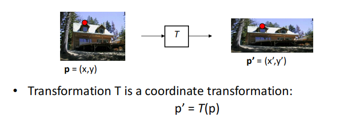
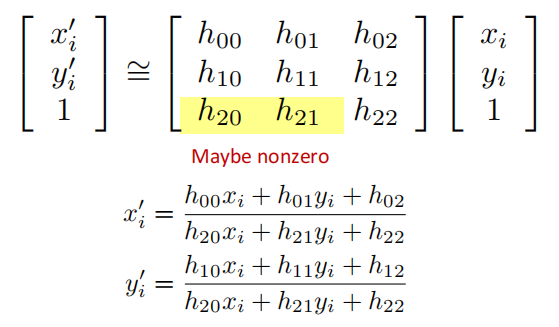
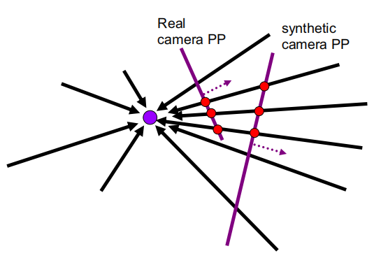
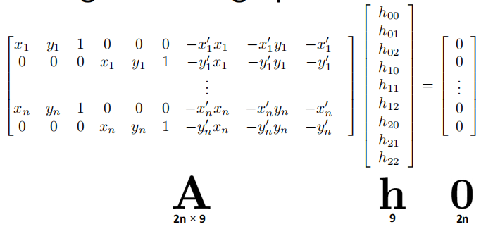
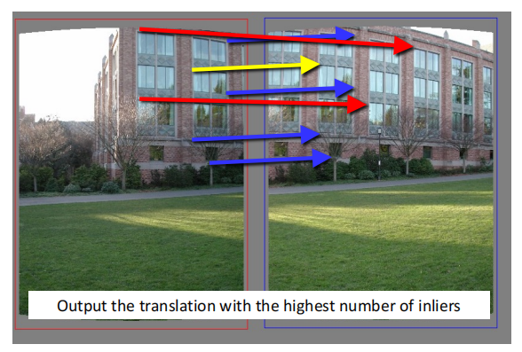
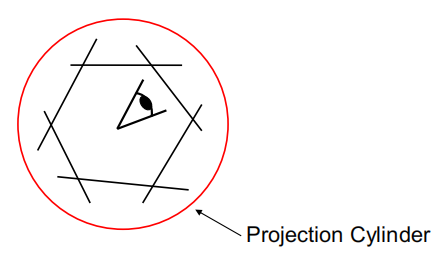
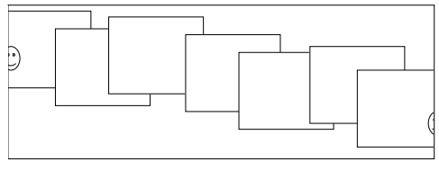

# Lec06 | Image Stitching

## Image Warping

与lec3介绍的image filtering相比较，filtering改变的是图像的像素值(intensity),而warping改变的是图像的形状(shape)

### Parametric global warping
我们关注的是参数化全局变形,即图像的每一个坐标都遵循同一个变换函数。

### Projective Transformation(Homography)

回顾仿射变换的齐次坐标表示:

$$
\begin{pmatrix}x^{'}\\
y^{'}\\
1\end{pmatrix}=\begin{pmatrix}a&b&t_x\\ c&d&t_y\\
0&0&1\end{pmatrix}\begin{pmatrix}x\\ y\\
1\end{pmatrix}
$$
对于仿射投影(or 单应变换), 矩阵的$a_{31},a_{32}$不一定为零:

- 单应性矩阵的自由度为8,因为我们可以同时除以$h_{22}$使得矩阵的$H_{33}$为1，结果是保持不变的。
- 在处理上，我们通常做的限制是使向量$[h_{00},h_{01},\cdots,h_{22}]$的长度为1

下图是一个单应性变化的例子

需要注意的是, 由于单应性变化两张图片的坐标是一一对应的，所以只有当相机中心保持不变时两张图片才符合单应变化。

- Camera rotated with its center unmoved
- Camera center moved and the scene is a plane

### Summary of 2D transformations

### Implementing image warping

或许我们会想，实现warping不是很容易吗，只要把当前图片的坐标值根据变化函数映射到另一个坐标上就行了。 但是考虑一个问题：当前的像素坐标映射后处于两个像素中间(可以理解为像素值是存放在格点上的，映射后的像素位置不一定在格点上)

所以这里我们采取逆变换, 即对于每一个需要找的像素点，去找变换前的坐标，如果坐标不在像素点上就使用周围的像素进行插值。

## Image Stitching

现在我们的问题就是给定两张图片, 如何计算出变换矩阵?

可以采用如下的方法(DLT)

所以我们可以通过求解优化问题: 
$$
min\Vert Ah-0\Vert ^2
$$
可以得到$h$就是$A^TA$对应最小特征值的特征向量，[推导过程](https://medium.com/@insight-in-plain-sight/estimating-the-homography-matrix-with-the-direct-linear-transform-dlt-ec6bbb82ee2b)

### RANSAC for Translation

**Recap the Idea**:

- All the inliers will agree with each other on the translation vector;
- The outliers will disagree with each other( RANSAC only has guarantees if there are <50% outliers)

> All good matches are alike; every bad match is bad in its own way.
>
> ——Tolstoy via Alyosha Efros

每次随机选一组对应点，计算票数，最后要将票数最高的$H$对应的所有点拿出来做一次最小二乘。

**Summary for image stitching**

- Input images
- Feature matching
- Compute transformation matrix with RANSAC
- Fix image 1 and warp image 2.

### Panoramas

对于全景，我们处理的是多张图片的拼接。

最朴素的方法就是取最中间的图片作为参考，其它所有的图片与中间那张对齐

但这种方法会使得边缘图像的形变很明显。

#### Cylindrical Projection

所以我们使用柱形投影 (cylindrical projection)的方法

柱形投影使得变化变简单了: 相机的旋转在圆柱上是平移

#### Assembling the panorama

在柱形投影的基础上还是会出现问题，就是误差的积累，导致漂移。

我们希望整体误差的和为0，一个解决办法就是将最后一张图和第一张图之间也进行个约束。
