# Lec07 | Structure from Motion

Structure from Motion, 中文名为运动恢复结构。这是一种三维重建的算法，通过两个或多个场景(图片)来恢复相机位姿并重建三维坐标点。

**Recover camera poses and 3D structure of a scene**

**需要解决的几个关键问题**

- 相机是如何将三维坐标点映射到图像平面上的？(camera model)
- 如何计算相机在世界坐标系下的位置和方向?(camera calibration and pose estimation)
- 如何从图像中重建出不知道的三维结构？(structure from motion)

## Camera Model

首先我们回顾一下图像形成的过程

这整个过程可以总结为三个步骤：

- 坐标系变换:将世界坐标系的点变换到相机坐标系
- 透视投影：将相机坐标系的点投影到像平面上
- 成像平面转化为像素平面：完成透视投影后我们得到的坐标单位是长度单位(毫米，米等),但是计算机上表示坐标是以像素为基本单元的，这就需要我们进行一个转化。

而这一系列过程可以定义为两个矩阵(两次变换):

- 外参矩阵(Extrinsic Matrix): 坐标系变换
- 内参矩阵(Intrinsic Matrix): 透视投影与转化为像素平面

"外" "内" 的概念也很好理解，对应于发生于相机外部和内部的变换。

### Coordinate Transformation

定义外参$(R,c_w)$ 分别代表从世界坐标向相机坐标的旋转矩阵和在世界坐标系下相机中心的坐标。如下图所示

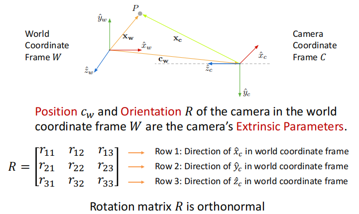

因此变换后的坐标:
$$
x_c=R(x_w-c_w)=Rx_w-Rc_w=Rx_w+t,\,t=-Rc_w
$$
即

使用齐次坐标表示，我们可以得到相机外参矩阵$M_{ext}$

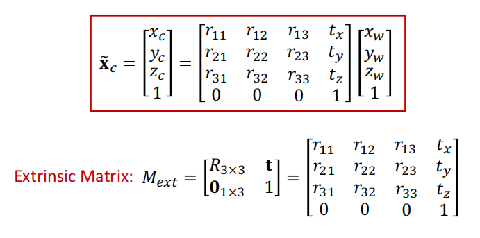

### Perspective Projection

这在lec2已经介绍过

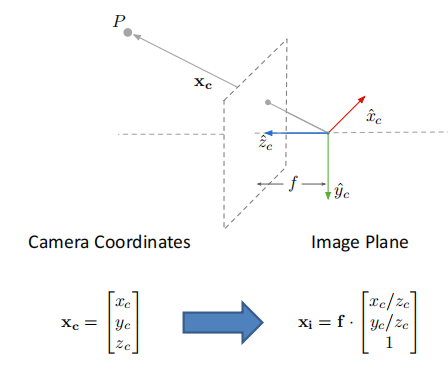

### Image Plane to Image Sensor Mapping

首先需要将长度单位转化为像素单位

其次，要进行坐标原点的转化。成像平面的原点在相机光轴与平面的交点(一般在图像正中间),而我们一般把图像左上角作为像素平面的原点。

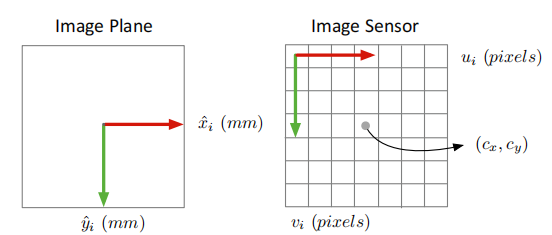

所以我们可以得到相机的内参矩阵:

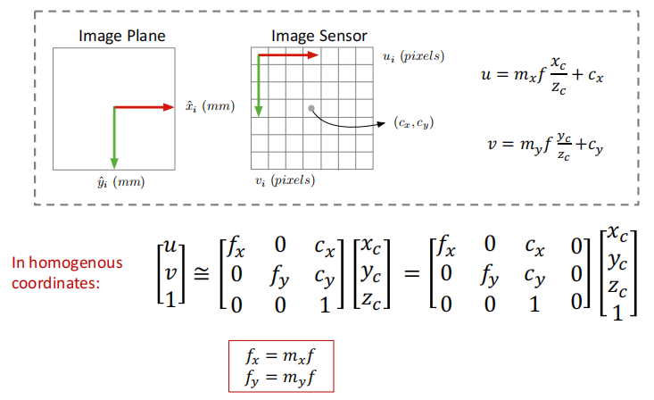

### Projection Matrix

综合相机的内参和外参矩阵，我们可以得到总的投影矩阵

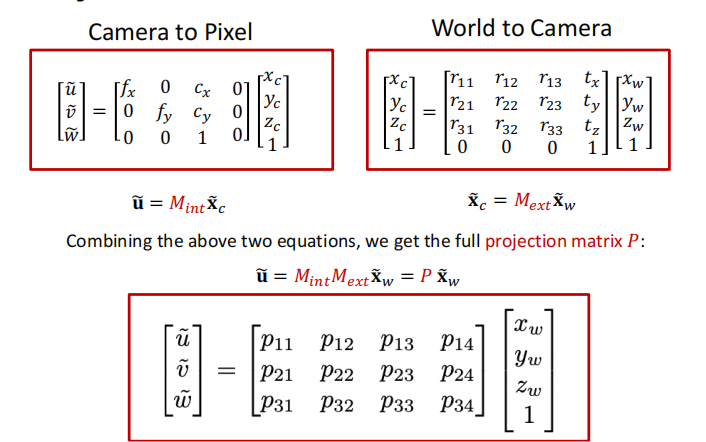

## Camera Calibration

有了内参和外参矩阵的定义后，我们就想通过像素坐标和实际空间坐标来得到这两个矩阵。

我们需要同时知道若干像素点的位置和3D世界坐标，所以我们希望有一个东西(标定板）能够使我们方便测量这两种坐标。

我们可以选择黑白棋盘作为标定板,它的坐标位置是很方便计算的。以其为标定板为例，相机标定的实现如下：

- 给定一个几何特性已知的标定板，人为定义世界坐标系(尽可能方便计算)
- 寻找特定关键点的对应关系，每一个点对都是一个3D点和一个2D点的对应

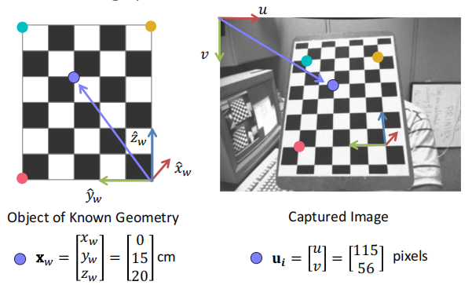

- 对于每一个点对，我们都可以用如下方程表示出对应关系，采用之前求解单应性矩阵的方法，我们可以求得投影矩阵$P$.

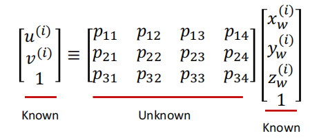

有了投影矩阵$P$后，我们应该如何得到内参和外参矩阵呢？

通常来说，将一个矩阵分解为两个特定矩阵是做不到的，但是我们的内参矩阵是一个上三角矩阵，且外参矩阵中的子矩阵旋转矩阵是正交的，因此我们可以通过$QR$分解实现对内参矩阵和旋转矩阵的求解。

而对于外参矩阵中的平移项，可以通过QR分解得到的内参矩阵得到

### Visual Localization Problem

视觉定位，通过照片计算出拍摄者的位置(即相机的外参)。这里我们假定场景的地图和相机的内参都已知。

**基本步骤**

- 找出3D点与2D点的对应关系，本质上是图像的特征匹配
- 求解相机的位姿，称作PnP问题(Perspective-n-Point，多点透视成像，是相机标定的子问题)

对于PnP问题，我们由6个未知的参数，3个旋转，3个平移，因此该问题也称作6自由度位姿估计问题。由于一个点对对应两个方程，因此我们至少需要3个点对来求解PnP问题，除此之外，还需要一个额外的点来保证答案的唯一性(否则会有四个解)。

**P3P**

P3P就是使用最少的点对来求解相机位姿，使用几何上的方法。

!!! Example "求解P3P"

    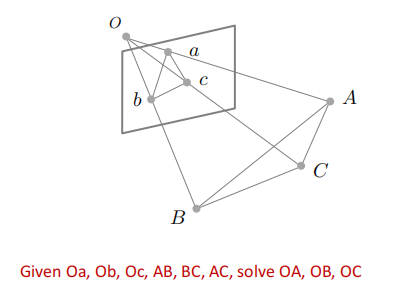

    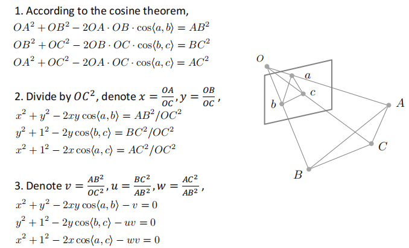

    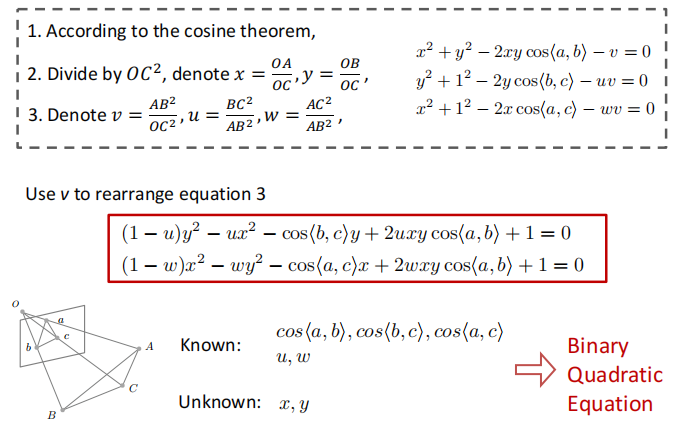

    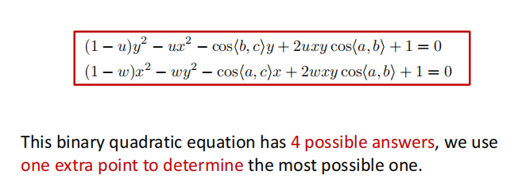

**PnP**
当$n>3$时，我们就可以将PnP转化为一个优化问题。

即最小化**重投影误差**(reprojection error)
给定相机的外参，把三维点投影到图像上，如果外参是对的，则投影点和特征点是一样的。

$$
\mathop{min}\limits_{R,t}\sum_i\Vert p_i-K(RP_i+t)\Vert^2
$$
我们使用P3P问题的解来初始化，并用高斯牛顿法进行优化

## Structrue from motion

再回顾一下SfM的任务： 从多视角场景(图片)恢复相机位姿，并重建三位点坐标。解决SfM问题，一般通过如下的假设与步骤：

- Assume intrinsic matrix $K$ is known for each camera.
- Find a few reliable corresponding points
- Find relative camera position $t$ and orientation $R$
- Find 3D position of scene points

### Epipolar Geometry

我们首先想要得到不同视角两张图片特征点之间(2D projections of a 3D point in 2 views)对应的几何关系。

Epipolar geometry tells us how to solve $t$ and $R$ given a few pairs of 2D correspondences.

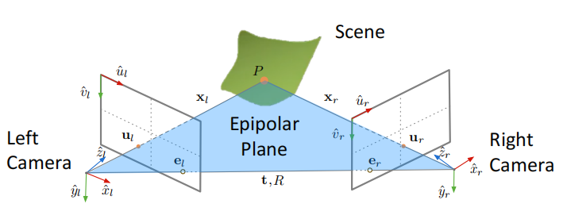

#### 一些terminology

- 基线：两个相机中心的连线，$OO^{'}$
- 对极点：两个相机中心连线与像平面的交点，可以理解为在一个相机视角下另一个相机在该相机平面的投影点，如图中的$e_l,e_r$。
- 对极平面: 由实际点$P$, 两个相机中心形成的平面。对于某个场景中的点，其对极面是唯一的。
- 对极线：对极面与成像平面的交线。

### Epipolar Constraint

极平面的法向量$n=t\times x_l$,  它与平面上任何点的内积为0，即$x_l\cdot (t\times x_l)=0$.

我们把这个式子写成矩阵形式，并引入叉乘矩阵：

由于$T_{\times}$是一个反对称矩阵，$R$是正交矩阵，所以我们可以通过奇异值分解$E=T_{\times}R$ 计算出$t,R$.

但是$(x_l,y_l,z_l)$ 是场景点相对相机坐标系的三维坐标，这是我们不知道的，我们只知道像素平面上的二维坐标。因此我们要把$x_l,x_r$通过内参矩阵转化为像素坐标。

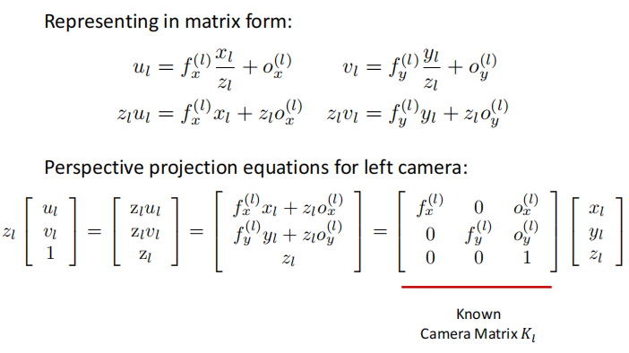

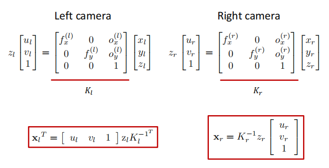

我们称中间的那个矩阵为基础矩阵$F$(Fundamental Matrix)

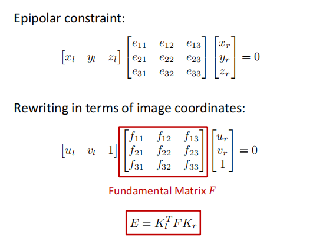

因此，由于$u_l,u_r$已知，我们可以求解基本矩阵，又由于相机内参已知，因此可以通过$F$求解出$E$,再使用SVD就可以得到$R,t$

由于基础矩阵也是homogenous的，因此我们在求解时可以加上约束$\Vert f\Vert^2=1$

现在我们就可以得到相机位姿估计的Pipeline

!!! Example "Relative Camera Pose Esitimation"

    对每个点对，写出对极约束，并改写矩阵得到线性方程组，使用最小二乘求解。得到基础矩阵后求解$E=J_L^{T}FK_r$,最后进行SVD分解。

    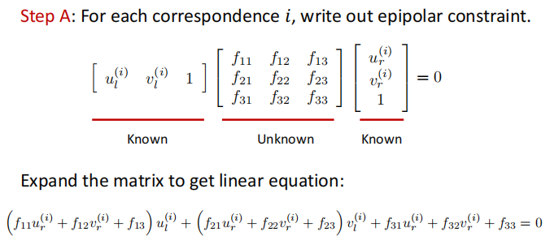

    

### Triangulation

现在我们有了对应的二维特征点，相机参数以及两个相机坐标系的相对位置关系，下一步就是计算出场景点的实际三维坐标。

??? Example "具体步骤"

    

    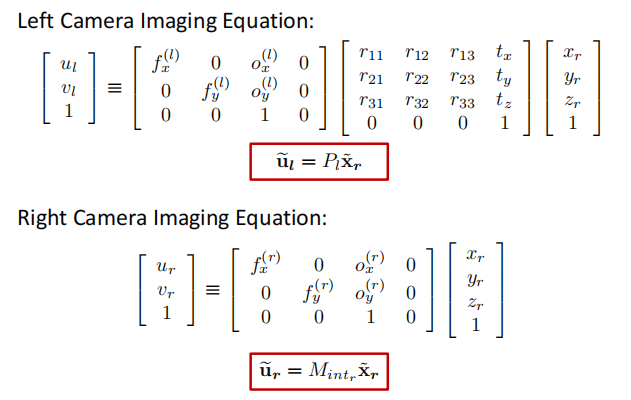

    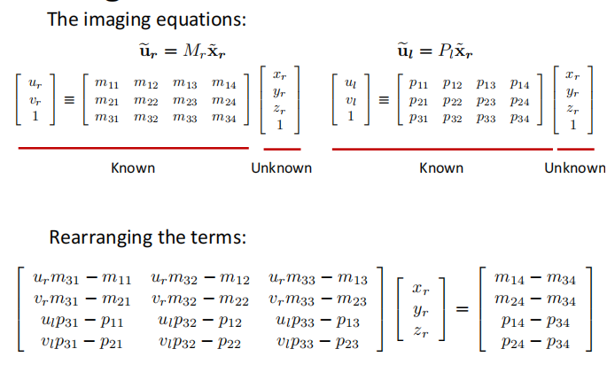

    

但是需要注意到，假设数据都是准确的，那么$O_lX_l,O_r,X_r$应该会相交于场景点$X$。大但是多数情况下会有误差，也就是说两条线不一定严格相交，因此我们使用优化的方法，即四个方程三个未知数，通过最小二乘得到最优解。

另一个选择是通过优化重投影误差进行求解。

Minmize **reprojection error**:

$$
cost(P)=\Vert u_l-\hat{u}_l\Vert^2+\Vert u_r-\hat{u}_r\Vert^2
$$

### Multi-frame Structure from Motion

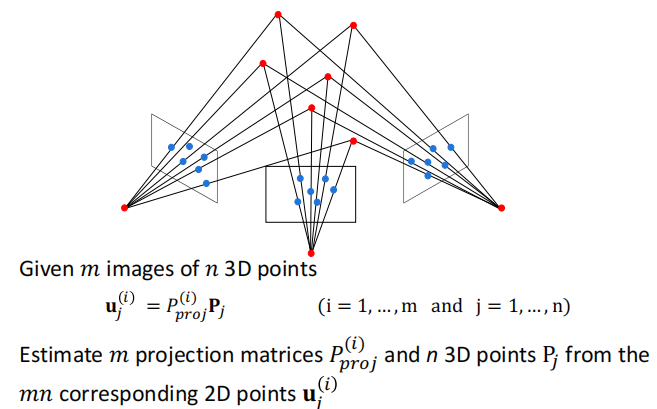

**Sequential SFM**
步骤：
  
- 从其中两张开始，使用前述方法重建
- 不断取出新的图像，根据已知条件计算相机位姿，可以得到新的三位点，并优化现有的点
- 使用Bundle Adjustment 进行优化(消除累积误差)

**Bundle Adjustment**

在所有相机坐标系下优化所有点的重投影误差

### COLMAP

一个三维重建工具
COLMAP is a general-purpose Structure-from-Motion (SfM) and Multi-View Stereo (MVS) pipeline with a graphical and command line interface. It offers a wide range of features for reconstruction of ordered and unordered image collections.
