# Lec8 Depth estimation and 3D reconstruction

上一节我们讨论的structure from motion重建的是稀疏的点云，这节我们讨论稠密的重建，即对每个像素点进行重建，而需要的一个重要概念就是深度的估计。

## Depth estimation

深度估计即对于给定的图像，估计每一个像素在实际场景中的深度。这里的深度有时候指空间点到相机中心或者像平面的距离，也有时候表示沿光线的距离。

深度图就是将深度信息可视化

### Stereo matching

#### Stereo Vision

- An object point will project to some point in our image
- That image point corresponds to a ray in the world.
- Two rays intersect at a single point, so if we want to localize points in 3D we need 2 eyes.(双目视觉)

**Recap: Epipolar geometry**

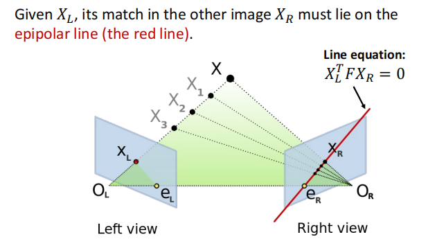

即如果已知$X_L$,那么$X_R$的轨迹就是对极线。这极大简化了我们搜索的区域。

考虑最简单的情况：两个平行的像平面：

这样子我们只需要搜索另一张图中同一高度的水平线即可，更加缩小了搜索的空间，提高效率！

那么对于并不平行的像平面，很直观的想法，就是通过几何变换使得它们平行。称作立体影像矫正。

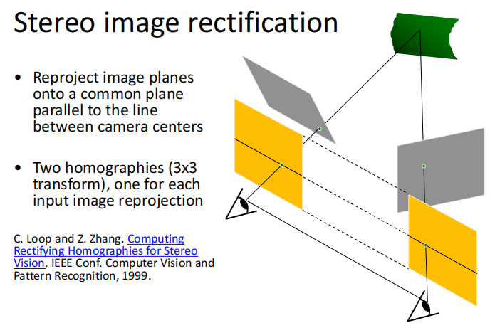

这样我们就将所有的情况都简化为了平行像平面。

!!! Example "Result"

    

**视差(disparity)**
两张图同一个点水平坐标的差别：
$x_2-x_1=$ the disparity of pixel($x_1,y_1$)

我们可以从视察来估计出深度信息：

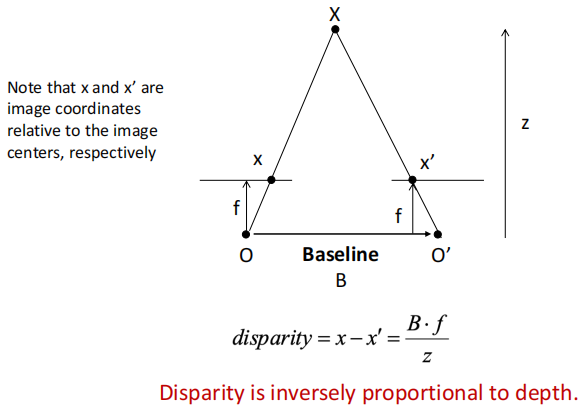

通过相似三角形得到。

#### Stereo matching algorithms

我们假设亮度一致。
立体匹配就是在另一张图的对极线上当前点搜索最佳匹配的点。很直观的想法就是取一个小窗口，在另一张图的对极线上滑动，寻找最相似的小区域。

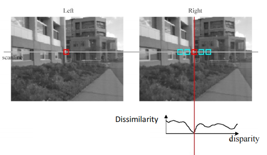

!!! Example "Popular matching scores"

    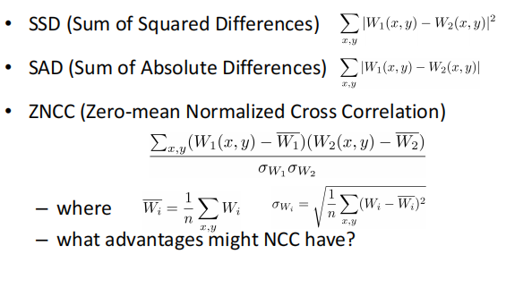

对于窗口匹配，窗口大小的选择对结果造成比较大的影响。窗口太小可以增加细节，但是会增加噪声。窗口太大虽然噪声小了，但是我们提取不到细节，后续重建的效果就不好

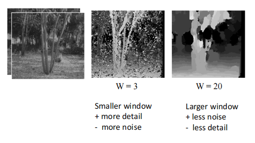

可以看到即使是最佳的window size,得到的深度图与实际还是有一定差距。

**Stereo as energy minmization**

我们可以将立体匹配转化为一个优化问题

$$
E(d)=E_d(d)+\lambda E_s(d)
$$

优化变量是每个点的视差，目标函数分为两个部分：

- 匹配本身的损失：目的是在另一张图中找到最佳匹配(match cost)
- 光滑性的损失： 相邻的两个像素，视察应该尽可能接近(smoothness cost)

对于$V$的选择：

可以看到该方法的结果，效果好了很多

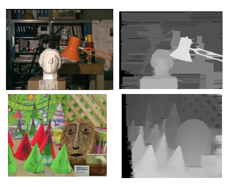

#### Stereo reconstruction pipeline

至此我们可以得到立体重建(双目重建)的基本步骤：

- Calibrate cameras
- Rectify images
- Compute disparity
- Estimate depth

!!! Example "基线的选择"

    
    
    如果基线过小，则点的深度误差会比较大。
    如果基线过大，则一方面重合的区域比较小，另一方面两张图片的内容差别比较大(就相当于从两个相差较远的视角看一张图，光线像素等内容就会不一样)，横向误差增大，比较难搜索到匹配的点。

!!! Example "Possible Cause of Error"

    - Camera calibration errors
    - Poor image resolution
    - Occlusions
    - Violations of brightness constancy
    - Textureless regions

!!! Question "结构光"

    对于没有纹理的区域(比如说镜面，金属表面)，立体匹配歧义性太强，无法进行深度估计。解决该问题的方法就是结构光:
    
    相机的光影会给无纹理的区域打上光斑，属于主动方式的深度估计。
    
    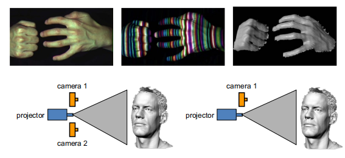

### Multi-view Stereo

和SfM一样，我们现在要将两个视角的深度估计拓展到多个视角。

!!! note "Advantages of MVS"
    
    - Can match windows using more than 1 neighbor, giving a stronger constraint
    
    - If you have lots of potential neighbors, can choose the best subset of neighbors to match per reference image
    
    - Can reconstruct a depth map for each reference frame, and the merge into a complete 3D model

**basic idea**

如果按照前述方法，将$n$张图片两两依次匹配并依次计算重投影误差，那么效率极低。因此在这里我们选择的方法是假设实际物体中点的深度，在所有图中计算重投影误差，即依次枚举。

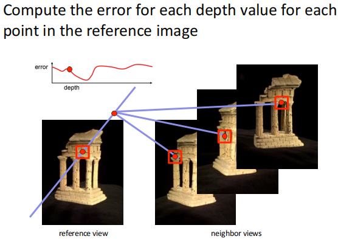

所以我们的方法总结起来就是：对于参考图像的每一个像素的每一个可能深度值，去计算重投影误差。我们得到的误差是个三维体素，长宽对应图像，高对应深度值个数，称作**cost volumn**

为了得到cost volumn, 我们采用如下方法：

#### Plane-Sweep

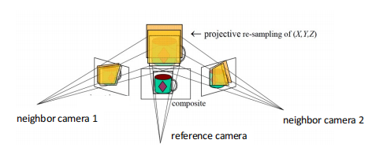

我们先假设参考图像的所有像素深度都是同一个值，那么对应三维空间中的一个面，我们做的是将这个面投影到其它的图像中，该投影是个单应性变换。据此计算重投影误差。

cost volumn记下了每个像素每一个深度对应的误差，最后我们提取每个像素表现最好的深度值,得到深度图。

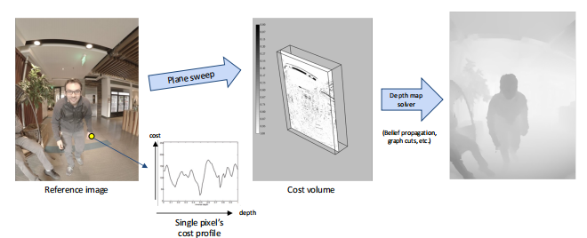

当然，计算cost volumn开销是比较大的, 有一种更加高效的立体匹配算法：

#### PatchMatch

首先我们进行随机初始化，赋予图像中的每个像素一个随机的深度值，总会有部分像素猜对。其次我们假设相邻的像素是相似的，即在两张图像上的视差相似。

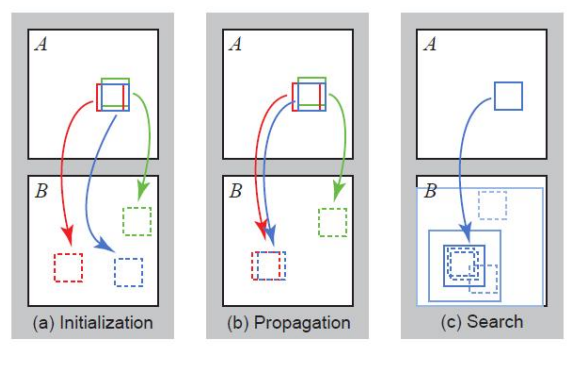

- Initialization: 随机初始化，大部分是错的，但是有可能会蒙对，在上图中我们假设红色是对的。
- Propagation: 对于每一个图像块，将与其相邻的图像块计算误差，如果误差变小，则更新。
- Search: 虽然相邻的像素相似但是不完全一致，所以我们要在小范围内进行微调。

可以把PatchMatch类比为图像匹配中的梯度下降。

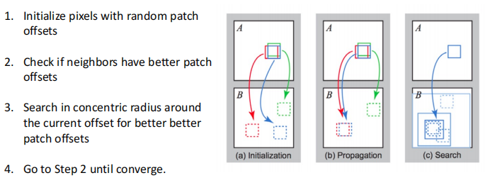

## 3D reconstruction

现在我们的目标是从深度图得到实际物体的三角网格。

!!! note "3D reconsturction Pipeline"

    - Compute depth map per image
    
    - Fuse the depth maps into a 3D surface
    
    - Texture mapping

### 3D representations

#### Point Cloud

点云表示就是一系列三维点。上一讲的SfM我们得到的就是三维点云。

#### Volume

**Occupancy volumn**

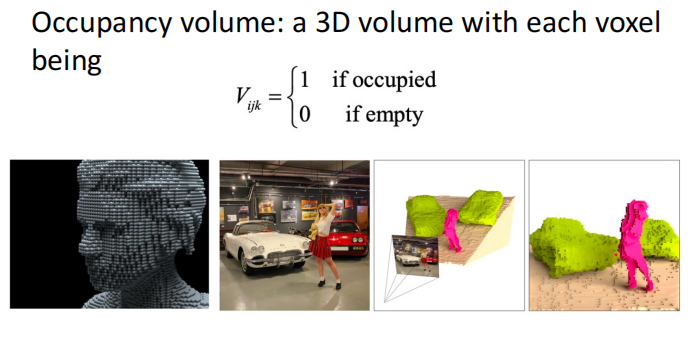

该方法会比点云更稠密，但是问题是占用空间大，造成空间分辨率较低。会缺失细节。

**Signed Distance Function(SDF)**

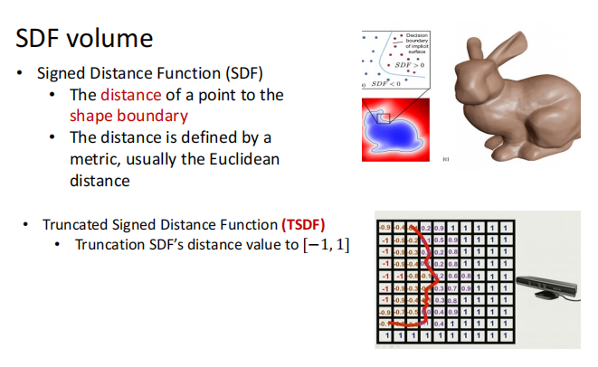

#### Mesh

一般使用三角网格。

### 3D surface reconsturction

现在我们想要知道如何从深度图得到三角网格。

基本的步骤如下：

- Depth maps->Occupancy volume: Poisson reconsturction
- Occupancy volume->mesh: Marching cubes

但是我们为什么要先将深度图变成体素表示再变为网格呢？

尽管volume存储空间大，但是它是一个规则的数据，非常便于计算机处理，并且可以很好地去噪。

#### Poisson Reconstruction

泊松重建是从深度图到三维体素的一个过程。

首先将深度图转化为点云。

这时候我们得到了一堆点，其实这些点已经近似构成了一个三维表面，只是比较noisy。

第二步，我们要计算这堆分布在表面附近的三维点各个局部的法向，可以利用主成分分析，对应小特征值的特征向量即为局部表面法向。

第三步，我们根据得到的法向构建0-1的体素,即用体素拟合点云，使得0-1交界的地方就是点云所在之处。我们可以定义一个优化问题：优化变量就是每个体素的值，为0或1。

对于目标函数，我们可以这样思考：对于体素的边界，物体内部值为1，外部值为0，则该处的梯度就沿着表面的法向。而我们又已知法向，因此可以优化梯度与法向之间的Loss。

!!! note "Poisson Reconstruction"

    - Represent the oriented points by a vector field $V$
    
    - Find the function $X$ (体素场) whose gradient best approximates $V$ (梯度向量场) by minimizing: $\Vert \nabla_{X}-V\Vert^2$
    
    - Solved by Poisson equation

#### Marching Cubes

现在我们需要从体素表示中提取表面三维网格。

这个做法其实很直观，就是寻找体素中有0和1转化的地方，提取中点，生成三角面片。下图很直观地展示二维和三维的情况。

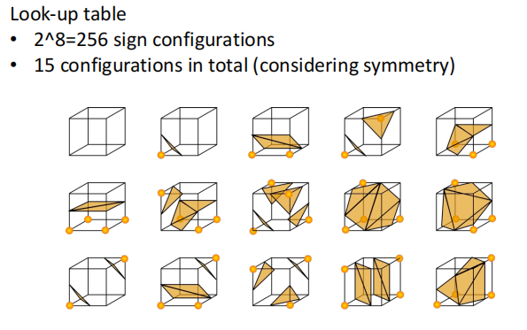

### Texture Mapping

目前我们得到的三角网格是没有颜色的，texture mapping(纹理映射)做的就是往mesh上上色。

对于三维物体，我们可以将其表面剪开，铺平成二维图像，就形成了纹理图。纹理图的每一个像素与三维表面有一一对应的关系。对于三角网格的每一个顶点，我们不仅有在三维空间中的坐标，我们同时记录该顶点在纹理图中的像素坐标。而面片里的点则通过顶点插值得到。