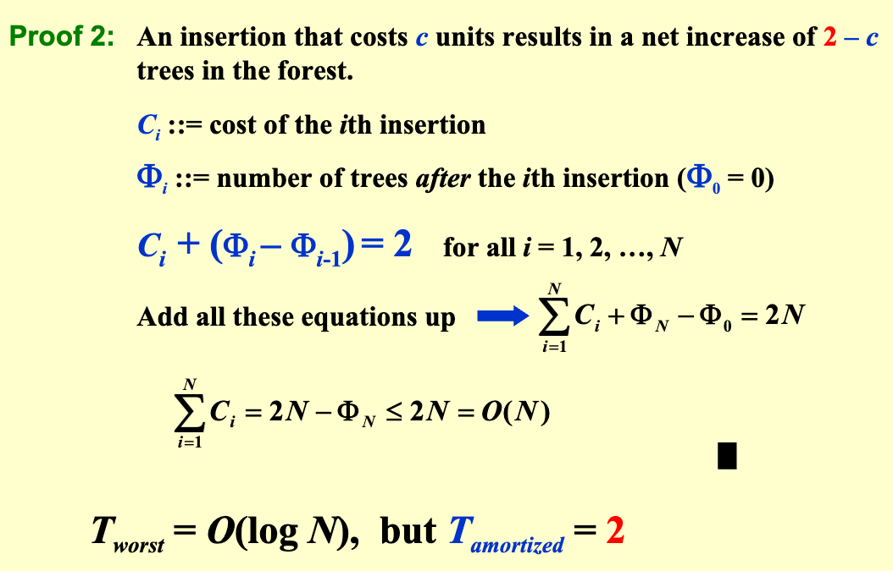
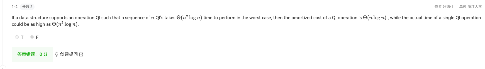
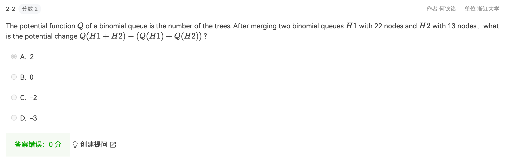
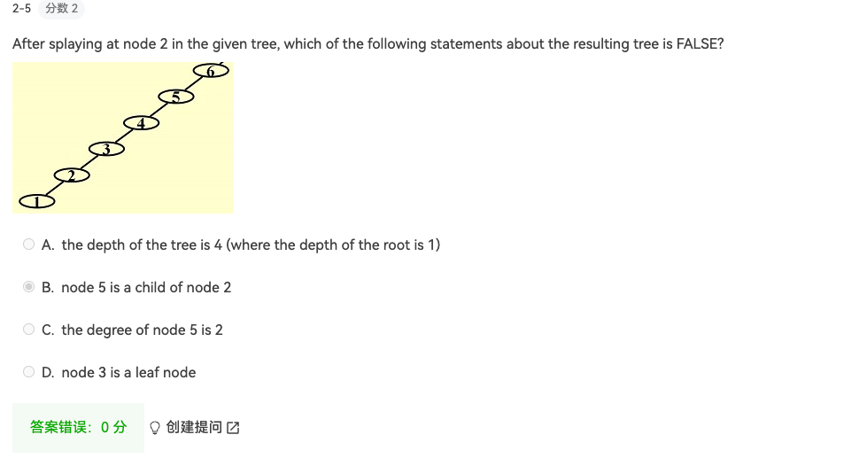
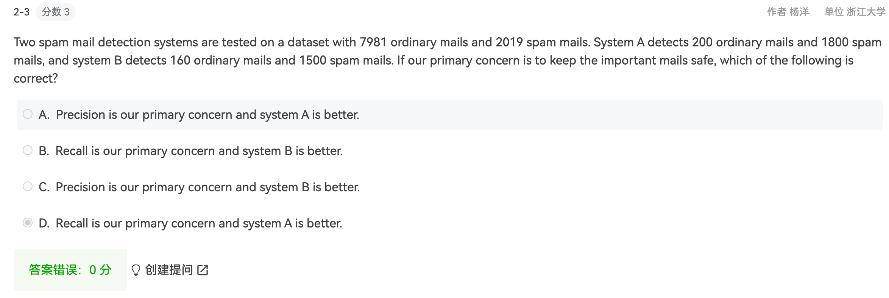
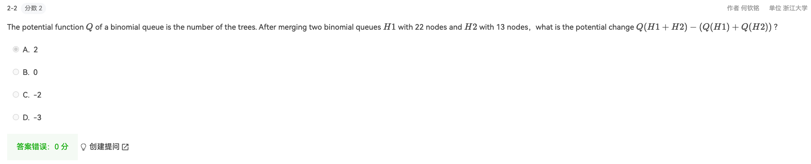
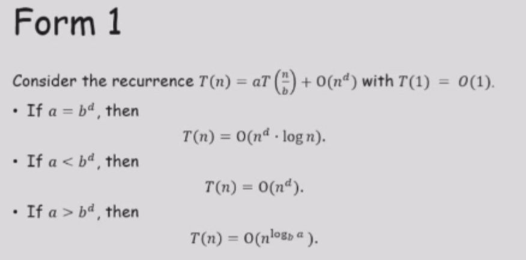
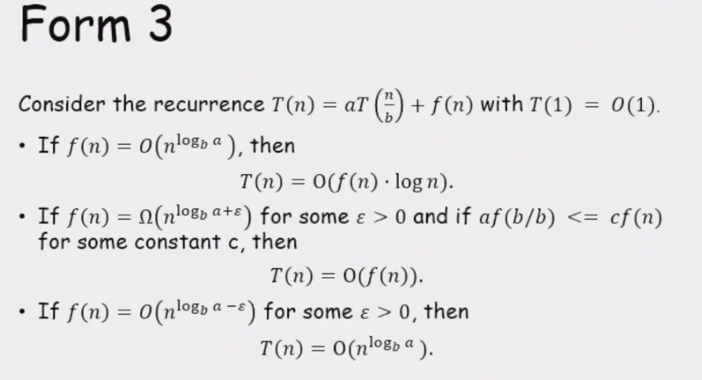
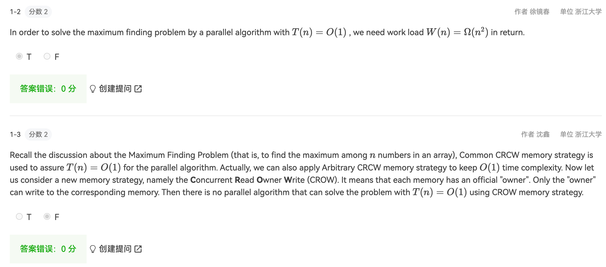
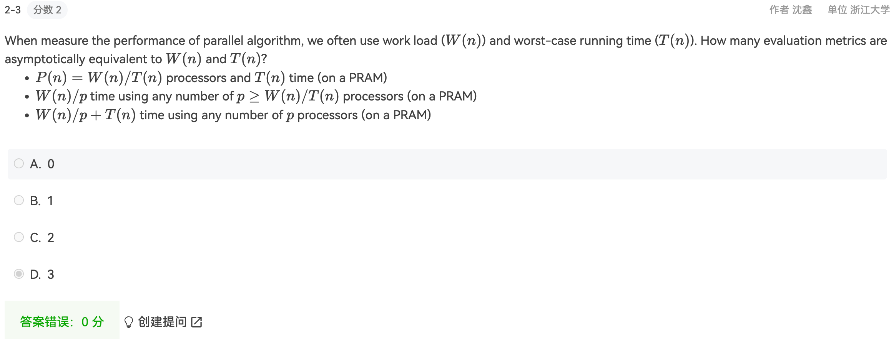

# 历年卷复习

## 数据结构复杂度分析汇总

| 数据结构 | 查找 | 插入 | 删除 | 备注 |
| --- | --- | --- | --- | --- |
| AVL tree | O(logn) | O(logn) | O(2logn) | 最坏情况也会在O(logn) |
| Red-Black tree | O(logn) | O(logn) | O(3) |  插入可能会比AVL慢（最长路是$2·H -1 $） |
| B plus tree | O(logn) | O(logn) | O(logn) |  适合磁盘存储 |
| Leftist Tree | O(logn) | O(logn) | O(logn) |  Speed up merging in O(N). |

| 数据结构 | FindMin | DeleteMin | Insert | Merge |
| --- | --- | --- | --- | --- |
| Binomial Heap | O(logn) / O(1) | O(logn) | O(1) | O(logn) |

## Potential function

## AVL & splay Tree

## Red-Black tree & bplus tree

> 具体红黑树的逻辑考前一定梳理一遍

> And we can derive that a red-black tree with black height H has at least 2​H​​−1 internal nodes.

## Invert file index

> 知识点非常好理解，考前可以再看眼概念
> 
> 两种计算方式的考察

## binomial heap

## skew heap & leftist heap

- leftist heap: Speed up merging in O(N). （一定注意定义）
- skew heap: Any M consecutive operations take at most O(M log N) time. （无脑交换）

## backtrack

> alpha-belta剪枝（computer-human）、八皇后、Turnpike Reconstruction Problem（本质也是一个搜索树，明确问题的定义就会做了）

## divided and conquer

> 最后一条$r>1$ 

 

## DP 问题

## Greedy 算法
> 学习掌握哈夫曼树大结构与方式

## Parallel computed

- B() 自底向上计算。
- C() 自顶向下计算。

- CRCW（Concurrent Read Concurrent Write）不能同时读写一个位置 
- CREW（Concurrent Read Exclusive Write）可以同时读，但不能同时写 
- EREW（Exclusive Read Exclusive Write）可以同时读写

## External Sorting

> num of pass = $1+log_{k}^{N/M}$
>
> 普通放置需要2k tape
> 斐波纳切数列安排run k+1 tape
>
> 可以利用replace section的方式，获得longer的run length
>
> k-way merge： 2k input buffers, 2 output buffers

> 
>
> 
>
> 
>
> 
>
> 逆天的坑人题目
> 