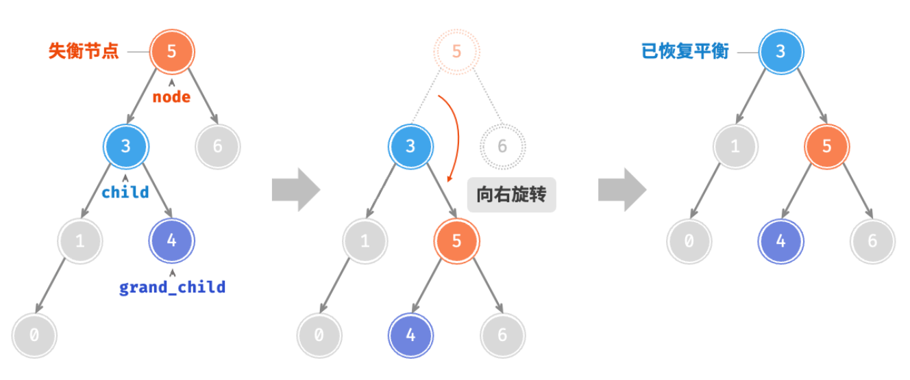

# week1
## AVL tree
[Tutor](https://www.hello-algo.com/chapter_tree/avl_tree/)
在二叉树中我们知道，如果树的高度为h，那么最多有2^h-1个节点，但在多次插入或删除后可能退化为链表从而降低效率

而AVL树是一种自平衡的二叉查找树，它的左右子树的高度差不超过1。这样我们就可以保证AVL树的高度为O(logn)。这样我们就可以保证AVL树的查找、插入、删除的时间复杂度为O(logn)。

### 平衡因子
平衡因子是指左子树的高度减去右子树的高度，即balance = height(left) - height(right)。在AVL树中，平衡因子的取值范围为-1, 0, 1。

### 旋转
个人认为左旋和右旋的思想没什么本质区别，具体操作如下图所示

<!-- prettier-ignore-start -->
!!! note "旋转的选择"
    |失衡节点的平衡因子 ｜ 子节点的平衡因子 | 应采用的旋转方法|
    |---|---|---|
    | $>1$ | $\geq 0$ | 右旋 |
    | $>1$ | $< 0$ | 先左旋再右旋 |
    | $<-1$ | $\leq 0$ | 左旋 |
    | $<-1$ | $> 0$ | 先右旋再左旋 |
<!-- prettier-ignore-end -->

### 插入和删除

## Splay tree
!!! quote "link"
    OI Wiki: https://oi-wiki.org/ds/splay/

Splay 树，即伸展树，想要解决的问题和 AVL 树类似，只不过 Splay 树希望达到的目标是在**摊还(Amortized)**复杂度$O(\log N)$的情况下完成大部分对点操作。

我们知道，为使 AVL 保持平衡，我们需要维护从根节点到 Trouble Maker 这条路径上所有点的平衡因子。而 Splay 则不再维护这些信息，这意味着我们无法保证 Splay 树的状态都是平衡的，但是我们希望它尽可能平衡。具体来说就是对于 $M$ 次任意操作，其时间复杂度都为 $O(M\log N)$，均摊下来这 $M$ 个操作每一个都需要 $O(\log N)$。

对于一个树，我们对其节点进行的操作可能是：**增**点、**删**点、**改**点、**查**点等等，而不同类型的操作开销可能不尽相同。简单的计算其平均值则忽略了这些操作之间互相的影响或者是操作频率的问题，所以我们这里使用**[摊还](#摊还){target="_blank"}**复杂度来描述其效率。

> 关于摊还的问题我们还会在之后进一步深入。

那么说了这么多，Splay 是怎么实现这一目标的呢？

Splay 的核心思想就是，每当我们访问一个节点（比如查询某个点、插入某个点，甚至是删除某个点），我们就通过一系列操作将目标点转移到根部，形象上理解就是不断旋转整个树的构造，知道把点转到根部。

!!! eg ""
    例如我们查询点 $k_1$，则会通过旋转将它转到根。

    === "Frame 1"
        
    === "Frame 2"
        
    === "Frame 3"
        

    可以发现，Frame 1 ~ 2 就是我们前面提到过的 **[LR Rotation](#lr--rl){target="_blank"}**，而 Frame 2 ~ 3 就是经过了两次 **[LL Rotation](#ll--rr){target="_blank"}**。当然，在 Splay 里这些操作都有了新的名字。

这个例子只是为了给读者一个初始印象，之后我们将更详细、准确的介绍操作。

> （没玩过可能听不太懂）不知道大家有没有玩过那种电子游戏，就是有好多转盘，相邻转盘之间有交界处，这些交界点上都会有圆球，当一个转盘旋转的时候，其圆周上的球体都会跟着这个圆周转动。通过不停转动相邻的圆盘，我们可以实现把某个位置的圆球转移到另外一个位置。而 Splay 差不多是这么个感觉。

---

### 基本操作

首先我们做一个约定，对于任意一个节点 X，我们记其父节点为 P(Parent)，其父节点的父节点为 G(Grandparent)。

- 当我们访问到某个点 X 时：
    - 如果 P 是根节点，则直接进行一次 [Single Rotation](#ll--rr){target="_blank"}，将 X 转到根节点；
    - 如果 P 不是根节点：
        - 当情况为 LR / RL 时，进行一次 [LR Rotation 或 RL Rotation](#lr--rl){target="_blank"}，我们称之为 zig-zag；
        - 当情况为 LL / RR 时，进行两次 [Single Rotation](#ll--rr){target="_blank"}，使得 X、P、G 的顺序逆转，像跷跷板一样，我们称之为 zig-zig；
    - 不断对 X 进行 Splay 操作，直到 X 成为根节点；

可以发现，其具体操作基本就和 AVL 树的相关操作有很大重合。

!!! property "效果"
    Splaying not only moves the accessed node to the root, but also roughly halves the depth of most nodes on the path.

---

### 对点操作

由于 Splay Tree 除了在完成所有操作以后都需要进行一次 Splay 操作，其他部分都和 BST 一样，所以这里只简单介绍一下 Splay 的部分。

!!! section "Find X"
    根据 BST 的性质，可以在 $O(\log N)$ 的时间里找到 $X$，接下来通过旋转操作，将 $X$ 不断旋转至根，最终直接取出 Root 即为结果。   

!!! section "Remove X"
    根据 BST 的性质，可以在 $O(\log N)$ 的时间里找到 $X$，接下来通过旋转操作，将 $X$ 不断旋转至根，接下来删除 Root 节点，并在维护 BST 性质的情况下递归地合并左右孩子树即可。

!!! section "Find Max"
    根据 BST 的性质，可以在 $O(\log N)$ 的时间里找到最大值，将它旋转到根部以后，可以发现它没有右孩子树，直接删掉就行。

---

### 摊还分析

此处，我们将使用**势能法**来分析 Splay 的摊还复杂度，由于课件省略了很多细节上的解释，这里会补充非常多内容。

!!! quote "reference"
    http://www2.hawaii.edu/~nodari/teaching/f19/scribes/notes06.pdf

开始分析之前，我们首先需要明确分析的目标：

对于 Splay，它不像我们在 **[Topic 1 | Amortized Analysis](Ex01.md#摊还分析)** 提到的那些案例一样，存在明显的减势和增势行为。对于 Splay 来说，所有我们提到的操作都依赖于将目标点旋转到根来实现，而这也成为其主要开销（部分常数操作显然被覆盖，插入之类的操作之所以能被忽略的原因，可以参考 ltgg 的**[这篇文章](https://www.yuque.com/27rabbit/gi2sf3/veonae)**）。其中我们会用到若干次 `zig`、`zig-zag`、`zig-zig` 的操作。

因此我们可以认为，我们要分析的目标为：

$$
T_{\text{rotate }x\text{ to root}} = T_{\text{zig}} + \sum{ {T_{\text{zig-zag}}}_i } + \sum{ {T_{\text{zig-zig}}}_i }
$$

> 上面三个部分每一个都有可能是 $0$，而 `zig` 最多只会发生一次！

接下来，我们需要设计一个势能函数 $\Phi(x)$，并且根据我们提到过的势能分析法的特性，$\Phi(x)$ 应该具有这么几个特征：

- 开销大的操作应当倾向让势能降，开销小的操作应当倾向让势能升；
- 势能高倾向于让某些操作开销大，势能低倾向于让某些操作开销小；
- $\Phi(final) > \Phi(initial)$；

于是这里我们设计的势能函数为：

$$
\Phi(T) = \sum_{des \in T} \log Size(des) = \sum_{des \in T} Rank(des)\\
\begin{aligned}
    &\text{Where } des \text{ means the descendant of } T \text{,}\\
    &\text{and } Size(des) \text{ means the number of the nodes of } des \text{.} \\
    &\text{And we note } Rank(des) = \log Size(des) \approx Height(des) \text{.}
\end{aligned}
$$

用语言描述一下就是，对于某个孩子树 $T$，其势能函数 $\Phi(T)$ 等于<u>以所有它的后代为根</u>的孩子树的大小取对数以后求和。

!!! warning "Rank v.s. Height"
    这里需要注意的一个点是，虽然 $Rank(des) \approx Height(des)$，但是我们不应该用 $Height()$ 来代替 $Rank()$，主要原因是在旋转过程中，$Rank()$ 不会变化（因为 $Size()$ 不会变化），但是 $Height()$ 可能变化。换句话来说，如果选用 $Height()$ 作为势能函数，我们就不得已考虑整棵树，而非只需要考虑当前旋转涉及的孩子树。

关于正确性的说明，我会放在之后的过程中一个个插入，它们会被包裹在 `key-point` 文字框中，请注意这些内容。接下来我们就可以开始分析了，根据我们给定的目标：

$$
T_{\text{rotate }x\text{ to root}} = T_{\text{zig}} + \sum{ {T_{\text{zig-zag}}}_i } + \sum{ {T_{\text{zig-zig}}}_i }
$$

我们利用均摊分析，需要得到一个平滑上界：

$$
\hat{c}_{\text{rotate }x\text{ to root}} = \hat{c}_{\text{zig}} + \sum{ {\hat{c}_{\text{zig-zag}}}_i } + \sum{ {\hat{c}_{\text{zig-zig}}}_i }
$$

而我们需要证明 $\hat{c}_{\text{rotate }x\text{ to root}} = O(\log{N})$，现在我们需要分别分析 `zig`、`zig-zag`、`zig-zig`。

---

#### zig

!!! section "Amortized Analysis for Zig"
    

    $$
    \begin{aligned}
        {\hat{c}_{\text{zig}}}_i
        &= {c_{\text{zig}}}_i + \Phi_{i}(X) - \Phi_{i-1}(P) \\
        &= 1 + Rank_{i}(X) - Rank_{i-1}(X) +  Rank_{i}(P) - Rank_{i-1}(P)
    \end{aligned}
    $$

    观察配图，$X$ 多了 $P$ 和 $C$ 作为子嗣，而 $P$ 悲惨地失去了 $X$ 一族，甚至成了 $X$ 的后代，即 $X$ 盛 $P$ 衰，因此就有不等式：

    $$
    \left\{
        \begin{aligned}
            & Rank_{i}(X) - Rank_{i-1}(X) \geq 0\\
            & Rank_{i}(P) - Rank_{i-1}(P) \leq 0
        \end{aligned}    
    \right.
    $$

    所以我们可以做简单的缩放：

    $$
    \begin{aligned}
        {\hat{c}_{\text{zig}}}_i
        &= 1 + \underbrace{Rank_{i}(X) - Rank_{i-1}(X)}_{\geq 0} + \underbrace{Rank_{i}(P) - Rank_{i-1}(P)}_{\leq 0} \\
        &\leq 1 + Rank_{i}(X) - Rank_{i-1}(X)
    \end{aligned}
    $$

!!! key-point "为什么不是另外一种选择 / 为何这样缩放？"
    > 这一部分在 cy 的 PPT 里并没有详细说明，但是我认为这是这个分析方法成立一个非常重要的因素！

    也许你已经注意到了，又或者你了解了之后两种分析，又回过头来思考发现，这里其实存在另外一种更紧凑的缩放方法（甚至不能说“缩放”），观察到 $Size_{i}(X) =Size_{i-1}(P)$，所以：
    
    $$
    \begin{aligned}
        {\hat{c}_{\text{zig}}}_i
        &= 1 + Rank_{i}(P) - Rank_{i-1}(X) + \underbrace{Rank_{i}(X) - Rank_{i-1}(P)}_{= 0} \\
        &= 1 + Rank_{i}(P) - Rank_{i-1}(X)
    \end{aligned}
    $$

    但是这不便于我们之后的传递。还记得我们要求的目标吗？
    
    $$
    \hat{c}_{\text{rotate }x\text{ to root}} = \hat{c}_{\text{zig}} + \sum{ {\hat{c}_{\text{zig-zag}}}_i } + \sum{ {\hat{c}_{\text{zig-zig}}}_i }
    $$
    
    我们之后需要对各种 $\hat{c}$ 进行求和，而每一次的 $X,\;P,\;G$ 都是不同的，为了在求和的时候实现错位相减，我们必须保证缩放得到的结果具有一定的**传递性质**，或者说在求和过程中能够达到**裂项相消**的效果。

    而对于 Splay 来说，我们的操作传递，正是通过不断将我们关注的 $X$ 点**递归地向上旋转**实现的。换句话来说，$\Phi_{i}(X)$ 中的 $X$，就是 $\Phi_{i-1}(X)$ 中的 $X$，如此我们最终可以得到 $\Phi_{n}(X) - \Phi_{0}(X)$，而其中一个是根，一个是我们一开始打算操作的那个点。

    于是我们理想的缩放目标就是 $k(Rank_{i}(X) - Rank_{i-1}(X)) \;\; \text{where } k \text{ is fixed for all the terms}$。

    ---

    > 不过你可能又要提问了，`zig` 分析的结果里不是有个 ${c_{\text{zig}}}_i = 1$ 吗？
    > 
    > 这是因为 `zig` 最多只发生一次，所以这个常数是没有影响的。

!!! key-point "真的需要都缩放到相同的 k 吗"
    随之而来的，一个需要讨论的问题是「$\text{where } k \text{ is fixed for all the terms}$」真的重要吗，换句话来说，我们必须保证三个部分缩放出来都具有相同的 $k$ 吗？
    
    首先，重要肯定是重要的，只不过在这个问题中，由于我们旋转的方向都是向上，所以 $Rank_{i}(X) \geq Rank_{i-1}(X)$，因此我们只需要最后将它们一起都缩放到 $k_{overall} = \max\{k_\text{zig}, k_\text{zig-zag}, k_\text{zig-zig} \}$ 就可以了。

---

#### zig-zag

!!! section "Amortized Analysis for Zig-Zag"
    

    $$
    \begin{aligned}
        {\hat{c}_{\text{zig-zag}}}_i 
        &= {c_{\text{zig-zag}}}_i + \Phi_{i}(X)- \Phi_{i-1}(G) \\
        &= 2 + Rank_{i}(X) - Rank_{i-1}(X) + Rank_{i}(P) - Rank_{i-1}(P) + Rank_{i}(G) - Rank_{i-1}(G)
    \end{aligned}
    $$

    观察配图，$X$ 又一次绝地反击，成为它家长和它家长的家长共同的家长；$G$ 损失最惨重，丢掉了 $A,\;B$ 两族子嗣。

    在这次的缩放中，根据我们之前在 `key-point` 里提到的，我们需要将它缩放到 $k(Rank_{i}(X) - Rank_{i-1}(X))$ 的形式，并且由于 `zig-zig` 会多次发生，所以我们也得想办法搞掉这里的 ${c_{\text{zig-zag}}}_i = 2$，否则最后就会出现一个 $2p(n)$ 的 term，而我们的证明目标是 $\log{N}$，所以我们必须将这个 $2$ 消掉。而为了消除这个 $2$，我们需要先引入一个引理：

    !!! property "Lemma 1"
        由于 $y = \log{x}$ 是单调的凸函数，所以有 $\frac{\log{x} + \log{b}}{2} \leq \log {\frac{a+b}{2}}$。

        而在 Splay 的均摊复杂度分析过程中，我们的 $\log{x}$ 指的是 $\log_2{x}$，因此有：

        $$
        \begin{aligned}
            \log{a} + \log{b} 
            &= 2\left( \frac{\log{a} + \log{b}}{2} \right) \\
            &\leq 2\left( \log{\frac{a+b}{2}} \right) \\
            &= 2\left( \log{(a+b)} - \log{2} \right) \\
            &= 2 \log{(a+b)} - 2 \\
        \end{aligned}
        $$

    看到这里出现了一个 $-2$ 我们就能长舒一口气了，这下 ${c_{\text{zig-zag}}}_i = 2$ 死到临头咯！对照配图看，我们可以得到：
    
    $$
    \begin{aligned}
        Rank_{i}(P) + Rank_{i}(G)   &= \log{Size_{i}(P)} + \log{Size_{i}(G)} \\
                                    &\leq 2\log{\left(Size_{i}(P)+Size_{i}(G)\right)} - 2 & \text{(Lemma 1)}\\
                                    &\leq 2\log{\left(Size_{i}(P)+Size_{i}(G)+1\right)} - 2 \\
                                    &\leq 2\log{Size_{i}(X)} - 2 \\
                                    &\leq 2Rank_{i}(X) - 2 \\
    \end{aligned}
    $$

    因此，我们能够得到这些相等或不等关系：

    $$
    \left\{
        \begin{aligned}
            Rank_{i}(X) &= Rank_{i-1}(G) \\
            Rank_{i}(P) + Rank_{i}(G) &\leq 2Rank_{i}(X) - 2 \\
            Rank_{i-1}(P) + Rank_{i-1}(X) &\geq 2Rank_{i-1}(X)
        \end{aligned}
    \right.
    $$

    于是我们可以实现缩放：

    $$
    \begin{aligned}
        {\hat{c}_{\text{zig-zag}}}_i 
        &= 2 + Rank_{i}(X) - Rank_{i-1}(X) + Rank_{i}(P) - Rank_{i-1}(P) + Rank_{i}(G) - Rank_{i-1}(G) \\
        &= 2 + \left( Rank_{i}(X) - Rank_{i-1}(G)\right ) 
             + \left( Rank_{i}(P) + Rank_{i}(G) \right)
             - \left( Rank_{i-1}(P) + Rank_{i-1}(X) \right) \\
        &\leq 2 + 0 + 2Rank_{i}(X) - 2 + 2Rank_{i-1}(X) \\
        &= 2\left(Rank_{i}(X) - Rank_{i-1}(X)\right)
    \end{aligned}
    $$

    皆大欢喜！

---

#### zig-zig

!!! section "Amortized Analysis for Zig-Zig"
    

    $$
    \begin{aligned}
        {\hat{c}_{\text{zig-zig}}}_i 
        &= {c_{\text{zig-zig}}}_i + \Phi_{i}(X)- \Phi_{i-1}(G) \\
        &= 2 + Rank_{i}(X) - Rank_{i-1}(X) + Rank_{i}(P) - Rank_{i-1}(P) + Rank_{i}(G) - Rank_{i-1}(G)
    \end{aligned}
    $$
    
    为了实现 `zig-zig` 的缩放，我们还需要对 Lemma 1 进行一个活用。对照配图，得到：

    $$
    \begin{aligned}
        Rank_{i}(G) + Rank_{i-1}(X) 
            &\leq 2\log{\left( 
                \underbrace{Size_{i}(G)}_{\mathbf{C}+\mathbf{D}+G}
              + \underbrace{Size_{i-1}(X)}_{\mathbf{A}+\mathbf{B}+X}
            \right)} - 2 & \text{(Lemma 1)} \\
            &\leq 2\log{\left( Size_{i}(G) + Size_{i-1}(X) + 1 \right)} - 2 & \\
            &= 2\log{\left( Size_{i}(X) \right)} - 2 \\
            &= 2Rank_{i}(X) - 2 \\
        Rank_{i}(G) 
            &\leq 2Rank_{i}(X) - Rank_{i-1}(X) - 2
    \end{aligned}
    $$

    > 这一步很难想，但是也非常关键。

    于是，我们有如下这些不等式：

    $$
    \left\{
        \begin{aligned}
            Rank_{i}(X) &= Rank_{i-1}(G) \\
            Rank_{i}(G) &\leq 2Rank_{i}(X) - Rank_{i-1}(X) - 2 \\
            Rank_{i}(P) &\leq Rank_{i}(X) \\
            Rank_{i-1}(P) &\geq Rank_{i-1}(X)
        \end{aligned}
    \right.
    $$

    于是我们就可以对其进行<s>诡异</s>的缩放：

    $$
    \begin{aligned}
        {\hat{c}_{\text{zig-zig}}}_i 
        &= 2 + Rank_{i}(X) - Rank_{i-1}(X) + Rank_{i}(P) - Rank_{i-1}(P) + Rank_{i}(G) - Rank_{i-1}(G) \\
        &= 2 + \left( Rank_{i}(X) - Rank_{i-1}(G) \right)
             + Rank_{i}(G)
             + Rank_{i}(P)
             - Rank_{i-1}(P)
             - Rank_{i-1}(X) \\
        &\leq 2 + 0 
                + \left( 2Rank_{i}(X) - Rank_{i-1}(X) - 2 \right) 
                + Rank_{i}(X)
                - Rank_{i-1}(X)
                - Rank_{i-1}(X) \\
        &= 3\left( Rank_{i}(X) - Rank_{i-1}(X) \right)
    \end{aligned}
    $$

    😩 至此，我们总算是把牛鬼蛇神的 `zig-zig` 的证明也给搞定了。

---

#### 结论

!!! section "Amortized Analysis for Splay"
    至此，对于三种操作，我们都得到了它们的均摊上界：

    $$
    \begin{aligned}
        {\hat{c}_{\text{zig}}}_i &\leq 1 + Rank_{i}(X) - Rank_{i-1}(X) \\
        {\hat{c}_{\text{zig-zag}}}_i &\leq 2\left(Rank_{i}(X) - Rank_{i-1}(X)\right) \\
        {\hat{c}_{\text{zig-zig}}}_i &\leq 3\left(Rank_{i}(X) - Rank_{i-1}(X)\right)
    \end{aligned}
    $$

    根据我们在 `key-point` 框「真的需要都缩放到相同的 k 吗」中的内容，我们接下来可以将它们的 $k$ 都缩放为 $3$：

    $$
    \begin{aligned}
        {\hat{c}_{\text{zig}}}_i &\leq 1 + 3\left( Rank_{i}(X) - Rank_{i-1}(X) \right) \\
        {\hat{c}_{\text{zig-zag}}}_i &\leq 3\left( Rank_{i}(X) - Rank_{i-1}(X) \right) \\
        {\hat{c}_{\text{zig-zig}}}_i &\leq 3\left( Rank_{i}(X) - Rank_{i-1}(X) \right)
    \end{aligned}
    $$

    于是，我们就可以得到最终的均摊上界：

    $$
    \begin{aligned}
        \hat{c}_{\text{rotate }x\text{ to root}} 
            &= \hat{c}_{\text{zig}} + \sum{ {\hat{c}_{\text{zig-zag}}}_i } + \sum{ {\hat{c}_{\text{zig-zig}}}_i } \\
            &= O(1) + 3\left( Rank_{N}(X) - Rank_{0}(X) \right) \\
            &= O(\log{N})
    \end{aligned}
    $$

    > 可以仔细想想求和式是如何“相消”得到最后的式子的，这里的 $\sum {\hat{c}_\text{...}}_i$ 的 $i$ 并不是在求和式中各自连续的，但是三个 term 放在一起，则可以囊括 $i\in\{1,2,...,N\}$

## Amortized Analysis

!!! quote "link"
    Wikipedia: https://zh.wikipedia.org/wiki/%E5%B9%B3%E6%91%8A%E5%88%86%E6%9E%90

!!! warning "不好意思"
    我实在不知道怎么清晰地讲明白“摊还”是什么，感觉讲不太清楚，所以就比较简单的介绍了，但是我仍然会指出我学习过程中认为对我启发性比较大的地方。

所谓的摊还分析，分析的是摊还边界，或者说摊还时间复杂度。平常我们分析时间复杂度时，针对的往往是某个具体的操作。而摊还分析的对象则是一个数据结构的一系列操作，而这一系列操作中有成本较低的，也有成本较高的，而且操作之间也可能有互相影响。

而摊还分析则是以一个更全局的角度来计算“平均”的操作代价，它计算的是从初始状态开始，连续的 M 次任意操作最多有 的代价。需要注意的是，它不同于平均时间分析（所有可能的操作出现概率平均，也就是直接求平均）和概率算法的概率分析（平均话所有可能的随机选择，也就是加权求平均）不同，摊还分析和概率完全无关。

容易得到如下等式：

$$
\text{worst-case bound} \geq \text{amortized bound} \geq \text{average-case bound}
$$

我们知道，由于 amortized bound 限制了所有的 M 次操作，所以其上界就等于最差的情况发生 M 次（当然，很多情况下不一定能取到全都是最差情况）；同样的，由于需要对任意组合都成立，所以一定不会小于统计学意义上的平均情况。

> 刚开始学到摊还分析的时候，看着这些内容有一种莫名其妙的感觉，不知道它在干嘛，后来我才发现我误解了摊还分析的目的。所以我感觉还是需要就此给出我自己的理解。
> 
> !!! tip "摊还分析"
>       在我理解中，摊还分析实际上是一系列**证明方法**，更进一步的说，在我们之后会讲到的三个分析方法中，有一些可能难以直接得到摊还复杂度。但是实际上，他们的过程更像是已知一个摊还边界，并证明它确实是边界。

常见的摊还分析有三种：聚合(aggregate)法、核(accounting)法、势能(potential)法，接下来一一介绍。

---

### 聚合法

聚合法相对简单，就是直接累积连续 M 次操作的代价，再除以 M。

$$
T_{amortized} = \frac{\sum_i{T_i}}{n}
$$

---

### 核法

!!! quote "link"
    关于 Accounting Analysis 可以参考这篇文章：https://www.baeldung.com/cs/amortized-analysis

做一个比喻的话，可以这么理解：

> 你去吃午饭，吃素菜要 ¥1（对标消耗较小的操作），吃荤菜要 ¥4（对标消耗较大的操作），现在你知道你每天吃午饭的摊还开销为 ¥2（从证明的角度来理解），并且我无脑的认为每个操作的摊还代价都是 ¥2（在核法中，整体的摊还开销和单个操作的摊还开销是不一样的，单个操作的摊还开销是可能互不一样的，M 个操作求和取平均以后才是整体的摊还代价）。那么你今天吃素菜，账户入账 ¥1（2 - 1 = 1）；明天你也吃素菜，账户也入账 ¥1；后天你吃荤菜了，那么账户就出账 ¥2（2 - 4 = -2）……

核法大概就是按照这么一个思路来证明，不过具体细节和上面这个案例还是有区别的，可以详细参考上面那片文章，我觉得配图和说明都很详细。

---

### 势能法

!!! quote "link"
    关于 Potential Analysis 可以参考这篇文章：https://en.wikipedia.org/wiki/Potential_method
    以及 ltgg 的这期周报讲的也很好：https://www.yuque.com/xianyuxuan/saltfish_shop/weekly002_amortized_analysis#KmnY6

势能法强推 ltgg 的这篇文章，讲的非常好。

