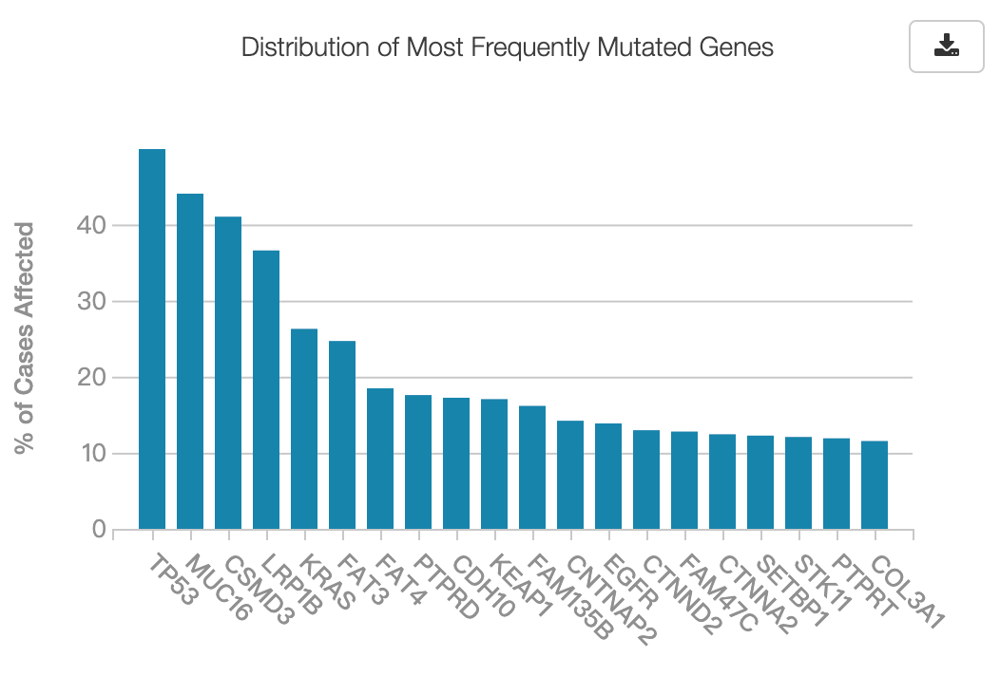
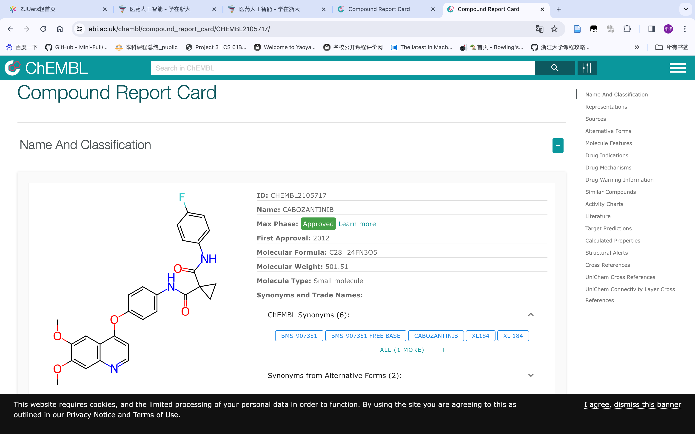
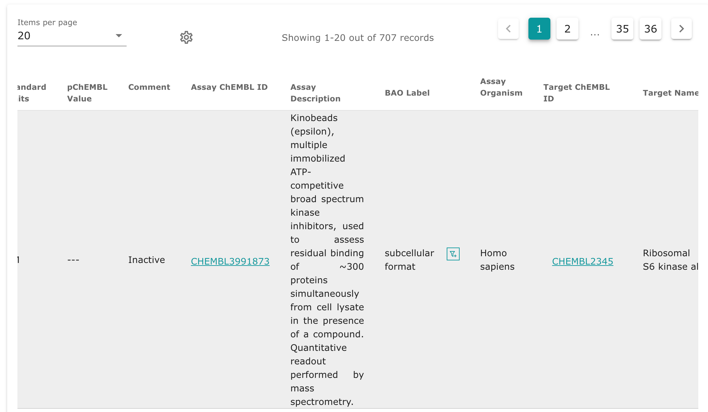

# 课程笔记
## week1
### 药物靶标发现的三个研究阶段
- 可药靶向性分析（认识不充分）
- 功能组学研究（缩小范围）（方法不完善）
- 疗效药物确证（模式不清楚）

## week2 文献检索
### 测序与组学相关的数据库
- [NCBI](https://www.ncbi.nlm.nih.gov/):National Center for Biotechnology Information.
- [EMBL-EBI](https://www.ebi.ac.uk/):European Bioinformatics Institute.
- [TCGA](https://www.cancer.gov/about-nci/organization/ccg/research/structural-genomics/tcga):The Cancer Genome Atlas.

### 化学与活性相关的数据库
- [PubChem](https://pubchem.ncbi.nlm.nih.gov/):PubChem is the world's largest collection of freely accessible chemical information.
- [ChEMBL](https://www.ebi.ac.uk/chembl/):ChEMBL is a manually curated database of bioactive molecules with drug-like properties.
- [ZINC](http://zinc.docking.org/):ZINC is a free database of commercially-available compounds for virtual screening.
- [Binding database](https://www.bindingdb.org/rwd/bind/index.jsp):BindingDB is a public, web-accessible database of measured binding affinities, focusing chiefly on the interactions of protein considered to be drug-targets with small, drug-like molecules.

### 药学相关的数据库
- [DrugBank](https://www.drugbank.ca/):DrugBank is a comprehensive, freely accessible, online database containing information on drugs and drug targets.
- [INTEDE](https://pubmed.ncbi.nlm.nih.gov/33045737/):INTEDE is a database of integrative target and disease evidence.
- [PharmGKB](https://www.pharmgkb.org/):PharmGKB is a resource that provides information about the impact of human genetic variation on drug responses.
- [TTD](http://db.idrblab.net/ttd/):Therapeutic Target Database.
- [VARIDT](http://varidt.idrblab.net/):VARIDT is a database of genomic variations related to drug responses.

### 检索实践
1. 检索肺癌(TCGA-LUAD project)中体细胞突变频率最高的10个基因(genes)和10个突变类型(mutations)

进入网页[CGC Data Portal](https://portal.gdc.cancer.gov/)，上方提示进入新版。此后看到analysis，提示指导你进入Exploration界面：

| | |
|---|---|
|||

2. 在CHEMBL中，挖掘下述化合物的生物活性信息（靶标、针对靶标的活性数值等）

首先在[ChEMBL](https://www.ebi.ac.uk/chembl/)中搜索栏界面下我们可以看到advanced search，点击进入后发现需要你绘制化合物的结构。

这里我想到是否存在基于图像识别的方式自动来绘制化合物的工具，上网搜索后你会发现[stoneMind](https://www.stonemind.org/)，这是一个基于图像识别的化合物结构绘制工具。

**Tips：** 将复制的内容直接粘贴在绘图框中，网站会自动识别！！！ 根据本人亲测，由于mol会包含更多的信息，会比smiles结构更加准确。

之后你便会看到如下界面，在右边侧边栏查看你想寻找的信息。

而对于CHEMBL2105717来说，我们点击下图左边第一个表格，进去后则能看到详细信息。

具体信息如下：（学CS的属实是看不太懂）
