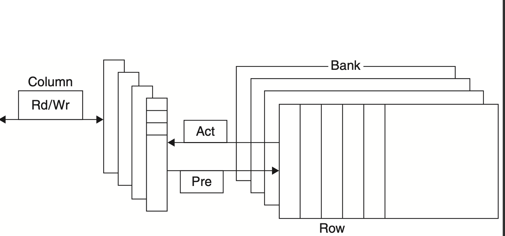
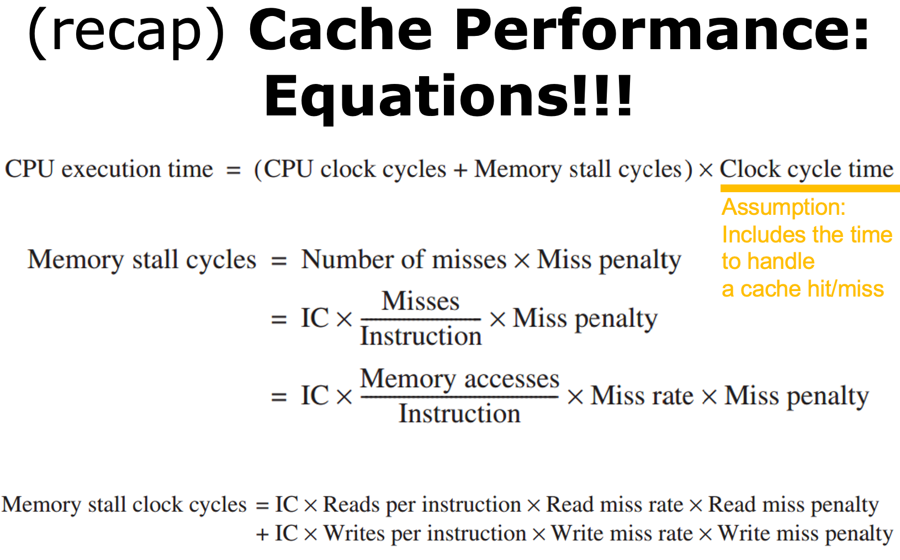
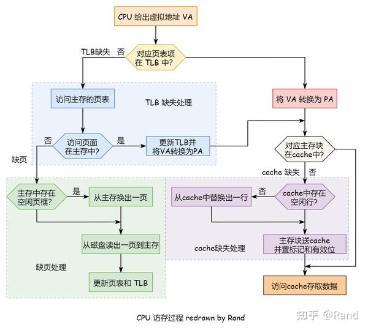
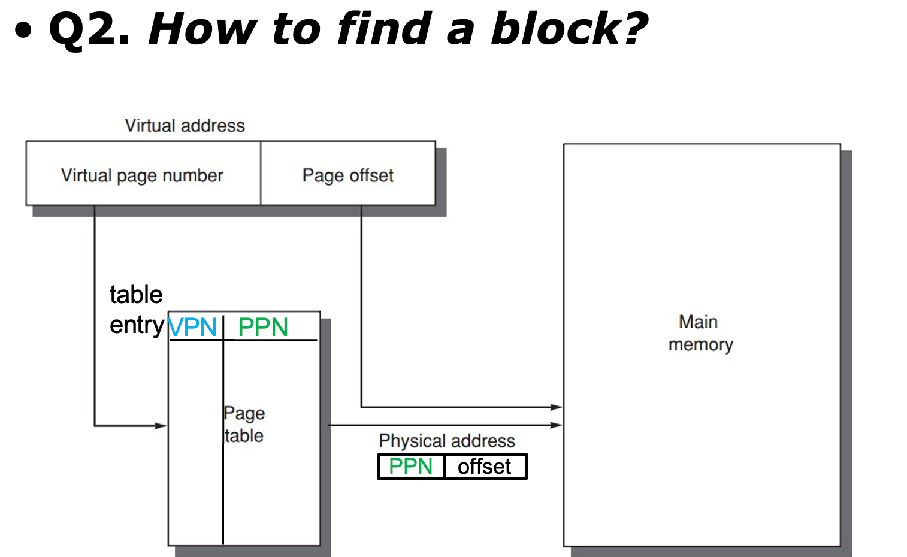
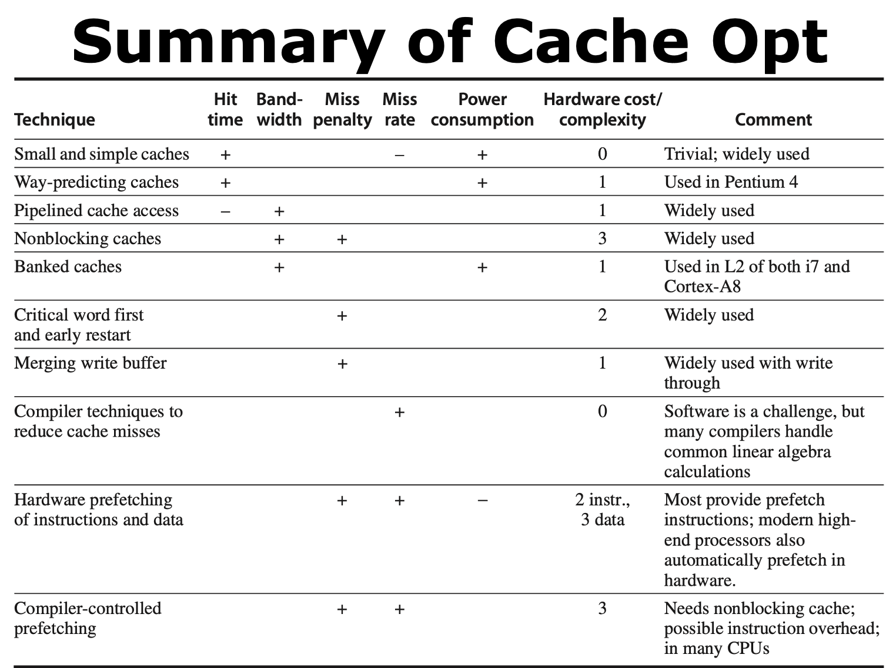
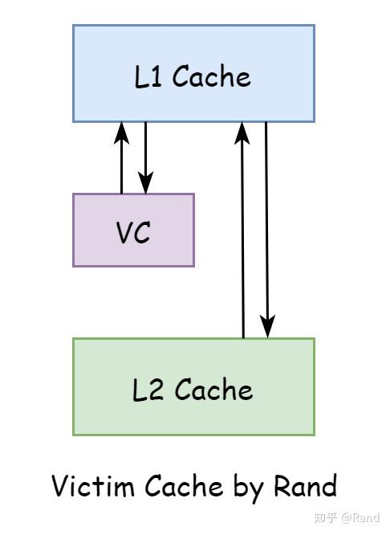
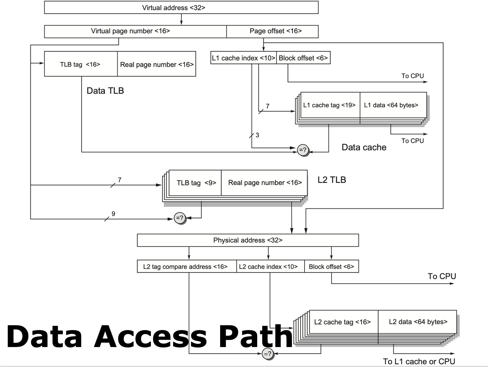

# Memory Hierarchy

## Technology and Optimizations
### Main memory
- Latency:
  - acess time: time to read/write a word
  - cycle time: time between successive accesses
- bandwith: the time to retrieve the rest of the block
  
- SRAM(Static random access memory): Don't need to be refreshed, so access time is very close to cycle time
- DRAM(Dynamic random access memory): DRAMs are commonly sold on small boards called DIMM (dual inline memory modules), typically containing 4 ~ 16 DRAMs

<!-- prettier-ignore-start -->
!!! note "technique"

    === "cache"
    介绍了三种cache技术,具体可以见机组

    === "DRAM"
    具体分为了RAS（行地址选择）和CAS（列地址选择）两个部分
    
<!-- prettier-ignore-end -->

### DRAM improvements
- Timing signals
- Leverage spatial locality
- Clock signals
- SDRAM
- Wider DRAM
- DDR(double data rate) SDRAM
- Multiple banks

## Cache performance

$$
\text{Average hit time} = (1 - \text{miss rate}) \times \text{cache access time} + \text{miss rate} \times \text{miss penalty} \\
= \text{cache access time} + \text{miss rate} \times \text{miss penalty}
$$

### Six basic cache optimizations
- Larger block size
- Bigger cache
- higher associativity
- multilevel caches
- Give priority to read misses
- Avoiding address translation during indexing of the cache

> **Capacity vs Conflict**

<!-- prettier-ignore-start -->
!!! note "cache寻址"
    === "VIVT"
    

    === "PIPT"
    

    === "VIPT"
    
<!-- prettier-ignore-end -->

## Virtual Memory
### Background 4 Questions
- Where to place a block
-  
- Which block to replace upon a virtual memory miss? (**LRU**)
- Which block to replace upon a virtual memory miss? (Write back or write through)

$$
\text{Virtual memory} = \text{main memory} + \text{Secondary storage}
$$

## Ten advanced cache optimizations

- Small and Simple First-Level Caches
- Way Prediction
- Multibanked Caches (Pipelining Access)
- Nonblocking Caches
- Critical Word First
- Merging Write Buffer
- Compiler Optimization
- Hardware Prefetching
- Compiler Prefetching
- HBM

> {: width="50%"}

## Virtual Memory

