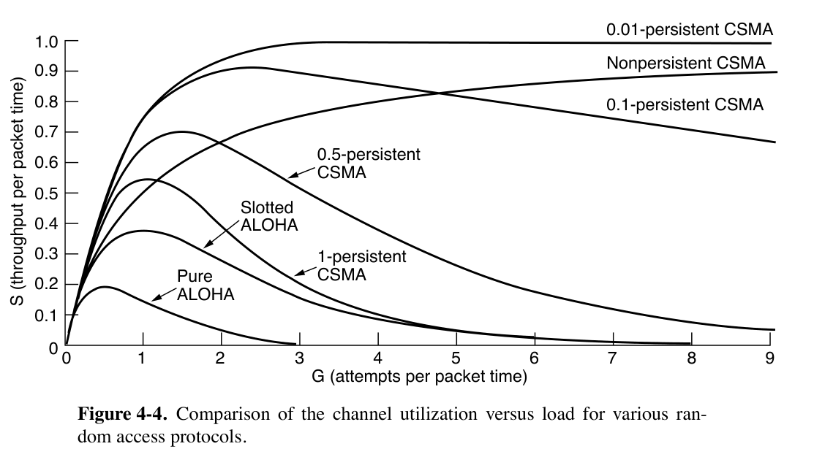
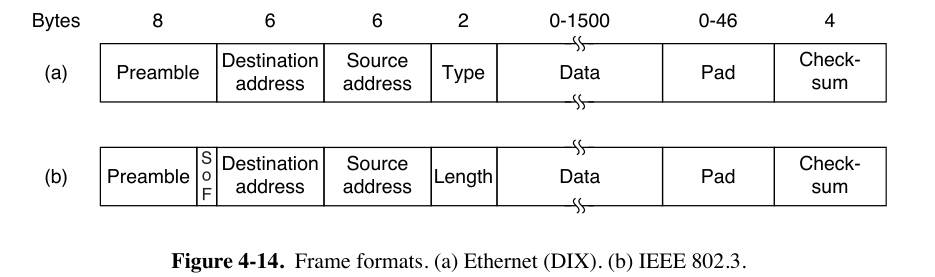
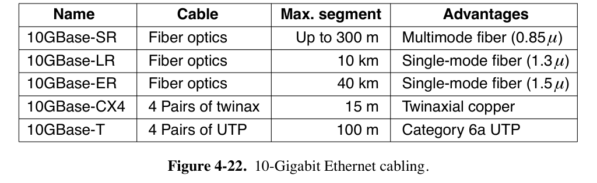
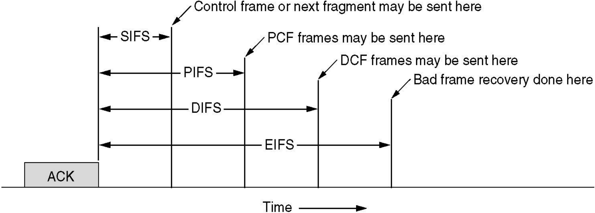
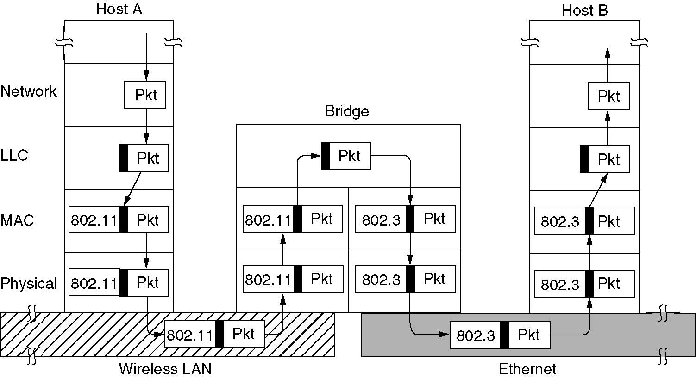

# Chap04 | MAC Sublayer

- Medium Access Control Sublayer（介质访问控制子层）
- 位于数据链路层的底部
- 用于在广播通信介质中，确定谁有权使用该信道（信道控制）

## 4.1 Channel Allocation Problem

- 信道分配的方式：
    - 静态分配：比如物理层中介绍的频分复用，波分复用，码分复用等等。
        - 在处理突发流量时效率低下，会导致频谱浪费或延迟增加
        - 举例：假设帧平均以$\lambda$帧/秒的速率到达，帧的平均长度为$1/\mu$比特。则信道的服务速率为$\mu C$帧/秒，则发送一个帧到容量为$C$bps的信道上的平均延迟时间$T=\frac{1}{\mu C-\lambda}$。
        - 现在将单一信道划分为$N$个独立的子信道，每个子信道的容量为$C/N$bps，每个子信道上的平均输入速率现在为$\lambda/N$。则平均延迟时间$T_N=\frac{1}{\mu (C/N)-(\lambda/N)}=NT$。
    - 动态信道分配：又叫多点接入，特点是信道并非在用户通信的时候固定分配给用户。
        - 5个基本的假设：
            - Independent traffic：N个独立站点（如计算机），每个站点都可以独立产生帧。在帧成功传输之前，站点被阻塞，什么也不能做。
            - Single channel：所有站点共用一个信道。
            - Observable collision：Collision（冲突）的意思是，多个帧同时在同一个信道上传输会在时间上重叠，进而导致信号混乱。所有站点都能检测到冲突的发生。发生冲突的帧必须稍后重新传输。
            - Continuous time / Slotted time：发送的时间可以是连续的；或者，发送的时间要被划分为离散的间隔（称为 slot 时隙），一个时隙可能包含0、1或多个帧，帧传输必须从时隙的开始时刻开始。
            - Carrier Sense / No Carrier Sense：如果有载波监听，则站点可以在尝试使用信道之前判断信道是否正在使用；如果没有载波监听，站点在尝试使用信道之前无法感知信道的状态，它们会直接开始传输，稍后才能确定传输是否成功。
        - 多路传输协议：ALOHA，CSMA等等

## 4.2 Multiple Access Protocols

### 4.2.1 ALOHA

- Pure ALOHA
    - Continuous Time & No Carrier Sense
    - 任何站点在需要传输数据时，无需任何检测就可以直接传输。如果一段时间内没有收到确认，就认为传输过程中产生了冲突，在等待随机时间后重新发送。
    - Throughput（吞吐量）：$S=Ge^{-2G}$ ，其中$G$表示每个帧发送所需的时间内生成的总帧数的平均值（包括新帧和重传帧）。不过，在这段时间内生成帧数的概率服从泊松分布。
    - 最大吞吐量：当$G = 0.5$时，$S = 1/(2e)$，约为0.184。
- Slotted ALOHA：将时间分成离散的slot，各站点只能在slot的开始处开始发帧
    - Slotted Time & No Carrier Sense
    - 一个帧的发送时间应小于等于一个slot的长度
    - Throughput：$S=Ge^{-G}$ 
    - 最大吞吐量：当$G = 1$时，$S = 1/e$，约为0.368，是纯ALOHA的两倍

### 4.2.2 CSMA（Carrier Sense Multiple Access Protocols）

- Carrier Sense

- 特点：在发送数据之前一直监听信道，如果冲突了就等待一段随机的时间之后再试一次

- CSMA在ALOHA基础上添加了一个载波监听装置。分为多种情况：
    - 1-persistant CSMA：
        - 要发送数据时，监听信道
            - 信道空闲则立即发送数据
            - 信道占用则持续监听，直到信道空闲，然后发送帧
        - 如果发生冲突，站点会等待一段随机时间，然后重新开始。
        - 带宽和延迟的乘积越大，信道上能容纳的帧数越大，冲突越容易发生，协议性能越差。
        - 以太网使用 1-persistant CSMA
    - non-persistant CSMA：
        - 要发送数据时，监听信道
            - 信道空闲则立即发送数据
            - 如果信道占用，它会等待一段随机时间，然后重复该算法。
        - 冲突少、信道的利用率高，但是延迟大
    - p-persistant CSMA：
        - 要发送数据时，监听信道
            - 信道空闲，则有一定的概率$p$立即发送数据，有$1-p$的概率推迟到下一个slot，重复判断信道是否空闲
            - 如果信道占用/发生冲突，它会等待一段随机时间，然后重复该算法。
        - IEEE 802.11使用优化后的p-persistant CSMA
    - Nonpersistent CSMA的等待时间过长，1-persistent CSMA很有可能会出现多个站点检测到信道空闲后同时发送的情况，p-persistent是二者的折中。

- CSMA/CD（CSMA with Collision Detection）
    - 在CSMA的基础上，在传输过程也检测冲突。如果冲突则停止数据发送，等待一段随机时间后重新传输。
        - 相比之下，未经改进的CSMA不会在传输过程中检测冲突，即使冲突了也继续发送
        - 如果站点读取的信号与它发出的信号不同，它就知道发生了冲突。
    
    - 假设信号在两个最远站点之间传播的时间为$\tau$ ，则在最坏情况下，一个站点在传输了$2\tau$时间且没有听到冲突之前，无法确定它已经占用了信道。
        - 常见错误结论：一个站点在开始传输后，如果在等于整个电缆传播时间的时间内没有听到冲突，就可以确定它已经占用了电缆。
        - 可以将CSMA/CD的竞争视为一个时隙宽度为$2\tau$的时隙ALOHA系统，不过帧传输时间时间通常远长于传播时间，因而CSMA/CD效率实际高很多。
    
    - 以太网采用这种策略。仅用于总线型/半双工网路环境（不能同时接收和发送），现代全双工网络环境两条信道一个发送一个传输，无需担心冲突。
    

### 4.2.2 Collision-Free & Limited-Contention Protocols（略）

Collision-Free Protocols（包括Token Passing、Binary Countdown）和Limited-Contention Protocols不考，课上也没讲，这里不展开。

### 4.2.3 Wireless LAN Protocols

- WLAN的特点

    - 无线通信系统通常不能检测出正在发生的冲突（站点接收到的信号可能非常微弱）
    - WLAN的站点可能无法给所有其他的站发送帧，也可能无法接受来自所有来自其他站的帧
    - 简化假设：每个无线电发射器都有一各固定的范围，用圆形来表示

- 一个简单的想法是使用CSMA：每个站点监听是否有其他的站点在传输，并且只有当没有其他站在传送数据的时候才进行传输，问题如下图所示：

    

    - 当A发送给B的时候，C在监听，但是监听不到A，因为在距离之外，因此错误地认为C可以向B发送数据，因此B处可能产生冲突。（上图a）
        - 由于竞争者离得太远而导致站点无法检测到潜在的竞争者，这个问题被称为 hidden station problem（隐藏终端问题）
    - B向A传输，同时C想向D传输。如果C检测到了B正在传输，则它不会向D传输，但实际上是可以的。（上图b）
        - 这个问题被称为 exposed terminal problem（暴露终端问题）

- MACA（Multiple Access with Collision Avoidance）

    - 要求发送者广播发送一个RTS信号告知接收者，随后接收者广播一个CTS信号，这样两者附近所有设备都能知道它们之间正在传输，从而避免冲突。RTS（Request To Send）信号帧有30字节，包括源地址、目的地址和通信预期持续时间，CTS（Clear To Send）包括通信预期持续时间。
        - 如果一个站收到了RTS，则应保持一段时间的静默，避免与CTS冲突
        - 如果一个站收到了RTS但是没有收到CTS，则它可以正常传输它的数据，不会造成干扰
        - 如果一个站收到了CTS但是没有收到RTS，则它不能传输数据
        - 如果一个站同时收到了CTS和RTS，则它不能传输数据
    - MACA不能阻止冲突的发生，比如两个发送者同时广播RTS。
    
    

- MACAW（MACA for Wireless）
    - 在数据帧每次传输成功后，引入ACK信号；引入 retransmission 来防止丢帧。

## 4.3 Ethernet IEEE 802.3 标准

- Ethernet（以太网）的分类：
    - Classical Ethernet（经典以太网）
    - Switched Ethernet（交换式以太网）：用Switch（交换机）来连接不同的计算机，目前主要使用的以太网类型
- DIX标准原来是为10 Mbps的以太网设计的，后经修改成为IEEE 802.3标准。
- 信息使用曼彻斯特编码进行传输。
- Unacknowledged Connectionless Service（无确认无连接服务）
    - 不对发送帧编号、不要求接收方发送ACK确认
    - 提供不可靠服务
    - 此处可以参考Chapter 3开头处。

- 以太网可以包含多个Cable Segments（电缆段）和多个Repeaters（中继器）

### 4.3.1 Classic Ethernet MAC Sublayer Protocol

- 802.3的数据帧格式：

    - Preamble（前导码）是8个字节，前7个字节是`10101010`，最后一个字节是`10101011`（称为SOF 帧起始定界符 Start of Frame delimiter）
    - 目标地址和源地址都是6字节的长度
        - 目标地址的第一位是0/1分别表示 ordinary address 和 group address，使用后者传输称为multicast（组播），前者称为 unicast（单播）
        - 目标地址全是1则是 broadcast（广播）
        - 站点源地址为全球唯一，其实就是MAC地址
            - 前3个字节为OUI（组织唯一标识符），由IEEE分配给制造商
            - 制造商分配地址的最后3个字节，并将完整的地址编码到网卡（NIC，又称 Adapter 网络适配器）中
    - 接下来是 Type or Length field（类型或长度字段）
        - 类型代码`0x0800`表示数据包含IPv4数据包。
        - 由于这两种规范混用，有时候分不清这段存的是类型还是长度。因此规定，任何小于或等于`0x600`（1536）的数字都可以解释为长度，任何大于`0x600`的数字都可以解释为类型。
        - 如果当作长度，则只包含 Data 字段的长度而不包含其它，甚至不包含 Padding 部分。
        
    - 数据字段最多可以有1500个字节。
    - 以太网要求从目的地址到checksum（有效帧）的长度至少是64字节，因此需要有0-46字节的填充区
        - 这是为了满足$2\tau$的round-trip delay（往返传播时间）。802.3规定，对于具有最大长度2500米和四个中继器的10 Mbps局域网，这个时间约为50微秒，在10 Mbps时，一个比特需要100纳秒，因此500比特是最小的帧，四舍五入到512bit。
    - Checksum（校验和）一般是4字节（32位）的CRC。

    

- `Binary Exponential Backoff`二进制指数退避算法： 

    - 经典以太网使用1-persistent CSMA/CD算法，但使用二进制指数退避算法确定重试时间间隔。
    - 将slot长度设置为512 bit对应的round-trip delay，即51.2微秒
    - 在第i次的冲突之后，随机等待$0\rightarrow \min (2^i-1, 1023)$ 个slot
    - 在16次冲突后，控制器放弃并报告失败，返回更高层处理。
    - 如果只有少量的站冲突可以确保比较低的延迟，但是冲突的站点比较多的时候也可以保证一个合理的时间来解决冲突
    
- 以太网的传输介质（书上不全，从王道补充）

- 以太网的信道效率（略，太复杂了，虽然也有考的可能）
    - 用帧长度 $F$、网络带宽 $B$、电缆长度$L$ 和信号传播速度$c$表示，对于每帧$e$个竞争slot的最佳情况下，信道效率$=\frac{1}{1+2BLe/cF}$

### 4.3.2 Switched Ethernet

- 交换式以太网
- 传统以太网的第一步改进：用Hub（集线器）简单地将所有连接的电缆电连接在一起，在逻辑上等同于经典以太网的单一长电缆。
    - 在一个Hub下，连接的所有设备处于同一个collision domain下。

- Switch（交换机）：每个端口独立，帧只转发到目的端口，无冲突，性能更高。
    - 全双工时，多个站点和端口可同时发送帧；半双工时，需使用CSMA/CD。
        - 由于两个帧可能同时发送到同一个输出端口，交换机必须有缓冲区

    - 在交换机中，每个端口都是其自己的collision domain。
    - 例题：考虑8口Hub与8口Switch
        - Hub：当B$\rightarrow$C时，所有其他计算机不能同时发送。如果网络总带宽为10Mbps，平均每台节点机的最高带宽为：$10/8=1.25$Mbps。
        - Switch：当B$\rightarrow$C时，同时可以进行：D$\rightarrow$A，E$\rightarrow$G，H$\rightarrow$F。网络总带宽为$10\times 4=40$Mbps，平均每台节点机的最高带宽为：$10/2=5$Mbps。当网卡及交换机都是全双工设备时，平均每台节点机的最高带宽为：$5\times 2=10$Mbps。

### 4.3.3 Fast Ethernet 802.3u

- 100Mbps
- 使用点对点链路，同时支持全双工与半双工
- 快速以太网基于双绞线布线，主要有三种实现方式：100Base-T4、100Base-TX 和 100Base-FX。
    - 100Base-T4 使用 Category 3 UTP（3类双绞线），内含4 twisted pairs。
        - 本身是设计为半双工操作的，但是同时使用3对线进行发送和1对线进行接收，实现类似全双工的效果。
        - 采用8B6T的编码方案，将8位的数据编码成6位的信号级别。
        - 使用三电平脉冲幅度调制（PAM-3）来编码数据，即3进制编码。
        - 时钟频率为25MHz。总共有$3^3=27$种信号模式，但只采用其中16种，因此1时钟周期发送4bit，传输速度为100Mbps。
        - 平均下来，每对线实际上提供33.3Mbps的数据传输能力。
        - 最大距离100m。
    - 100Base-TX 使用 Category 5 UTP（5类双绞线），信号速度为 125 MHz，采用纯 4B/5B 编码，支持Full Duplex at 100Mbps，最大距离100m。
    - 100Base-FX 使用 2 strands of multimode fiber（多模光纤），支持100Mbps全双工，最大距离2 km。
    
    

### 4.3.4 Gigabit Ethernet 802.3z/802.3ab

- 同时支持全双工与半双工
    - 全双工（默认采用）：Buffered Central Switch, no contention, no CSMA/CD
    - 半双工：Hub, Collisions possible, CSMA/CD required
- 引入两个特征来增加半径：
    - Carrier extension（载波扩展）：告诉硬件在正常帧后添加自己的填充，将帧扩展到 512 字节。
    - Frame bursting（帧突发技术）：发送方在一次传输中发送多个帧的串联序列。如果总突发小于 512 字节，硬件会再次填充它。
- 8B/10B 编码，将 8 位数据编码为 10 位码字。使用 NRZ 发送编码。
- 布线类型
    - Fiber optics
        - 8B/10B 编码 & NRZ
        - 1000Base-SX：用LED实现 0.85 微米的短波长信号。multimode fiber，最大传输距离 550m。
        - 1000Base-LX：用激光器实现 1.3 微米的长波长信号。single（10 微米）或multimode fiber，最大传输距离 5 km。
    - 1000Base-CX：2 pairs of STP（Shielded Twisted Pair），25m。
    - 1000Base-T 使用 Category 5 UTP，传输速率 1Gbps，传输距离100m。
        - 所有四对双绞线同时用于双向传输，通过数字信号处理分离信号。
        - 每根电线上使用 5 voltage levels 携带 2 bit 信息，信号传输速率为 125 Msymbols/sec。
            -  为了实现从bit到voltage levels的转换，引入data scrambling（混淆）用于过渡，以及an error correcting code in which 4 values are embedded into 5 signal levels
    
    
- 引入flow control（流量控制），通过发送特殊的 PAUSE 控制帧（类型为 0x8808），接收方可以暂停数据接收，避免缓冲区溢出。
- 引入Jumbo Frames，减少帧率，降低与帧处理相关的开销

### 4.3.5 10 Gigabit Ethernet

- 只支持full-duplex，不再需要CSMA/CD
- Fiber Optics：有3种类型（见下图）
    - 64B/66B 编码 
- 10GBase-CX4: 4 pairs twinaxial copper wire，8B/10B encoding，3.125Gsymbol/sec，最大距离15m
- 10GBase-T: Category 6a UTP（也可以使用Cat 5，只是传输距离会变短），4 pairs twisted pair，最大距离100m
    - 双向2500Mbps传输：800 Msymbols/sec + 16 voltage levels + data scrambling + LDPC（Low Density Parity Check）error correction

## 4.4 Wireless LANs 802.11

- 802.11的两种模式
    - Infrastructure Mode（基础设施模式）：每个客户端都与一个AP（Access Point，接入点）关联，该接入点又通过称为distribution system的有线网络连接到其他网络。客户端通过AP发送和接收数据包。
    - ad hoc network（自治网络）：客户端相互关联，可以直接发送帧，没有AP。

- 802.11协议栈：
    - 物理层：与OSI物理层对应。
    - 数据链路层：分为MAC子层（决定信道分配）和LLC子层（隐藏不同802变体的差异）。

### 4.4.1 Physical Layer Protocol

- 主要讨论 Spread Spectrum Methods（扩频）

- 所有802.11技术都在2.4GHz或者5GHz的ISM频段传输信号

- Infrared：可以理解为电视机遥控器的红外传输，diffused transmission（散射）

- FHSS（Frequency Hopping Spread Spectrum，跳频）书上没讲

    - 整个系统按照预定的跳频序列在多个频率点之间快速切换。

- 802.11b：2.4 GHz频段的1或2 Mbps的DSSS（Direct Dequence Spread Spectrum，直接序列扩频），支持11 Mbps的速率

    | 传输速率 | 调制方法                                                     | chip transmission rate |
    | -------- | ------------------------------------------------------------ | ---------------------- |
    | 1Mbps    | Barker Sequence + BPSK modulation = 1 bit per 11 chips       | 11 Mchips/s            |
    | 2Mbps    | Barker Sequence + QPSK modulation = 2 bit per 11 chips       | 11 Mchips/s            |
    | 5.5Mbps  | CCK（Complementary Code Keying，互补码键控）= 4 bit per 8 chips | 11 Mchips/s            |
    | 11Mbps   | CCK = 8 bit per 8 chips                                      | 11 Mchips/s            |

- 802.11a/g：使用5 GHz频段，速率6-54 Mbps。

    - 基于OFDM（正交频分复用），该技术可以减少 wireless signal degradations
        - 不同频率的子载波之间是正交的：每个子载波的中心频率间隔设置为符号速率的倒数，即$\Delta f=1/T_s$，其中$T_s$是一个符号的时间长度。这样，当一个子载波在一个符号周期内完成一个完整的周期变化时，其他所有子载波在这个周期内的积分值为零。
    - Binary Convolutional Code（前面说不讲来着）
    - 比特在52个子载波上并行发送，其中48个用于数据传输，4个用于同步。每个符号持续4µs，发送1、2、4或6位。

- 802.11g：使用2.4 GHz频段和OFDM

- 802.11n：多天线速度提升

    - 40 MHz channel，allowing a group of frames to be sent together
    - 使用MIMO（Multiple Input Multiple Output）分离不同天线的4个信息流
    - 理论可达 100Mbps

- 802.11ac：使用5 GHz频段，被大多数现代移动设备使用

    - 80 MHz & 120 MHz channel，256-QAM调制、MU-MIMO（多用户MIMO），8个信息流
    - 理论可达 7 Gbps

- 802.11ad：60 GHz频段

- 802.11ax（WiFi 6）：引入OFDMA和1024-QAM，提升频谱效率和数据速率，支持智能调度

### 4.4.2 MAC Sublayer Protocol

避免碰撞：CSMA/CA（CSMA with Collision Avoidance）但也不能完全避免冲突

- 物理信道感知
- 使用ARQ（链路层确认/重传），收到对方确认帧之后才能继续发送下一帧
    - 属于可靠传输协议

- 实现DCF（Distributed Coordination Function，分布式协调功能）
    - 标准还包括PCF（Point Coordination Function，点协调功能）
        - AP控制其单元中的所有活动
        - PCF不常用，因为通常没有办法阻止附近网络中的站点发送竞争流量。
- 算法流程
    - 如果站点最初有数据要发送（而不是发送失败重传），且信道空闲，则再等待DIFS后发送整个数据帧
    - 否则执行CSMA/CA算法，随机选择一个退避值，进行倒计时，对退避值进行自减操作。
        - 一旦检测到信道忙，倒计时就暂停
        - 信道空闲，则倒计时继续
    - 退避值自减到0，此时信道一定空闲，发送整个帧并等待ACK确认
    - 发送站收到ACK确认后，如果需要继续发帧，则执行CSMA/CA算法，随机选择一个退避值，重新进行倒计时
    - 如果发送站再一定时间内未收到ACK，则需重传该帧，再次使用CSMA/CA争用信道，直到收到ACK或者因尝试次数过多主动放弃发送

站点传输范围不同（hidden terminal problem）

- 具体问题：

    - hidden station problem：A和C都在B的范围内，但A和C不在彼此的范围内，导致A和C同时向B发送数据时发生碰撞

    - exposed station problem：B想要向C发送数据，但听到A正在向D发送数据，错误地认为不能发送

    - half duplex：无线设备无法在同一频率上同时进行传输和监听冲突

- 同时使用物理信道感知和虚拟载波监听。
- Virtual Channel Sensing（虚拟载波监听）：
    - 每个站点通过感知NAV（Network Allocation Vector）来自行估计信道会被占用的时间
        - 每个帧携带一个NAV字段，说明该帧所属的序列完成所需的时间
        - 听到此帧的站点在这段时间内都停止发送，实际上未监听信道，但效果上像是在监听
        - 这样做的原因也跟无线网络不稳定有关
    - 可选的RTS/CTS机制使用NAV
        - 源站在RTS帧中说明所需占用信道的时间，从RTS发送完毕，到目的站最后发送完ACK
        - 目的站（AP）在CTS帧中说明所需占用信道的时间，从CTS发送完毕，到目的站最后发送完ACK
        - 听到RTS/CTS的站点均可以根据帧中声明的时间估计会被占用的时间
        - RTS帧在传出的时候使用物理信道感知和CSMA/CA算法

802.11的其它配套机制

- 传输不稳定，频繁需要重传：
    - 降低传输速率
    - 发送更短的帧
        - Fragment Burst：将一个帧分为多个片，连续传输。
        - 减少从网络层接受的消息的最大大小
- Power-save Mode（省电模式）
    - AP 周期性广播 Beacon（信标帧）
        - 向客户端通告AP的存在，并携带系统参数，如AP的标识符、时间、下一次信标的时间和安全设置
        - 客户端可以在发送给AP的帧中设置一个功率管理位，表示它要进入省电模式，告诉AP缓冲发送给它的流量
            - 客户端会在收到每个信标时从省电模式中唤醒，并检查作为信标一部分发送的流量映射。
            - 该映射告诉客户端是否有缓冲的流量。如果有，客户端会向AP发送一个轮询消息，AP随后发送缓冲的流量。
            - 然后客户端可以回到省电模式，直到下一次信标发送。
    - APSD（自动省电交付）
        - AP缓冲帧并在客户端向AP发送帧后立即将其发送给客户端
- 让VoIP流量优先于点对点流量
    - 引入IFS（InterFrame Space，帧间间隔）
        - 任何站点在介质空闲DIFS后都可以尝试获取信道以发送新帧
            - 发生碰撞则二进制指数退避
        - SIFS：发送ACK、RTS、CTS、fragment burst需要等待这么长时间。
        - AIFS1用于高优先级流量，AIFS4用于低优先级流量。
        - EIFS：仅由刚刚接收到错误或未知帧的站点使用，以报告问题。
            - 由于接收到错误的站点可能不知道问题的具体情况，它应该等待一段时间以避免干扰两个站点之间的正在进行对话。
    - TXOP（传输机会）
        - 每个站点获得相等的时间片，而不是相等的帧数，防止拉低发送速率快的站点的速率

!!! info "差异"

    lkj的PPT上采取了一种与第6版教材不同的方式，将PCF/DCF与IFS混合在了一起。
    
    PCF采用轮询：基站（称为AP）通过一个信标（Beacon）挨个站询问要不要发，没被问到的站不能发数据
    
    - PCF 无碰撞
    - 电力管理：告知一个站点进入休眠状态
    PCF 与 DCF 共存：
    - 所有站点在完成发送后，必须等待并监听信道是否空闲一段时间才能发送下一帧，这段时间称为IFS（InterFrame Space，帧间间隔），分为如下四种：
    	- SIFS（Short InterFrame Spacing）：最短，由ACK帧、CTS帧、分片后的数据帧、AP探寻回复帧使用
    	- PIFS（PCF InterFrame Spacing）：中等长度，用于切换到PCF
    	- DIFS（DCF InterFrame Spacing）：更长，用于发送RTS帧切换到DCF
    	- EIFS（Extended InterFrame Spacing）：最长，用于报告坏帧
    
    通过这些IFS，PCF与DCF之间可以平滑切换，有效解决PCF中AP突然挂掉之类的情况。
    
    

### 4.4.3 802.11 Frame Structure

802.11有三种帧：Data，Control，Management

- Data Frame：
    - Frame Control Field
        - Version设置为00
        - Type区分Data/Control/Mamagement Frame，常规数据帧设置为10
        - Subtype区分RTS/CTS等，常规数据帧设置为0000
        - To DS和From DS位用于指示帧是去往还是来自与AP连接的网络
        - More fragments位表示后续还有更多片段。
        - Retry位标记帧是先前发送的帧的重传。
        - Power management位表示发送方正在进入省电模式。
        - More data位表示发送方有更多帧要发送给接收方。
        - Protected Frame位表示帧体已加密以确保安全
        - Order位告诉接收方，更高层的应用期望帧严格按顺序到达。
    - Duration Field：表示帧将占用信道，以及它将占用信道的时间，以微秒为单位
        - 它存在于所有类型的帧中，包括Control Frames
        - 站点用这个段来管理NAV机制。
    - Address Fields：3个依次表示接收方、发送方、帧最终要送到的地址
    - Sequence Field：对帧进行编号，以便检测重复帧。
        - 4位用来标识 Fragment，12位携带一个随着每次新传输而递增的编号
    - Data Field：0-2132字节
        - 该有效载荷的前几个字节采用称为LLC（逻辑链路控制）的格式。
            - LLC层用于识别有效载荷应该传递给何种高层协议（如IP）
    - Frame Check Sequence：32位CRC
- Management Frame格式与Data Frame相同，Data Field则因子类型（如Beacon）而异
- Control Frame较短
    - 包含Frame Control、Duration 和Frame Check Sequence
    - 可能只有一个Address，没有Data Field
    - 关键信息通过Subtype Field传递

### 4.4.4 802.11 Services

- Association：移动站点使用此服务连接到AP
    - 使用信标帧或者直接询问AP，了解AP的情况
        - 处理支持的数据速率、QoS 等，还包括可以视为网络名称的 SSID（服务集标识符）.
        - SSID 可能不会在信标帧中广播，这种情况下站点需要设法获取SSID才能与SP关联。
    - 站点发送请求以与AP关联；AP可以接受或拒绝该请求。
- Disassociation：站点或基站提出解除关联
- Reassociation：站点从一个基站移动到另一个基站时使用
    - 不提供 delivery guarantees。
- Distribution：在帧到达AP后，决定如何为帧路由（即将帧转发到目的站点）
- Integration：将802.11帧转换为非802.11目标网络的格式（如将WLAN连接到互联网）
- Data Delivery：以best-effort way transmit和receive数据，不保证可靠。
    - 802.11的核心

- Authentication：站点被在允许发送数据之前需要先认证。
    - 如果某802.11网络是开放的则任何人都可以使用，否则需要用凭据来认证。
    - WPA2（802.11i）：AP可以与具有用户名和密码数据库的认证服务器通信，以确定是否允许站点访问网络。或者可以配置pre-shared key（网络密码）。
        - WPA的前身是WEP（已被破解）
    - 802.1X：实现了 port-based authentication，依赖于 centralized authentication。
        - 依赖于EAP认证框架
- Privacy：在使用WPA2的无线网络中加密信息，使用AES
- QoS Traffic Scheduling：QoS流量调度服务
    - 处理不同优先级的流量（如优先处理语音和视频）
- Transmit Power Control：发射功率控制服务
- Dynamic Frequency Selection：动态频率选择服务

## 4.5 Data Link Layer Switching

王道说现在网桥已经被交换机淘汰了，但是教材上还有，还得学

Ethernet Switch（以太网交换机，参考上面Switched Ethernet部分）是Bridge（网桥/桥接器）的现代称呼。

- 超越Classical Ethernet和Hub（集线器）的功能
- 我们可以将一个Physical LANs（物理局域网）视为多个逻辑局域网，称为虚拟局域网（VLAN，Virtual LANs）
- 本章混用Bridges和Switches两个术语
- 不检查帧的有效字段，检查Data Link Layer Addresses用于转发

我们想要实现一种被称为Transparent Bridge（透明网桥）的设备

- 无需配置即可使用
- 站点不能区分局域网有没有使用透明网桥
- 网桥可以连接不同类型的电缆，沟通不同类型的协议
- 网桥可以作为新站点连接其它Bridge、Hub以及站点

### 4.5.1 Basic Operations of Bridges

Promiscuous Mode（混杂模式）：网桥接受连接到其每个端口的站点传输的每个帧

进一步地，

- 如果发送与接收的站点连在网桥的同一端口上，网桥应该知道无需转发，立即丢弃
- 如果需要跨网桥传输，应该转发到对应的端口上。

简单实现：Hash Table（转发表）

- 存储已知可能的目标的MAC地址及其对应的端口信息。
- 网桥初始化后，Hash Table均为空，此时使用Flooding Algorithm（洪泛算法）：
    - 当透明网桥接收到一个未知目的MAC地址的数据帧时，将该数据帧复制并发送到除了接收该帧的那个端口以外的所有其他端口 
- 与此同时，进行Backward Learning（向后学习）：当网桥接收到一个数据帧时，它会检查源MAC地址，并将其与接收到该帧的端口号一起记录到哈希表中。
    - 下次接收到发往该MAC地址的信息的时候，直接在哈希表里面寻找目的地MAC地址所在的端口，从而有效地转发数据帧。
    
- Dynamic Topologies的对策：记录表中每个源地址的帧的到达时间（老化时间），定期清除过期条目，适应拓扑变化。

    - 如果一台机器安静了几分钟，发往它的任何流量都必须泛洪，直到它再次发送帧。

- 总结：

    1. 如果Hash Table中记录的，与帧中的目标地址对应的端口与源端口相同，则丢弃该帧。
    2. 如果目标地址对应的端口与源端口不同，则将帧转发到目标端口。
    3. 如果目标地址对应的端口未知，则使用泛洪算法，将帧发送到除源端口之外的所有端口。
    4. 目的地址为广播地址，则进行广播。

- 网桥内部对帧的操作：

    

### 4.5.2 Spanning-Tree Bridges（IEEE 802.1D）

在一对网桥中设置两条并行链路会导致在拓扑中创建环路，对于各网桥来说目的地MAC地址未被Hash Table记录的的洪泛帧可能被无限转发（Broadcast Storm，广播风暴）

- 解决方法：网桥之间需要相互通讯，自动创建一个Spanning Tree（生成树）拓扑代替存在环路的拓扑。
    - 从每个站点到其他每个站点都恰好有一条路径
    - spanning-tree algorithm（IEEE 802.1D）
        - 选举根桥（Root Bridge）：所有交换机在启动后，会发送BPDU（Bridge Protocol Data Unit）消息，其中包含自己的桥ID（通常是优先级加上MAC地址）。拥有最低桥ID的交换机会被选为根桥。
        - 确定根端口（Root Port）：非根桥上的每个交换机都会按照hop（跳数）选择一条到达根桥的最短路径，这条路径上的端口被称为根端口。如果不同路径距离均最短，则选择ID更小的线路。
            - 网桥将其到根的距离记录在 Configuration Message 中。
        - 网桥关闭那些不在最短路径上的端口，以避免环路。
            - 下面两个具体实现并未在教材上展开，作为补充
                - 选择指定端口（Designated Port）：每个交换机对于每一个网段或链路，会选择一个指定端口，该端口负责转发数据到该网段。通常，距离根桥最近的那个端口会被选为指定端口。
                - 阻塞其他端口：除了根端口和指定端口之外的端口将被置于阻塞状态，以防止环路形成。
        - 如果最短路径上有 bridge 或者 LAN 挂掉，则重新计算。

### 4.5.3 Devices

- Repeater（中继器）
    - 不理解帧、数据包或头部，仅amplify signal（放大信号）。
- Hub（集线器）
    - 具有多个输入线路，任何一条线路上到达的帧都会被发送到其他所有线路。
    - 不会amplify signal，连接多条线路
- Bridge（网桥/桥接器）
    - 端口相互隔离。输入线路可能以不同的速度运行，甚至可能是不同类型的网络（如不同种类的以太网）
        - 桥接不同种类的网络存在诸多问题，下面几条也有描述。
    - 如果帧进入的速度比重新传输速度快，桥接器可能会耗尽缓冲空间并开始丢弃帧
    - 帧格式转换耗时、存在内存损坏导致检测不出错误的可能性
    - 不同协议最大帧长度不同，太大而无法转发的帧会被丢弃（不够transparent）
    - 802.11有链路层加密功能和服务质量特性（如优先级），而以太网没有
- Switch（交换机）
    - 现代意义上的网桥
- Router（路由器）
    - 看不到帧地址
    - 根据数据包（即上图中的Packet）头部（Packet Header，包含如IPv4或IPv6等形式的地址）选择输出线路
- Transport Gateways（传输网关）
    - 连接使用不同面向连接传输协议的两台计算机（如TCP/IP与SCTP）
- Application Gateways（应用网关）
    - 理解数据的格式和内容，并能将消息从一种格式翻译成另一种（如互联网消息到SMS短信）

---

- Collision Domain（冲突域）：一组设备之间可能发生数据包碰撞（即冲突）的区域。在这些设备中，任何两个设备同时尝试发送数据时，都会导致数据包相互干扰。
    - 一个集线器所连接的所有设备构成一个冲突域。
    - 网桥所连接的每个网段独自构成一个冲突域。
    - 使用交换机时，每个端口连接的设备独自构成一个冲突域。

- Broadcast Domian（广播域）：某个设备或者端口发送一个广播帧，能到达的计算机和端口的集合。不同的局域网是独立的广播域。

!!! tip "举例"

    - 1个24口Switch（每口通过Hub连10个电脑）没划分VLAN，只有1个广播域，但有24个冲突域（每端口是1个）；如果该交换机收到一个广播帧，会被该交换机转发到240台电脑。
    - 如果该交换机划成4个VLAN（每VLAN含6个端口），就有4个广播域，但有24个冲突域，如果该交换机收到一个广播帧，会被该交换机转发同一VLAN的其他5个端口的电脑。

### 4.5.4 Virtual LANs

- 需要在 physical LAN 上建立VLAN的原因：

    - Security：隔离不同网络，避免 promiscuous mode（混杂模式）

    - Load：不同网络之间带宽使用强度不同，VLAN可以隔离不同网络之间的带宽

    - Broadcast Storm：多个计算机的广播帧在信道中累积，占用带宽。因此要用VLAN分为多个广播域。

- VLAN（虚拟局域网）基于支持VLAN的交换机

- 在VLAN建立前，需要在网桥中设置configuration tables（配置表）。配置表负责区分每个端口或者网线可以连接的VLAN。
- 一个来自ID为$x$的VLAN的包在到达某网桥时，**在所有标为ID为$x$的端口间转发**。
- 一个端口可能可以连接多个VLAN。

### 4.5.5 IEEE 802.1Q

- 背景
    - VLAN字段实际上只由网桥和交换机使用，而不是用户机器。只需要它们存在于桥梁之间的线路中，而不一定非要出现在通往终端站的线路上。
    - 要使用VLAN，网桥必须是VLAN aware的（支持VLAN感知功能）。
- 第一个接触帧的VLAN aware的网桥在帧上添加VLAN相关fields，最后一个则会移除这些fields。
- 802.1Q一般要求一个端口上的所有机器必须属于同一个VLAN。
    - 不过，网桥也可以根据更高层的协议（如IP包/PPP帧）分配选择VLAN ID。
    - 也可以用MAC地址选择VLAN ID，不过802.1Q不支持。
- 802.1Q帧格式
    - 相比于802.3增加了2个2字节字段
        - VLAN protocol ID：它的值总是0x8100。
            - 因为这个数值大于1500，所有以太网卡都会将其解释为类型而非长度。
        - 第二字段
            - VLAN identifier（VLAN ID）：低12bit
            - Priority Field（Pri，优先级字段）：3bit，实际上与VLAN无关
            - CFI（Canonical format indicator，规范格式指示符）：1bit，与VLAN无关
                - 表示有效载荷包含一个802.5帧，希望在通过以太网传输期间找到另一个802.5局域网作为目的地

- Switch 中的 VLAN forward table需要记录以下内容：VLAN ID, MAC address, port number, time.
- VLAN table 可以手动配置，也可以由 bridge 和 switch 自动配置。