# Chap05 | Network Layer

## 5.1 Network Layer Design Issues

- 网络层是处理end-to-end transmission（端到端传输）的最底层
    - 数据链路层只关心帧在 wire 上的传输
    - 主要研究数据包在路由器之间的转发过程
- 网络层必须知道网络的 topology（拓扑结构，即所有 routers 和 links 的集合），并选择适当的路径进行传输。
- 网络层向传输层提供的服务
    1. 服务应独立于路由器技术。
    2. 传输层应不受现有路由器的数量、类型和拓扑结构的影响。
    3. 提供给传输层的网络地址应使用 uniform numbering plan（统一的编号方案），即使在局域网（LAN）和广域网（WAN）之间也是如此。
- 路由器的任务
    - Forwarding: To handle each incoming packet, look up the route table, then forward to a output line.
    - Filling and updating the route table.
- 网络层有提供 Connection-oriented Service 和 Connectionless Service 两种实现
    - Connectionless Service
        - end-to-end（端到端）
        - 只提供SEND PACKET和RECEIVE PACKET两个基本操作
        - 网络层不进行 packet ordering（数据包排序）和flow control（流量控制）
            - 主机自行进行 error control（error detection & correction）以及flow control
        - 在这里，packets（数据包）被称为 datagrams（数据报），网络被称为 datagram network（数据报网络）
        - 不需要advanced setup
        - 举例：IP 协议
    - Connection-oriented Service
        - 必须在发送任何数据包之前，建立从源路由器到目的路由器的路径
            - 预先建立的连接称为 Virtual Circuit（VC，虚拟电路）
        - 举例：ATM、MPLS（多协议标签交换）

### 5.1.1 Connectionless Service

- 每个路由器通过Routing table（路由表）决定如何将数据包向目标路由器的方向传递
    - 路由表可以在运行过程中随时被路由器修改
    - 举例：从A到F发送四个数据包
        - 发送前三个时，路由器根据路由表，决定通过C发送
        - 发送第四个之前，路由器处于某些决策改变了路由表，决定通过B发送
            - 这个决策算法称为Routing algorithm（路由算法）

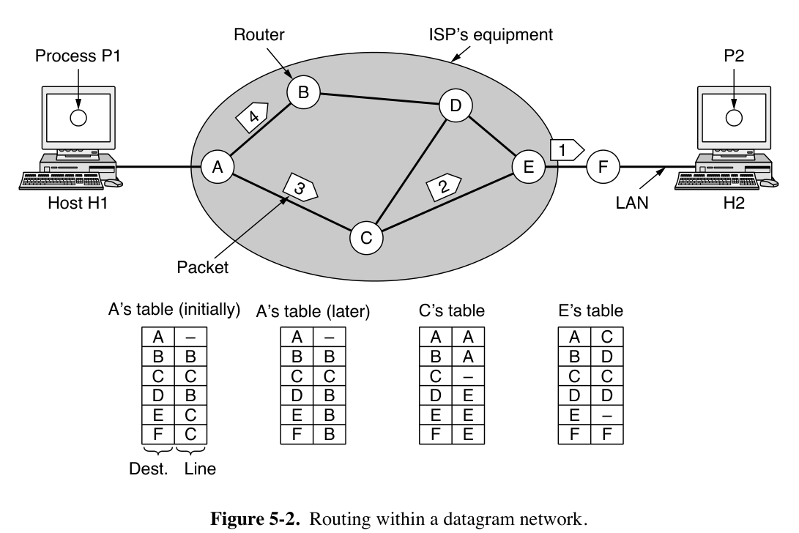

### 5.1.2 Connection-oriented Service

- 每个数据包携带一个 connection identifier（连接标识符），指示它属于哪个虚拟电路
    - 路由器需要能够替换 outgoing packages（出站数据包）中连接标识符，以方便后续路由器区分数据包所属VC

## 5.2 Routing Algorithms

- 算法目标：correctness、simplicity、robustness、stability、fairness and optimality
    - stability: converge quickly（快速收敛）
        - 收敛指的是每个路由器对最佳路径的学习过程
    - fairness & optimality 有时相互矛盾
- 路由算法的分类
    - Nonadaptive algorithms（非自适应算法）：决策不受当前 topology 和 traffic 变化的影响
        - 又称 static routing
    - Adaptive algorithms（自适应算法）：决策随着当前 topology（有时还包括 traffic）的变化而调整
        - 又称 dynamic routing

- The Optimality Principle（最优性原理）
    - 如果路由器J位于从路由器I到路由器K的最优路径上，那么从J到K的最优路径应该是I到K路径的一部分
    - 推论：从所有源到给定目的地的最优路径的集合一定会形成一棵以目的地为根的树（即sink tree 汇聚树）
        - 汇聚树可以不唯一，汇聚树的并集构成有向无环图（DAG，Directed Acyclic Graph）
        - 依赖于一个Assumption：paths do not interfere with each other

### 5.2.1 Shortest Path Algorithm

- 测量路径长度的方法可以包括 number of hops（跳数）、物理距离、mean delay（平均延迟）等
    - 可以生成一个权重函数
- Dijkstra 算法
    - 这里不展开了，可以[回忆一下FDS](https://ziji-cs.github.io/T-FundamentalDataStructure/9-x.html#dijkstras-algorithmfor-weighted-shortest-paths)

### 5.2.2 Flooding（洪泛）

- 每个传入路由器的数据包都会在除了到达线路之外的所有传出线路上发送
- 避免产生指数级重复数据包的措施
    - Hop counter in packet header（跳数计数器）
        - 每跳一次计数器减一，当计数器达到零时丢弃该数据包
        - 计数器初始化为从源到目的地的路径长度，或者the full diameter of the network（直径）
    - Sequence Number（序列号）
        - 源路由器在从其主机接收到的每个数据包中放入一个序列号
        - 每个路由器需要为每个源路由器保存一个列表，记录从它哪里收过哪些序列号
        - 可以用一个计数器k，如果数据包序列号小于k，则认为已经洪泛过
- 洪泛的延迟最短（如果不考虑操作本身对流量的挤占的话）

### 5.2.3 Distance Vector Routing（RIP）

- 即RIP（Routing Information Protocol）或者 Bellman-Ford Routing Algorithm
- 每个路由器维护一个routing table（路由表），即 vector
    - 按路由器索引
    - 每个路由器一个entry
        1. 以这个路由器为目的地的 preferred outgoing line
        2. 到该目的地的最小距离估计（estimate of the distance to that destination）
            - 标准可以是 hop number，也可以是其它
            - 如果用传播延迟，路由器使用特殊ECHO数据包来测量延迟
- 算法流程（以传播延迟为例）
    - 每隔T毫秒，每个路由器与每个邻居交换一个列表，其中列出它对到每个目的地的延迟的估计。
    - 假如说$d_x(y)$表示从节点$x$到节点$y$的最小距离估计，现在让节点$x$与所有相邻节点$v$交换distance vector，则$d_x(y)$取各个$v$节点的$d_v(y)+c(x,v)$中的最小值，其中$c(x,v)$表示二者之间的直连距离（这里表现为从$x$到$v$的延迟）。
    - 同时与多个邻居交换数据
    - 注意，计算过程中**不使用**自身存储的上一周期计算的路由表

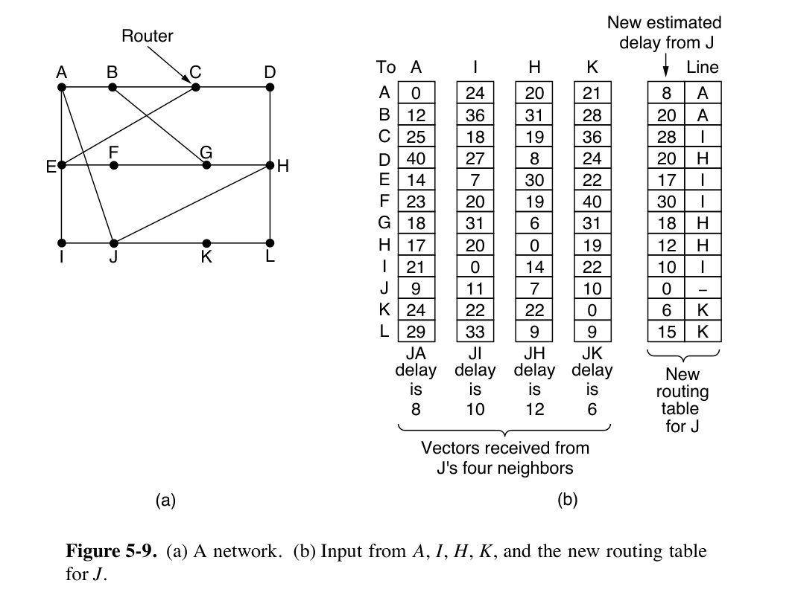

- Count-to-infinity Problem
    - RIP converges slowly，好消息传得快，坏消息传得慢
    - 举例来说，考虑下图的线性网络，以hop number为
        - 假设最初A处于关闭状态，则其它路由器均将它们到A的距离记为无穷大
        - 假设此时打开A，则与A距离为$N$跳的路由器可以在$N$次交换时间内更新到A的距离
        - 假设此时关闭A，则B在下次交换时，听不到A的信息，则$d_A(A)+c(B,A)=\infin$；然后从C知道C到A的距离$d_C(A)=2$，则B将自己到A的距离更新为$\min(\infin, d_C(A)+c(B,C))=3$。
            - C在下次交换时，发现周围B和D到A的距离都是3，则它将自己到A的距离更新为4。
            - 经过很久，所有路由器中到A的距离才能回到无穷大。

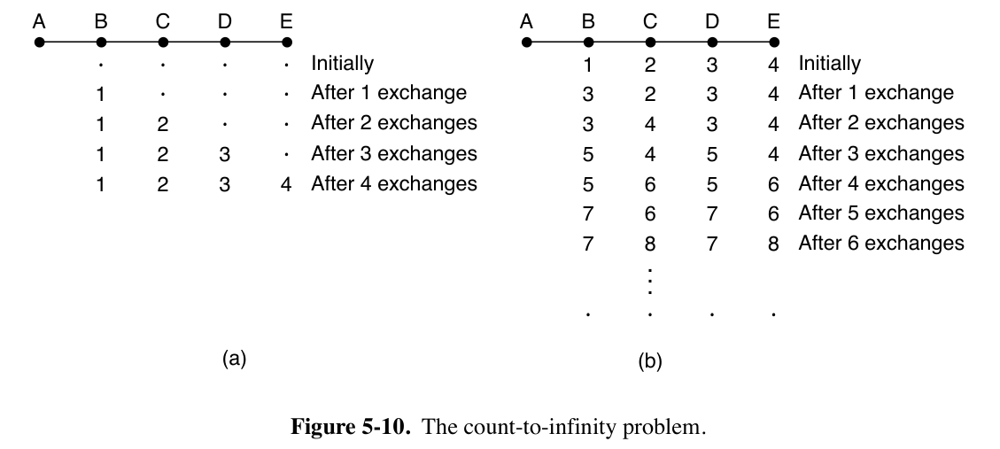

- Distance Vector Routing 的缺点
    - Take too long to converge
    - Not taking bandwidth into account

### 5.2.4 Link State Routing

- 举例：IS-IS和OSPF。区别是IS-IS可以同时携带多个网络层协议的信息（例如，IP和AppleTalk），而OSPF不会。

- 操作方法

    1. 发现其邻居并学习它们的 network addresses。

        - 路由器启动时，向每个相邻的路由器发送特殊的HELLO数据包

        - 每个相邻的路由器发送一个回复，其中包含它的全局唯一名称

        - 如果多个路由器通过 broadcast link（如交换机、环网或经典以太网）连接，将这些局域网本身视为一个节点。（见下图）

            

    2. 设置到每个邻居的距离或 cost metric（成本度量）。

        - 每个路由器到每个邻居的成本。可以自动设置也可以管理员手动设置
            - 举例：成本与链路带宽成反比
            - 举例：链路延迟
                - 测量方法：在链路上发送特殊的ECHO数据包，要求链路立即发送回来，将往返时间除以二作为延迟的估计时间

    3. 构建一个包含刚才学习到的信息的数据包（link state package）。

        - 数据包包含 sender identity（发送者身份）、sequence number、age、neighbor list including costs
        - 构建数据包时机：可以以固定时间间隔构建，或者在发生特定事件（邻居状态变化或者本身属性变化）时构建。OSPF采用后者。

        

    4. 向所有其他路由器 distribute（分发）此数据包，接收来自其它路由器的包。

        - 基本分发方法：flooding
            - 每个数据包包含一个 sequence number（序列号），每次发送新数据包时递增
            - 路由器会跟踪它们看到的所有（源路由器，序列号）对
                - 如果到达的数据包的序列号低于迄今为止看到的最高序列号，则视为过时并丢弃
            - 这个算法有诸多问题。
                1. 序列号溢出
                    - 解决方法：32位序列号，用不完
                2. 路由器崩溃会丢失其对序列号的跟踪
                3. 序列号传输过程中可能因包损坏而损坏
            - 解决方法：每个数据包中包含一个age，每秒递减。
                - 路由器中记录的某个路由器的age变为0时，这一entry失效。
                - 在initial flooding过程中，每个路由器也会递减age。
        - 改进：收到数据包后不立即转发，先在 packet buffer 中暂存片刻

            - 如果收到了来自同一源的数据包，则取序列号更低的
            - 所有link state package都需要acknowledge
        - 举例：上图中的B路由器

            - 对于它的三个邻居ACF，每个邻居都有一个对应的send和ACK位。
                - send位表示这一条的数据包需要转发给这一位为1的邻居
                - ACK位表示需要向这一位为1的邻居确认
                - 如果原始数据包仍在缓冲区时，有重复的数据包到达，则需要更改标志位
                - 举例：来自E的数据包到达了两次，一次通过EAB，一次通过EFB。因此，它只需要发送到C，但必须向A和F确认。

            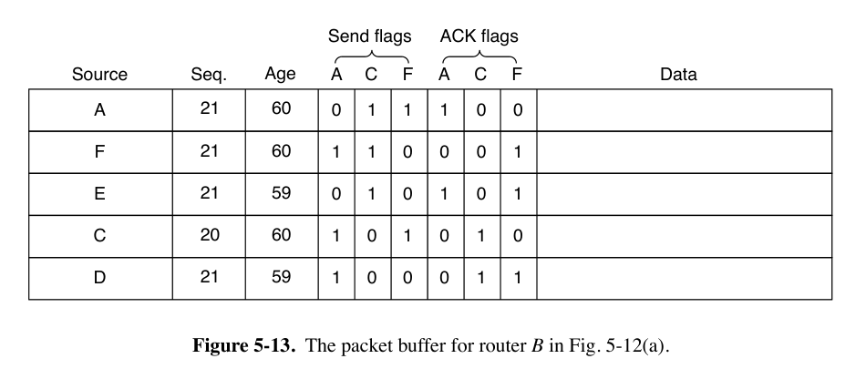

    5. 计算到其它每个路由器的最短路径。

        - 完整的拓扑结构被分发到每个服务器（甚至一条边的信息重复两次），每个服务器自己运行 Dijkstra 算法

### 5.2.5 Hierarchical Routing

- 为了避免路由表过大，将大规模网络分成几个区域，每个路由器记录它到区域的距离。
- 路由器无需了解其它网络结构的拓扑结构。
- 代价是部分情况下，选择的链路的路程可能更长，如下图中1A到5C最近是走region 2，但实际走region 3。

## 5.3 Traffic Management

- Congestion（拥塞）的意思是，如果网络中某个部分的数据包过多，会导致数据包延迟和丢失，从而降低性能。网络层与传输层共同负责它的处理。
    - 传输层中，用congestion control来指代拥塞的处理
    - 网络层中，我们讨论的是congestion management（或称 traffic management）
    - 注意congestion control、traffic management 和 flow control 之间的区别。
        - flow control 关心的是一对发送方与接收方之间的流量，保证发送方不会以接收方无法处理的速度传输数据。
        - congestion management & control 确保网络能够承载各部分产生的流量。涉及一整个网络中，所有主机和路由器的行为。
- 拥塞的具体表现是，如果路由器处理速度不足，内部缓冲区被填满，导致数据包丢失。
- 还有一种原因是，由于延迟较大，部分路由器没收到确认，会大量重传

5.3.2 居然不考，那不学了。

## 5.4 Quality of Service（QoS）

QoS四指标：bandwidth, delay, jitter, and loss

- jitter（抖动）指的是延迟或数据包到达时间的变化（即标准差）

Overprovisioning（过度配置）：构建一个具有足够容量的网络，以应对任何流量。成本过高。

互联网目前有两种服务质量版本：集成服务（Integrated Services）和区分服务（Differentiated Services）。

5.4.3-5.4.5 简单考，先跳过了。

## 5.5 Internetworking

IP协议提供了一种通用的数据包格式，所有路由器都能识别，并且几乎可以在任何网络中传递。

注意 routing 与 switching（bridging）存在本质区别，后者只需要基于MAC地址传输帧，前者则还需要从数据包中提取网络地址。

能够处理多种网络协议的路由器称为多协议路由器（multiprotocol router）。它必须要么转换协议，要么为更高协议层留出连接。这两种方法都不完全令人满意。

路由器无法在不同网络（network）之间转换数据包，如IPv4与IPv6的不兼容问题。

连通不同的网络非常困难，只有一种特殊情况容易解决：源主机和目标主机位于相同类型的网络上，只是中间隔着一个不同的网络。

- 举例来说，从IPv6过IPv4到IPv6，只需要用上面提到的多协议路由器将IPv6数据包装进IPv4数据包中，后面再用多协议路由器去掉IPv4数据包，露出IPv6数据包来传输。

Internetwork Routing（Routing Across Multiple Networks）：跨网络进行路由

- 采用两级路由算法。
    - 在网络内部，使用 intradomain or interior gateway protocol（域内或内部网关协议）进行路由，采用的可能是前面提到的 link state routing
        - 这个过程称为 intradomain routing
        - 域内路由协议也称为IGP（Interior Gateway Protocol 内部网关协议）
    - 在组成互联网的网络之间，使用 interdomain or exterior gateway protocol（域间或外部网关协议）。不同网络之间必须使用同样的域间网络协议。
        - 这个过程称为 interdomain routing
        - 互联网中，域间路由协议称为BGP（Border Gateway Protocol 边界网关协议）

每个网络层协议或者链路层协议都对数据包的大小由一定的限制。

- 传输尽可能大的数据包可以减小主机开销，但是源主机不知道数据包会经过哪些网络，也就不知道要采用多小的数据包。

- 一种解决方法是，采取这些网络中最小的数据包。

    - 这个数据包大小称为路径最大传输单元（path MTU，Path Maximum Transmission Unit）

    - 即使源主机在发送时知道 Path MTU，网络的路由也可能发生变化，从而改变数据包会经过的网络。

    - 现代互联网采用这个方法，称为 path MTU discovery。

        - IP数据包头部指示不允许分片。
        - 如果路由器接收到一个太大的数据包，它会生成一个错误数据包，将其返回给源，并丢弃该数据包。
        - 当源接收到错误数据包时，它使用其中的信息将数据包重新分片为路由器可以处理的小片段。
        - 如果路径上的另一个路由器的MTU更小，重复进行这个过程。
        - 除了路由变化问题，这个方案本身会增加 startup delay（或者说，需要尝试很多次才能真正开始发送）。

        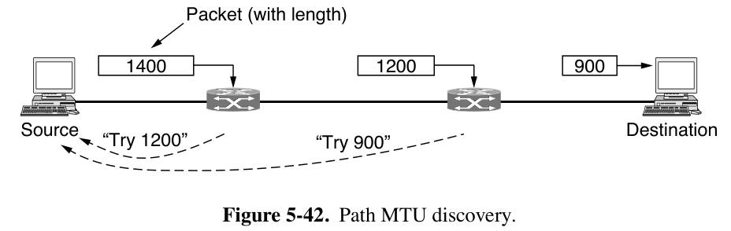

- 另一种解决方法是，路由器将数据包分解成 fragment（片段），将每个片段作为单独的网络层数据包发送。

    - 策略1，transparent fragmentation（透明分片）：数据包的分片操作对后续网络透明。

        - 过大的数据包到达路由器G1时，G1将其分解，分解产生的每个片段都指向同一个出口路由器G2，在G2将片段重新组合。
        - 问题
            - 由于必须经过一个指定的路由器，routing过程受到限制。
            - 路由器需要缓冲到达的片段，并在未接收到所有片段时决定何时丢弃它们
            - 数据包可能被反复分片和重复组装

    - 策略2，非透明分片：避免在中间路由器上重新组合片段，只在目的地主机上进行重新组装。

        - 被IP采用

            - 为每个片段提供一个 packet number（在所有数据包上携带）、fragment offset（数据包内的绝对字节偏移量）以及一个end of packet flag（用于标记这个片段是不是这个 packet 的最后一个）。

        - 优点

            - 路由器负担低
            - 可以多次分片
            - 可以分片段重传
            - 可以是任意大小

        - 问题

            - 开销高于透明分片，因为每个片段都有一份数据包头，但数据包头在link layer传输时不一定用得到。
            - 分片对性能影响过大：如果丢失了任何一个片段，整个数据包都会丢失，需要重传。

            

## 5.6 SDN（Software-Defined Networking）

SDN的核心概念是 control plane 和 data plane 各自独立运行。

- Control plane 运行在软件中，选择路由并决定如何处理转发流量。
- Data plane 负责实际执行数据包查找并决定如何处理它们。

- Control plane 通常是一个 single, logically centralized program。

    - SDN control logic（controllers）负责 compute the paths through the network 和 update resulting forwarding tables
    - 协议举例：
        - 直接控制每个路由器选择的路由：RCP（Routing Control Platform）和 Ethane。
        - OpenFlow
            - 向一个内存写入match-action table（匹配-动作表），可以让交换机对拥有符合某些条件的所有数据包头字段的执行同样的操作
            - 通过单一的集中式软件程序控制网络，允许跨网络设备和转发元素进行协调
            - 通过单一的高级编程语言表达控制
        - 在cellular networks中：CORD
- Data Plane: Programmable Hardware

    - protocol-independent switch architecture：网络接口卡（NIC）和交换机中可编程硬件使得从数据包格式到转发行为的一切都可以定制。

        - 该架构中包含一组 processing pipeline（处理流水线）
        - Forwarding Model 称为 RMT（Reconfigurable Match Tables，可重构匹配表）：
        
            - 流水线的每个阶段都可以从数据包头中读取信息，根据简单的算术操作修改头中的值，并将这些值写回数据包。
            - 允许自定义数据包头格式/修改任意头字段。
            - 可以指定任意大小的多个匹配表。
            
            - 模型允许改进，如实现INT（In-band Network Telemetry），可以携带网络本身状态的信息，如 network path 中每跳的延迟。

## 5.7 The Network Layer in the Internet

IP（Internet Protocol）将整个互联网连接起来。互联网中的通信工作方式如下：

- 传输层接收数据流并将其拆分，以便它们可以作为IP数据包发送。
    - 理论上每个数据包最大可达64 KB，但实际上通常不超过1500字节，使其能被放入以太网帧中
- IP路由器通过互联网转发每个数据包。
- 在目的地，网络层将数据交给传输层，传输层将其交给接收进程。
- 当所有数据包最终到达目的地机器时，网络层将它们重新组装成原始的 datagram（数据报）
- 数据报被交给传输层

互联网可以被视为一组互联的networks或者AS（Autonomous Systems，自治系统）

- 存在几个主要的骨干网络，最大的称为Tier 1 Networks（一级网络）
    - 连接到骨干网络的有ISP（Internet Service Providers，互联网服务提供商）、data centers 和 colocation facilities（托管设施）、regional networks（区域网络）等
        - 连接到区域网络的有更多ISPs以及LANs（局域网）

### 5.7.1 IPv4 Protocol

IPv4数据报由header（头部）和data（数据部分，也叫 payload 有效载荷）组成

- IPv4协议的数据报头部有20字节的定长部分和一个可选的长度可变（0-40字节）的部分（Options）

- Version字段的高位先传输（big-endian，与Intel x86等小端机器不同）

- 数据报头部的组成

    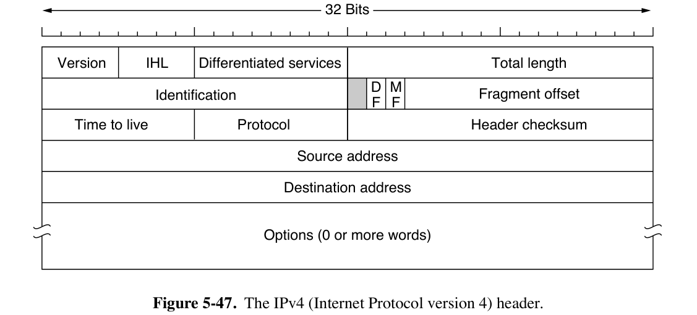

    - Version 字段（4 bit）由于是IPv4，所以值为4

    - IHL 字段（4 bit）指示头部的长度，以32bit word为单位，最小值为5（即没有Options的情况），最大值为15。

    - Differentiated services 字段（8 bit）

        - 早期被称为 Type of service，区分不同类型的服务（语音/文件等），但是没有实际使用
            - 3位用于信号优先级，3位用于指示主机是否关心延迟、吞吐量和可靠性
        - 现在前6位用于标记数据包的service class，包括 expedited & assured services（见教材5.4.5，先前跳过了），表示不同的QoS。
        - 后2位用于携带explicit congestion notification information（显式拥塞通知信息），例如数据包是否经历了拥塞。

    - Total length 字段（16 bit）描述数据报的总长，包括头部和数据字段，最大为65535字节

    - Identification 字段（16 bit）：用于标记 fragment 属于哪个数据包，一个数据包的所有片段的该字段的值相同。（参考上文“非透明分片”部分）

    - 1 bit未被使用

    - DF（1 bit）代表Don’t Fragment（不分片）（参考上文path MTU discovery）。

        - 为0表示可以分片，为1表示不允许分片。

    - MF（1 bit）代表More Fragments（更多片段）。

        - 使用非透明传输时，最后一个片段的这一位设为0，其余片段设为1。
    
    - Fragment offset 字段（13 bit）表示当前片段的数据在数据包中地址的绝对偏移量
    
        - 除数据报中的最后一个片段外，所有片段的大小必须是8字节的倍数
        - 该字段的单位是8字节。相比之下，Total length 字段的单位仍然是1字节
        - 每个数据报最多可以有8192个片段

    - TTL（Time to live）字段（8 bit）是一个用于限制数据包生命周期的计数器

        - 设计时认为应以秒为单位，每跳以及在路由器 buffer 中 queue 时，值应递减
        - 实际表示跳数，到 0 时，数据包被丢弃，并向源主机发送一个 warning 数据包。
    
    - Protocol 字段（8 bit）指示网络层组装数据包结束后，应该交给哪个传输层进程处理（如TCP/UDP）。
    
    - Header Checksum字段（16 bit）为校验和。
    
        - 算法：将头部以16bit为单位相加，使用补码算术，然后取结果的补码。
        - 在计算这个算法的时候，假设Header Checksum字段为0。
        - 每跳时需要重新计算
    
    - Source address 和 Destination address 字段（各32 bit）指示源和目标的network interfaces的IP地址。
    
    - Options 字段填充为4字节（32 bit）的倍数。协议设计时，定义了下面五个选项。
    
        - Security option 指示信息的保密程度，实际上不被使用
        - Strict source routing option 提供了从源到目的地的完整路径，作为一系列IP地址。数据报必须遵循这条确切的路径。
            - 对于系统管理员在路由表损坏时发送紧急数据包，或进行时序或性能测量非常有用
        - Loose source routing option 要求数据包按指定顺序遍历指定的路由器列表，但允许在途中经过其他路由器。
        - Record route option 要求路径上的每个路由器将其IP地址附加到Options字段中，现在由于数据包会经过太多路由器，option 字段的40字节已经不够用了。
        - Timestamp option 类似于 Record route option，只是每个路由器除了记录其32位IP地址外，还记录一个32位时间戳。此选项也主要用于网络测量。
    
        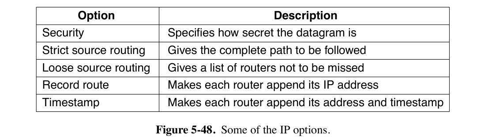
    

### 5.7.2 IPv4 Address

IPv4协议中的IP地址是一个**32位的地址**，互联网上的每一台主机和路由器都有一个IP地址，用于数据包中的Source address和Destination address字段。

- 需要注意的是，IP地址实际上并不指代主机，而是指代network interface（网络接口）。

    - 如果一个主机连接到两个网络，它必须有两个IP地址
    - 路由器有多个接口，因此有多个IP地址

- IP地址以 dotted decimal notation（点分十进制表示法）书写。

    - 4个字节中的每一个都以十进制形式书写，范围从0到255。
    - 例如，32位十六进制地址80D00297被写为128.208.2.151。

- Prefix（前缀）

    - IP地址是分层的，每个32位地址由顶部的高位比特中的可变长度网络部分和底部的低位比特中的主机部分组成。
    - 单个网络（如以太网LAN）上的所有主机的网络部分相同。
    - 一个网络对应于一个连续的IP address space（地址空间），这个地址空间块称为前缀。
    - 前缀通过将块中最低IP地址和块的大小结合起来来表示。
        - 如果128.208.2.151所在的这个网络为IP地址中的网络部分保留24位，则它被写为128.208.2.0/24。
        - 如果前缀通过`/24`或者`255.255.255.0`的方式（也就是仅通过其长度）描述，则称为子网掩码。
            - 子网掩码与IP地址按位与运算可以提取出IP地址的网络部分。
    - 分层地址的优点：路由器可以按地址的网络部分转发数据包，只有当数据包到达它们所指向的网络时，它们才会被转发到正确的主机。
    - 分层地址的缺点：
        - 需要额外的设置（mobile IP等）来支持在网络之间移动但希望保持相同IP地址的主机。
        - 分层结构会浪费地址（部分地址分配但未使用）。

- Subnet（子网）

    - Network number（网络号码）由一个名为ICANN的非营利性公司管理，以避免冲突。

    - 基于前缀的路由要求网络中的所有主机具有相同的Network number

    - subnetting（子网划分）：一个地址空间块可以被拆分为多个部分，作为多个网络来使用

        - 划分网络而产生的网络（如以太网LAN）称为subnet（子网）
        - 拆分不需要每个子地址块大小均匀，但拆成的地址块之间不能有重叠。
        - 在外部网络中，子网划分是不可见的。也因此，子网划分可以在以后更改。

    - 连接外部与各子网的主路由器只需存储各子网的掩码和前缀。

        - 将数据包的目的IP地址，与各掩码作按位与操作，并与存储的前缀比较，就能知道应该转发到哪个子网。

    - 下面是一个大学网络给各院系分配子网前缀的案例

        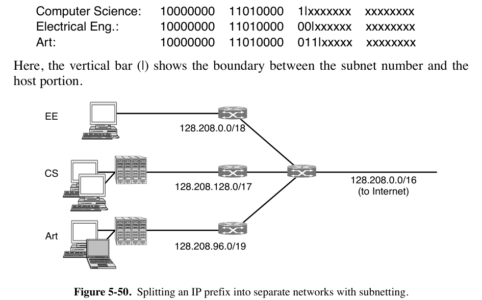

- CIDR（Classless InterDomain Routing，无类别域间路由）

    - default-free zone 中的骨干网路由器的路由表规模非常大；路由算法要求路由器与邻居交换地址信息，路由表太大导致每次交换需要处理大量信息

    - route aggregation（路由聚合）：路由器将给定的IP地址视为属于不同大小的前缀，将多个小前缀合并为一个更大的前缀。

    - 前缀允许重叠。数据包被发送到最具体的路由方向，即匹配最长前缀、IP地址最少的路由。

    - CIDR工作算法如下：

        - 当数据包进入时，路由表被扫描以确定目的地是否在前缀内。
        - 可能会有多个不同前缀长度的条目匹配，此时优先检查前缀最长的条目。
            - 如果`/20`掩码和`/24`掩码都匹配，则先使用`/24`条目来查找数据包的发出方向，找不到再用这个`/20`掩码。

    - 举例：

        

        - 假如说这个例子中的 Available 块后来被分配给了旧金山，则`192.24.0.0/19`这个前缀被定向到伦敦，`194.24.12.0/22`这个前缀被定向到旧金山。
    
- classful addressing（有类别地址分配）

    - CIDB的前身

    - 在1993年之前，IP地址被分为下图中列出的五类。

        

        - 这里的ABC三类地址格式用于network分配。例如B类地址可以分给$2^{14}$个网络，每个网络下有$2^{16}$个主机。
        - D类地址在互联网中用于多播。
        - E类地址被预留。

    - 特殊含义的地址

        - IP地址0.0.0.0（最低地址）在主机启动时使用。它表示“本网络”或“本主机”。
        - 网络号为0的IP地址指的是当前网络。这些地址允许机器在不了解其编号的情况下引用自己的网络（但它们必须知道网络掩码，不然不知道网络号有几位）。
        - 由全1组成的地址，即255.255.255.255（最高地址），用于表示指定网络上的所有主机。它允许在本地网络上进行广播，通常是LAN。
        - 所有形式为127.xx.yy.zz的地址都保留用于环回测试。发送到该地址的数据包不会放到线路上；它们在本地处理并被视为传入数据包。

- NAT（Network Address Translation，网络地址转换）

    - 节省IP地址的一种方式是动态分配，但是现在很多计算机全天开机。
    - 使用NAT时，ISP为一个network分配少量的IP地址，在这个network内部，每台计算机被分配唯一的一个IP地址。
        - 在数据包离开network并前往ISP之前，进行地址转换，将唯一的内部IP地址转换为共享的公共IP地址。
        - network内部分配的IP地址不能出现在互联网上，否则会引起混淆。
    - NAT box 将发回network的数据包中的公共IP地址替换为内部IP地址的方法：
        - 利用数据包内层的TCP和UDP端口。
            - 每个传出的TCP消息都包含源端口和目标端口。这些端口共同用于识别使用连接的两端进程。
        - 每当传出数据包进入NAT时，network内部的源地址被替换为公共IP地址。此外，TCP源端口字段被替换为NAT盒的65,536个条目转换表中的索引。该表的每条entry包含内部原始IP地址和原始源端口。
            - 必须替换源端口，因为内部的不同主机可能都恰好使用端口5000
            - 数据包传入NAT盒时，从TCP头中提取目标端口，以这个目标端口为索引查找并提取内部IP地址和原始TCP端口，并插入到数据包中，然后重新计算并插入IP和TCP校验和，再将数据包转发到内部network中。
    - NAT带来的问题：
        - 违反了IP的结构模型，即一台机器对应一个IP
        - NAT打破了端到端的连接模型：在发送传出数据包之前，无法接受传入数据包。需要引入 NAT traversal 相关 techniques 才能解决这一问题。
        - NAT将互联网从无连接网络变成了面向连接的网络：如果NAT box崩溃、映射表丢失，所有TCP连接都丢失
        - 违反了最基本的协议分层规则
        - 互联网上的进程并不一定只使用TCP和UDP

### 5.7.3 IPv6

IPv6与IPv4不兼容，但它与其他辅助互联网协议（包括TCP、UDP、ICMP、IGMP、OSPF、BGP和DNS）兼容，只需对更长的地址进行少量修改。其相对IPv4的改进如下：

1. 128 bit 地址，几乎无限
2. 简化头部为7字段
3. 不常使用的字段变为可选，路由器可以跳过无关选项
4. 安全性：隐私和认证
5. 改善QoS

- Main IPv6 Header

    

    - Version 字段对于IPv6始终为6

    - Differentiated services 字段（最初称为Traffic class）用于区分具有不同实时交付要求的数据包的服务类别。该字段与IPv4相比变化不大。

        - 用于区分service architecture以实现QoS。
        - 低阶2位用于信号显式拥塞指示。

    - Flow label 字段：用于形成 pseudo-connection（伪链接）

        - flow（流）尝试融合 datagram network 的灵活性和VC对数据传输的保障
        - 例如，一个 stream of packets 可能具有严格的延迟要求，因此需要预留带宽。可以预先设置流并为其分配 identifier。当带有非零 Flow label 的数据包出现时，所有路由器都可以在内置表中查找，以查看它需要何种特殊处理。
        - 每个流由源地址、目的地址和 flow number 指定.
        - flow label会通过某种hash随机选择

    - Payload length 字段指示在40字节头部之后有多少字节。

        - 注意，这个字段的名称与IPv4的Total length不同，意味着头部不在计入长度。

    - Next header 字段指示当前头部之后是哪一个（目前有六个）扩展头部。如果这是最后一个IP头部，Next header 字段指示将数据包传递给哪个传输协议处理程序（例如，TCP、UDP）。

    - Hop limit 字段用于防止数据包永远存在，与IPv4中的Time to live字段相同，也是在每跳时递减的字段。

    - Source address 和 Destination address 字段

        - IPv6 16字节地址的表示方法：八个四位hexadecimal数字组，组之间用冒号分隔。
            - 组内的前导零可以省略
            - 16位零组可以用一对冒号替换
            - `8000:0000:0000:0000:0123:4567:89AB:CDEF`变为`8000::123:4567:89AB:CDEF`
        - IPv4地址可以写为一对冒号和一个旧的点分十进制数，例如：`::192.31.20.46`

    - 对比：

        - IHL字段消失

        - Protocol字段被移除（被Next header替代）

        - 与分片相关的字段都被移除

            - 采用 path MTU discovery

        - Checksum字段消失

            - 数据链路层和传输层通常有自己的校验和

        - 路由器必须能够转发的最小数据包大小已从576字节提高到1280字节，以允许1024字节的数据和许多头部。

            > 注：并没有在书中找到关于这个576字节的说法

- Extension Headers

    - 目前有六种
        
	    
	- 所有Extension Header的结构大致如下：
	    - 开头一个 8 bit Next header 字段，指示下一个头部的类型
	    - 然后是一个 8 bit Payload Length 字段，指示逐跳头部的长度（以字节为单位），不包括强制性的前8个字节
	    - 一些头部具有固定格式；其他头部包含数量可变的长度可变的 options。
	        - 每个 option 编码为一个 TLV 元组`Type-Length-Value`。
	        - Type 是一个1字节字段，指示这个元组是哪个 option。
	            - Type 的前 2 bit 告诉不知道如何处理该选项的路由器该怎么做。选择包括：跳过该选项；丢弃数据包；丢弃数据包并发送回一个ICMP数据包；丢弃数据包但不发送ICMP数据包给多播地址（以防止一个坏的多播数据包生成数百万个ICMP报告）。
	        - Length 也是一个 1 字节字段，指示 Value 字段的长度（0-255字节）。
	    
	- Hop-by-hop options header
	    - 用于所有沿路径的路由器都必须检查的信息
	    - 支持超过64 KB的数据报。
	    - 当使用它时，固定头部中的Payload length字段设置为0。
	    - 接下来的2个字节指示此 option 定义数据报大小（code 194），并且大小是一个4字节数字。
	    - 最后4个字节给出数据报的大小。
	    - 使用此头部扩展的数据报称为巨型数据报（jumbograms）
	        - 小于65,536字节的大小是不允许的，并且会导致第一个路由器丢弃数据包并发送回一个ICMP错误消息。
	        
	        
	    
	- Destination options header
	    - 用于存储仅需要在目标主机上解析的字段
	    - 暂无功能，预留
	    
	- Routing options header
	
	    - 列出了在前往目的地的途中必须访问的一个或多个路由器。
	
	    - 列出的所有地址必须按顺序访问，但未列出的其他路由器可以在中间访问。
	
	    - 类似IPv4的Loop Source Routing
	
	    - option header 结构如下：
	
	        - Next header 和 Header extension length 字段如上所述。
	        - Routing Type 
	            - 如果这个值为0，表示第一个 32 bit word 后面有一个保留的 32 bit word，然后后面是IPv6地址。
	        - Segments left 字段跟踪列表中尚未访问的地址数量。
	            - 每次访问一个地址时，它都会递减。
	            - 当它达到0时，数据包不再有必须经过的路由，通常来说此时它已经很接近目的地。
	
	        
	
	- Fragment header
	
	    - 头部保存 datagram identifier、fragment number 以及代表后面还有没有 fragment 的位
	    - 在 IPv6 中只有源主机可以分片数据包
	    - IPv6 采用 path MTU discovery
	
	- Authentication header
	
	    - 使数据包的接收者能够确认发送者是谁、只有预期的接收者才能读取它

### 5.7.4 Internet Control Protocols

本节描述 ICMP、ARP 和 DHCP 与 IPv4对应的版本。ARP在IPv6中的等效协议称为NDP。

- ICMP（Internet Control Message Protocol）

    - 用于路由器向发送方报告在处理数据包时发生的意外情况，以及测试互联网。

        

    - Destination unreachable：路由器找不到目标IP地址，或者数据包的DF位被置1但是它比前面网络能处理的最大大小要大

    - Time exceeded（超时）：数据包因TTL（生存时间）计数器达到零而被丢弃

        - traceroute会利用这个特性，将TTL从1开始每次递增1，这样路径中每个路由器都会依次向主机发送Time exceeded。

    - Parameter problem：在数据包头部字段中检测到了非法值

    - Source quench（源抑制）：主机收到此消息时，预期会减慢发送速度。

        - 由于会使拥塞更严重，目前不会使用它。
        - 现在拥塞控制主要在传输层进行，使用数据包丢失作为拥塞信号。

    - Redirect（重定向）：路由器使用此消息告诉发送主机，数据包被错误路由，应该更新到更好的路由。

    - Echo and echo reply（回显）：查看给定目标是否可达且当前在线

        - 用于ping

    - Timestamp request/reply：二者类似
        - 不同之处在于 timestamp reply 中记录了消息的到达时间和应答的离开时间
        - 用于测量网络性能
    - Router advertisement/solicitation（路由器通告/请求）：用于让主机发现附近的路由器。
        - 主机需要学习至少一个路由器的IP地址，才能将数据包发送到本地网络之外。
- ARP（The Address Resolution Protocol）

    - 作用流程
        - 主机1在以太网上发送ARP广播包，询问哪个主机上拥有特定的IP地址（记为IP2）
        - 每台机器都会检查其IP地址。IP地址位IP2的主机用ARP格式回复它的 Ethernet address（记为E2）。
        - 主机1要发送数据时，构建一个目标地址为E2的以太网帧，将IP数据包放入有效载荷字段，并将其发送到以太网上。
        - 主机2的以太网NIC检测到此帧，识别出它是发送给自己的帧，接收它并触发中断。
    - 优化
        - 缓存ARP结果，以防不久后需要联系同一台机器
        - 在ARP广播帧中包含自身IP地址和以太网地址，所有接收到广播包的主机均缓存这些信息
        - 让每台机器在配置IP地址时广播其映射（但此时以太网地址不变）
            - gratuitous ARP（无偿ARP）：以ARP查找其自身IP地址的形式进行这种广播
            - 不应有响应，否则相当于两台机器被分配了相同的IP地址
    - proxy ARP：如果要跨network发送信息，由路由器负责转交和重组ARP请求和响应。
        - 这个路由器称为default gateway（默认网关），按照惯例，默认网关使用network上的最低IP地址
- DHCP（The Dynamic Host Configuration Protocol）

    - 用于给主机自动分配IP地址
    - 如果要使用DHCP，每个网络都必须有一个负责配置的DHCP服务器
    - 计算机启动时，它内置的以太网或其他链路层地址嵌入在NIC中，但没有IP地址。
        - 计算机广播一个DHCP DISCOVER数据包，请求一个IP地址
            - DHCP DISCOVER数据包中需要包含主机的以太网地址
            - 如果该服务器未直接连接到网络，应该预先配置路由器，让它接收DHCP广播并将其转发到DHCP服务器
        - 服务器接收到请求后分配一个空闲的IP地址，并将其在DHCP OFFER数据包中发送给主机
        - Leasing（租约）：IP地址的分配有一个固定的期限
            - 租约 expire（到期）时，主机必须请求 DHCP renewal（续订）。

### 5.7.5 Label Switching & MPLS

- 回忆本章开头，MPLS（MultiProtocol Label Switching，多协议标签交换）是一种Connection-oriented network，早年曾被称为 tag switching 等。

- MPLS在每个数据包前添加一个标签，路由器在转发时，将标签（而不是目标地址）作为内部表的索引，通过进行表查找，选择正确的输出线路。

- 必须在IP头部前添加一个新的MPLS头部。

    - 在使用PPP作为成帧协议的路由器到路由器链路上，使用PPP+MPLS+IP+TCP协议组合的帧结构如下图

        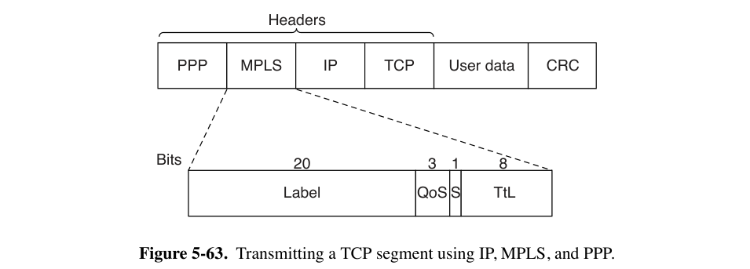

    - MPLS头部长度为4字节，有4个字段

        - Label 字段保存路由器内部表索引
        - QoS 字段表示服务类别。
        - S 字段与堆叠多个标签有关
            - 底部标签设为1，其余标签设为0
        - TTL 字段表示数据包还可以被转发的次数
            - 防止在路由不稳定的情况下出现无限循环
    
- MLPS介于数据链路层与网络层之间，独立于这两层（不依赖于IP协议）
    - MLPS可以在非IP网络上承载IP数据包。
    
- MLPS的传输过程

    - 当IP数据包到达MPLS网络的边缘、准备进入MLPS时，将标签附加在数据包上

        - 由 LER（Label Edge Router）负责
        - 在MPLS网络的另一端，标签完成其使命并被移除，IP数据包重新被暴露出来

    - MPLS网络内部负责转发的路由器称为LSR（Label Switched Router）

        - 两个不同的路由器可以向另一个LSR发送带有相同标签的不同数据包，使这些数据包在同一条输出线路上传输。
            - 对于不同的来源，标签需要在每一跳的路由器上重新映射（或者说被更新）

        

- MPLS与传统VC的区别

    - 路由器将多个流向特定路由器或LAN的流分组，并使用单个标签来表示它们。
        - 在单个标签下分组在一起的流被称为属于同一个FEC（Forwarding Equivalence Class 转发等价类）
        - 此类不仅涵盖数据包的去向，还涵盖它们的 service class
        - 由于MPLS数据包中仍然包含最终地址，所以无需像在VC中一样，担心无法在网络边缘区分流向不同终点的数据包。
    - stack of labels：堆叠多个标签
        - 用于让整体路径存在不同的数据包遵循相同的子路径传递
    - label forwarding tables 的设置
        - 在VC中，用户想要建立连接时，发送一个数据包来创建路径、设置 forwarding table entry
        - 在MLPS中，使用一种介于 routing protocols 和 connection setup protocols 之间的协议
            - 一种变体：路由器启动时，检查哪些路由是其最终目的地。路由器为它们创建一个或多个FEC，为每个FEC分配一个标签，并将标签传递给其邻居。邻居们依次将标签输入其转发表，并向它们的邻居们发送新标签。

### 5.7.6 OSPF

- Open Shortest Path First

- An Interior Gateway Routing Protocol（IGP）

- 支持点对点链路（例如，SONET）和广播网络（例如，大多数LAN）

- 支持具有多个路由器的网络，每个路由器都可以直接与其他路由器通信（称为multiaccess networks），即使它们没有广播能力。

- OSPF的运行基础

    - 将实际网络、路由器和链路的集合抽象为一个directed graph，每个arc（弧）都被分配一个weight（权重，可以是距离、延迟等）

        - 两个路由器之间的点对点连接由一对弧表示，两弧方向相反、权重可以不同。
        - 广播网络由网络本身的节点加上每个路由器的节点表示。
            - 从该网络节点到路由器的弧的权重为0。
        - 只有主机的网络只有到达它们的弧，而没有返回的弧，防止规划的 path 穿过它们。

    - 基于这个directed graph，使用link state method，让每个路由器计算从自身到所有其他节点的最短路径。

        - ECMP（Equal Cost MultiPath）：如果找到多条同样是最短的路径，OSPF会在数据包转发期间将流量分散到这些路径上，以平衡负载。

        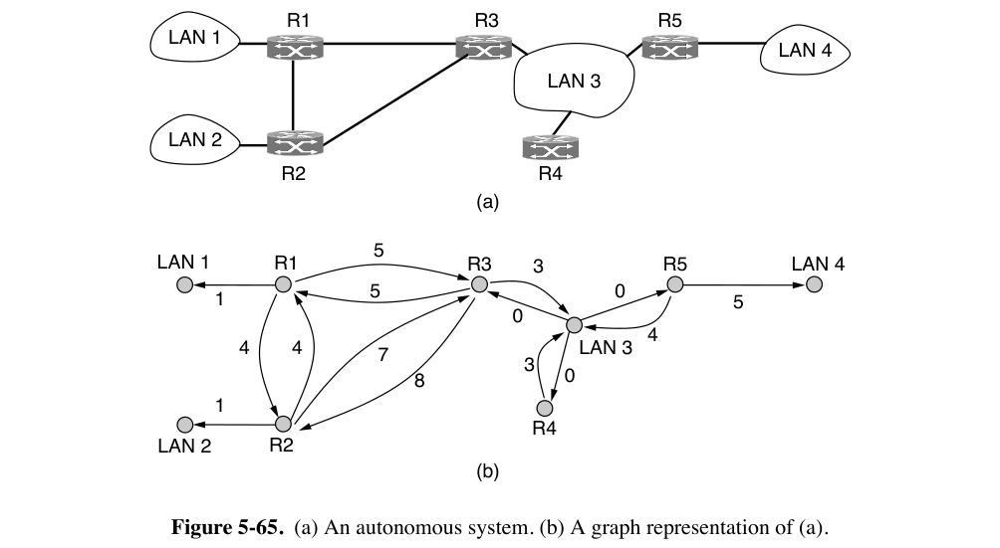

    - OSPF允许将一个AS（Autonomous Systems）分为 numbered areas（区域）

        - 每个 area 包含一个 network 或者一组 contiguous（连续的）networks

        - area 之间不能重叠，但所有area的交集不必覆盖所有路由器

        - 完全位于一个 area 内的路由器称为 internal routers

        - 所有 area 内部的拓扑结构在 area 之外均不可见。

        - 每个AS都有一个 backbone area（骨干区域），称为 area 0

            - 该区域中的路由器称作 backbone routers
            - 所有区域都连接到骨干区域，可能通过tunnel（隧道）连接
                - 因此可以从AS中的任何区域通过骨干区域到达AS中的任何其他区域
                - 隧道在图中也表示为一个弧

        - 两个或更多区域的路由器称为 area border routers

            - 需要是 backbone area 的一部分
            - 总结 destinations 的 cost 信息，但不包括拓扑细节
                - 信息的总结允许其它区域中的主机找到进入区域的最佳 area border router

        - AS boundary router（AS边界路由器）

            - 将其它AS的外部目标的路由注入到 area 中
            - 外部路由可以在一个或者多个 AS boundary router 上注入

        - 这三种路由器的功能可以存在重叠，例如，area border routers一定是backbone routers

            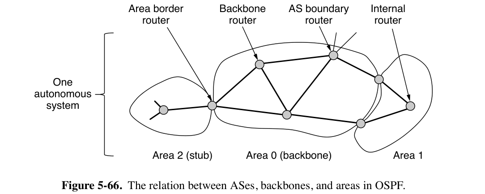

        - 每个 area 内的路由器具有相同的 link state database，运行相同的最短路径算法

            - 主要工作是计算从自身到整个AS中每个其他路由器和网络的最短路径
            - area border routers 需要连接的所有区域的链路状态数据库，并分别为每个区域运行最短路径算法。

        - OSPF强制要求 star configuration

            - 如果 source 和 destination 在同一 area 中，路由需要完全位于 area 内
            - 如果 source 和 destination 在不同 area 中，路由必须经过 backbone area
                - 由于一个 area 可能有多个 area border router 连接到 backbone area，而且要选择成本最低的路由，网络不同部分的路由器可能使用不同的 area border router 进出骨干区域

        - 数据包在传输过程中不会被封装，非必要不会通过tunnel传输。

        - 如果需要跨AS，则跨AS的cost也要被 AS boundary router 记录。
    
    - OSPF的工作原理
    
        - 所有数据包以IP数据包形式发送
    
        - 位于同一LAN上的路由器都是 neighbor。
    
            - 路由器启动时，它会在所有点对点连接上发送，并在LAN上向所有其他路由器组播HELLO消息
            - OSPF通过在 adjacent（相邻的）路由器之间交换信息来工作，这与 neighbor（邻居）路由器的概念有所不同
            - 为了避免出现一个路由器与LAN上所有路由器交谈的情况，选择一个 designated router（指定路由器），将其视作与LAN上所有路由器 adjacent。
            - neighbor 路由器如果不 adjacent 则不交换信息
    
        - 每个路由器定期向每个 adjacent 路由器泛洪 LINK STATE UPDATE 消息
    
            - 提供其当前状态，以及传输 cost
            - 这些消息需要被确认
            - 每条消息都有一个序列号
            - 连接发生变化（建立/关闭/传输成本变化）时，路由器也要发送这些消息
    
        - DATABASE DESCRIPTION 消息给出发送方当前持有的所有连接状态条目的 sequence number
    
            - 线路连接建立时发送这种消息。
            - 接收方根据 sequence number 判断发送方与接收方谁的数据更新
    
        - 连接中的任意一方都可以通过发送 LINK STATE REQUEST 请求连接状态信息
    
            
    
        - 总结：
    
            - 通过flooding，每个路由器向其 area 中的所有其他路由器通知它与其他路由器和网络的连接及其 cost。
                - 通过这些信息，每个路由器可以计算出从它到它的各个 neighbor 之间的最佳路径。
            - backbone routers 除了与 area 内部路由器沟通，还要接收 area border routers 的信息，来计算从每个 backbone router 到每个其他路由器的最佳路径。
                - backbone routers 的计算结果再通过 area border routers 传回 internal routers，使其可以计算到 area 以外的其它 destinations 的最佳路径。

5.7.7 BGP 简单考，先跳过。
