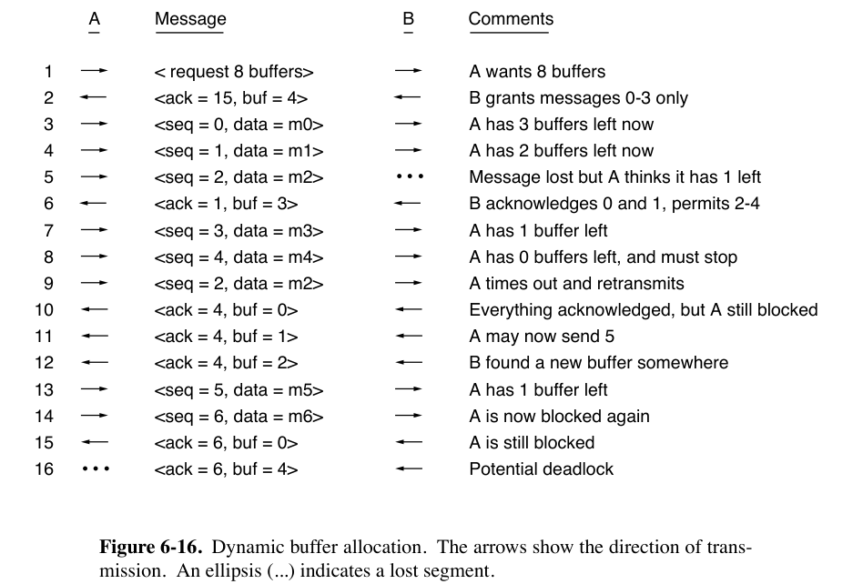
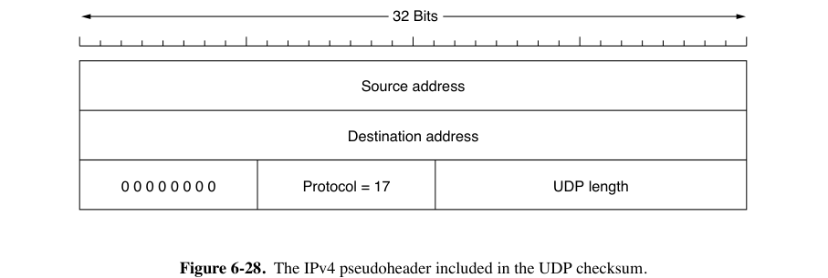
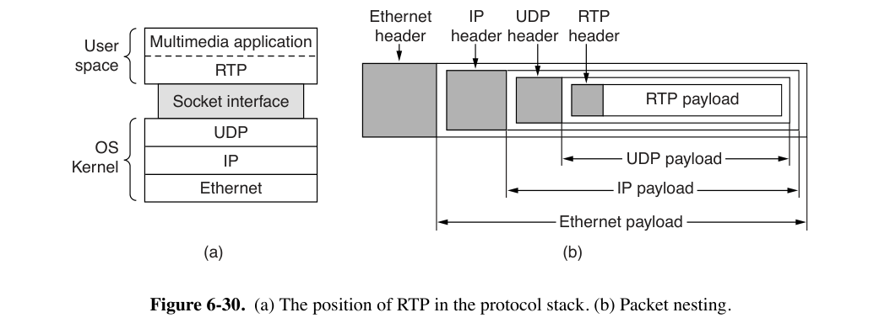
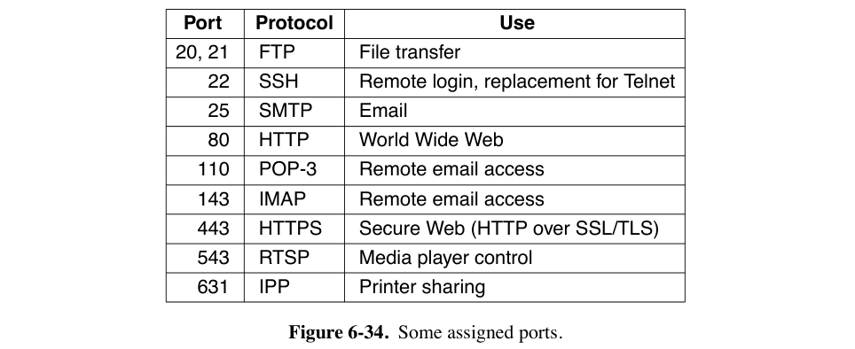

# Chap06 | Transport Layer

## 6.1 Transport Service

- 传输层服务也分为面向连接和无连接两种
    - 两种均有三个阶段：建立、数据传输和释放
    
- 在传输层中进行工作的软件和/或硬件称为 transport entity（传输实体）。

    - 用 segment（段）或者 TPDU（Transport Protocol Data Unit）表示传输实体间传输的消息。

        

- 传输层的代码完全运行在用户机器上，而网络层主要运行在路由器上。

- 使用传输层，OSI model 可以分为两部分：
    - Layers 1-4：transport service provider
    - Layers 5-7：transport service user

- 传输层隐藏网络服务的缺陷，即使用户进程位于不同的机器上，它们也可以假设存在一个无错误的比特流。

    - 传输层也可以提供 unreliable service（datagram），跟网络层的 datagram 道理差不多，这里不展开

- 网络服务只会被传输实体看到，但传输服务会被很多程序看到，因此需要一套简单的 primitives（原语）。

??? info "原语举例（感觉不如直接看下面的TCP原语）"
    - 考虑一个带有服务器和多个远程客户端的应用程序。
    - LISTEN：服务器调用库进程，阻塞服务器，直到有客户端出现
    - CONNECT：客户端想要与服务器通信时调用，用于建立连接。
        - 传输实体阻塞调用它的进程，向服务器发送 CONNECTION REQUEST 段。
        - 该段到达时，服务器的传输实体检查服务器是否在 LISTEN，如果在，它解除对服务端的阻塞，向客户端发送 CONNECTION ACCEPTED 段。
        - 当该段到达时，客户端被解除阻塞，连接建立。
    - SEND & RECEIVE：任何一方都可以执行一个（阻塞的）RECEIVE 来等待另一方执行 SEND。当段到达时，接收方被解除阻塞，然后它可以处理段并发送回复。
        - 传输层中每个发送的数据包都要被确认，传输实体也需要处理计时器和重传。
    - 断开连接有两种。
        - asymmetric variant：任何一方都可以发出一个 DISCONNECT 原语，发送一个 DISCONNECT 段到远程传输实体。到达后，连接被释放。
        - symmetric variant：当一方执行 DISCONNECT 后，不再发送更多数据，但仍然接受来自对方的数据。
    - 状态转换图如下。这里假设每个段都单独确认。我们还假设使用对称断开连接模型，客户端首先断开连接。
        

- TCP Socket 原语

    - 用于UNIX系统和Windows `winsock` API

        

    - 服务器端

        - SOCKET 原语创建一个新的 endpoint，并在传输实体中为其分配 table spaces。
            - 调用时指定要使用的 addressing format（寻址格式）、所需的服务类型（例如，可靠的字节流）以及协议。
            - 返回文件描述符（就像文件的OPEN调用一样）
        - BIND 原语分配网络地址。
            - 一旦服务器将地址绑定到套接字，远程客户端就可以连接到它。
        - LISTEN 原语为 incoming calls 分配 queue 空间，以防多个客户端同时尝试连接
            - Socket 模型的 LISTEN 不是一个阻塞调用
        - ACCEPT 原语阻塞并等待传入的连接
            - 当请求连接的段到达时，传输实体创建一个与原始套接字具有相同属性的新套接字，并返回其文件描述符。
            - 服务器可以fork出一个进程或线程来处理新套接字上的连接，并返回到原始套接字上等待下一个连接。

    - 客户端

        - 先使用 SOCKET 原语创建一个套接字，但不需要BIND
        - CONNECT 原语阻塞调用它的进程，并启动连接过程。
            - 连接进程从服务器接收到适当的段后，客户端进程被解除阻塞，连接建立
        - 使用 SEND 和 RECEIVE 在 full-duplex 连接上传输和接收数据
            - 也可以使用标准的UNIX READ和WRITE系统调用
        - symmetric connection release：当双方都执行了CLOSE原语时，连接被释放。

    - Socket API + TCP = 一个称为 reliable byte stream 的 connection-oriented service

    - 可以被用于其它 transport services，如 DCCP（Datagram Congestion Control Protocol）具有拥塞控制的UDP版本。

    - Socket API在每个流中进行拥塞控制，不如在整个group中进行

        - SCTP（Stream Control Transmission Protocol）和QUIC解决了这个问题。
- 例程
    - 写过Socket那个实验就都明白了，此处略。

## 6.2 Elements of Transport Protocols

### 6.2.1 Addressing

- 建立连接时，通过定义 transport address（传输地址），指定与 remote endpoint 的哪个进程连接，让进程在这些地址上监听连接请求。
    - 这些 endpoints 被称为 ports（端口）
    - 使用 TSAP（Transport Service Access Point，传输服务访问点）来表示传输层中的特定端点
    - 相似地，网络层中的端点（即网络层地址）被称为NSAP（Network Service Access Point，网络服务访问点）。
        - 例如IP地址。
        - 即：数据链路层的SAP是MAC地址，网络层的SAP是IP地址，传输层的SAP是端口。
    - 进程附加到 TSAP 的方法超出了网络模型的范围，完全取决于操作系统
    - 问题：与先前不知道 TSAP 地址的其他用户进程通信
        - 引入 portmapper（端口映射器）特殊进程
            - 用户发送一条包含服务名称的消息，端口映射器返回TSAP地址
    - initial connection protocol（初始连接协议）
        - 每台向远程用户提供服务的机器都有一个特殊的 process server 进程，取代使用频率较低的服务器进程
            - 同时监听一组端口，等待连接请求
        - 接收到连接请求后，process server 生成新的服务器进程，让它继承连接，process server 本身继续监听
        - 在UNIX系统中，这个特殊的服务器进程称为`inetd`（Internet daemon）
### 6.2.2 Connection Establishment

- 问题：延迟的重复数据包被误认为是新数据包，导致重复建立连接

    - 方法1：使用一次性传输地址
        - 延迟的重复数据包无法找到传输进程
        - 开头连接到进程变得更加困难
    - 方法2：为每个建立的连接分配递增的序列号，将序列号放入每个连接请求段和数据段
        - 每个传输实体维护一个表，列出过时连接的 `(对等传输实体，连接标识符)` 对
        - 要求每个传输实体无限期地有效维护一定量的历史信息
    - 消除网络中的过期数据包，不允许数据包永远存在
        - 在每个数据包中放置一个跳数计数器，每次转发递减
        - 实践中，除了要确保数据包死亡，还要确保对它的所有确认信息也死亡
            - 引入一个周期$T$，它是 maximum packet lifetime（网络的一个保守常数，互联网设为120s）的一个倍数
            - 数据包发送$T$时间之后，认为它和它的确认信息均已死亡

- TCP使用的方法

??? bug "这部分没学懂，lkj PPT上也没有，有待补充"
    - 核心：让源为段打上序列号，这些序列号在$T$秒内不会被重用。周期$T$和每秒数据包的速率决定了序列号的大小。

    - 为每个主机配备一个实时时钟，即一个以均匀时间间隔递增的二进制计数器
    
        - 计数器中的位数必须等于或超过序列号中的位数
        - 即使主机崩溃，时钟也继续运行
    
    - 当建立连接时，时钟的低阶$k$位用作$k$位初始序列号。
    
        - 每个连接从不同的初始序列号开始编号其段。
    
        - 如果崩溃，从重启时刻的时钟开始作为序列号
    
        - 禁止区域：任何段在这些时间都不能使用对应序列号发送，否则可能会延迟并冒充一个具有相同序列号的稍后发送的不同数据包。
    
            
    
    - 滑动窗口协议
    
    - 方式序列号进入禁止区域
    
        - 发送数据的速度不能太快
            - 对于时钟速率C和序列号空间大小S，我们必须有$S/C>T$，以使序列号不会太快回绕。（注：这里的$T$似乎不是图里的 crash 时间，指的是序列号在$T$秒内不会重用）
        - 传输实体必须在崩溃重启后等待时钟 tick，然后再打开新连接，以免重复使用相同的序列号。
        - 由于序列号回绕，实际使用的序列号与时间曲线最终会从左侧进入禁止区域。
            - 尽量增大斜率，减慢这个时间的到来
    
    - 解决了无法区分延迟的重复段和新段的问题
    
        - 但建立连接时，不知道包含初始序列号的连接段是不是最近连接的重复

- three-way handshake（三次握手）

    - 主机1在发起连接时，选择一个初始序列号x，装入 CONNECTION REQUEST（CR）段发送到主机2。主机2选择自己的初始序列号y，与x一起装入一个ACK段发回主机1。主机1在其发送的第一个DATA数据包中顺带在序列号字段发送x、在确认字段发送y。

    - 如果主机2接收到一个重复的来自主机1的CR，它向主机1发送ACK段，主机1发现ACK段的值x自己没有记录，发回REJECT，主机2接收到后放弃连接请求。

    - 如果主机2在接收到一个重复的来自主机1的CR之后、收到主机1的REJECT之前，还接收到一个重复的包含x和确认z的DATA数据包，主机2发现ACK字段的值是x而不是y，将DATA也视为重复数据包丢弃。

        

- PAWS（Protection Against Wrapped Sequence numbers，防止序列号回绕的保护机制）：

    - TCP在连接内部使用时间戳来扩展32位序列号，使得序列号在最大数据包生存期内不会回绕

- 在实践中使用伪随机初始序列号进行连接，防止攻击者预测下一个初始序列号，伪造三次握手数据包

    - 不过，重要的是初始序列号在一段时间内不会重复，这就够了

### 6.2.3 Connection Release

- asymmetric release

    - 连接释放太突然，可能导致数据丢失

- symmetric release

    - 主机可以在发送 DISCONNECT 段后继续接收数据

    - two-army problem

        - 在不可靠的信道中，消息可能丢失
            - 如果双方都不准备断开连接，直到它确信另一方也准备断开连接，那么断开连接将永远不会发生。
        - 对这个问题，不存在完美的解决的方法

    - 实际解决方法：三次握手 + 计时器到期的时候，无论如何都释放连接

        - 引入DISCONNECTION REQUEST（不同于DISCONNECT原语）

        

    - half-open connection（半开连接）：

        - 初始DR和N次重试都丢失，发送方断开连接但接收方没有断开
        - 一个解决办法是，如果一段时间内没有收到段，则自动断开。
            - 需要在空闲时传输虚拟段，以防止对方断开

- 结论：传输实体不能很好地自主决定何时断开连接，依赖应用程序

    - TCP通常执行对称关闭（当它发送完数据时，每一方独立关闭其连接的一半，使用FIN包）
    - 许多Web服务器向客户端发送一个RST包（类似非对称）
        - 数据传输结束后，服务器可以向客户端发出警告并突然关闭连接。
            - 如果客户端收到此警告，它将立即释放连接。
            - 如果客户端没有收到警告，它在超时后释放连接。

### 6.2.4 Error Control and Flow Control

- 错误控制与流量控制方法类似于数据链路层。

    1. 帧携带一个错误检测码（例如CRC或校验和），用于检查信息是否正确接收。
    2. 帧携带一个序列号来标识自身，并由发送方重传，直到它从接收方收到成功接收的确认。这称为ARQ（自动重复请求）。
    3. 发送方允许在任何时间未完成的帧的最大数量，如果接收方确认帧的速度不够快，则暂停发送。如果此最大值为一个数据包，则该协议称为停止等待。较大的窗口支持流水线操作，并在长距离、高速链路上提高性能。
    4. 滑动窗口协议结合了这些特性，并支持双向数据传输。

- 传输层在端上校验，不在中间路由器上校验

- TCP重传\&滑动窗口：对于不同带宽的流量分配不同的缓冲区

    - 低带宽的突发流量（如远程打字）：不分配任何缓冲区，而是在两端动态获取缓冲区，如果偶尔必须丢弃段，则依赖发送方的缓冲
    - 高带宽的流量（如文件访问）：让接收方为每个连接分配一个完整的窗口缓冲区，以允许数据以最大速度流动

- TCP dynamic sliding window：在名为Window size的头部字段中携带缓冲区分配。

    - decouple the buffering from the acknowledgements

    - 发送方请求一定数量的缓冲区。接收方尽可能多地批准。发送方在发送数据包后，自减空闲缓冲区大小。接收方分别将确认和缓冲区分配附加到反向流量中。
      
        

### 6.2.5 Multiplexing

- multiplexing（多路复用）：一个 network address 对应多个 transport address
- inverse multiplexing（逆多路复用）：一个 transport address 对应多个 network address
    - 可以增加带宽。
    - 举例：SCTP（Stream Control Transmission Protocol），可以在多个网络接口上运行一个连接
    - TCP使用单一的网络端点。

### 6.2.6 Crash Recovery

- 从第N层崩溃中恢复只能由第N+1层完成，并且只有在更高层保留足够的状态信息以重建问题发生之前的状态时才能完成。

## 6.3 UDP

### 6.3.1 UDP

- UDP（User Datagram Protocol，用户数据报协议）

    - Internet传输层的Connectionless protocol
    - 为应用程序提供了一种发送封装的IP数据报的方式

- UDP传输的 segment 由一个8字节的头部和负载构成

    

    - 两个port字段用于标识 source 和 destination 的 endpoint。

        - source port 主要在发回时由对方用到

    - UDP length 字段包括8字节的头部长度和数据（负载）长度。

        - 最小为8字节（即头部长度）。
        - 最大长度为65,515字节（而不是$2^{16}-1$），套上IP数据包头后，总长度不能超过IP数据包的最大长度的限制。

    - UDP checksum 字段包含了对UDP头部、UDP数据和IP pseudoheader 的校验。

        - 计算校验和时，将该字段视作0

        - 使用 one's complement（反码）对所有16位字求和，并取和的反码。

            - 如果数据字段长度为奇数个字节数，则用一个额外的全0字节填充。

        - 如果为计算校验和，这一段填写为全0。

            - 实际上，如果校验和计算出来为0，实际写进来的是它的反码，即全1

        - IP pseudoheader：只用于UDP校验和计算

            - 包含源和目标机器的32位IPv4地址

            - 这里面 UDP Length 字段跟 UDP segment 头部的 UDP Length 的值保持一致
              
	        - TCP使用相同的伪头部进行校验和计算。
            
                
        
    - 不进行流量控制、拥塞控制或收到错误段时的重传。
      
    - 用于DNS（Domain Name System，域名系统）

### 6.3.2 RPC

- RPC（Remote Procedure Call，远程过程调用）

    - 将网络上的请求-回复交互安排为过程调用的形式。
    - 调用过程被称为客户端，被调用过程被称为服务器。

- 要调用远程过程，客户端程序必须与一个称为客户端存根（client stub）的库过程绑定，该过程在客户端的地址空间中代表服务器过程。类似地，服务器与一个称为服务器存根（server stub）的过程绑定。

- 执行流程：

    1. 调用 client stub

    2. 对参数执行 marshaling（序列化）操作

    3. 将消息从客户端机器发送到服务器机器

    4. 将传入的数据包传递给server stub

    5. server stub 对参数执行 unmarshaling（反序列化），调用服务器过程

        

- 常见问题（略）

- 请求和回复都可以作为单个UDP数据包发送

    - 因为请求或回复可能会丢失，客户端需要额外设置一个计时器用于重新传输
    - 如果操作不是 idempotent（幂等的，即重复操作结果相同），可能需要TCP来防止重传造成重复操作

### 6.3.3 RTP

- RTP（Real-time Transport Protocol，实时传输协议）

- 位于应用层和传输层之间

    

- RTP的基本功能是将多个实时数据流多路复用到单个UDP数据包流上

    - UDP流可以发送到单个目的地（unicast）或多个目的地（multicast）

- RTP没有重传和确认机制。

    - 数据包可能会丢失、延迟、损坏等，如果发生丢失，接收端的行动取决于应用程序
        - 在流媒体应用程序中，播放器可能会暂停。
        - 在像IP语音通话这样的实时媒体应用程序中，通常会跳过数据包。

- RTP定义了数个 profile（配置文件），对于每个配置文件允许多种编码。

    - RTP本身不涉及编码的实现方式

- RTP 头部：3 个 32 bit word，可能包括一些 extensions

    

    - Version 目前为2
    - P 位表示数据包已填充到4字节的倍数。最后一个padding byte的内容是填充字节的数量。
    - X 位表示存在扩展头部，扩展头部的格式和含义没有被定义。
    - CC 字段表示存在多少个贡献源，范围从0到15。
    - M 位是因具体应用程序而异的标记位。
    - Payload Type 字段代表编码算法（MP3、未压缩的8位音频等）
        - 由于每个数据包都携带此字段，编码可以在传输过程中更改。
    - Sequence Number 是一个计数器，每发送一个RTP数据包时递增。它用于检测丢失的数据包。
    - Timestamp 表示数据包中第一个样本的制作时间
        - 用于减少 jitter（抖动）
            - 将播放与数据包到达时间解耦：接收端进行缓冲，并在流开始后的正确时间播放每个样本，而不依赖于包含样本的数据包到达的时间
        - 用于多个流之间的同步
    - Synchronization source identifier 表示数据包属于哪个流
        - 用于将多个数据流多路复用到单个UDP数据包流上
    - Contributing source identifiers（可选）：用于 mixers（混音器）
        - 混音器是同步源，在此字段列出正在被混合的流。

- RTCP（Real-time Transport Control Protocol，实时传输控制协议）
    - 用于向源提供有关延迟、延迟变化（或抖动）、带宽、拥塞和其他网络属性的反馈
        - 根据网络质量不断切换编码算法，提供最佳质量
        - Payload Type 字段用于告诉接收端当前数据包使用的编码算法
        - RTCP报告会发送给所有参与者
            - 为了防止占用过多带宽，RTCP发送方会降低其报告的速率，使得占用总带宽不超过媒介带宽的5%。
    - 处理流间同步
    - 提供了一种为各个源命名的方法（如ASCII文本）

- Buffering & Jitter Control
    - 平滑播放的一个关键考虑因素是playback point（播放点），即在播放媒体之前在接收端等待多长时间。
        - 即使平均延迟没有差异，high jitter 的播放点比 low jitter 要晚
    - 应用程序可以通过查看RTP时间戳和到达时间之间的差异来测量抖动。
    - 由于延迟可能因为网络变化而随时变化，应用程序可以在运行时调整其播放点。
    - 改变播放点可能会导致故障被用户察觉，因此可以选择在 talkspurts（对话的间隙）调整。
    - 要提前播放点，要么允许丢包率高，要么改善网络层 QoS。

## 6.5 TCP

- TCP（Transmission Control Protocol，传输控制协议）
- 用于在不可靠的互联网上提供可靠的端到端字节流。
    - 能够动态适应互联网的特性：不同部分的参数差异很大。
- 每台支持TCP的机器都有一个TCP transport entity（传输实体），通常是内核代码。
    - 管理TCP流并与IP层接口
    - 从本地进程接收用户数据流，将它们分解为不超过 64KB 的片段，将每个片段作为单独的IP数据报发送
        - 实际一般为1460字节的数据，以便能够适应带有IP和TCP头部的单个以太网帧
    - 数据报到达机器后交给传输实体，将乱序到达的数据报重新组装原始字节流。
- TCP能解决IP不可靠的问题

### 6.5.1 TCP Service Model

- 通过发送方与接收方创建 Socket（套接字）实现
    - 每个套接字有一个 socket number，由主机的IP地址和该主机本地的16位数字（称为 port 端口）组成。
        - port 就是TCP中的TSAP。
        
        
        
    - 一个套接字可以同时用于多个连接。
    
    - 端口号低于1024的端口称为well-known ports，只能由操作系统特权用户启动。
    
- 所有TCP连接都是 full duplex（全双工）和 point-to-point（点对点）的。
    - 全双工意味着流量可以在两个方向上同时进行。点对点意味着每个连接恰好有两个端点。
    - TCP不支持多播或广播。
    
- TCP连接是一个字节流，而不是消息流。
    - 接收方无法检测到数据被写入的单位（比如是不是用字节）。
    
- 当应用程序将数据传递给TCP时，TCP可以根据自己的判断立即发送数据或缓冲数据（收集更多数据一次性发送）。
    - 有时应用程序希望数据强制立即发送而不等待缓冲存满。
    - TCP有一个在数据包上携带的PUSH标志，然而应用程序不能在发送数据时直接设置PUSH标志，现在这个功能由操作系统负责实现。
    
- urgent data：用于将高优先级数据（如ctrl+C等控制信息）放入数据流中，并将其与URGENT标志一起交给TCP。
    - 收到这些数据后，TCP传输实体立即开始发送。
    - 紧急数据到达目的地时，接收应用程序会被中断。
    - 现在很少使用。

### 6.5.2 TCP Protocol

- TCP连接上的每个字节都有自己的32位 sequence number（序列号）
    - 数据包上携带的独立32位序列号用于滑动窗口位置的确认。
- TCP实体以 segment（段）的形式交换数据。
    - TCP段由一个固定的20字节头部（加上可选部分）和零个或多个数据字节组成。
        - 段最长为65515字节（算上TCP头部），以适应IP的 payload 长度。
        - 为了避免分片，段长也要适应MTU。一般需要适应以太网 payload 的1500字节上限。
        - 采用 path MTU discovery，通过ICMP消息查找最小MTU，以调整段大小。
- sliding window protocol with a dynamic window size（滑动窗口协议）
    - 发送方在传输一个段的同时启动一个计时器。
    - 段在到达目的地时，接收的TCP实体返回一个段（可以携带数据），其确认号等于它期望接收的下一个序列号，以及目的地的剩余空闲空间（即流量控制窗口）大小。
    - 如果发送方的计时器在收到确认之前超时，发送方会再次传输该段。

### 6.5.3 TCP Segment Header

- 每个段以固定格式的20字节头部开始，后面可能跟随着 header options
    - 数据最多可以有$65535 - 20 - 20 = 65495$字节，其中第一个20指的是IP头部，第二个20指的是TCP头部。
    - 没有数据的段是合法的，通常用于确认和控制消息。
- Connection Identifier 通常被称为 5 tuple，包含协议（TCP）、源IP、源端口、目标IP和目标端口。在 TCP Header 中的有 source port 和 destination port。
- Acknowledgement number（确认号）为 cumulative acknowledgement（累积确认）。
    - 指示期望接收的下一个字节（而不是之前正确接收的最后一个字节！）
    - 重申：TCP流中的每个字节都被编号。
- TCP header length：TCP header的长度。包括 options 部分，所以是可变的。
    - 以 32 bit word 为单位。
- 4 bit 未被使用
- 8 个 1 bit
    - CWR和ECE在启用ECN（Explicit Congestion Notification，显式拥塞通知）时发出拥塞信号
        - CWR设置为1表示向TCP接收方发出 Congestion Window Reduced 信号，让它知道发送方已减速并可以停止发送ECN-Echo。
        - ECE设置为1表示向TCP发送方发出ECN-Echo信号，在TCP接收方从网络接收到拥塞指示时，告诉它减速。
    - URG设置为1表示后面的 urgent pointer（紧急指针）字段有效。参考前面提到的urgent data。
    - ACK设置为1表示前面的确认号有效，此位为0则忽略确认号字段。
    - PSH设置为1表示 PUSHed data。参考前面提到的PUSH标志。
    - RST设置为1表示连接的突然重置，或者表示拒绝无效段，或者表示拒绝尝试打开连接。
    - SYN设置为1表示 CONNECTION REQUEST 和 CONNECTION ACCEPTED。
        - SYN=1且ACK=0表示连接请求，SYN=1且ACK=1表示连接确认。
    - FIN设置为1表示释放连接。
        - SYN为1的段和FIN为1的段的序列号都是有效的，以保证按正确顺序处理。
- Window size：表示发送方从确认的字节开始，还可以再缓冲的字节数。
    - 也就是 flow control window（流量控制窗口）的大小。
    - window size 为0是合法的，表示接收方收到了数据但是暂时不能处理更多。
    - 与数据链路层协议相比，接收到的数据的确认和新数据的发送权限是相互独立的。
    
- Checksum number：以与UDP相同的方式对头部、数据和概念上的伪头部进行校验和计算。
    - TCP的校验和是强制性的，不像UDP可以为0。

- Urgent pointer：用于指示从当前序列号开始的字节偏移量，在该偏移量处可以找到紧急数据。
    - 此功能代替中断消息。现在很少使用。
- Options：最长为40字节，如果长度不是 32bit 的倍数，需要用0填充。
    - 每个选项都用TLV格式编码。（参考IPv6）
    - MSS（Maximum Segment Size，最大段大小）
        - 主机在这个数据段声明它能接受的最大的 segment 的大小。
        - 如果不设置这个选项，则默认它能接受的 payload 最大为536字节，能处理最多556字节TCP段。
        - 两个传输方向上的最大段大小不必相同。

    - window scale（窗口缩放）
        - 双方可以协商 scale factor（最多14），每次将接收到的 window size 左移这些位作为对方窗口空闲空间大小。
        - 也就是说窗口实际最大可以是$2^{30}$字节。

    - timestamp：发送者发送时间戳，接收者echo（回显）它。
        - 也可以用于扩展 32bit sequence number。（也就是前面的PAWS方案）

    - SACK（Selective ACKnowledgement）：接收方通过这个 option 可以告诉发送方它已经接收到的序列号范围。
        - 该字段给出期望接收的下一个有序字节号。
        - 通过SACK，发送方明确知道接收方已经接收了哪些数据，因此可以确定应该重新传输哪些数据。

### 6.5.4 TCP Connection Establishment

- 改进前面提到的 three-way handshake（三次握手）

    - 等待连接的一方依次执行 LISTEN 和 ACCEPT 原语

        - 可以指定特定的源或不指定任何源

    - 主动连接的一方执行 CONNECT 原语

        - 指定IP地址和端口，以及此方愿意接受的最大TCP段大小
        - 发送一个SYN=1且ACK=0的段，等待响应

    - 收到该段的一方的传输实体检查是否有进程在目标端口上执行了LISTEN

        - 如果没有，发送一个RST=1的段，拒绝连接
        - 如果有，该进程收到传入的TCP段，选择接收或者拒绝连接。
            - 如果接受，发送一个确认段。
            - 认为发出的这个SYN段消耗1字节的序列空间，以便明确确认它。
                - 注：这个SYN段的数据段长度为0，也不会修改 sequence number，但是就是认为它占用了1字节的序列空间。

    - 如果双方使用同一对套接字同时向对方建立连接，由于连接由 endpoint（port）标识，只建立一个连接

        

    - 每个主机选择的初始序列号应该缓慢循环，而不是一个常数（如0），以防止延迟的重复数据包

        - 最初通过基于时钟的方案实现
        - SYN flood attack：恶意发送方通过发送一系列SYN段而不完成连接来占用主机的资源
            - SYN cookies：主机以对方IP地址和端口以及本地密钥等，根据一个hash函数生成序列号
            - 后续只需重新生成并比对，而无需单独记住序列号，就不会出现记了大量无效序列号的问题了
            - SYN cookies 会导致无法处理 TCP options，因此只在受到SYN flood attack时使用。

### 6.5.5 TCP Connection Release

- 为方便理解，将TCP的全双工连接视为 simplex connections（单工）连接
- 任何一方发送FIN为置1的TCP段表示没有更多数据要传输，FIN被确认后它单向关闭连接。
- 通常，释放连接需要四个TCP段：每个方向一个FIN和一个ACK。
    - 第一个ACK和第二个FIN可以包含在同一个段中，从而将总数减少到三个。
- 两台主机先后或者同时释放连接并没有本质区别。
- 为避免two-army problem，使用计时器。
    - 如果一段时间内没有收到对FIN的响应，或者收不到另一方的信息，则释放连接
    - 这个问题没有完美的解决方案

### 6.5.6 TCP Connection Management Modeling

- 上图中粗虚线表示主动连接/断开方，粗实线表示被动连接/断开方。
    - 可能需要说明，TIME WAIT 状态时实际上已经断开，但要多等一会，以防自身发出的确认帧丢失。

### 6.5.7 TCP Sliding Window

- 前面说过，window size 为0是合法的，表示接收方收到了数据但是暂时不能处理更多。此时发送方必须停止发送，直到接收方发回一个包告知window size > 0，可以发送更多数据。

    然而，窗口为0时，有两个发送方可以继续发送的例外。

    1. urgent data
    2. window probing（窗口探测）：发送方可以发送一个1字节的段，强制要求接收方重新通告下一个期望字节和窗口大小。用于防止死锁。

- delayed acknowledgements（延迟确认）：将确认和窗口更新延迟最多500毫秒，如果延迟期间有新的数据要发送，可以合并数据包。

    - 减少接收方对网络的负载

- Nagle's Algorithm：试图解决发送方连续发送短数据包造成效率低下的问题。

    - 只发送第一块，并缓冲其余所有数据，直到第一块被确认。

    - 然后在一个TCP段中发送所有缓冲的数据，并再次开始缓冲，直到下一个段被确认。

    - 如果足够的数据已经传入以填充一个最大段，则应发送一个新段。

    - 缺点：

        1. 有时候需要快速高频发送短数据包（如游戏）；
        2. 与延迟确认共同作用，可能导致临时死锁。
            - 接收方等待数据以便捎带确认，而发送方等待确认以发送更多数据

    - 禁用Nagle算法：TCP\_NODELAY option
    
- Clark's solution：解决 silly window syndrome：即使接收方的buffer腾出了很小的地方，都要通知发送方可以继续发送了

    - 接收方等到它可以处理$\min (MSS, receiver\_buffer\_size/2)$大小的内容时再通知发送方。
    - 也可以由发送方等待接收方有这么大的receive\_buffer了再发送。

- Nagle's Algorithm 与 Clark's solution 一个管发送方，一个管接收方，可以同时使用。

- 接收方还可以阻止READ请求，直到它可以提供足够多的数据

- 接收端在处理段无序到达时，可以缓存等待缺失数据重发，也可以直接丢弃无序段，等待重发所有。

- 使用 cumulative acknowledgement（累积确认）。

### 6.5.8 TCP Timer Management

- RTO（Retransmission TimeOut，重传超时）计时器：时间耗尽前如果没有收到确认，则停止计时器

    - 相比于数据链路层可以设置固定的超时时间，传输层的往返时间的方差大，且其均值和方差因为拥塞的增加和解决，经常发生变化。
    - Jacobson's Algorithm：
        - 用一个SRTT（Smoothed Round-Trip Time）估计往返时间
            - 如果确认在计时器超时之前返回，记其往返时间为$R$，则$SRTT = \alpha\times SRTT+(1-\alpha)\times R$。
                - $\alpha$是一个 smoothing factor（平滑因子），用于确定旧值被遗忘的速度，通常$\alpha = 7/8$。
                - $SRTT$初始使用$2\times RTT$（两倍的往返时间）
            - 实际上是一种 EWMA（Exponentially Weighted Moving Average）或者说 low-pass filter
            - 问题：方差上升时不能有效响应。
        - 再引入一个RTTVAR（Round-Trip Time VARiation）往返时间方差
            - $RTTVAR = \beta× RTTVAR + (1 - \beta) × |SRTT - R|$
                - 通常设$\beta=3/4$
        - 重传超时设置为$RTO = SRTT+4\times RTTVAR$

    - Karn's Algorithm：解决段超时重传并返回确认后，不清楚确认是回复哪次传输的问题
        - 不要更新任何已重传段的估计值
        - 每次连续重传时，超时都会加倍，直到段成功传输为止

- persistence timer：解决这个死锁：接收方用于声明自己的buffer有空间接收新数据段的数据包丢失
    - 发送方的这个 timer 超时时，向接收方发送 window probing
- keepalive timer：如果连接长时间空闲，该计时器超时，一方检查另一方是否仍有响应。
- TIME WAIT状态中使用的 timer：时长为两倍的 maximum packet lifetime。（见上方状态转移图）

### 6.5.9 TCP Congestion Control

拥塞控制相关内容一般都划为不考（如6.3、6.6），不知道这里为什么考了，而且lkj PPT上也有

- 所有互联网TCP算法都假设丢失的数据包是由拥塞引起的，并监控超时。
- 维护两个窗口：接收方的流量控制窗口（指定接收方可以缓冲的字节数）以及发送方的拥塞窗口

    - 拥塞窗口：其大小是发送方在任何时候可以在网络中的字节数，相应的速率是窗口大小除以连接的往返时间。
    - 实际可以发送的字节数是两个窗口中较小的一个。
- AIMD规则（Additive Increase Multiplicative Decrease）：

    - 加性增加：拥塞窗口在网络无拥塞时线性增长。
    - 乘性减少：当检测到拥塞时，拥塞窗口减半。
- ack clock：确认（ACK）返回的速率。

    - 它取决于网络路径中最慢的部分，决定了发送方可以向网络注入新数据包的速率。
- 算法流程
    - slow start（慢启动）
        - 拥塞窗口从较小的初始值（如4个段）开始。
        - 每收到一个确认（或者说每隔一个RTT），拥塞窗口增加一倍的大小。
        - 数据包发送速度逐渐加快，直到拥塞窗口大小超过slow start threshold（慢启动阈值），或者检测到拥塞，或者接收方窗口已满。
            - 初始化时，慢启动阈值设为流量控制窗口的大小（也可以任意高）。
            - 检测到数据包丢失时，慢启动阈值设置为拥塞窗口的一半，然后拥塞窗口重置为其小初始值，并重新开始慢启动
        - 实际上是指数增长，目的是快速探测网络的容量。
    - Additive Increase（加性增加）
      
        - 拥塞窗口大小超过慢启动阈值后，切换到加性增加，拥塞窗口每RTT增加一个段的大小。
            - 一种近似：称拥塞窗口大小为cwnd，最大段大小为MSS。
            - 对于每个可能被确认的cwnd/MSS数据包，cwnd += MSS × MSS)/cwnd。
        - 这种线性增长使拥塞窗口逐渐接近网络的最佳容量。
    - Fast Retransmit（快速重传）
        - 不依赖于超时，快速识别数据包丢失。
        - 当发送方收到三个重复确认时，推断数据包丢失，并立即重新传输丢失的数据包。
        - 慢启动阈值设置为当前拥塞窗口的一半，可以将拥塞窗口设置为一个数据包来重新慢启动。

- TCP Tahoe = slow start + additive increase + fast retransmit

    

- TCP Reno：TCP Tahoe + 快速恢复

    - heuristic（启发式方法）
    - Fast Recovery（快速恢复）
        - 在快速重传后，发送方进入快速恢复模式。
        - 先将慢启动阈值设为当前拥塞窗口大小的一半
        - 再将拥塞窗口设置为新的慢启动阈值，并继续发送新数据包，直到丢失的数据包被确认。
        - 丢失的数据包全部被确认后，退出快速恢复模式
            - 拥塞窗口大小设置为新的慢启动阈值
        - 快速恢复避免了慢启动的重新启动，使连接更快恢复到正常状态。
    - 结果：AIMD希望达成的 sawtooth（锯齿形）模式。
    
    
    
- 改进：

    - Linux使用称为CUBIC TCP的变体

    - Windows包括称为Compound TCP的变体

    - SACK：确认丢失的具体数据包（上文 segment header 部分有提及）

        - 列出最多三个已经接收的字节范围
        - 建立连接时，双方需要各自发送允许SACK的TCP选项
        - 接收到乱序数据包时发送SACK选项
        - 例如，如果收到了数据包1和数据包3但是没有收到2，则发送SACK表示接收到了3，以及数据包1的重复确认。
        - SACK 是 strictly advisory information（不具有强制性）
        - 已经被广泛使用

        

    - ECN：作为丢包之外的拥塞信号。（上文 segment header 部分介绍过ECE和CWR位）

        - 如果使用ECN，每个携带TCP段的包都会在IP头中标记，以显示它可以携带ECN信号。
        - 接收方使用ECE（ECN Echo）标志向TCP发送方发出信号，表明其数据包经历了拥塞。
        - 发送方通过使用CWR（Congestion Window Reduced）标志告诉接收方它已经听到了这个信号。
        - 使用ECN优于等待丢包，因为信息传递的时候还没有数据包受损。
        - 需要主机和路由器支持，尚未推广。
