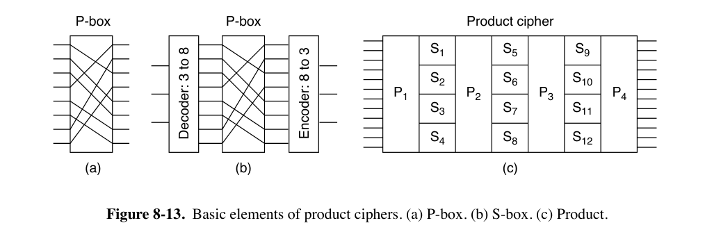
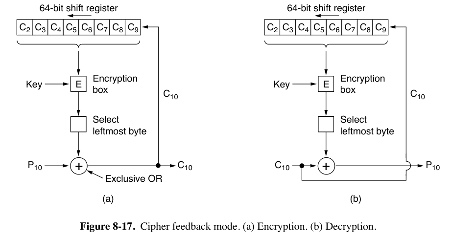
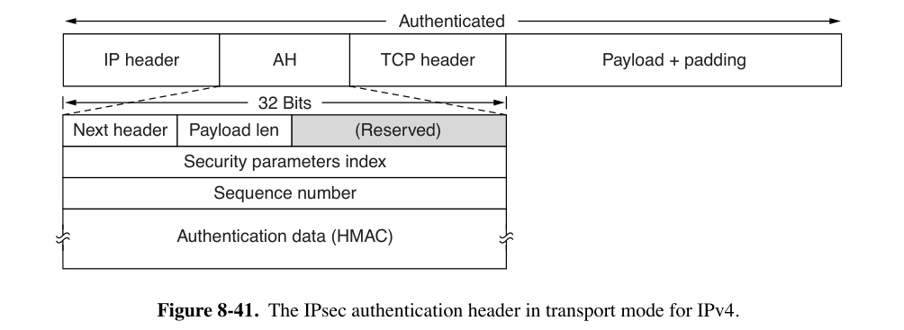
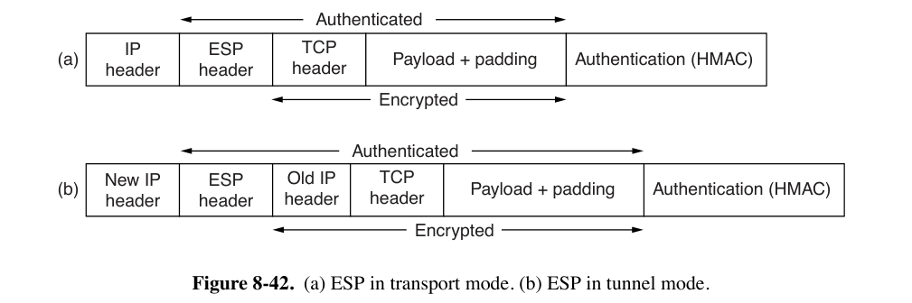
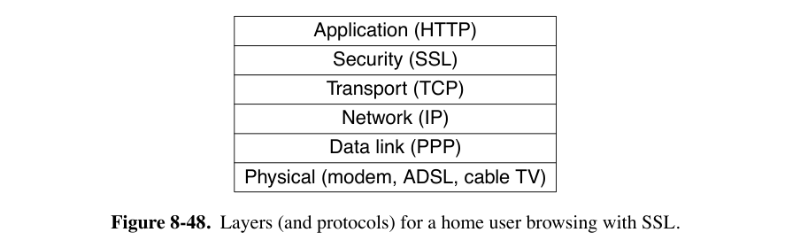

# Chap08 | Network Security

- 8.1 将网络安全原则，略过
- 8.2 范围表上说不考，略过
- 8.3 讲 Firewall，也略过吧

## 8.4 Cryptography

- 密码学基础术语
    - 注意 code 与 cipher 的区别
        - cipher（密码）是一种字符到字符或位到位的转换，不考虑消息的语言结构。
        - code（代码）是用一个词替换另一个词
    - encrypt（加密）
    - plaintext（明文）：需要被加密的信息
    - key（密钥）：一个用于转换的参数化的函数。加密密钥与解密密钥不一定一致。
    - ciphertext（密文）：加密的结果
    - intruder：入侵者
        - 被动入侵者监听信道，主动入侵者向密文注入自己的信息或者篡改有效信息
    - 使用$C = E_K(P)$来表示使用密钥$K$对明文$P$进行加密得到密文$C$。同样，$P = D_K(C)$表示对$C$进行解密以再次得到明文。
    - Kerckhoffs原则：所有算法必须是公开的；只有密钥是秘密的。
    
- 密码学两个基本原则
    1. 消息必须包含一些 redundancy（冗余）
        - 否则即使被攻击者注入了无效信息，也当作有效信息
    2. 需要某种方法来防止 replay attacks（重放攻击）
        - 攻击者可能通过重复之前发送的有效消息造成干扰
    
- substitution ciphers（替换密码）
    - Caesar cipher（凯撒移位）
        - 密文字母表被k个字母移位
            - 举例，移3位：a变为D，b变为E，c变为F，...，z变为C
        - 这种字母之间一一映射的系统称为 monoalphabetic substitution cipher（单字母替换密码）
    - 可以利用自然语言的统计特性破解。
        - 例如digrams（两字母组合）、trigrams（三字母组合）
    
- transposition ciphers（换位密码）
    - columnar transposition：按列换位，以列为单位打乱位置，但不改变字母本身。
        - 密钥的目的是对列进行排序，第一列位于密钥字母中最接近字母表开头的位置，依此类推。如下图的密钥`MEGABUCK`中，最靠近字母表开头的是`A`，因此把`A`对应的列换到第一列。
    
        
    
    - 根据字母出现频率可以判断使用的是换位密码，猜测一个可能的明文短语并推测双字母集可以确定密钥长度，最后尝试各种列的排序方法。
    
- One time pad 范围表上说不考，这里略过

## 8.5 Symmetric-key Algorithms

- block cipher（分组密码）：将n位的明文块作为输入，并使用密钥将其转换为n位的密文块。

- substitution 和 transposition 可以通过电路硬件实现。

    - P-box（Permutation）：通过接线实现置换
    - S-box（Substitution）：P-box加上编解码器，输入输出一一对应
    - product cipher（乘积密码）：通过 cascade 实现。
        - 通过多个较小的 S-box 来近似较大的 S-box，S-box 越大硬件实现越复杂。

    

    - k的常见值是256，至少有20个物理阶段；如果改用软件实现，通常会有至少8次的 iteration（或者称为 rounds） 

### 8.5.1 DES

-  DES (Data Encryption Standard)

- 加密方法大致如上图

    - 明文（以二进制形式）被分成64位的单元，每个单元通过在16轮连续的轮次中使用56位密钥进行参数化的置换和替换来单独加密。
        - 其实DES是一个单表替换密码，使用64字符密码表

- triple DES

    - 同时使用两个56位密钥来增加密钥长度，总共有112位的密钥
    - 使用加密-解密-加密，将两个密钥设为相同的值

    

### 8.5.2 AES

- AES (Advanced Encryption Standard)
- 最终采用的具体实现方法称为 Rijndael
    - Rijndael支持从128位到256位的 key length 和 block size，length of steps 为32位。
    - AES有两种变体：128位分组和128位密钥，以及128位分组和256位密钥。
    - 对于128位密钥和128位分组，number of rounds 为10，而对于最大的密钥或分组，轮数增加到14。
- DES 是 bit oriented 的，因此软件实现速度较慢；而AES操作以整个字节为单位。

### 8.5.3 Cipher Modes

- ECB mode（Electronic Code Book mode，电子密码本）
    - AES与DES本质上都是 monoalphabetic substitution cipher
        - 每当相同的明文块进入前端时，相同的密文块就会从后端输出。这个性质可以用于破解。
    - 使用DES加密长明文的最直接方法是将其分解为连续的8字节（64位）块，并使用相同的密钥一个接一个地加密它们。如果需要，最后一个明文块会被填充到64位。

- CBC mode（Cipher Block Chaining mode，密码分组链接）

    - 每个明文块在加密之前与前一个密文块进行异或操作。
        - 例如，第一个块与一个随机选择的IV（Initialization Vector，初始化向量）进行异或，IV与密文一起以明文形式传输。
    - 相同的明文块不会导致相同的密文块。

    

- CFB mode（Cipher Feedback Mode，密码反馈）

    - CBC 需要等待整个块到达才能解密。
    - CFB 仍然需要初始向量IV。
    - 假如说每次加密 64bit，每次移动 1byte，则如果有一次加密出错，只会影响 8byte 的内容。
    - 举例：$C_1 = E_K(IV_{1-8})\oplus P_1$，$P_1 = E_K(IV_{1-8})\oplus C_1$

    

- Stream Cipher Mode
    - 反复加密IV得到不重复的 keystream
    - 绝对不能两次使用相同的IV，会受到 keystream reuse attack
	

## 8.6 Public Key Algorithms

- 公钥加密要求每个用户拥有两个密钥：
    - 一个 public key，用于加密发送给该用户的消息
    - 一个 secret key，用户用它来解密消息

### 8.6.1 RSA

- 加密流程
    1. 选择两个大素数$p$和$q$（比如1024位长的素数）。
    2. 计算$n = p \times q$和$z = (p - 1) \times (q - 1)$。
    3. 选择一个与$z$互质的数，并称之为$d$。
    4. 找到$e$，使得$e \times d = 1\mod z$。
    5. 加密：$C = P^e\mod n$，解密：$P=C^d\mod n$
- 公钥由$(e, n)$组成，私钥由$(d, n)$组成

## 8.7 Digital Signatures

1. 接收者可以验证发送者的声称身份。
2. 发送者无法在事后否认消息的内容。（nonrepudiation）
3. 接收者不可能自己编造消息。

- Symmetric-Key Signatures
    - 引入中央权威机构
- Public-Key Signatures
    - A用自己的私钥和对方的公钥，将明文P加密为$C=E_B(D_A(P))$，B用自己的私钥和对方的公钥，解密为$P = E_A(D_B(C))$
    - 如果$D_A$泄露，则无法证明消息是A本人发送的。
    - 除了RSA之外，还有用Digital Signature Standard (DSS)的，但它太复杂，速度太慢。

- Message Digests
    - 使用Hash functions
        1. 给定$P$，可以计算$MD(P)$。
        2. 给定$MD(P)$，不可能找到$P$。
        3. 给定$P$，无法找到$P'$，使得$MD(P') = MD(P)$。
        4. 即使改变输入的1比特，输出也会非常不同。
    - SHA-1 的输入数据为512位块，生成160位的消息摘要。已于2017年破解。
    - 生成224、256、384和512位的哈希的版本统称为 SHA-2
    - 另外已经有SHA-3了。
- The Birthday Attack：表格中注为不考。

## 8.8以后没有精力完成了

### 8.10.1 IPsec

- IPsec (IP security)：网络层加密
    - 基于symmetric-key cryptography
    - 虽然位于IP层，但是是有连接的。
        - IPsec的“连接”称为SA（Security Association，安全关联）。
        - SA是两个端点之间的 simplex 连接，并具有与之关联的 security identifier（安全标识符）。
            - 如果需要在两个方向上进行安全通信，则需要两个安全关联。
        - 安全标识符在安全连接上传输的数据包中携带，并在安全数据包到达时用于查找密钥和其他相关信息。（应该就是下文的security parameters index）
    
- IPsec的两种模式
    - transport mode
        - IPsec头插入在IP头之后。
        - IP头中的Protocol字段由TCP改为指示IPsec
        - IPsec header 包括 SA identifier、sequence number、payload integrity check。
    - tunnel mode
        - 包括IP header在内的IP数据包被封装在一个新的IP数据包内部，带有新的IP头。
        - 隧道重点需要是 security gateway machine（安全网关），由它负责封装与解封装。
        - 可以防止侦听流量模式（或称traffic analysis）
        - 缺点是添加了额外IP头，增加了overhead。
    
- IPsec的两个组成部分
    - 可以添加到数据包中的两个新头。
    
        - AH（Authentication Header，认证头）
    
            - AH 头不对数据进行加密，因此它主要在需要 integrity check 但不需要保密性时有用。
            - 在IPv4中插入在IP头（包括任何options）和TCP头之间；在IPv6中则相当于一个扩展头。
    
            
    
            - next header 通常为代表TCP的`6`。
            - payload length 是AH头中的32位字的数量减去2。
            - security parameters index 它由发送方插入，以指示接收方数据库中的特定 record。该 record 包含在此连接上使用的 shared key 等信息。
            - sequence number 对在SA上发送的所有数据包进行编号。
                - 重传的数据包与原数据包在此处的sequence number不同，以检测 replay attacks。
                - 不会 wrap around（回绕），如果所有序列号都用完，则建立新的SA继续通信。
            - authentication data 字段长度可变，包含 payload 的数字签名，用于 integrity check。
                - 双方在 SA 建立时商议使用的算法
                - 此处通常不会使用公钥加密
                - 由于IPsec基于对称密钥加密，并且在设置 SA 之前发送方和接收方协商共享密钥，因此使用共享密钥来进行签名计算。
                    - 也就是说，IPsec 使用 HMAC（Hashed Message Authentication Code）。
            - AH 的 integrity check 涵盖了IP头中，在数据包从路由器移动到路由器时不会改变的字段。例如，TTL 不会被涵盖，但IP源地址必须被检查。
    
        - ESP（Encapsulating Security Payload，封装安全载荷）
    
            
    
            - ESP header的内容就是AH中的 security parameters index 和 sequence number。
            - ESP header后面可能还跟一个数据加密用的IV，但是不算做header的一部分。
            - 将HMAC放在末尾在硬件实现中有一个优势：HMAC可以在比特通过网络接口发送出去时计算，并附加到末尾。
    
    - ISAKMP（Internet Security Association and Key Management Protocol，互联网安全关联和密钥管理协议），处理密钥的建立。基于IKE（Internet Key Exchange，互联网密钥交换）协议。

### 8.12.3 Transport Layer Security

- TLS（Transport Layer Security，传输层安全）是SSL（Secure Sockets Layer，安全套接字层）的现行名称。

- SSL位于传输层与应用层之间，接受浏览器的请求并将它们发送到TCP以传输到服务器。

    - 一旦建立了安全连接，SSL的主要工作是处理压缩和加密。
    - 当HTTP在SSL上使用时，它被称为HTTPS（Secure HTTP，安全HTTP），尽管它仍然是标准的HTTP协议。

    

- 我们只讨论SSL3。

- SSL connection establishment subprotocol

    1. Alice 向 Bob 发送一个请求，指定她拥有的SSL版本以及她对压缩和加密算法的偏好。它还包含一个稍后要使用的随机数$R_A$。
    2. Bob 从 Alice 支持的各种算法中做出选择，并发送自己的随机数$R_B$。
    3. Bob 发送一个包含其公钥的 certificate。
        - 如果这个证书由某个不 well-known 的 authority 签署，Bob 还要发送一个 chain of certificates 用于追溯
    4. Bob 发送一个 Server Done 消息。
    5. Alice 选择一个随机的384位 premaster key 并将其用Bob的公钥加密后发送给Bob。
        - 此时双方均能计算 session key
    6. Alice 告诉 Bob 切换到新 cipher
    7. Alice 发送消息，声明她已完成 establishment subprotocol
    8. Bob随后确认她的操作

    - SSH 支持多种加密算法
        - 使用三重DES（带有三个独立密钥，共168位）进行加密，使用SHA-2进行消息完整性保护
        - 使用RC4（带有128位密钥）进行加密，使用MD5进行消息认证。
            - RC4是一个经典 Stream Cipher。
                - 将128位密钥作为种子，并将其扩展为一个更大的数字，仅用于内部使用。
                - 使用这个内部数生成一个密钥流。
                - 密钥流与明文进行异或操作，形成密文。
    - Alice知道Bob是谁，但Bob不知道Alice是谁。
        - 因此建立连接后，Bob的第一个消息很可能是请求Alice登录。

- Data transmission using SSL

    - 将来自浏览器的消息分成最大 16KB 的单元。
        - 如果启用了数据压缩，将每个单元分别压缩。
    - 从两个随机数和 premaster key 派生的密钥与压缩文本连接，结果使用约定的哈希算法（通常是MD5）进行哈希。这个哈希作为MAC（注：此处可能指 message authentication code）附加到每个片段。
    - 压缩片段加上MAC随后使用约定的对称加密算法（通常通过与RC4密钥流异或）进行加密。
    - 最后，附加一个片段头，并以通常的方式通过TCP连接传输片段。
