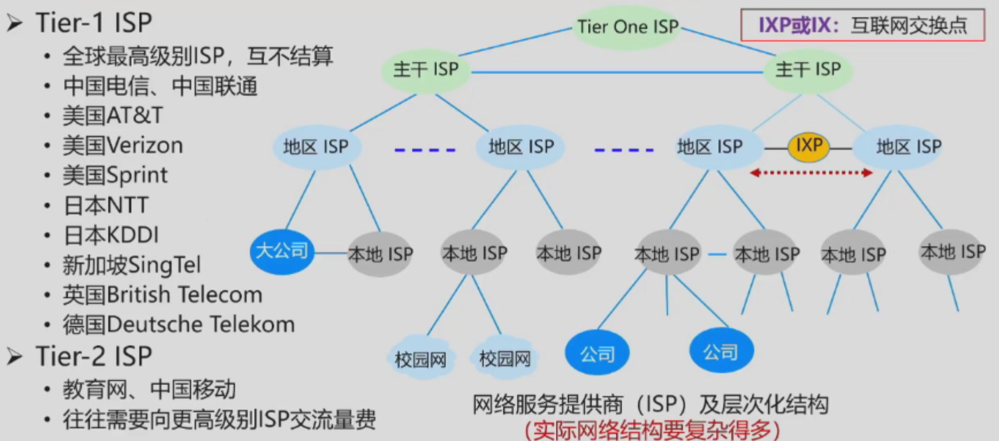

# Introduction
计算机网络：计算+通信

## 互联网的构成
### 网络分类
- 个域网PAN（Personal Area Network） 例如蓝牙耳机
- 局域网LAN（Local Area Network） 例如家里的路由器，大到一栋建筑，小到一个房间的组网
- 城域网MAN（Metropolitan Area Network） 例如城市的网
- 广域网WAN（Wide Area Network） 覆盖很大的地域范围，乃至地区，国家，甚至全球

｜互联网（Internet）｜互连网（internet）｜
|:---:|:---:|
|网络的网络|更是一种泛指｜
｜使用TCPIP协议族|whatever|

- 网络核心

- 接入网
通过异构网络边缘路由器接入网络，光纤到户；DSL；Cable（同轴电缆）；无线接入