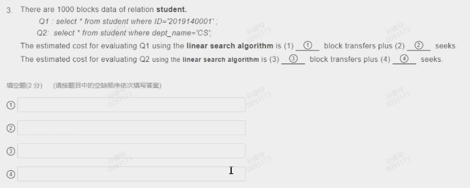
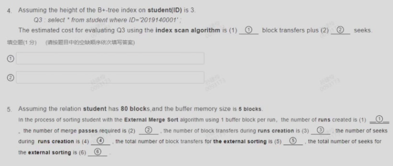
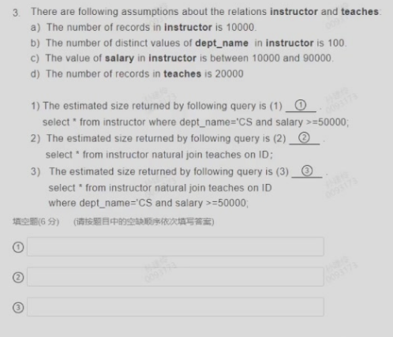

# Quiz
> 本节为sjl老师数据库课后随堂习题的汇总

## week1
1. The feature of database;
2. The duty of database administrator;

## week2
1. 关系代数的基本操作有什么
2. 不同操作之后的元祖数量

## week3
1. sql语句考察，考点完全同22.2考题
2. 考察`select p1.id from person P1, person P2 where p1.gender = p2.gender group by p1.id having count(*) > 1;`的结果即统计相同性别且人数大于二的性别的人数。
   > 由于P1和P2是同一个表做product，因此结果的数量可能大于表中行数。

## week6
1. 把ER图转化成关系模式的时候，entity中的多值属性必须单独转换成一个关系模式。
2. 把ER图转化成关系模式的时候，Many-to-Many的关系必须转换成一个关系模式。
3. 把weak entity set转换成关系模式时，构成关系模式主键的属性是：
   > The union of the discriminator of the weak entity set and the primary key of the identifying strong entity set.

## week7
$F={AB \to C, C \to D}$, set F hold on the relation R(ABCDE).
1. which functional dependency is in the closure of F?
    > $AB \to D$, $AB \to CD$.
2. The closure of the attribute set {AC} is:
    > {ACD}
3. What is the candidate key of R?
    > {ABE}
4. Which decomposition is lossless join?
    > - $R_1(A, B, C, E)$, $R_2(C, D)$ [Y]
    > - $R_1(A, B, C, E)$, $R_2(A, B, D)$ [Y]
    > - $R_1(A, B, D, E)$, $R_2(A, B, C)$ [Y]
    > - $R_1(A, B, C)$, $R_2(C, D, E)$ [N]

5. 考察Canonical Cover;
6. 考察BCNF;

## week9
1. which physical storage media is non-volatile?
    > flash memory | magnetic disk | SSD | magnetic tape | optical disk

2. which physical storage medias belong to secondary storage?
    > flash memory | magnetic disk | SSD 

3. which term represents the time that the disk controller takes to reposition the disk arm over the correct track?(考察`Performance Measures of Disks`)
    > seek time

4. What is the right approach to optimizing data access on a disk?
    > - Buffering 
    > - Read-ahead
    > - defragment the file system
    > - Non-volatile write buffer
    > - Log disk

5/6. What's MTTF & IOPS?
    > - MTTF: Mean Time To Failure
    > - IOPS: Input/Output Operations Per Second

7. What is contained in the header of slotted page?
   

8. Judge different file organization!!!

9. Which statement is incorrect? (`D`)
    > - A. For heap file organization, records can be placed anywhere in the file where there is space
    > - B. Database system seeks to minimize the num of block transfers between the disk and memory
    > - C. If the needed block is not in the buffer, the buffer manager will replace some block in the buffer.
    > - D. LRUs are the most efficient replacement policy

10. LRU Quiz

## week10
- Indexing mechanisms are used to speed up access to desired data. [Y]
- Range query returns records with an attribute value falling in a specified range of values. [Y]
- Secondary index is an index whose search key specifies an order same as the sequential order of the file. [N]
- In an dense index, index records for every search-key value appear in the index file. [Y]
- B+ tree path length is same as the height of the tree. [Y]
- If the root of a b plus tree is a leaf node, the tree has at least two children. [Y]
- In databases, a node of a b plus tree is generally the same size as a disk block. [Y]
- The leaf nodes of a b plus tree file organization store records, instead of pointers to records. [Y]
- Bitmap indices are useful for queries on multiple attributes, not particularly useful for single attribute queries. [Y]
  
1. Benefits of LSM approach: (a,b,c)
(a) Inserts are done using only sequential I/O operations.
(b) Leave nodes are full, avoid space waste.
(c) Reduced number of I/O operations per record inserted as compared to B+ tree.
(d) Queris have to search multiple trees.
(e) Entire content of each level copied multiple times.

## week 11

> A B D

> C

- 500
- 1 
- 1000 
- 1

第四题
- 4 
- 4

第五题
- 16 
- 2 
- 160 
- 32 
- 400 
- 272

- 16080 160
- 1680 16

## week 12

> A B C D

> 50 20000 100

## week13
非常知识点，把PPT构成逻辑框架即可完成