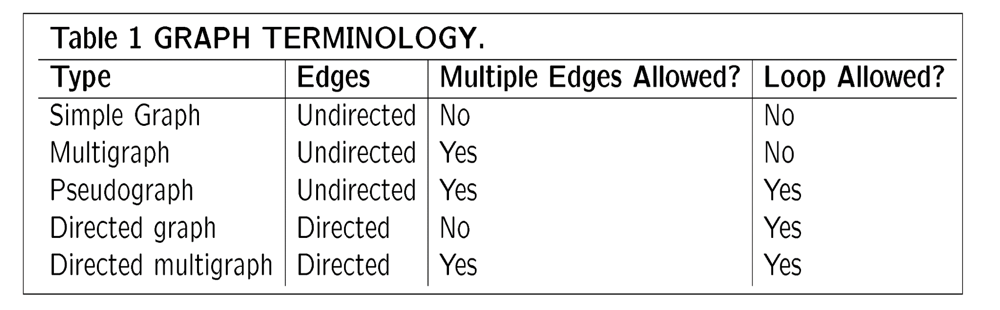

# 摘要
<!-- prettier-ignore-start -->
!!! info "注意"
    如果latex渲染未成功加载,请刷新网页!
<!-- prettier-ignore-end -->
## Chapter 1
|英文|中文|数学符号|
|:--:|:--:|----|
|disjunction|并|$\cup$|
| conjunction | 交 | $\cap$ |
| lemma | 引理 |  |

## Chapter 7 Relations

### 7.1 Relations and their properties

1. We write  $aRb$  for $(a,b) \in R$

> **Definition:** A binary relation R between A and B is a subset of Cartesian product $A \times B$ : $R \subseteq A \times B$
>
> When $A=B$, $R$ is called **a relation on** set $A$.

2. Distinguish **domain** and **range**. (just like function)

3. n-ary relation: n is called its **degree**.

4. The composite of R and S is the relation: $S \circ R = \{(a,c)|a \in A, c \in C \quad \exists b \in B\}$ such that  $(a,b)\in R$ and $(b,c)\in S$

5. Power: $R^{n+1} = R^n \circ R$

6. Inverse:$R^{-1} = \{(y,x)|(x,y) \in R\}$

7. Reflexive / Irreflexive: R is **reflexive** $\Leftrightarrow \forall x \in A, (x,x) \in R$ 

8. symmetric / antisymmetric: 

   > R is **symmetric** $\Leftrightarrow \forall x, y \in A, (x,y)\in R \Rightarrow (y,x)\in R \Leftrightarrow R^{-1} = R$
   >
   > R is **antisymmetric**: $\Leftrightarrow \forall x, y \in A, (x,y)\in R \quad and \quad (y,x)\in R \Rightarrow x = y \Leftrightarrow R \cap R^{-1} \subseteq R_=$
   >
   > Non-symmetric $\not\Leftrightarrow$ antisymmetric (eg. $R_=$)

9. R is **transitive** $\Leftrightarrow \forall x, y, z \in A((x,y)\in R \wedge(y,z) \in R) \Rightarrow (x,z)\in R$

   > **Theorem**:R on a set A is transitive if and only if $R^n \subseteq R$ for $n = 2, 3, \dots$
   >
   > **Inductive step:** $R^{n+1}$ is also a subset of $R$

### 7.2 Representing Relations

1. Matrices representation.

   > - reflexive $\Leftrightarrow$ All terms $m_{ii}$ in the main diagonal of $M_R$ are 1
   > - symmetric $\Leftrightarrow m_{ij} = m_{ji}$ for all $i,j$.
   > - anti-symmetric $\Leftrightarrow$ if $m_{ij} = 1 $ and $i\not= j$ then $m_{ij} = 0$
   > - Transitive $\Leftrightarrow$  whenever $c_{ij}$ in $C=M_R^2$ is nonzero then entry $m_{ij}$ in $M_R$ is also nonzero

2. Digraphs representation.

   > - A edge $(a,b)$, a isiInitial vertx and b is terminal vertex
   > - A edge of form $(a,a)$, called **loop**
   > - reflexible $\Leftrightarrow$ There are loops at every vertex of digraph.
   > - symmetric $\Leftrightarrow$ Every edge between distinct vertices is accompanied by a edge in the opposite direction.

### 7.3 Closures of Relations

1. **Definition:** $R \& S$ are relation,while S satisfy:

   > - S with property **P** and $R \subseteq S$
   > - $\forall S'$ with property **P** and $R \subseteq S'$ , then $S \subseteq S'$

2. **Theorem:** R be a relation on set A.

   > - The **reflexive closure** of relation R: 
   $$
   r(R) =R \cup \Delta
   $$
   , where $\Delta = \{(a,a)|a \in A\}$
   > - The **symmmetric closure** of relation R: 
   $$
   S(R) = R \cup R^{-1}
   $$

3. **Definition:** Path is a sequence of one or more edges in graph G.

   > **Theorem:**  Let R be a relation on set $A$. There is a path of length n from a to b $\Leftrightarrow (a,b) \in R^n$

4. **Definition**: The **connectivity relation** $R^* = \{(a,b)|\text{there is a path from a to b}\}$. 
   $$
   R^* = \cup^{\infin}_{n=1} R^n
   $$

   > **Theorem**: The transitive closure of R :
   $$
   t(R) = R^*
   $$

5. WARSHALL'S algorithm!

### 7.4 Equivalence Relations

1. **Definition**: Relation $R$~ : $A \leftrightarrow A$ is an **equivalence relation**, if it reflexive, symmetric and transitive.
   
2. **Definition**: Let $R: A \leftrightarrow A$ is an equivalence relation. For any $a \in A$, the **equivalence class** of a is the set of the elements related to a. 
   $$
   [a]_R = \{x\in A|(x,a) \in R\}
   $$ . 
   If $b\in [a]_R$. b is called a representative of this equivalence class.
   > The properties of equivalence classes are:
   > 1. $\forall a \in A, a[R] \not ={\emptyset}$( by reflexive, $a \in [a]_R$ )
   > 2. $\forall a,b \in A, [a]_R = [b]_R$ or $[a]_R \cap [b]_R = \emptyset$ (by symmetric and transitive) 
   > 3. $ \cup_{a\in A}[a]_R = A$ ($A \subseteq \cup_{a\in A}, [a]_R \subseteq A$)
   > 4. $[a]_R \cap [b]_R \not = \emptyset \Rightarrow [a]_R = [b]_R$ (by symmetric and transitive)

3. **Definition**: The set of all equivalence classes of R is called the **quotient set** of A by R. 
   $$
   A/R = \{[a]_R|a \in A\}
   $$
   > **Remark:**
   > 1. If A is finite, then $|A/R| $ is also finite.
   > 2. If A has n elements, and if every $[a]_R$ has m elements, then $|A/R| = n/m$

4. **Definition**: A partition $\pi$ on a set $S$ is a family of nonempty subsets of $S$ such that every element of $S$ is in exactly one of these subsets. 
   $$
   \pi = \{A_1, A_2, \dots, A_n\}\\
   1. \cup_{k=1}^n A_k =S \\ 
   2. A_j \cap A_k = \emptyset \text{ for every j,k with }j \not= k, 1 < j, k < n
   $$
   > **Theorem**: Let $R$ be an equivalence relation on a set $S$. Then the equivalence of classes of $R$ form a partition of $X$. Conversely, given a partition $\{A_i|i \in I\}$ of $S$, there is an equivalence relation $R$ on $S$ such that the equivalence classes of $R$ are the sets $A_i$.

### 7.5 Partial Orderings
1. **Definition**: A relation $R_{\preceq}$ on a set $S$ ($S \leftrightarrow S$) is a **partial ordering** if it is reflexive, antisymmetric and transitive.

2. **Definition**: The element a and b of s poset $S$ are **comparable** if either $a \preceq b$ or $b \preceq a$. Otherwise, a and b are **incomparable**.
3. **Definition**: A poset $S$ is a **total ordering** or **linear ordering** if every pair of elements of $S$ is comparable. A totaly ordered set is also called a **chain**.
4. **Lexicograpic order**: Construct a poset $S$ by taking the Cartesian product of two posets $S_1$ and $S_2$. The relation $\preceq$ on $S$ is defined by 
   $$
   (a_1, a_2) \preceq (b_1, b_2) \Leftrightarrow a_1 \preceq_1 b_1 \text{ and } a_2 \preceq_2 b_2
   $$
5. **hasse diagram**: A **hasse diagram** of a poset $S$ is a diagram that represents the poset $S$ using points and line segments. The points of the diagram are the elements of $S$, and there is a line segment between $a$ and $b$ if $a \prec b$ and there is no element $c$ such that $a \prec c \prec b$.
   > 1. Start with the directed graph for the relation.
   > 2. Remove all loops.
   > 3. Remove all edges that must be present because of the transitive property.
   > 4. Finally, arrange each edges so that its initial vertex is below its terminal vertex, Remove all arrows.

6. **Definition**: Let $(A, \preceq)$ be a partial ordered set, $B\subseteq A$.
   > 1. a is a maximal element of B if there is no element $b \in B$ such that $a \prec b$.
   > 2. b is a minimal element of B if there is no element $b \in B$ such that $b \prec a$.
   > 3. a is a greatest element of B if $a \preceq b$ for every $b \in B$.
   > 4. b is a least element of B if $b \preceq a$ for every $b \in B$. 
   > 5. a is an upper bound of B if $b \preceq a$ for every $b \in B$.
   > 6. b is a lower bound of B if $a \preceq b$ for every $b \in B$.
   > 7. a is the least upper bound of B if a is an upper bound of B and if $a \preceq c$ for every upper bound c of B.
   > 8. b is the greatest lower bound of B if b is a lower bound of B and if $c \preceq b$ for every lower bound c of B.
   >
   > **Remark:**
   > Can have many minimal/maximal elements, but only one least/greatest element.

7. **Definition**: A poset $S$ is a **lattice** if every pair of elements of $S$ has a least upper bound and a greatest lower bound.
   

## Chapter 8 Graph
1. **Definition**: A **graph** $G$ is an ordered pair $(V,E)$, where $V$ is a finite nonempty set and $E$ is a set of two-element subsets of $V$ which is called edges.
   > Definition: A **multigraph** is a graph that is permitted to have multiple edges with the same endpoints.(don't have loops)
   >
   > Definition: A **pseudograph** is a graph that is permitted to have loops.
   >**Sum table:**
   >

2. **Terminology**:
   - Two vertices u and v are **adjacent** or **neighbors** if {u,v} is an edge of G.
   - If {u,v} is an edge of G, then u and v are **incident** with the edge {u,v}.
   - The **degree** of a vertex v, denoted by deg(v), is the number of edges incident with v, with loops counted twice.(Pendant vertex: deg(v) = 1)

3. **Theorem**: Let $G = (V,E)$ be a graph with $n$ vertices and $m$ edges. Then
   $$
   \sum_{v \in V} deg(v) = 2m
   $$
   > **Corollary**(结论): The number of vertices of odd degree in any graph is even.
   > **Corollary**:
   >  $$ \sum_{i=1}^{n}{deg^{-}{v_i}} = \sum_{i=1}^{n}{deg^{+}{v_i}} = |E|$$

4. Some simple graph
   - complete graph: $K_n$ is a simple graph with n vertices and exactly one edge between each pair of distinct vertices.($|E| = \frac{n(n-1)}{2}$)
   - cycles: $C_n$ is a simple graph with n vertices $v_1, v_2, \dots, v_n$ and edges $\{v_1, v_2\}, \{v_2, v_3\}, \dots, \{v_{n-1}, v_n\}, \{v_n, v_1\}$
   - wheels: $W_n$ is a simple graph with n vertices $v_1, v_2, \dots, v_n$ and edges $\{v_1, v_2\}, \{v_2, v_3\}, \dots, \{v_{n-1}, v_n\}, \{v_n, v_1\}, \{v_1, v_3\}, \{v_1, v_4\}, \dots, \{v_1, v_n\}$
   - n-cubes: $Q_n$ is a simple graph with $2^n$ vertices $v_1, v_2, \dots, v_{2^n}$ and edges $\{v_i, v_j\}$ if and only if $v_i$ and $v_j$ differ in exactly one bit position.
   - bipartite graph: A graph $G = (V,E)$ is bipartite if $$ V = V_1 \cup V_2 \\ V_1 \cap V_2 = \emptyset$$ such that no edge has both endpoints in the same subset.
   - complete bipartite graph: $K_{m,n}$ is a bipartite graph with $m+n$ vertices $v_1, v_2, \dots, v_m$ and $u_1, u_2, \dots, u_n$ and edges $\{v_i, u_j\}$ for all $i = 1, 2, \dots, m$ and $j = 1, 2, \dots, n$.

5. New graphs from old:
   - subgraph: $G' = (V', E')$ is a subgraph of $G = (V,E)$ if $V' \subseteq V$ and $E' \subseteq E$.
   - complement: $G' = (V, E')$ is the complement of $G = (V,E)$ if $E' = \{ \{u,v\} | u,v \in V, u \not= v, \{u,v\} \not\in E\}$
   - union: $G_1 = (V_1, E_1)$ and $G_2 = (V_2, E_2)$, then $G_1 \cup G_2 = (V_1 \cup V_2, E_1 \cup E_2)$
   - join: $G_1 = (V_1, E_1)$ and $G_2 = (V_2, E_2)$, then $G_1 \vee G_2 = (V_1 \cup V_2, E_1 \cup E_2 \cup \{ \{u,v\} | u \in V_1, v \in V_2\})$

6. Representing graphs:
   - adjacency matrix: $A = (a_{ij})$ is a $n \times n$ matrix such that $a_{ij} = 1$ if $\{v_i, v_j\} \in E$ and $a_{ij} = 0$ otherwise.
   - incidence matrix: $B = (b_{ij})$ is a $n \times m$ matrix such that $b_{ij} = 1$ if $v_i$ is incident with $e_j$ and $b_{ij} = 0$ otherwise.
   - adjacency list: For each vertex $v_i$, we have a list of all vertices adjacent to $v_i$. (for directed graph, we have two lists for each vertex, one for the vertices adjacent to $v_i$ and one for the vertices from which there is an edge to $v_i$)