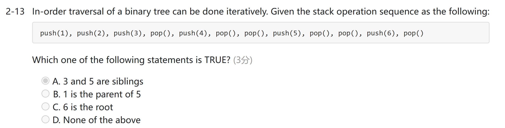
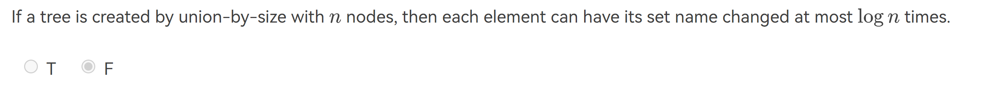

## 历年卷
### 判断题
1. In a graph G, if we have to do BFS twice to visit every one of its vertices, then there must be a cycle in G. (F) （反例：二分图） （However，DFS is true）
2. 

### 选择题
1. 用栈来模拟中序历遍
   
2.

### 程序填空题

## Quiz 4
1. 堆的综合考察：
    
<!-- prettier-ignore-start -->
??? info "大顶堆转小顶堆的线性方法"
    将一个大顶堆转换为小顶堆的线性算法可以通过一种称为"Heapify"的过程来实现。这个过程可以在线性时间内完成，具体步骤如下：
    - 从大顶堆的最后一个非叶子节点开始，依次向前遍历每个节点。
    - 对于每个节点，比较它与其子节点的值，找到其中最小的值。
    - 如果子节点的值更小，就交换节点和子节点的值。
    - 继续向前遍历，直到堆顶，这样就能够将整个大顶堆转换为小顶堆。
<!-- prettier-ignore-end -->

## Mid-term
1. 一般来说，在N较小的情况下，我们会选择$O(N^2)$的算法，而在N较大的情况下，我们会选择$O(NlogN)$的算法。因此，**并不是**所有情况下$O(N^2)$的算法都比$O(NlogN)$的算法快.
2. The answer is true. Because the depth of the set must be less than $O(logN)$.
   
3. 
4. Partial order is a precedence relation which is both transitive and irreflexive.