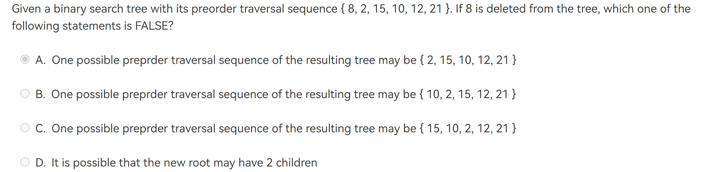
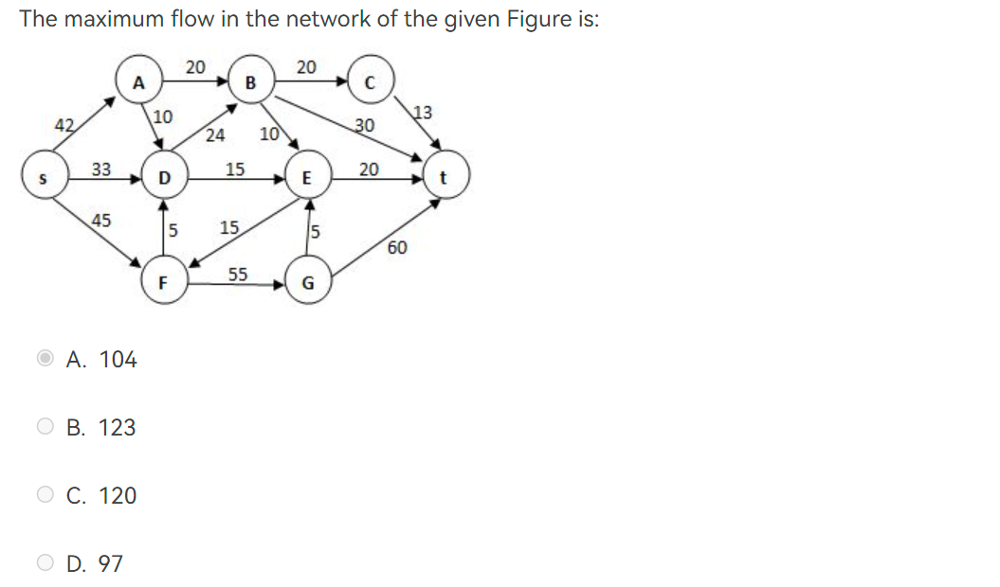

# 作业要点
这里记录着所有homework中的要点，便于复习！（预习
[TOC]


## HW1 Algorithm
<!-- prettier-ignore-start -->
!!! Note "摘要"
    === "Knowledge"
        本节你需要学会基础的算法时间和空间复杂度的分析。

    === "glossary"
        |英文|中文|
        |:--:|:--:|
        |complexity |复杂度 |
<!-- prettier-ignore-end -->

1. The Fibonacci number sequence ${F_N}$ is defined as: $F_0 = 0$, $F_1=1$,$F_N=F_{N−1}+F_{N−2}, N=2, 3, ....$ The time complexity of the function which calculates $F_N$ recursively is Θ(N!).

<!-- prettier-ignore-start -->
??? info "Tips"
    F

    在递归树中，每个节点表示一个递归调用，而树的深度表示递归的层数。对于斐波那契数列，每个节点会生成两个子节点，因为每个数都依赖于前两个数的和。

    假设我们要计算第n个斐波那契数，递归树的深度将是n。每个节点的计算时间是常数时间，因为它只涉及到简单的加法操作。

    因此，递归方法计算斐波那契数列的时间复杂度可以表示为O(2^n)。这是因为递归树的节点数是指数级增长的。
<!-- prettier-ignore-end -->


2. $$ P_1:T(1) = 1, T(N) = T(N/3)+1\\P_2:T(1) = 1, T(N) = 3T(N/3) $$

求 $P_1, P_2$ 的复杂度

<!-- prettier-ignore-start -->
??? info "Tips"
    $O(logN)$ for P1, $O(N)$ for P2
<!-- prettier-ignore-end -->

## HW2 linked-list
<!-- prettier-ignore-start -->
!!! Note "摘要"
    === "Knowledge"
        本节你需要温习在之前C语言课程中对基础ADT的使用。熟练掌握链表的操作以及基本概念是非常有必要的。

    === "glossary"
        |英文|中文|
        |:--:|:--:|
        |complexity |复杂度 |
<!-- prettier-ignore-end -->

1. **Attention：** Linear List（线性表）的初始定义是数组。
2. insertNode 函数可以背下来
<!-- prettier-ignore-start -->
??? code "code"
    ```C
    void insertNode(struct Node* head, int Element) {
        // 创建新节点
        struct Node* newNode = (struct Node*)malloc(sizeof(struct Node));
        newNode->Element = Element;
        
        newNode->Next = (head)->Next;
        (head)->Next = newNode;
    }
    ```
<!-- prettier-ignore-end -->
3. 温习``Mergesort`中merge的思想
<!-- prettier-ignore-start -->
??? code "code"
    ```C

    #define type int
    void Mergesort(type num[], int start, int end) {
        if (start >= end) return;
        int mid = start + (end-start)/2;
        Mergesort(num, start, mid);
        Mergesort(num, mid+1, end);

        Merge(num, start, mid, end);
    }

    void Merge(int num[], int start, int mid, int end) {
        int* temp = (int*)malloc((end-start+1)*sizeof(type));
        int i = start;
        int j = mid + 1;
        int k = 0;
        while (i <= mid && j <= end) {
            if (num[i] <= num[j]){
                temp[k++] = num[i++];
            } else {
                temp[k++] = num[j++];
            }
        }
        while (i <= mid) {
            temp[k++] = num[i++];
        }
        while (j <= end) {
            temp[k++] = num[j++];
        }
    }

    ```
<!-- prettier-ignore-end -->


## HW3 Stack & Queue

<!-- prettier-ignore-start -->
!!! Note "摘要"
    === "Knowledge"
        本节你需要温习在之前C语言课程中对基础ADT的使用。熟练掌握队列和栈。包括可以采用structue嵌套数组的方式来集成实现
        
        编程题：OI里将这种思想归纳为“模拟”

    === "glossary"
        |英文|中文|
        |:--:|:--:|
        |front |前 |
        |rare |后 |
<!-- prettier-ignore-end -->

1. stack pop `ooops`有多少种方式？   
<!-- prettier-ignore-start -->
??? info "Tips"
    5
    笔者第一次做时粗糙的认为是4种。最后分析认为还是画类似树形流程图最为靠谱
<!-- prettier-ignore-end -->


2. stack的一种集成方法

```C
//初始化时将top赋值为-1
typedef struct {
    int stack[MAX_SIZE];
    int top;
} Stack;

void push(Stack *s, int num) {
    s->stack[++s->top] = num;
}

int pop(Stack *s) {
    return s->stack[s->top--];
}
```

3. Suppose that an array of size 6 is used to store a circular queue, and the values of front and rear are 0 and 4, respectively. Now after 2 dequeues and 2 enqueues, what will the values of front and rear be?
   
<!-- prettier-ignore-start -->
??? info "Tips"
    [] Unfinished!
    2 0
<!-- prettier-ignore-end -->

## HW4 Binary tree
<!-- prettier-ignore-start -->
!!! Note "摘要"
    === "Knowledge"
        本节你需要学习二叉树的一些基础概念与操作。
        
        函数题充分展现了递归思想，编程题是对之前知识的综合使用

    === "glossary"
        |中文|英文|概念|
        |:--:|:--:|:--:|
        |根节点|root node|位于二叉树顶层的节点，没有父节点|
        |叶节点|leaf node|没有子节点的节点，其两个指针均指向| 
        |边|edge|连接两个节点的线段，即节点引用（指针）|
        |层|level|从顶至底递增，根节点所在层为 1 |
        |度|degree|节点的子节点的数量。在二叉树中，度的取值范围是 0、1、2 |
        |高度|height|从根节点到最远叶节点所经过的边的数量|
        |深度|depth|从根节点到该节点所经过的边的数量|
        |高度|height|从距离该节点最远的叶节点到该节点所经过的边的数量|
        |遍历|traversal| |
<!-- prettier-ignore-end -->


下面先让我们看看基本概念吧（From hello-algo）
<!-- prettier-ignore-start -->
??? info "二叉树基本概念"
    === "完美二叉树 perfect BT"
        
    === "平衡二叉树 balance BT"
        
    === "完全二叉树 complete BT"
        
    ===  "完满二叉树 full BT"
        
<!-- prettier-ignore-end -->

1. There exists a binary tree with 2016 nodes in total, and with 16 nodes having only one child.

<!-- prettier-ignore-start -->
??? info "Tips"
    F 本题是个脑经急转弯题目
<!-- prettier-ignore-end -->

2. Given a tree of degree 3. Suppose that there are 3 nodes of degree 2 and 2 nodes of degree 3. Then the number of leaf nodes must be ____.

<!-- prettier-ignore-start -->
??? info "Tips"
    8
    
    通解：
    1. 算儿子， $ 3n_3+2n_2+n_1+1=N $
    2. 算所有， $ n_3+n_2+n_1+n_0=N $

    需要注意的概念：
    结点的度（Degree）：结点的子树个数
    树的度：树的所有结点中最大的degree
<!-- prettier-ignore-end -->

3. If a general tree T is converted into a binary tree BT, then which of the following BT traversals gives the same sequence as that of the post-order traversal of T?

<!-- prettier-ignore-start -->

??? info "Tips"
    [普通树转二叉树](https://blog.csdn.net/best_LY/article/details/121346561)

    可以这样浅显的理解：
    1. 在所有兄弟节点间添加一条连线
    2. 对每个节点，除了保留与第一个儿子的连线外，删除别的连线。
    
<!-- prettier-ignore-end -->

!!! Note "conclusion"
    T的preorder = BT的preorder
    T的postorder = BT的inorder

1. Threaded Binary Trees(一种对二叉树的优化，老师不讲但要掌握) 
!!! Note 
    [线索二叉树](./tree.md#实现)
    
    一个直观的快速解题的方法便是写出原本树的遍历结果，然后用使用左右指针与它的前后值接起来即可！


## HW5
1. In a binary search tree which contains several integer keys including 4, 5, and 6, if 4 and 6 are on the same level, then 5 must be their parent.

<!-- prettier-ignore-start -->
??? info "Tips"
    F 5 could be their grandparents
<!-- prettier-ignore-end -->
2. 2-3<!-- prettier-ignore-start -->
!!! note "Question"
    
<!-- prettier-ignore-end -->
3. 什么是decision tree?
4. A binary search tree if ood nodes, 如果我们选`i/2`，之后每次都选`i/2`；选`i/2+1`则都选`i/2+1`。


## HW6
1. heap两种插入方式，具体可见hello算法书
2. 编程题有序数字串建完全二叉树可以利用中序历遍的思想来建树
3.  红黑树？

## HW7
1. In Union/Find algorithm, if Unions are done by size, the depth of any node must be no more than $N/2$ , but not $O(logN)$.
<!-- prettier-ignore-start -->
??? info "Tips"
    F 假设最初每个节点的深度都为0，那么在进行N-1次按大小合并后，每个节点的深度最多为1。因此，任意节点的深度不会超过N/2。
    需要注意的是，这个结论是在按大小合并的情况下成立的。如果使用其他合并策略，例如按秩合并（将深度较小的树合并到深度较大的树中），那么节点的深度可能会更小，甚至可能达到O(logN)。
<!-- prettier-ignore-end -->


2. The array representation of a disjoint set containing numbers 0 to 8 is given by { 1, -4, 1, 1, -3, 4, 4, 8, -2 }. Then to union the two sets which contain 6 and 8 (with union-by-size), the index of the resulting root and the value stored at the root are:

<!-- prettier-ignore-start -->
??? info "Tips"
    4 -5
<!-- prettier-ignore-end -->

3. Let T be a tree created by union-by-size with N nodes, then the height of T can be .
<!-- prettier-ignore-start -->
??? info "Tips"
    at most $log(N) + 1$
<!-- prettier-ignore-end -->

4. A relation R is defined on a set S. If for every element e in S, "e R e" is always true, then R is said to be **reflexive** over S.

## HW8 Graph
> 1. 图论中的degree是指与该节点所连接的边的个数
>    By contrast， 树中的degree是指子节点的个数
1. In a connected graph, the number of edges must be equal or greater than the number of vertices minus 1.
2. A graph with 90 vertices and 20 edges must have at least __ connected component(s)

<!-- prettier-ignore-start -->
??? info "Tips"
    70

<!-- prettier-ignore-end -->

## HW9 Shortest_Path
1. Let P be the shortest path from S to T. If the weight of every edge in the graph is incremented by 2, P will still be the shortest path from S to T.
<!-- prettier-ignore-start -->
!!! Note "key"
    F

    Because if shortest road has 6 nodes with 12 while 2nd-shortest road has 4 nodes with 13. After every edge incremented by 2. The last shortest road is 24 while last 2nd-shortest road is 21 which means it is the current shortest road!
<!-- prettier-ignore-end -->

2. Use Dijkstra algorithm to find the shortest paths from 1 to every other vertices. In which order that the destinations must be obtained?
   

## HW10 MST & Maxstream 
> [x] Finished
> 本次作业，你需要对最小生成树（minimum spanning tree）的两个算法清晰的记忆，关于最大流应当学会计算。
1. The minimum spanning tree of any weighted graph ____
<!-- prettier-ignore-start -->
??? info "Tips"
    May not exits.  
    Exit if it is connected.
<!-- prettier-ignore-end -->

2. An example question about max stream.

<!-- prettier-ignore-start -->
??? info "Question"
    
<!-- prettier-ignore-end -->

## HW11 DFS & InsertionSort
<!-- prettier-ignore-start -->
!!! Note "摘要"
    === "Knowledge"
        [] finshed?
        1. 本节需要掌握'biconnected"([重连接](https://www.cnblogs.com/bless/archive/2008/07/30/1256875.html))相关的知识
        2. u is an articulation point if
        > (1)  u is the root and has at least 2 children;  or
        > (2)  u is not the root, and has at least 1 child such that  $Low(child) \ge Num(u)$
        3. Euler circuit: 简单来说就是“一笔画”问题，可看[Eular path](https://discrete.openmathbooks.org/dmoi2/sec_paths.html)
        4. 以及你需要对dfs以及排序有熟练掌握（相信学到这里应该没有不熟练的了吧hhhh
        
    === "glossary"
        |英文|中文|
        |:--:|:--:|  
        |articulation point |关节点 |
        |biconnected | 重联通|

<!-- prettier-ignore-end -->


1. For a graph, if each vertex has an even degree or only two vertexes have odd degree, we can find a cycle that visits every edge exactly once
<!-- prettier-ignore-start -->
??? info "Tips"
    F

    It has to be a Euler Cycle, thus only if each vertex has even degrees；Euler Circuit -> exact 2 vertices have odd degrees / all vertices have even degrees
    
    
<!-- prettier-ignore-end -->

2. Apply DFS to a directed acyclic graph, and output the vertex before the end of each recursion. The output sequence will be:
<!-- prettier-ignore-start -->
??? info "Tips"
    acyclic graph -> 无环图
<!-- prettier-ignore-end -->

3. Graph G is an undirected completed graph of 20 nodes. Is there an Euler circuit in G? If not, in order to have an Euler circuit, what is the minimum number of edges which should be removed from G?
<!-- prettier-ignore-start -->
??? info "Tips"
    Each Node has exactly 19 degrees

    - Euler Circuit (Strong Form) requires every node to be even degrees

    - Euler Tour (Weak Form) requires 0 or 2 odd degrees

    Remove 1 edge, every 2 nodes will lose 1 degrees, so we lose 10 edges
<!-- prettier-ignore-end -->


## HW12 sort
<!-- prettier-ignore-start -->
!!! note "摘要"
    === "Knowledge"
        本节你将学习到各种排序算法的思想以及实现。并且需要掌握各种排序算法的时间复杂度以及空间复杂度。

        其中值得注意的是shell sort和heap sort的实现，以及对于quick sort的理解。

<!-- prettier-ignore-end -->
1. Shellsort的实现如下：
<!-- prettier-ignore-start -->
??? code "Shellsort"

    ```C
    // Shellsort
    void Shellsort( ElementType A[ ], int N ) 
    { 
        int  i, j, Increment; 
        ElementType  Tmp; 
        for ( Increment = N / 2; Increment > 0; Increment /= 2 )  
        /*h sequence */
        for ( i = Increment; i < N; i++ ) { /* insertion sort */
            Tmp = A[ i ]; 
            for ( j = i; j >= Increment; j - = Increment ) 
            if( Tmp < A[ j - Increment ] ) 
                A[ j ] = A[ j - Increment ]; 
            else 
                break; 
            A[ j ] = Tmp; 
        } /* end for-I and for-Increment loops */
    }
    ```
<!-- prettier-ignore-end -->

2. Heapsort的实现如下：
<!-- prettier-ignore-start -->
??? code "Heapsort"

    ```C
    void PercDown( ElementType A[ ], int i, int N ) 
    { 
        int  Child; 
        ElementType  Tmp; 
        for ( Tmp = A[ i ]; LeftChild( i ) < N; i = Child ) { 
            Child = LeftChild( i ); 
            if( Child != N - 1 && A[ Child + 1 ] > A[ Child ] ) 
                Child++; 
            if( Tmp < A[ Child ] ) 
                A[ i ] = A[ Child ]; 
            else 
                break; 
        } 
        A[ i ] = Tmp; 
    } 

    void Heapsort( ElementType A[ ], int N ) 
    { 
        int  i; 
        for ( i = N / 2; i >= 0; i-- ) /* BuildHeap */
            PercDown( A, i, N ); 
        for ( i = N - 1; i > 0; i-- ) { 
            Swap( &A[ 0 ], &A[ i ] ); /* DeleteMax */
            PercDown( A, 0, i ); 
        } 
    }
    ```