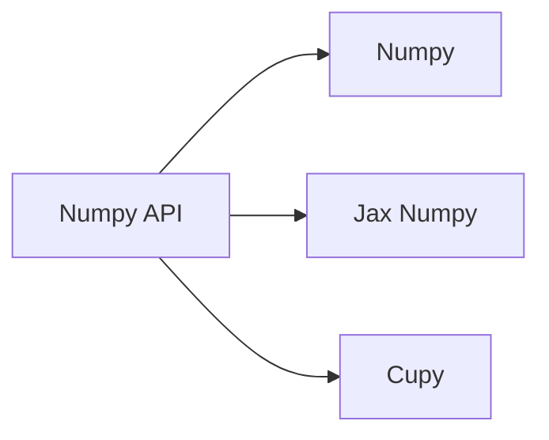

# 7月8日 向量化并行计算基础

* python、numpy 、向量化计算……

* 向量化计算是什么？

* Array Programming 对数组直接进行运算操作
* Automatic/Manual vectorization

## What is array programming


1. c语言完成的矩阵乘法，是从基本乘法一个个规定元素的计算。

> 实现效率低；代码耦合；代码复用困难


2. 高层次向量化的核心：计算语意与调度分离。

> 1. 编写程序可以专注于计算语义本身，不需要分心如何高效实现算子
> 2. 灵活使用第三方库提供的高性能实现大幅节约开发成本
> 3. 代码具有更高的可移植性，同一份代码可以使用不同的后端实现加速




## Numpy

[NumPy](https://numpy.org/) 是 Python 中科学计算的基础包。它是一个 Python 库，提供多维数组对象，各种派生对象（如掩码数组和矩阵），以及用于数组快速操作的各种 API，有包括数学、逻辑、形状操作、排序、选择、输入输出、离散傅立叶变换、基本线性代数，基本统计运算和随机模拟等等。

Numpy 代码一般采用向量化（矢量化）描述，这使得代码中没有任何显式的循环，索引等，这样的代码有以下好处：

- 向量化代码更简洁，更易于阅读
- 更少的代码行通常意味着更少的错误
- 代码更接近于标准的数学符号

另外，向量化的代码能够规避掉 Python 中缓慢的迭代循环，被底层的实现更好的调度，如接入 BLAS 矩阵运算库，从而实现更高的性能。

### NumPy API

由于课上已经介绍过这部分内容，具体可以参考 NumPy 的[文档](https://numpy.org/doc/stable/)（真的一定一定要好好查文档，很多人可能会说速通怎么样，但我觉得还是要打好python的基础。）

### 可能的调度优化

并行：多个核心一起计算

SIMD：使用处理器的SIMD指令加速

Trade Off 是门艺术！！！

### NumPy使用

（ps：这里推荐一个b站up主“奇乐编程学院”，他的视频的凝聚度很高，适合速通）

```python
import numpy as np
>>> a = np.zeros((3,2)) # initialize the matrix
>>> a.shape # got the size
(3,2)

>>> a = np.ones((2,4))
a = array([[1,1,1,1],
           [1,1,1,1]])

>>> np.arange(3,7)
array([3, 4, 5, 6])

# random elements
>>> np.random.rand(2,4)
array([[0.26649161, 0.92231931, 0.9729259 , 0.4400486 ],
       [0.80943781, 0.53395907, 0.16488674, 0.33438204]])

>>> np.linspace(0,1,5) # notice the spell
array([0.  , 0.25, 0.5 , 0.75, 1.  ])

# numpy中默认的数据类型是64位浮点数，但我们可以自己指定，如下：
>>> a = np.zeros((4,2), dtype = np.int32)

>>> a
array([[0., 0.],
       [0., 0.],
       [0., 0.],
       [0., 0.]])
>>> a.dtype
dtype('float64')
>>> a = a.astype(int)
>>> a.dtype
dtype('int64')

# 两个相同位置的数组，可以直接进行四则运算。它会将数组同位置的元素进行加减乘除
# 点乘是使用dot函数
# @是矩阵乘法运算
>>>a = np.array([1,2,3])
>>>b = np.array([4,5,6])
>>>np.dot(a,b)
32

#求平方根/sin/cos/log/power
>>> a
array([1, 2, 3])
>>> np.sqrt(a)
array([1.        , 1.41421356, 1.73205081])
>>> np.sin(a)
array([0.84147098, 0.90929743, 0.14112001])

# 广播
>>> a
array([1, 2, 3])
>>> a*5
array([ 5, 10, 15])
>>> b
array([[1],
       [2],
       [3]])
>>> a+b
array([[2, 3, 4],
       [3, 4, 5],
       [4, 5, 6]])

# min 或者 max，返回数组最小或最大
# argmin 或者 argmax会返回最小或最大的索引
# sum会返回所有数据的总和
# mean或者median会返回数据的平均值
# var是方差，std是标准方差等
# 以上可以指定axis，axis=0代表第一个维度行，=1代表列
>>> c
array([[2, 3, 4],
       [3, 4, 5],
       [4, 5, 6]])
>>> c.sum(axis=0)
array([ 9, 12, 15])
>>> c.min(axis=0)
array([2, 3, 4])
>>> c.mean(axis=0)
array([3., 4., 5.])
>>> c.var(axis=0)
array([0.66666667, 0.66666667, 0.66666667])

# 与python list相同，可以有许多新奇的操作如下
>>> c
array([[2, 3, 4],
       [3, 4, 5],
       [4, 5, 6]])
>>> c[0,1]
3
# 注意：与c不同，与和或只打一个符号
>>> c[(c>3) & (c%2 == 0)]
array([4, 4, 4, 6])
>>> c[0,0:2]
array([2, 3])
>>> a[0:] || a[0]
array([1, 2, 3])
>>> a[0:3:2]
array([1, 3])
>>> a[::-1]
array([3, 2, 1])

```

更深入的学习可以参加[From python to numpy](https://www.labri.fr/perso/nrougier/from-python-to-numpy/)


### 使用技巧

* 向量化除了单个算子内部的调度优化外，可以不一个算子一个算子的执行，所有需要执行的算子可以构成**计算图**
* 在计算图上的调度优化不再局限于算子内部，而可以跨算子消除冗余，增强缓存友好型减少访存，并行执行多个算子等等更灵活的优化。


## Automatic/Manual vectorization

###　Automatic vectorization

编译器会自动识别并将你的代码向量化

> Single Instruction Multiple Data. Generally speaking, SIMD is combined with SSE and AVX.
