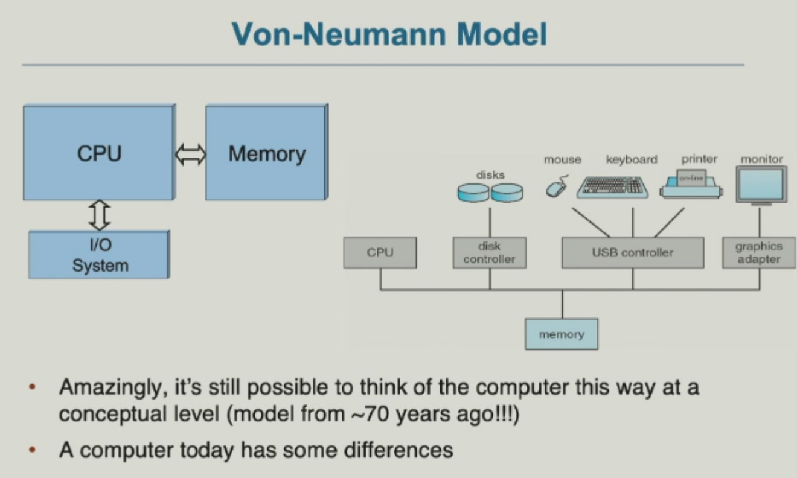
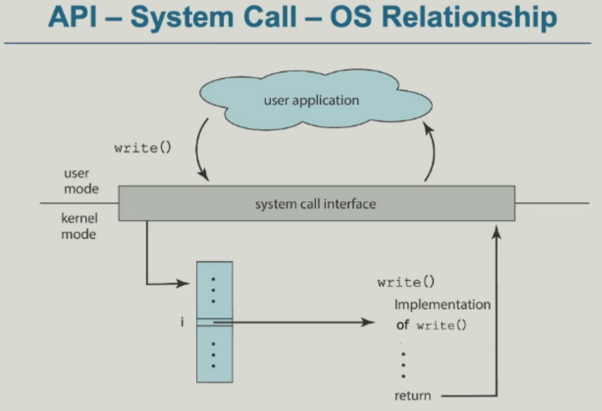
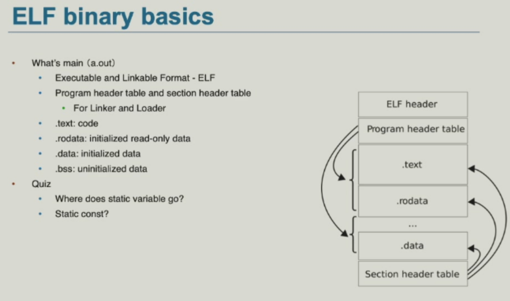
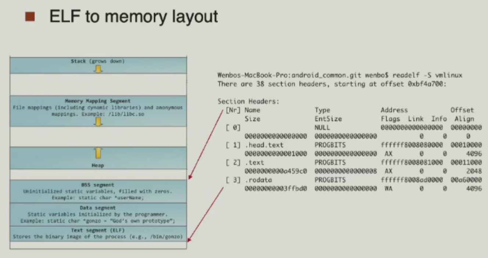
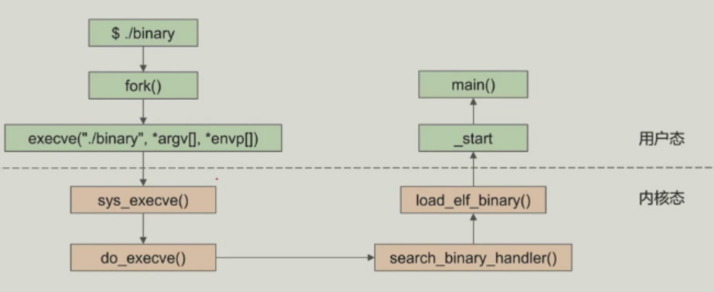
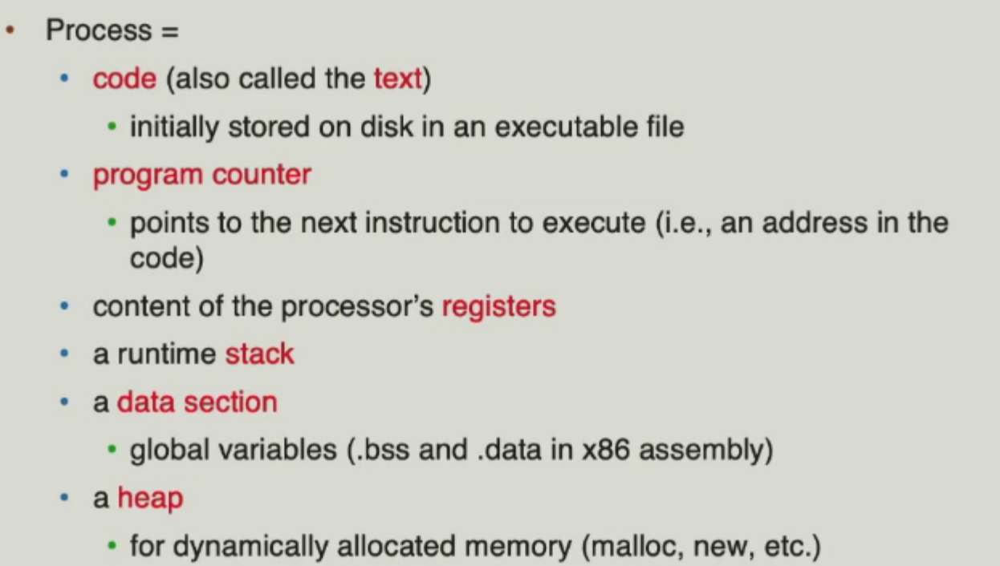
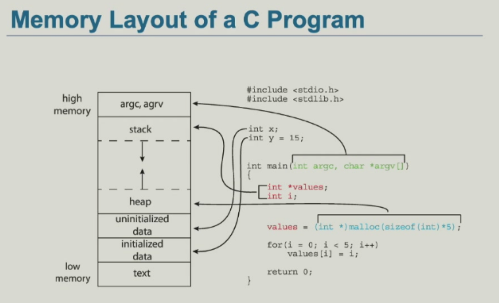
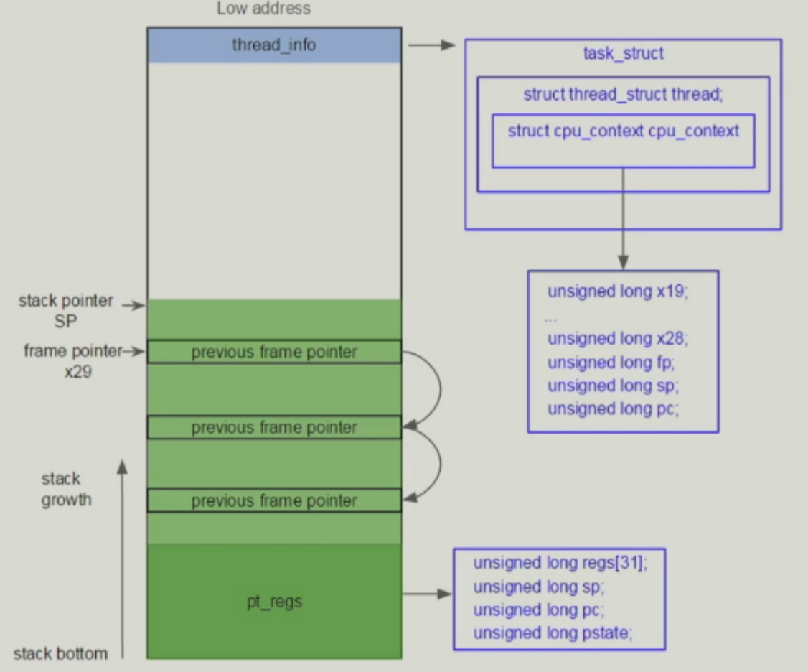
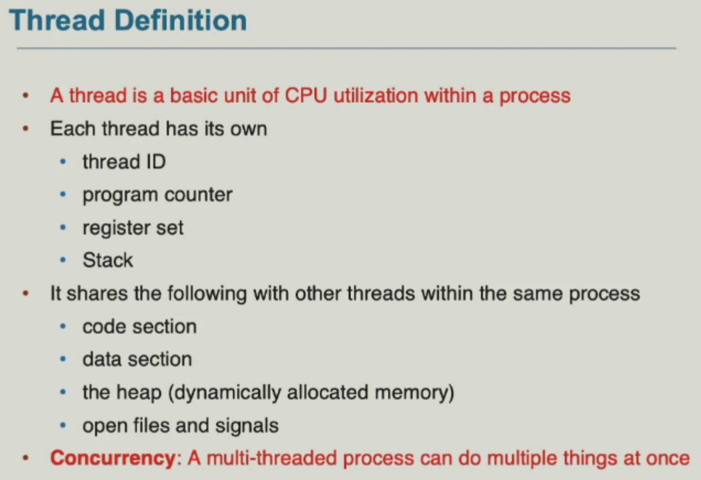
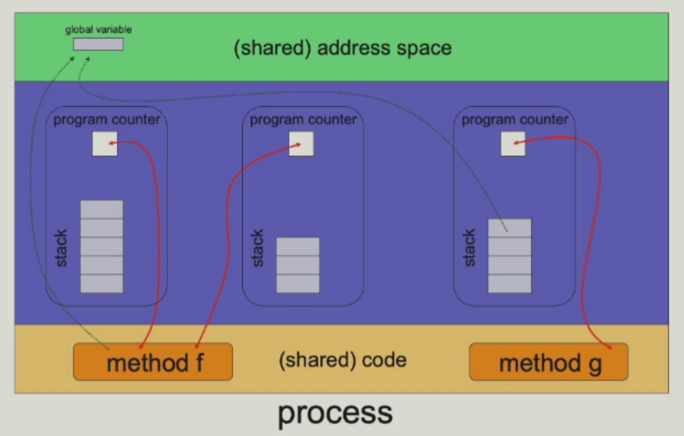

# Mid Review

- Computer architecture
- OS overview
- OS structure
- Process management
  - schedule
  - IPC
  - Thread
  - synchronization
  - deadlock

## OS overview & structures
OS is a **resource abstractor and allocator**
所有和硬件资源有关的操作都是privileged的，所以需要OS来管理。

OS is a **control program**

There are two kinds of events: **interrupt** and **trap**.

### system call
system call is a **software trap**.
<!-- prettier-ignore-start -->
!!! note "normal syscall"
    x86-32: `int 0x80`
    x86-64: `syscall`
    ARM: `svc`
    MIPS: `ecall`
<!-- prettier-ignore-end -->

**syscall table** 里的 **index** 是 syscall number，对应的是 syscall handler 的地址。

不同thread的context是不同的，所以需要 **context switch**。会分别存放到thread对应的kernel stack里， 存放pt_regs, pc, sp等。

最后调用`ret_to_user`返回到user。

- 需要明晰dynamic link和static link的优缺点
- dynamic通过`.interp`找到`ld-linux.so`，然后找到`.dynsym`，最后找到`.text`。

`execve`会把新的程序加载到内存中，调度所需要的内容。

> `entry point address` 是 `_start` 的地址，里面会调用 `__libc_start_main` 函数，里面才调用 `main()` 函数。并且存到user的pc里。

<!-- prettier-ignore-start -->
??? info "必考两个图"
    
    
<!-- prettier-ignore-end -->

要区分Policy和Mechanism，Policy是决策，Mechanism是实现。

## Process
A process is a program in execution.

<!-- prettier-ignore-start -->
!!! note "神图"
    
<!-- prettier-ignore-end -->

### 五个状态

- fork() 会复制父进程的PCB，但是不会复制内存，只是共享内存。
- exec() 会把新的程序加载到内存中，调度所需要的内容。
- wait() 会等待子进程结束，然后返回子进程的状态。

一定要会数有多少个进程

之后讲了orphan和zombie进程，以及进程的创建和销毁。

> Process schedule：有多少个`schedule`就有多少个`queue`

### CPU switch to
要明晰context switch的神图

<!-- prettier-ignore-start -->
!!! note "内核的"
    多了pt_regs；以及有大小限制
<!-- prettier-ignore-end -->

`task_struct`相当于PCB，里面有`mm_struct`，`files_struct`等。
以及caller saved和callee saved。

context_switch 没有单独的`syscall`，只是timer调用后自动schedule了。

<!-- prettier-ignore-start -->
!!! note "为什么fork会返回两个值"
    因为会有两个context，一个是父进程的，一个是子进程的；分别返回0和子进程的pid。
<!-- prettier-ignore-end -->

两个pc的值区别在于，task_struct里的`thread_info`的cpu_context里的`pc`存的是kernel的地址，而`pt_regs`里的`pc`存的是user的地址。

## IPC
- shared memory和message passing

## Thread

<!-- prettier-ignore-start -->
!!! graph "神图"
    
<!-- prettier-ignore-end -->

是red-hat帮助linux开发的thread的实现。
一般来说是使用one to one的mapping

## Synchronization
semaphore里必须有spinlock，因为有可能会被打断。
要明晰四个概念
这里一般来说会出一个大题