# 2 Instructions

!!! warning
    本章部分内容建立在掌握至少一门汇编语言的基础上，例如修读过计算机系统概论或汇编语言等课程。
    可能姜老师班上的同学会传承zzh学长给你们留的作业哟。放个网站https://hackmd.io/@gofzKoaiTI6mFzp4FTuenw/HJg3Q-lb6， 大家自行保重🙏。

我们讨论过，计算机的 performance 受 **#inst, clock cycle time 和 clock cycles per inst (CPI)** 决定。给定一个程序，需要使用的 #inst 受编译器和 inst set architecture 决定。

本章介绍 RISC-V 的 ISA。

<!-- prettier-ignore-start -->
???+ question "Preview Question"
    
<!-- prettier-ignore-end -->

### 2.1 寄存器，寻址方式

#### 寄存器

RISC-V architecture 提供 32 个数据寄存器，分别命名为 `x0` ~ `x31` ，每个寄存器的大小是 `64` 位。在 RISC-V architecture 中，一个 **word** 为 32 位，一个 **doubleword** 为 64 位。这些寄存器中的一部分有专门的用途，我们稍后对其进行讨论。

RISC-V architecture 也提供一系列浮点数寄存器 `f0` ~ `f31` ，这不是我们讨论的重点。

#### 寻址

RISC-V architecture 的地址是 64 位的，地址为字节地址，因此总共可以寻址 $2^{64}$ 个字节，即 $2^{61}$ 个 dword (doubleword, 下同)，因为一个 dword 占 $\log_2{\frac{64}{8}}=3$ 位。

在一些 architecture 中，word 的起始地址必须是 word 大小的整倍数，dword 也一样，这种要求称为 **alignment restriction**。RISC-V 允许不对齐的寻址，但是效率会低。

RISC-V 使用 **little endian** 小端编址。也就是说，当我们从 0x1000 这个地址读出一个 dword 时，我们读到的实际上是 0x1000~0x1007 这 8 个字节，并将 0x1000 存入寄存器低位，0x1007 存入高位。

> 一个记忆方法是，如果你将地址横着写，即从左到右递增，那么对于大端来说是比较自然的，但是对于小端来说会比较不自然。以上面的 `0A0B0C0D` 为例子，大端为从低地址到高地址是 `0A` `0B ` `0C` `0D`，而小端从低到高地址则是 `0D` `0C` `0B` `0A`。

RISC-V 支持 PC relative 寻址、立即数寻址 ( `lui` )、间接寻址 ( `jalr` )、基址寻址 ( `8(sp)` )：

<!-- prettier-ignore-start -->
??? info "Different addressing modes details"
    1. 直接寻址（Direct Addressing）:
    直接寻址是最简单的寻址方式。在这种模式下，指令中直接包含了操作数的地址。这意味着程序计数器（PC）从指令中获取内存地址，然后直接访问该地址中的数据。
    例如，如果有一个指令LOAD 2000，这里的2000就是操作数的直接地址。CPU将直接从内存地址2000处读取数据。

    2. 寄存器寻址（Register Addressing）:
    寄存器寻址是指指令直接引用CPU内部的寄存器来获取或存储操作数。这种方式非常快速，因为寄存器位于CPU内部，访问速度远高于内存。
    例如，如果有一个指令ADD R1, R2，这里的R1和R2是寄存器的编号。CPU将使用这些寄存器中存储的数据进行加法操作。

    3. 基址寻址（Base Addressing）:
    在基址寻址中，指令包含一个基址寄存器和一个偏移量。CPU将基址寄存器中的值与偏移量相加，形成最终的内存地址。
    例如，LOAD R0, [R1+100]，这里R1是基址寄存器，100是偏移量，CPU将计算R1+100得到实际地址。

    4. 相对寻址（Relative Addressing）:
    相对寻址涉及到使用程序计数器（PC）或指令中的偏移量来确定操作数的地址。这种方式常用于实现跳转指令。
    例如，JMP PC+100，这里PC是程序计数器，100是相对于当前PC的偏移量。

<!-- prettier-ignore-end -->

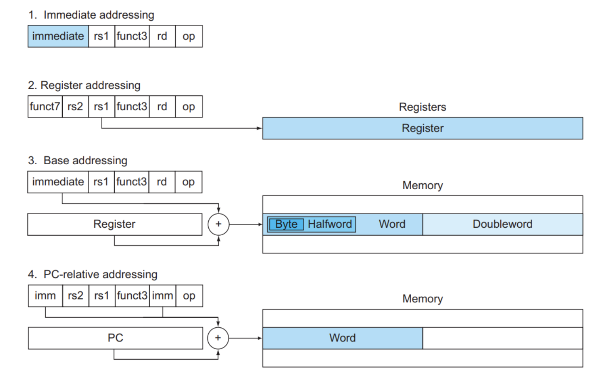

#### 补码 2's complement

$x + \bar x = 111\dots111_2 = -1$，因此 $-x = \bar x + 1$。前导 0 表示正数，前导 1 表示负数。[See also](https://www.yuque.com/xianyuxuan/coding/sca003#VqE99)

> 唯一值得一提的是`INT_MIN`值为$-2^{31}$, `INT_MAX`值为$2^{31}-1$，因为 `-INT_MIN` 会溢出。

<!-- prettier-ignore-start -->
!!! note "different complement"
    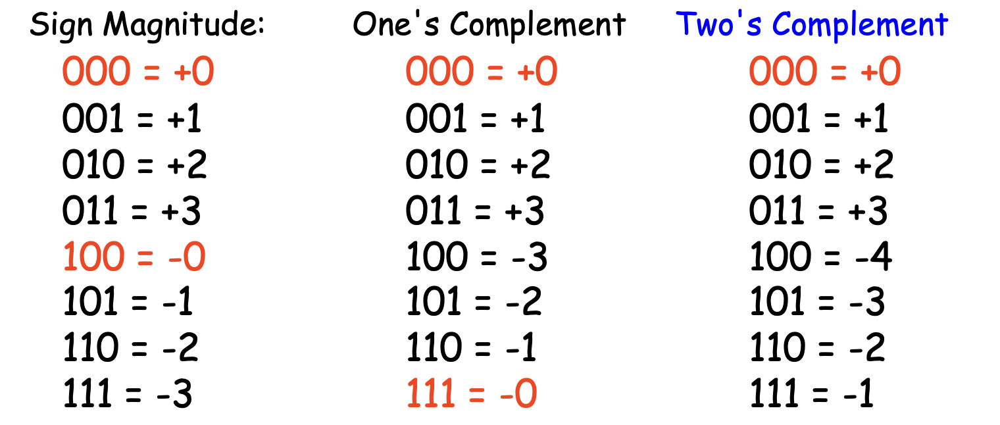
<!-- prettier-ignore-end -->

因此在将不足 64 位的数据载入寄存器时，如果数据是无符号数，只需要使用 0 将寄存器的其他部分填充 (**zero extension**)；而如果是符号数，则需要用最高位即符号位填充剩余部分，称为符号扩展 (**sign extension**)。
<!-- prettier-ignore-start -->
??? info "Sign extension"
    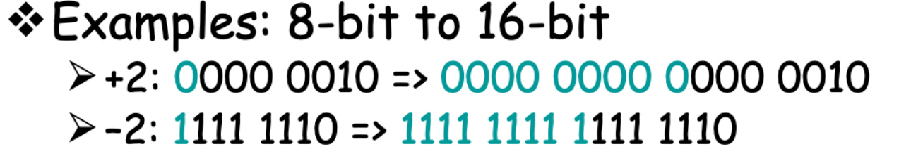
<!-- prettier-ignore-end -->

即，在指令中的 `lw` ,  `lh` ,  `lb` 使用 sign extension，而 `lwu` ,  `lhu` ,  `lbu` 使用 zero extension。

!!! info "18~19 Final"
    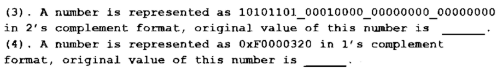
    
    ??? info "答案"
        -0x52F00000, -0x0FFFFCDF

### 2.2 arithmetic shift
在数逻中我们学到的全加器和半加器再不多赘述，下面我们看看RISC-V的拓展版本：
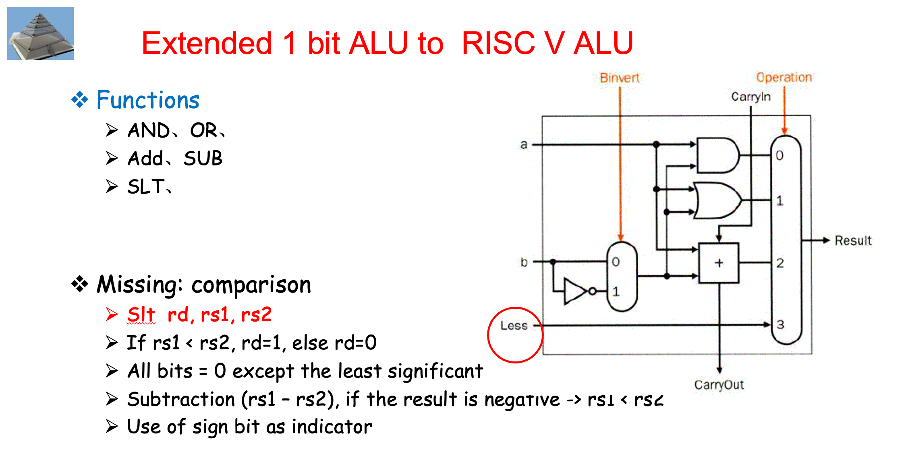

### 2.3 指令，指令格式

课本上介绍的 RISC-V 指令（ `lr.d` ,  `sc.d` 被省略了）列表如下：

> 在 RISC 指令集中，只有 load 系列和 store 系列指令能够访问内存。

RISC-V 的跳转指令的 offset **是基于当前指令的地址的偏移**；这不同于其他一些汇编是基于下一条指令的偏移的。即如果是跳转语句 `PC` 就不 +4 了，而是直接 +offset。

 `lw` ,  `lwu` 等操作都会清零高位。

**RISC-V 指令格式如下：**

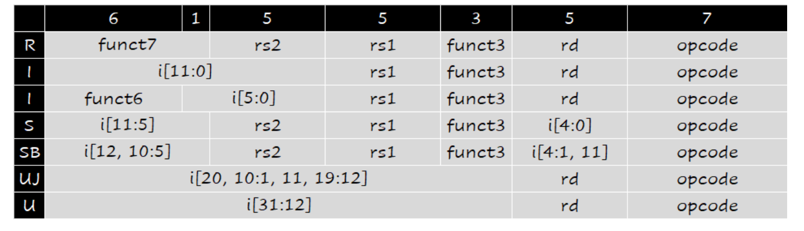
其中 `I` 型指令有两个条目；这是因为立即数移位操作 `slli` , `srli` , `srai` 并不可能对一个 64 位寄存器进行大于 63 位的移位操作，因此 12 位 imm 中只有后 6 位能实际被用到，因此前面 6 位被用来作为一个额外的操作码字段，如上图中第二个 `I` 条目那样。其他 `I` 型指令适用第一个 `I` 条目。

另外，为什么 `SB` 和 `UJ` 不存立即数（也就是偏移）的最低位呢？（关注表格，可以发现只包括 `i[12:1]` 或者 `i[20:1]`，缺失 `i[0]`）因为，偏移的最后一位一定是 0，即地址一定是 2 字节对齐的，因此没有必要保存。

??? question "既然每个指令都是 4 字节对齐的，为什么不是最后两位都省略，而是只省略一位呢？"
    实际上，是存在指令长为 2 字节的 extension 的，只不过我们没学：
    
    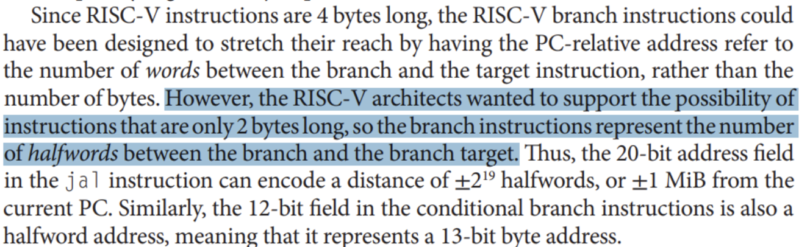
    
    
课本 P116

    

    
RISC-V Spec V20191213 P15

### 2.3 伪指令及其实现

注： `j imm` 也可以用 `beq x0, x0, imm` 实现，但是此法的 `imm` 的位数会较短，所以不采用。

<!-- prettier-ignore-start -->
??? info "指令总结"
    - lw和sw指令的偏移量是字节偏移量。此外对应着寄存器和内存的数据传输。
<!-- prettier-ignore-end -->

### 2.4 分支和循环
### 2.5 循环
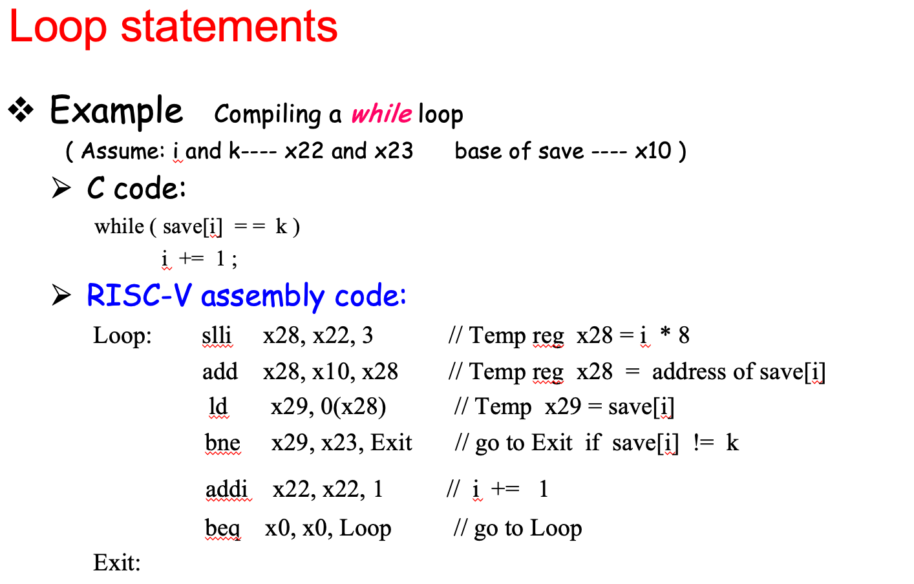

### 2.6 分支
> beq 12位，jalr 20 位。

| jalr | switch |
| ---- | ------ |
|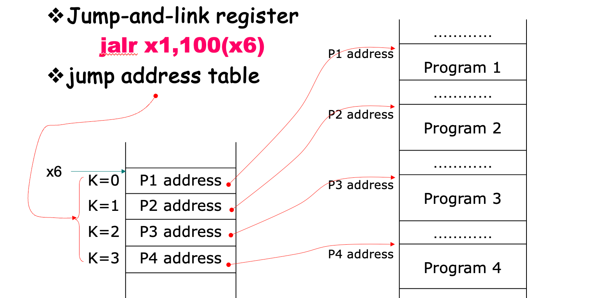 | 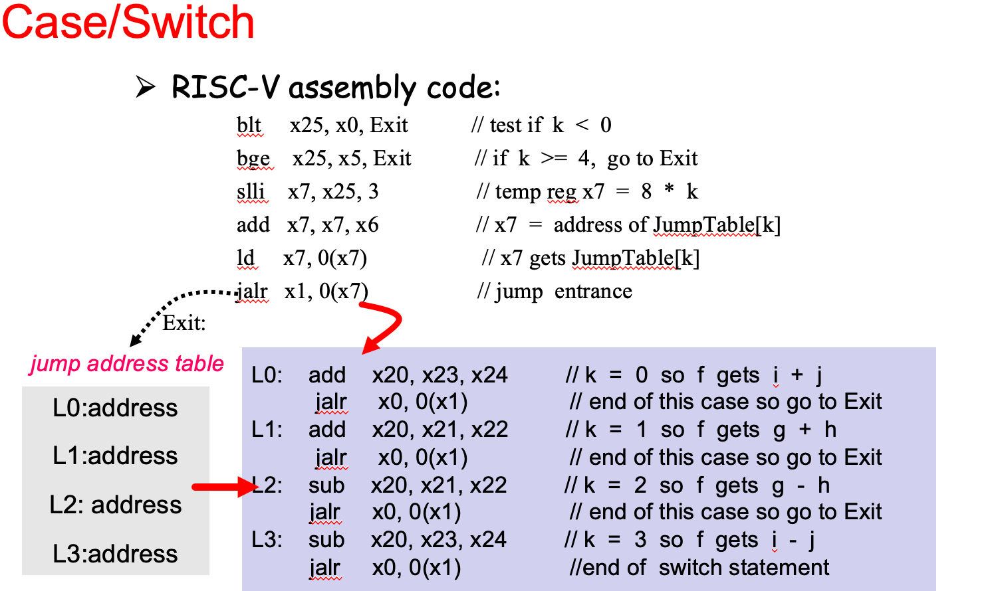 |

### 2.7 过程调用和栈
RISC-V 约定：

   -  `x5` - `x7` 以及 `x28` - `x31` 是 temp reg，如果需要的话 caller 保存；也就是说，不保证在经过过程调用之后这些寄存器的值不变。
   -  `x8` - `x9` 和 `x18` - `x27` 是 saved reg，callee 需要保证调用前后这些寄存器的值不变；也就是说，如果 callee 要用到这些寄存器，必须保存一份，返回前恢复。
   -  `x10` - `x17` 是 8 个参数寄存器，函数调用的前 8 个参数会放在这些寄存器中；如果参数超过 8 个的话就需要放到栈上（放在 `fp` 上方， `fp + 8` 是第 9 个参数， `fp + 16` 的第 10 个，以此类推）。同时，过程的结果也会放到这些寄存器中（当然，对于 C 语言这种只能有一个返回值的语言，可能只会用到 `x10` ）。
   -  `x1` 用来保存返回地址，所以也叫 `ra` 。因此，伪指令 `ret` 其实就是 `jalr x0, 0(x1)` 。
   - 栈指针是 `x2` ，也叫 `sp` ；始终指向 **栈顶元素**。栈从高地址向低地址增长。
      -  `addi sp, sp, -24` ,  `sd x5, 16(sp)` ,  `sd x6, 8(sp)` ,  `sd x20, 0(sp)` 可以实现将 x5, x6, x20 压栈。
   - 一些 RISC-V 编译器保留寄存器 `x3` 用来指向静态变量区，称为 global pointer  `gp` 。
   - 一些 RISC-V 编译器使用 `x8` 指向 activation record 的第一个 dword，方便访问局部变量；因此 `x8` 也称为 frame pointer  `fp` 。在进入函数时，用 `sp` 将 `fp` 初始化。
      -  `fp` 的方便性在于在整个过程中对局部变量的所有引用相对于 `fp` 的偏移都是固定的，但是对 `sp` 不一定。当然，如果过程中没有什么栈的变化或者根本没有局部变量，那就没有必要用 `fp` 了。

至此，我们将所有寄存器及其用途总结如下：

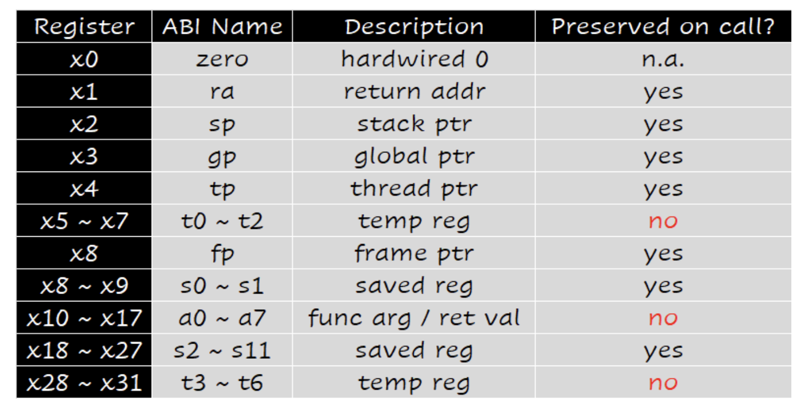

其中 "preserved on call" 的意思是，是否保证调用前后这些寄存器的值不变。

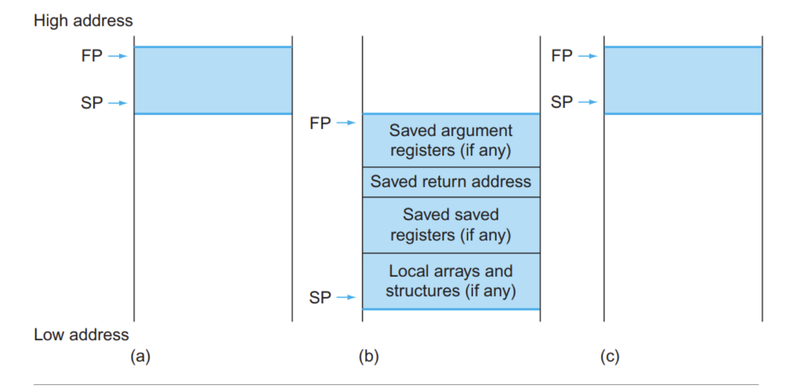

有一个例子：

### 2.8 其他话题

- 检查 index out of bounds：如果 `x20 = i, x11 = size` ，那么 `bgeu x20, x11, IndexOutOfBounds` ，即  `x20 >= x11 || x20 < 0` 
- 大立即数
   -  `lui` 将 20 位常数加载到目标寄存器的 31 到 12 位；然后用 `addi` 填充后面 12 位，就可以实现加载一个大立即数了。
   - 但是，如果后 12 位的首位是 1，在 `addi` 的时候就会因为 `sign ext` 额外加上 `0xFFFFF000` 。因此，我们只需要将 `lui` 的 imm 增加 1，这样 `lui` 加载后实际上就是增加了 `0x00001000` ，和 `0xFFFFF000` 相加后就可以抵消影响了。
- ASCII，是 8 位的，可以用 `lbu` 
- Unicode，是 16 位的，可以用 `lhu` 
- 尾递归 tail call / tail recursion，可以转成循环。
