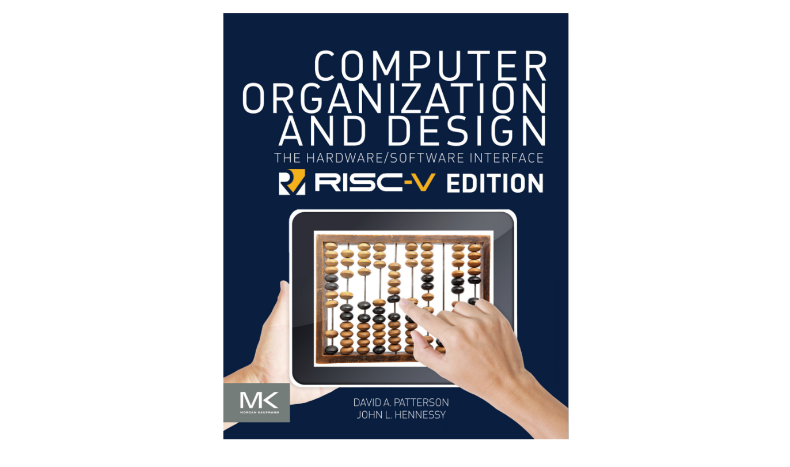

# 写在前面

!!! danger ""
    本文是图灵班姜女士的计算机组成，在**咸鱼喧笔记**的基础上进行整理学习。

    课程成绩占比为：quiz+6homework 20%，期中10%，期末40%，实验30%（bonus 5%）；
    > 其中验收60%，报告40%。迟交每天扣 20%😭（痛的教训）
    > 期中可以翻往年智云，姜女士一般来说都会慷慨讲解的
    > 建议平时都认真完成作业，不要学我浑水摸鱼

这是计算机组成课程的学习记录。

使用的课本是 _Computer Organization and Design - The Hardware / Software Interface (RISC-V Edition)_：

实验代码参考：https://github.com/liangchenwater/RISC-V-CPU
作业答案可参考：https://github.com/dmohindru/cod5e/blob/master/solutions
> (切记,由于指令集不同，答案不完全一样，**抄的时候需保持清醒Orz**)

!!! warning "说明"
    我自认为在 **3 Arithmetic**, **4 Processor**, **5 Cache** 三章中的整理和讲解是非常详细的，如果这些部分存在看不懂的地方，请务必联系我（xuan佬）。

    

!!! summary "课程速览"
    - [ ] Chapter1: Computer Abstraction and Technology
    - [x] Chapter 2: Instructions: Language of  the Computer
    - [x] Chapter 3: Arithmetic for Computers
    - [x] Chapter 4:The Processor：Datapath and Control
    - [x] Chapter 5:Large and Fast:  Exploiting Memory Hierarchy
    - [ ] Chapter 6: Parallel processor from client to Cloud (选讲，非考试内容)
    - [ ] Appendix: Storage, Networks, and Other Peripherals (Ch8 of Version 3,了解概念)

