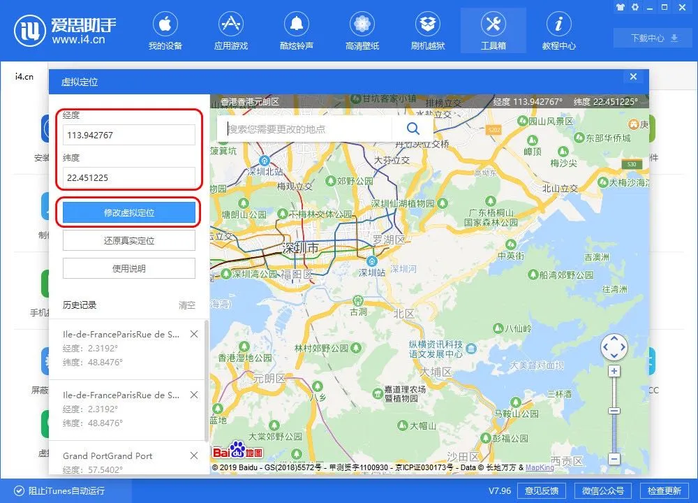

# 虚拟定位

## ios手机用户
下载爱思助手，在爱思助手的工具箱中点击“虚拟定位”功能，可以进行修改手机的定位。

修改前需要通过数据线连接手机设备。(一些较新的ios版本不支持更改)

爱思助手 目前支持 windows和mac

爱思助手官网下载：https://www.i4.cn/pro_pc.html

> 一般来说需要打开手机的开发者功能

连接后，通过搜索就可以找到地址，并直接定位，点击“修改虚拟定位”按钮即可立即定位，你可以打开iOS默认地图查看定位是否成功。

此外，如果搜索不到的地址，或者国外无法搜索的地址，可以在其它地图上获取定位，然后手动输入坐标就可以直接定位。
> 一般来说持续时间大约为3-6h左右

如果不想再定位，想要恢复原状，点击“还原真实坐标”即可。

## 安卓用户

## 打卡
由于虚拟定位以及轨迹等功能，是可以实现“打卡”的，但建议谨慎使用，后果自负。

（我会在之后抽空写个脚本。

